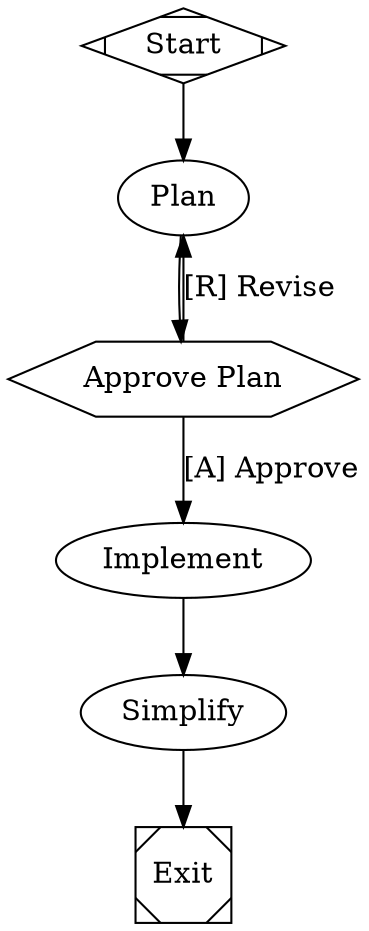

<div align="left" id="top">
<a href="https://arc.dev"></a>
</div>

## The open source software factory for expert engineers

AI coding agents are powerful but unpredictable. You either babysit every step or review a 50-file diff you don't trust. Arc gives you a middle path: define the process as a graph, let agents execute it, and intervene only where it matters.

[](LICENSE.md)
[](https://arc.dev)

---

## Key Features

|     | Feature                        | Description                                                                                           |
| --- | ------------------------------ | ----------------------------------------------------------------------------------------------------- |
| 🔀  | Deterministic workflow graphs  | Define pipelines in Graphviz DOT with branching, loops, parallelism, and human gates. Diffable, reviewable, version-controlled |
| 🙋  | Human-in-the-loop              | Approval gates pause for human decisions. Steer running agents mid-turn. Interview steps collect structured input |
| 🎨  | Multi-model routing            | CSS-like stylesheets route each node to the right model and provider, with automatic fallback chains  |
| ☁️  | Cloud sandboxes                | Run agents in isolated Daytona cloud VMs with snapshot-based setup, network controls, and automatic cleanup |
| 🔌  | SSH access and preview links   | Shell into running sandboxes with `arc ssh` and expose ports with `arc preview` for live debugging    |
| 🌲  | Git checkpointing              | Every stage commits code changes and execution metadata to Git branches. Resume, revert, or trace any change |
| 📊  | Automatic retros               | Each run generates a retrospective with cost, duration, files touched, and an LLM-written narrative   |
| ⚡  | Comprehensive API              | REST API with SSE event streaming and a React web UI. Run workflows programmatically or as a service  |
| 🦀  | Single binary, no runtime      | One compiled Rust executable with zero dependencies. No Python, no Node, no Docker required           |
| ⚖️  | Open source (MIT)              | Full source code, no vendor lock-in. Self-host, fork, or extend to fit your workflow                  |

---

## Example Workflow

A plan-approve-implement workflow where a human reviews the plan before the agent writes code:



Agents run as multi-turn LLM sessions with tool access. Human gates (`hexagon`) pause for approval. The stylesheet routes planning to a cheap model and coding to a frontier model. See the [DOT language reference](https://arc.dev/reference/dot-language) for the full syntax.

---

## 📖 Documentation

Arc ships with [comprehensive documentation](https://arc.dev) covering every feature in depth:

- [**Getting Started**](https://arc.dev/getting-started/introduction) -- Installation, first workflow, and why Arc exists
- [**Defining Workflows**](https://arc.dev/workflows/stages-and-nodes) -- Node types, transitions, variables, stylesheets, and human gates
- [**Executing Workflows**](https://arc.dev/execution/run-configuration) -- Run configuration, sandboxes, checkpoints, retros, and failure handling
- [**Agents**](https://arc.dev/agents/tools) -- Tools, prompts, skills, MCP integration, subagents, and permissions
- [**Tutorials**](https://arc.dev/tutorials/hello-world) -- Step-by-step guides from hello world to parallel multi-model ensembles
- [**API Reference**](https://arc.dev/api-reference/overview) -- Full OpenAPI spec with authentication, SSE events, and client SDKs
- [**CLI Reference**](https://arc.dev/reference/cli) -- Every command and flag documented

---

## Quick Start

### Install

Download the latest release for your platform:

```bash
# macOS (Apple Silicon)
curl -fsSL https://github.com/brynary/arc/releases/latest/download/arc-aarch64-apple-darwin.tar.gz | tar xz
sudo mv arc /usr/local/bin/

# Linux (x86_64)
curl -fsSL https://github.com/brynary/arc/releases/latest/download/arc-x86_64-unknown-linux-gnu.tar.gz | tar xz
sudo mv arc /usr/local/bin/
```

Or download directly from [GitHub Releases](https://github.com/brynary/arc/releases).

<details>
<summary>Build from source</summary>

Requires [Rust](https://rustup.rs/) (latest stable):

```bash
git clone https://github.com/brynary/arc.git
cd arc
cargo build --release
# Binary is at ./target/release/arc
```

</details>

### Run the setup wizard

```bash
arc install
```

### Initialize your project

```bash
cd my-repo/
arc init
```

### Run your first workflow

```bash
arc run hello
```

---

## Help or Feedback

- [Bug reports](https://github.com/brynary/arc/issues) via GitHub Issues
- [Feature requests](https://github.com/brynary/arc/issues) via GitHub Issues
- Email [bryan@qlty.sh](mailto:bryan@qlty.sh) for questions

---

## Contributing

See [CONTRIBUTING.md](CONTRIBUTING.md) for build instructions and development workflow.

---

## License

Arc is licensed under the [MIT License](LICENSE.md).
