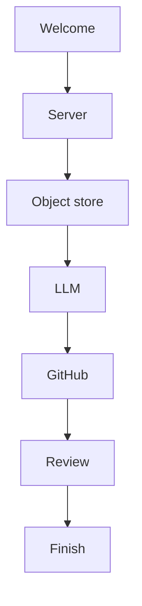

# Web Install Object Store Choice

## Problem Frame

The browser install wizard currently configures server URL, LLM credentials, and GitHub integration, but it does not let the operator choose where Fabro's object-store-backed data lives. Fabro already supports a local object store and AWS S3 in server configuration, and the runtime model keeps a separate local storage root for host-local state. The missing product behavior is a guided first-run choice for the shared object store used by both SlateDB and artifacts.

Without this step, operators who want S3-backed storage must finish install and then hand-edit server configuration and startup secrets. That creates avoidable setup drift between "works locally" and "production-like" deployments, especially for remote-first installs where the web wizard is supposed to be the primary setup path.

## Requirements

**Wizard flow**
- R1. The web install wizard must add a new `Object store` step after `Server` and before `LLM`, making the operator-visible order `Welcome → Server → Object store → LLM → GitHub → Review`.
- R2. The sidebar/progress UI, route flow, back/next behavior, and review screen must treat `Object store` as a first-class step, with refresh/re-entry behavior matching the existing install steps.
- R3. The wizard must explain that Fabro always keeps a local storage directory on the host and that this step chooses only the shared object store for object-store-backed server data.

**Storage modes**
- R4. The `Object store` step must offer exactly two wizard-managed modes: `Local disk` and `AWS S3`.
- R5. Choosing `Local disk` must configure both `server.slatedb` and `server.artifacts` to use the local object store provider.
- R6. Choosing `Local disk` must not prompt for S3-only fields such as bucket, region, or AWS credentials.
- R7. Choosing `AWS S3` must configure both `server.slatedb` and `server.artifacts` to use AWS S3, with one shared bucket and separate fixed prefixes so SlateDB data lives under `slatedb/` and artifact data lives under `artifacts/`.
- R8. The wizard must not expose separate object-store choices for SlateDB and artifacts. Operators who need split backends or more advanced layouts must configure them manually after install.
- R9. The wizard must not expose S3-compatible endpoint or path-style options in v1. The step must clearly note that non-AWS S3-compatible backends are out of scope for the wizard and require manual configuration.

**S3 fields and credentials**
- R10. When `AWS S3` is selected, the wizard must collect `bucket` and `region`.
- R11. The `AWS S3` path must offer exactly two credential modes: `Use AWS runtime credentials` and `Enter AWS access key credentials`.
- R12. `Use AWS runtime credentials` must be described as the path for deployments where AWS credentials come from the runtime environment or attached role, and it must not prompt for AWS secret material.
- R13. `Enter AWS access key credentials` must prompt only for `AWS_ACCESS_KEY_ID` and `AWS_SECRET_ACCESS_KEY`.
- R14. Manual AWS access-key credentials are server-only startup secrets. They must be persisted as server startup env secrets, not as workflow-visible vault secrets.
- R15. The wizard must not support session-token or STS inputs in v1. Operators who need temporary-session credential flows must configure object-store access manually outside the wizard.

**Validation and review**
- R16. The `AWS S3` path must perform live validation before the operator can continue past the `Object store` step.
- R17. Live validation must confirm that the configured bucket, region, chosen credential mode, and fixed `slatedb/` / `artifacts/` prefixes permit Fabro to reach the target S3 bucket with the intended object-store setup.
- R18. Validation errors must render inline on the `Object store` step and make it clear whether the failure is due to bucket/region mismatch, missing runtime credentials, or invalid manually-entered credentials when that distinction is available.
- R19. The review step must summarize the chosen object-store mode. For S3, it must show the bucket, region, credential mode, and that Fabro will use the fixed `slatedb/` and `artifacts/` prefixes in the shared bucket without revealing secret values.

## Success Criteria
- Operators can complete first-run setup for either local object storage or AWS S3 without editing `settings.toml` by hand.
- An install completed with `Local disk` produces the expected local-provider config for both SlateDB and artifacts.
- An install completed with `AWS S3` produces the expected shared-bucket S3 config for both SlateDB and artifacts, with `slatedb/` and `artifacts/` prefixes.
- Manual AWS credentials, when provided, are stored only as server startup secrets and are not exposed in workflow-visible secret surfaces.
- Misconfigured S3 details are caught during the install wizard instead of surfacing only after install completes and the server restarts.

## Scope Boundaries
- The local host storage root remains separate and is not replaced by S3.
- The wizard does not support separate object-store backends for SlateDB and artifacts.
- The wizard does not support non-AWS S3-compatible backends.
- The wizard does not support session-token or STS credential inputs.
- Advanced object-store layouts, custom prefixes beyond the fixed `slatedb/` and `artifacts/`, and other specialized storage topologies remain manual-configuration workflows.

## Key Decisions
- One shared object-store choice for both SlateDB and artifacts: keeps the wizard simple and avoids first-run misconfiguration.
- AWS S3 only in the wizard: reduces surface area and avoids exposing endpoint/path-style details meant for manual advanced setups.
- Two S3 auth paths: ambient runtime credentials for AWS-native deployments, or manually-entered access keys for non-AWS deployments that still target S3.
- Live validation on the wizard step: catches storage errors before the install succeeds and the server exits.
- `Object store` comes before provider/integration setup: keeps server-level infrastructure decisions together near the server URL step.

## Dependencies / Assumptions
- The existing server config model continues to treat `server.storage.root` as host-local storage and `server.slatedb` / `server.artifacts` as separate object-store-backed domains.
- The runtime continues to initialize S3 access from startup environment credentials or the ambient AWS credential chain.
- Using one shared S3 bucket with distinct `slatedb/` and `artifacts/` prefixes is sufficient for the wizard-managed path.

## Outstanding Questions

### Resolve Before Planning

(none)

### Deferred to Planning
- [Affects R16-R18] [Technical] Define the exact validation probe shape for local vs S3 so the install flow checks the real runtime path without creating misleading side effects in the bucket.
- [Affects R14] [Technical] Confirm the exact persistence path and lifecycle for manual AWS credentials in `server.env`, including whether existing install rollback behavior is sufficient for newly-added AWS env keys.
- [Affects R19] [Technical] Decide how the review screen and session payload represent the credential mode without leaking secret values and while preserving edit/re-entry behavior.

## Next Steps

→ `/prompts:ce-plan` for structured implementation planning
