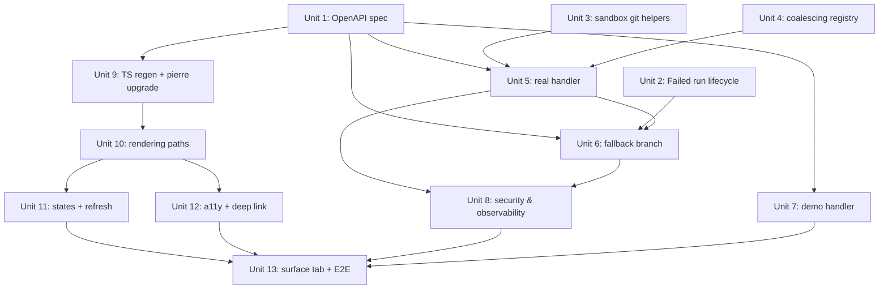

<!--
Implementation status (2026-04-19): all 13 units shipped on main.

- [x] Unit 1: OpenAPI spec + schema extensions
- [x] Unit 2: Lifecycle — capture final_patch on RunFailed
- [x] Unit 3: Sandbox git machine-readable helpers
- [x] Unit 4: Per-run request coalescing primitive
- [x] Unit 5: Real list_run_files handler (sandbox path)
- [x] Unit 6: Degraded fallback (final_patch) + empty envelope
- [x] Unit 7: Demo handler parity
- [x] Unit 8: Security & observability (logging-strategy.md update;
       denylist lives inline in run_files.rs — a globset-based module
       extraction is the one remaining follow-up from this plan)
- [x] Unit 9: TS client regen + @pierre/diffs upgrade (1.0.11 → 1.1.15)
- [x] Unit 10: Rendering paths (MultiFileDiff / PatchDiff / placeholders)
- [x] Unit 11: Empty/error/loading/refresh states + SSE revalidation
- [x] Unit 12: A11y + responsive + deep-link
- [x] Unit 13: Surface tab + verification

Deferred follow-ups (not blocking ship):
- Extract inline denylist from run_files.rs into a shared globset-based
  run_files_security module and add unit tests for non-UTF-8 path
  handling.
- Wrap large diff lists in `<Virtualizer>` once a run with >50 files
  demonstrates a measurable rendering regression.
-->


# feat: Files Changed tab for workflow runs

## Overview

Make the existing `apps/fabro-web/app/routes/run-files.tsx` skeleton real. Replace the hardcoded `fallbackFiles` fixture with a live diff sourced from the run's sandbox (while active) or from the stored `final_patch` string (once the sandbox is gone), rendered via `@pierre/diffs`. Surface the tab in the Run Detail UI, add security controls (auth, path denylist, request budget), and add a small lifecycle change so Failed runs also capture a `final_patch` for post-sandbox viewing.

## Problem Frame

The Files tab skeleton already imports `@pierre/diffs`' `MultiFileDiff` and calls `GET /runs/:id/files`, but that endpoint does not exist on the server — the route falls back to hardcoded fixture data. The tab is currently hidden from navigation via `broken: true` in `apps/fabro-web/app/routes/run-detail.tsx:14`. Users cannot see what a run actually changed without leaving Fabro.

This is also a **reintroduction** — the same endpoint *path* was defined-but-unimplemented and explicitly deleted in `docs/plans/2026-04-05-run-adjacent-server-only-cleanup-plan.md` §6; the `PaginatedRunFileList`/`FileDiff`/`DiffFile` schemas **survived** and remain in `docs/api-reference/fabro-api.yaml` today as orphans. Unit 1 re-wires the existing schemas (replacing the `PaginationMeta` reference on `PaginatedRunFileList` with the new `RunFilesMeta`) rather than reintroducing them from scratch.

That cleanup's stated rationale was that **the CLI** shouldn't reconnect to sandboxes for live diffs — the concerns were CLI UX (long sandbox spin-up, flaky reconnects destroying an interactive command) and avoiding a CLI-only sandbox dependency. Those concerns apply differently here: (1) the consumer is a web UI, not a CLI, where a "this didn't load" spinner is acceptable where a hanging `fabro diff` invocation wasn't; (2) the plan treats reconnect failure as a fall-through to a stored-patch fallback (Unit 6) rather than a hard error, so a failed reconnect degrades gracefully; (3) no new sandbox dependency is introduced in CLI code paths. The April 5 deletion is respected: no CLI code in this plan calls `reconnect_run_sandbox`.

## Requirements Trace

This plan satisfies the requirements in `docs/brainstorms/2026-04-19-run-files-changed-tab-requirements.md`:

**UI (R1–R8):**
- R1 (render via @pierre/diffs) — Units 9, 10
- R2 (toolbar toggles + persist split/unified) — Unit 10
- R3 (remove Steer) — Unit 10
- R4 (empty-state taxonomy) — Unit 11
- R5 (error-state taxonomy) — Unit 11
- R6 (loading + refresh + freshness) — Unit 11
- R7 (deep link) — Unit 12
- R8 (a11y + responsive) — Unit 12

**Diff semantics (R9–R13):**
- R9 (committed-HEAD only) — Units 3, 5
- R10 (live sandbox path) — Units 3, 5
- R11 (post-sandbox = final_patch only) — Unit 6
- R12 (degraded view via PatchDiff) — Units 6, 10
- R13 (coverage by run state, use `git_commit_sha` on Failed) — Unit 13 verification

**API contract (R14–R18):**
- R14 (endpoint + operationId) — Unit 1
- R15 (optional `from_sha`/`to_sha`, reject non-default) — Units 1, 5
- R16 (materialize-on-demand) — Unit 5
- R17 (don't change `final_patch` consumers) — Unit 2 explicitly preserves
- R18 (no lifecycle push) — Unit 2 (captures `final_patch` without pushing)

**Schema extensions (R19–R23):**
- R19 (`change_kind` optional) — Unit 1
- R20 (contents conventions for add/delete/rename) — Unit 1
- R21 (`truncated` + `binary` independent) — Unit 1
- R22 (`sensitive` flag) — Unit 1
- R23 (additive back-compat) — Unit 1

**Caps (R24–R28):**
- R24 (per-file 256 KB / 20k lines) — Units 3, 5
- R25 (aggregate 5 MB) — Unit 5
- R26 (skip binary) — Units 3, 5
- R27 (200-file cap) — Unit 5
- R28 (`--find-renames=50%`) — Unit 3

**Security & observability (R29–R35):**
- R29 (authentication + IDOR-safe 404) — Unit 5
- R30 (committed-only as primary control) — Units 3, 5
- R31 (sensitive-path denylist) — Units 5, 6, 8
- R32 (request budget + coalescing) — Units 4, 5
- R33 (git hardening env) — Units 3, 8
- R34 (demo isolation) — Unit 7
- R35 (log redaction) — Unit 8

**Demo (R36):** moves `fallbackFiles` into demo handler — Unit 7

### Success Criteria (quantified)

Carried from origin + new measurable targets:

- **Coverage**: ≥ 85% of Files-tab opens on runs ≤ 7 days old return `meta.degraded: false` with `data.length > 0` or explicit R4(b) "no changes" state. Older runs or Failed-no-checkpoint runs are allowed to show R4(c).
- **Latency**: **p95 < 3 s** for the endpoint on runs with ≤ 200 files and ≤ 5 MB aggregate content, measured from request accept to response complete. Live-Daytona runs may have a separate p95 ≤ 10 s budget until `git cat-file --batch` batching is in place.
- **First contentful paint**: within 500 ms of the response's first byte on the client.
- **Security**: zero occurrences of diff contents, full changed-file paths, or git stderr in production logs over a 7-day observation window (measurable via Sentry search on the tracing field set).
- **Freshness**: `CheckpointCompleted` SSE event triggers a UI revalidation within 1 s of receipt (500 ms debounce + round-trip).
- **Demo mode**: `X-Fabro-Demo: 1` returns the fixture response without touching `state.runs` or `state.store` (verified by a test spy).

## Scope Boundaries

- No uncommitted working-tree view (deferred to v2; see origin Key Decisions).
- No lifecycle push-on-failure and no changes to `RunFailed` event shape beyond adding `final_patch` (no head SHA push, no ref pollution, no CI triggers).
- No per-stage / per-checkpoint UI; `from_sha`/`to_sha` params exist as forward-compat slots only — v1 rejects non-default values with 400.
- No origin-side read path. Post-sandbox runs without `final_patch` show an empty state.
- No search/filter/grouping beyond what `@pierre/diffs` provides natively.
- No content-based secret detection (denylist is path-only, defense-in-depth).
- No SlateDB schema change; `final_patch` stays `Option<String>` on `RunProjection`.
- No change to the `PaginatedRunFileList` schema name even though cursor pagination isn't used (additive meta change only).
- No "Steer" inline commenting on diff lines (already out of scope; the skeleton's Steer UI is removed).

## Context & Research

### Relevant Code and Patterns

- **Handler pair idiom (`demo::*_stub` + real)**: `lib/crates/fabro-server/src/demo/mod.rs:94-122` (`get_run_stages`, `list_run_artifacts_stub`) and `lib/crates/fabro-server/src/server.rs:2102-2204` (`list_run_stages`). Extractor order: `_auth: AuthenticatedService, State(state), Path(id), Query(params)`.
- **Route registration**: `lib/crates/fabro-server/src/server.rs:1000-1076` (demo router) and `:1078-1149` (real router). The `/api/v1` prefix is applied at mount-time, not in `.route(...)` paths.
- **`ListResponse<T>` wrapper**: `lib/crates/fabro-server/src/server.rs:211-225` — the in-repo baseline for "paginated" endpoints that actually return naturally-bounded lists (always sets `has_more: false`). `list_run_stages` uses this pattern today even though it accepts `PaginationParams`.
- **Sandbox reconnect**: `lib/crates/fabro-sandbox/src/reconnect.rs:17-60` (dispatches on `provider` string; only Local and Daytona are compiled into the server — `fabro-server/Cargo.toml:25` enables only `features = ["daytona"]`, so Docker runs would 409 at reconnect). `reconnect_run_sandbox` in `lib/crates/fabro-server/src/server.rs:5797-5806` maps all reconnect errors to `StatusCode::CONFLICT`.
- **Sandbox git helpers**: `lib/crates/fabro-workflow/src/sandbox_git.rs`. `GIT_REMOTE` (line 23), `shell_quote` (line 26), `git_diff` at line 185 is `pub(crate)` with a 30 s timeout and returns an unbounded string — not fit for the new endpoint. A sibling machine-readable helper is needed.
- **`RunProjection.final_patch`**: `lib/crates/fabro-store/src/run_state.rs:35`, populated at `lib/crates/fabro-workflow/src/lifecycle/git.rs:303-332` via `on_run_end` when `outcome.status == Success || PartialSuccess`. Extending to Failed is the lifecycle change in Unit 2.
- **Redaction**: `lib/crates/fabro-util/src/redact/` is gitleaks+entropy at the content level. No path-denylist exists anywhere — Unit 8 is greenfield for that.
- **Frontend API helpers**: `apps/fabro-web/app/api.ts:41-47` (`apiJson`), `:115-130` (`apiJsonOrNull` — handles 404 and 501 gracefully — use this for the new route).
- **Route conventions**: loaders use `({ request, params })`; `export const handle = { wide: true }` toggles wide layout; data flows through `withRouteModule` wrapper (`router.tsx:42-49`).
- **Tab visibility**: `apps/fabro-web/app/routes/run-detail.tsx:14` has `{ name: "Files Changed", path: "/files", broken: true }`; `:68` filters with `!t.broken`. Removing the flag makes the tab visible.
- **SSE revalidation pattern**: `apps/fabro-web/app/components/stage-sidebar.tsx:39-66` uses `useRevalidator` + debounced SSE subscription to `/api/v1/runs/${id}/attach`. Use this pattern to refresh the Files tab on `CheckpointCompleted` events for Running runs.
- **OpenAPI conformance test**: `lib/crates/fabro-server/tests/it/openapi_conformance.rs` `all_spec_routes_are_routable` — fails immediately if a spec route lacks a router entry. Register a `not_implemented` placeholder if handlers are staged across multiple units.

### Institutional Learnings

From `docs/plans/`:

- `docs/plans/2026-04-05-run-adjacent-server-only-cleanup-plan.md` **deleted** `/api/v1/runs/{id}/files` and the `PaginatedRunFileList`/`FileDiff` schemas earlier this month. Verify via `git log -- docs/api-reference/fabro-api.yaml` before editing that file. Reviewers will want prior-art context.
- `docs/plans/2026-04-08-production-web-ui.md` established demo-vs-real parity: demo handlers must return the same wire shape as real handlers, distinguished only by `X-Fabro-Demo: 1`. Follow this for Unit 7.
- `docs/plans/2026-04-09-settings-toml-redesign-handoff-3.md` documented the full OpenAPI → progenitor → openapi-generator regen workflow. Key points: add optional fields (not required) for back-compat; expect a large TS-client diff; conformance test catches spec/router drift; `keys_match_openapi_spec`-style tests were deleted, so there is no active frontend↔spec key-diff gate.
- `docs/plans/2026-04-07-interview-control-channel-and-server-slack-plan.md` pattern: enqueue with short timeout; treat channel closure as abort. Apply to sandbox subprocess invocations (R32).

There is no `docs/solutions/` directory in this repo; `docs/plans/` and `docs/brainstorms/` are the institutional-knowledge corpus.

### External References

- `@pierre/diffs` research (Apache-2.0, https://github.com/pierrecomputer/pierre):
  - `MultiFileDiff` takes `{oldFile, newFile}` with full contents.
  - `PatchDiff` takes a unified patch string (`parsePatchFiles` is a sibling utility that returns `FileDiffMetadata[]`).
  - `FileDiff` takes precomputed hunks (`FileDiffMetadata`) — `type` field covers `"change" | "rename-pure" | "rename-changed" | "new" | "deleted"`.
  - `renderAnnotation` is line-only; per-file banners must be sibling DOM.
  - 1.0.11 (currently installed) has **no virtualization**; 1.1.0 introduced a `Virtualizer` component and `renderHeaderPrefix`/`renderCustomHeader`. Latest is 1.1.16 (2026-04-19).
  - 1.0 → 1.1 refactored managers (`MouseEventManager`/`LineSelectionManager` merged into `InteractionManager`). Public React components keep the same shape; internal APIs change.
  - No built-in keyboard nav, no responsive split/unified; both are consumer-built.
- Git invocation for enumeration: `git diff --raw -z --find-renames=50% <base>..HEAD` + `git cat-file --batch` (for size gating) + `git show <sha>:<path>`. Rename detection is off by default; `--find-renames=50%` is the brainstorm's pinned threshold (R28).

### Sources & References

- **Origin document**: [docs/brainstorms/2026-04-19-run-files-changed-tab-requirements.md](../brainstorms/2026-04-19-run-files-changed-tab-requirements.md)
- Related prior plans: `docs/plans/2026-04-05-run-adjacent-server-only-cleanup-plan.md`, `docs/plans/2026-04-08-production-web-ui.md`, `docs/plans/2026-04-09-settings-toml-redesign-handoff-3.md`, `docs/plans/2026-04-07-interview-control-channel-and-server-slack-plan.md`
- External: https://diffs.com/ (@pierre/diffs docs), https://github.com/pierrecomputer/pierre
- Logging strategy to extend: `docs-internal/logging-strategy.md`
- AGENTS.md rules: shell quoting (`shell_quote`), import style, API workflow (spec → progenitor → handler → conformance test → TS regen)

## Key Technical Decisions

| Decision | Rationale |
|---|---|
| **Drop origin-read entirely; use `final_patch` + `PatchDiff` for post-sandbox runs.** | `@pierre/diffs` renders unified patches natively via `PatchDiff`. Origin-read would add the GitHub REST vs bare-clone decision, credential scoping, and a server-side patch parser for no added UX beyond what the stored patch string can deliver. Trade: patch-only view lacks surrounding file context, flagged in the UI with a banner. |
| **Capture `final_patch` on `RunFailed` (no push, no refs).** | A 6-line change in `lifecycle/git.rs` closes the Failed-post-sandbox coverage gap with zero blast radius (no origin push, no CI triggers, no crash-time credentials). Hard-crash paths that don't reach the lifecycle hook still fall to R4(c) empty state. |
| **Upgrade `@pierre/diffs` to 1.1.x.** | `Virtualizer` protects the tab against large runs; `renderHeaderPrefix` replaces sibling-div hacks for binary/truncated/sensitive banners. Breaking changes live in internal managers (`InteractionManager`) — public React components are stable. |
| **Response shape**: reuse `PaginatedRunFileList` name; introduce `RunFilesMeta` replacing `PaginationMeta` on this endpoint. | Keeps the existing schema name (already in the spec and the TS client as a type alias). Adds `truncated`, `total_changed`, optional `degraded`, optional `patch` without touching shared `PaginationMeta`. Non-breaking for consumers of `PaginationMeta` on other endpoints. |
| **No cursor pagination; single top-level `truncated` + `total_changed`.** | Natural-bound list with a hard 200-file cap. Follows `ListResponse<T>` precedent where "paginated" just means "bounded". Adding a cursor is deferred until a consumer needs it. |
| **`change_kind` is optional.** | Resolves the R19/R23 back-compat tension: existing progenitor/openapi-generator clients can ignore it; v1 clients that know about it can skip hunk inspection. Kept as additive-only metadata. |
| **Denylist in server code; content-based scanning out of scope.** | `fabro-util::redact` is content-level; the brainstorm explicitly confines R31 to path-based skipping. Matches the "authz gate + `git diff` parity" framing in R30. Config-driven denylist can come later. |
| **Request coalescing, not queuing.** | Concurrent callers for the same run share one in-flight materialization via a singleflight map on `AppState`. Avoids redundant git work, prevents queue-exhaustion DoS, and is simpler than a 429-with-retry policy. |
| **Use `apiJsonOrNull` on the web loader.** | Handles 404 and 501 gracefully, so dev environments without the new route (or demo without the new demo stub) render R4(c) empty state instead of hitting `RootErrorBoundary`. Mirrors the precedent in `run-stages.tsx:118` and `run-overview.tsx:16`. |

## Open Questions

### Resolved During Planning

- **Post-sandbox read mechanism** (origin doc, Resolve-Before-Planning): resolved by dropping origin-read; use `final_patch` + `PatchDiff`.
- **Keep R12 degraded view or drop?**: keep R12. Implementation is near-trivial given `PatchDiff`; no full server-side patch parser (a regex-level header scan is sufficient for denylist enforcement).
- **Sandbox provider coverage**: Local + Daytona in the deployed server (Docker feature is not compiled into `fabro-server` per `lib/crates/fabro-server/Cargo.toml:25`). For runs whose `SandboxRecord.provider` is `"docker"`, reconnect returns `Ok(None)` via the new `try_reconnect_run_sandbox` helper and we fall through to `final_patch` with `degraded_reason: "provider_unsupported"`.
- **Lifecycle change for Failed runs**: approved — capture `final_patch` on `RunFailed` without any push or ref change, using a shorter 10 s timeout to bound terminal latency.
- **Patch parser choice**: no full server-side parser. Degraded-view client uses `@pierre/diffs` `PatchDiff` / `parsePatchFiles`. Server does a one-regex header scan for denylist enforcement.
- **Freshness timestamp source**: `to_sha_committed_at` for Running runs; HTTP response time for completed. Refresh disabled when `to_sha` is unchanged.
- **`to_sha` on the wire**: added to `RunFilesMeta` in Unit 1 (optional). Unit 5 populates from `git rev-parse HEAD` on the sandbox; Unit 6 populates from `RunProjection.conclusion.git_commit_sha` for degraded responses.
- **Coalescing shape**: inline concrete implementation on `AppState`, not a generic `CoalescingRegistry<K, V>` module. Drive via `tokio::spawn` + `broadcast::Receiver` (not `Shared<BoxFuture>` alone) to decouple materialization from caller liveness. `catch_unwind` around the materialization body.
- **`total_changed` for degraded responses**: count `^diff --git ` headers in the filtered patch via a compiled regex — cheap and accurate.
- **Placeholder priority**: `sensitive > binary > symlink/submodule > truncated` so security signals never get hidden.
- **Denylist matching**: `globset` against separate basename and path-suffix globsets. Checked against both `old_path` and `new_path` for renames.
- **Authorization**: v1 matches sibling `/runs/{id}/*` endpoints (authentication only via `AuthenticatedService`). Unauthorized returns **404** (not 403/401) to prevent run-ID enumeration. Per-run workspace membership is a cross-cutting follow-up tracked separately, not this plan's scope.
- **Unit 1 back-compat grep**: the implementer runs `rg "PaginatedRunFileList\['meta'\]|PaginatedRunFileList\\.meta"` across the monorepo before editing the schema and records zero-or-N existing consumers in the PR description.

### Deferred to Implementation

- **Exact method signatures** for the new machine-readable sandbox-git helpers — let implementation pick them when writing tests.
- **Final TS-client regen diff size** — will be large by construction; reviewers should expect it. Regenerate last.
- **SSE event wire name** — `CheckpointCompleted` is almost certainly the canonical name; confirm against `lib/crates/fabro-workflow/src/event.rs` during Unit 11.
- **First-file-exceeds-5 MB behavior**: if the very first non-sensitive text file already exceeds the aggregate 5 MB budget, apply the per-file cap (R24: 256 KB / 20 k lines) first; the aggregate cap never kicks in for that file. Subsequent files hit the aggregate cap normally.
- **Exact `ListRunFilesParams` field names** (`page[limit]` vs `pageLimit` etc.) — match the sibling `PaginationParams` serde renames exactly; implementation confirms at write-time.

## High-Level Technical Design

> *This illustrates the intended approach and is directional guidance for review, not implementation specification. The implementing agent should treat it as context, not code to reproduce.*

### Response envelope

```yaml
# OpenAPI sketch — directional
FileDiff:
  required: [old_file, new_file]
  old_file: DiffFile
  new_file: DiffFile
  change_kind?: "added" | "modified" | "deleted" | "renamed" | "symlink" | "submodule"
  truncation_reason?: enum    # "file_too_large" | "budget_exhausted" (absent when not truncated)
  truncated?: boolean         # convenience: truncation_reason.is_some()
  binary?: boolean            # content is not textual (contents always "")
  sensitive?: boolean         # path matched denylist (contents always "")

RunFilesMeta:            # new — replaces PaginationMeta on this endpoint
  required: [truncated, total_changed]
  truncated: boolean               # any truncation applied (file-count, per-file, or aggregate)
  files_omitted_by_budget?: int    # count of files dropped because the 5 MB aggregate cap was exhausted
  total_changed: integer           # total files actually changed in the run
  to_sha?: string                  # head SHA the diff/patch was resolved against
  to_sha_committed_at?: timestamp  # commit time of to_sha (for "Checkpoint Xm ago" indicator)
  degraded?: boolean               # true when response is patch-only (no file contents)
  degraded_reason?: enum           # "sandbox_unreachable" | "sandbox_gone" | "provider_unsupported"
  patch?: string                   # unified patch text (capped at 5 MB), only present when degraded=true

PaginatedRunFileList:    # name retained; meta type changed
  required: [data, meta]
  data: [FileDiff]
  meta: RunFilesMeta
```

### Handler flow

```text
GET /api/v1/runs/{id}/files

1. Parse & auth:
     _auth: AuthenticatedService
     parse_run_id_path(id) -> RunId  (400 on malformed)
     load_run_record(id)             (404 if not found)

2. Reject non-default from_sha/to_sha:
     if from_sha or to_sha provided and != default -> 400

3. Coalesce:
     key = RunId
     materialize via AppState.files_registry.run_coalesced(key, async { ... })

4. materialize():
     a. If run has an active sandbox (SandboxRecord present):
          try reconnect_run_sandbox  -> Box<dyn Sandbox>
          if ok:
            files = run new machine-readable sandbox_git helper
                     (git diff --raw -z --find-renames=50% <base>..HEAD,
                      then per-file git cat-file -s + git show <sha>:<path>)
            files = apply_denylist(files)       # R31
            files = apply_caps(files)            # R24, R25, R27
            return { data: files,
                     meta: { truncated, total_changed,
                             degraded: false } }
          if reconnect fails -> fall through

     b. If final_patch is Some:
          return { data: [],
                   meta: { truncated: false, total_changed: 0,
                           degraded: true, patch: final_patch } }

     c. Else (no sandbox + no final_patch):
          return { data: [],
                   meta: { truncated: false, total_changed: 0,
                           degraded: false } }
          # Empty envelope — UI maps to R4(c).

5. Errors:
     Sandbox git subprocess timeout / non-zero exit → 503 transient.
     Coalescing future panic → 500 unknown, with request ID.

    All logging emits only: run_id, file_count, bytes_total, duration_ms,
    truncated, binary_count, sensitive_count. No paths, no contents,
    no raw git stderr. (R35)
```

### Client rendering

```text
RunFiles component:

  if meta.degraded && meta.patch:
    <PatchDiff patch={meta.patch} options={...}>
    <DegradedBanner reason="Contents unavailable; showing patch only" />

  elif data.length > 0:
    <Virtualizer>   # @pierre/diffs 1.1.x
      for file in data:
        if file.binary:     <BinaryPlaceholder name={file.new_file.name} change={file.change_kind} />
        elif file.sensitive:<SensitivePlaceholder name={file.new_file.name} />
        elif file.truncated:<TruncatedPlaceholder name={file.new_file.name} />
        else:               <MultiFileDiff oldFile={file.old_file} newFile={file.new_file} options={...} />

  else:
    <EmptyState kind={deriveEmptyKind(runStatus, meta.degraded)} />   # R4 taxonomy
```

### Data flow summary

```mermaid
flowchart TB
  A[Web loader] -->|GET /runs/:id/files| B[fabro-server handler]
  B --> C{Run has active sandbox?}
  C -->|yes| D[reconnect_run_sandbox]
  D -->|ok| E[sandbox_git::list_changed_files_raw]
  E --> F[apply denylist + caps]
  F --> G[FileDiff[] response]
  C -->|no, or reconnect fails| H{final_patch present?}
  D -->|fails| H
  H -->|yes| I[Degraded response: patch string in meta]
  H -->|no| J[Empty envelope]
  G --> K[Client: MultiFileDiff per file]
  I --> L[Client: PatchDiff with meta.patch]
  J --> M[Client: R4 empty state]
```

## Implementation Units

- [ ] **Unit 1: OpenAPI spec — endpoint + schema extensions**

**Goal:** Add `GET /api/v1/runs/{id}/files` to the spec with `operationId: listRunFiles`, extend `FileDiff` with optional metadata fields, replace the endpoint's `meta` with a new `RunFilesMeta`, and regenerate Rust + TS clients.

**Requirements:** R14, R15, R19, R20, R21, R22, R23, R27

**Dependencies:** None (foundational; unblocks Units 5, 6, 7, 9)

**Files:**
- Modify: `docs/api-reference/fabro-api.yaml` (add path, extend schemas, add `RunFilesMeta`)
- Modify: `lib/crates/fabro-server/src/server.rs` (register route against `not_implemented` to satisfy conformance test; real handler lands in Unit 5)
- Modify: `lib/crates/fabro-server/src/server.rs:25-41` (add `pub use fabro_api::types::{FileDiff, RunFilesMeta, PaginatedRunFileList, DiffFile}` re-exports if missing)
- Test: `lib/crates/fabro-server/tests/it/openapi_conformance.rs` (already exists; validates routability)
- Regenerated (do not hand-edit): `lib/packages/fabro-api-client/src/models/file-diff.ts`, `diff-file.ts`, `paginated-run-file-list.ts`, and a new `run-files-meta.ts`

**Approach:**
- Add the path under `/api/v1/runs/{id}/files:` with the same `parameters` style as `listRunStages` (path `id`, plus `Query page[limit]`/`page[offset]` if we want to keep the param shape consistent, even though v1 ignores them). Also accept optional `from_sha`/`to_sha` query params for forward compat; v1 handler rejects non-default with 400 (R15).
- Responses: 200 with `$ref: '#/components/schemas/PaginatedRunFileList'`; 400 for invalid `from_sha`/`to_sha`; 404 for missing run; 409 for reconnect failure with an unrecoverable `final_patch` absence.
- Extend `FileDiff` additively — `change_kind`, `truncated`, `binary`, `sensitive` all optional. `old_file`/`new_file` stay required (empty-string contents for added/deleted sides).
- Introduce `RunFilesMeta` as a new named schema (not a modification to `PaginationMeta`) to avoid affecting other endpoints' pagination.
- Run the regen sequence per AGENTS.md: `cargo build -p fabro-api`, then `cd lib/packages/fabro-api-client && bun run generate`.

**Patterns to follow:**
- `listRunStages` operation at `fabro-api.yaml:667-689` for operation shape.
- `list_run_artifacts` operation at `:716-736` for non-cursor response style (but keep `PaginatedRunFileList` wrapper since the schema already exists).
- `not_implemented` handler (imported in `server.rs`) for placeholder route registration.

**Test scenarios:**
- Integration: `cargo nextest run -p fabro-server --test it openapi_conformance` passes — the new route path resolves against `build_router()` (Unit 1 registers a placeholder; Unit 5 swaps in the real handler).
- Happy path: `cargo build -p fabro-api` succeeds — progenitor accepts the schema extensions; `cd lib/packages/fabro-api-client && bun run generate` succeeds and produces `run-files-meta.ts` + updated `file-diff.ts`.
- Back-compat: existing consumers of `FileDiff` compile unchanged (no required fields added).

**Verification:**
- `cargo build --workspace` succeeds.
- `cargo nextest run -p fabro-server` passes (conformance test specifically).
- TS client has `RunFilesMeta` model and updated `FileDiff` with optional fields.

---

- [ ] **Unit 2: Lifecycle — capture `final_patch` on `RunFailed`**

**Goal:** Extend the workflow lifecycle's `on_run_end` hook so Failed runs also run `git diff <base_sha> HEAD` and persist the resulting patch into `RunProjection.final_patch` via a new (or reused) event field. No origin push, no ref changes.

**Requirements:** R13 (coverage for Failed runs when the lifecycle hook is reached)

**Dependencies:** None (independent; unblocks Unit 6's fallback path for Failed runs)

**Files:**
- Modify: `lib/crates/fabro-workflow/src/lifecycle/git.rs` (`on_run_end` — drop the `Success || PartialSuccess` guard; use a **10 s** timeout on the diff capture, not the default 30 s, so Failed-run terminal latency stays bounded)
- Modify: `lib/crates/fabro-workflow/src/lifecycle/event.rs` (the emit site at `:482` for `Event::WorkflowRunFailed` — read `self.final_patch.lock().unwrap().clone()` and pass it through to the event, mirroring the `WorkflowRunCompleted` emit at `:464-476`)
- Modify: `lib/crates/fabro-workflow/src/event.rs` (the `Event::WorkflowRunFailed` variant + the `to_run_event` mapping near `:1585`)
- Modify: `lib/crates/fabro-types/src/run_event/run.rs` (`RunFailedProps` at `:110` — add `#[serde(default, skip_serializing_if = "Option::is_none")] pub final_patch: Option<String>`)
- Modify: `lib/crates/fabro-store/src/run_state.rs` (`apply_event` for `RunFailed` — clone `final_patch` into the projection like `RunCompleted` does at `:146`)

**Approach:**
- Copy the existing Success/PartialSuccess logic (`lib/crates/fabro-workflow/src/lifecycle/git.rs:303-331`) to also run for `Failed`. Keep the "best-effort, log warn on error" behavior; do not fail the run because diff capture failed.
- Use a **10 s timeout** (not the existing 30 s) for the Failed-path `git diff` invocation — Failed runs are often in a pathological state (FS locks, OOM, corrupted index), and downstream consumers (Slack notifier, SSE `RunFailed`, CI hooks) are latency-sensitive to terminal emission. Emit a `RunNotice` warn when the timeout fires; projection `final_patch` stays `None`.
- `RunFailed` event already exists (`lib/crates/fabro-workflow/src/lifecycle/event.rs:482`) but does **not** forward `final_patch` today — this unit wires the shared `Arc<Mutex<Option<String>>>` read (already at `:426` in the Completed branch) through to the Failed emit.
- The projection already carries `final_patch` — just copy the field through in the `RunFailed` arm.
- **No changes to `final_patch`'s wire consumers** (PR body generation, etc.). This is additive.
- **Event replay**: serde's `#[serde(default)]` ensures pre-change RunFailed events in SlateDB deserialize with `final_patch: None` — no corruption, no backfill required. Old Failed runs continue to show R4(c) on the Files tab.

**Execution note:** Start with a failing test that asserts a Failed run's `RunProjection.final_patch` is `Some(...)` after the lifecycle hook fires. That test drives all three file changes.

**Patterns to follow:**
- `lib/crates/fabro-workflow/src/lifecycle/git.rs:303-331` — existing `on_run_end` structure to clone.
- `lib/crates/fabro-store/src/run_state.rs:142-148` — existing `RunCompleted` → projection mapping to mirror.

**Test scenarios:**
- Happy path: sandbox reachable at Failed — `final_patch` populated on the projection with the expected diff string.
- Edge case: base_sha missing on the run — skip diff capture cleanly, projection `final_patch` stays `None` (no panic).
- Error path: `git diff` subprocess fails inside sandbox — `RunNotice` warn emitted, projection `final_patch` stays `None`, failure does not affect the run's terminal status.
- Integration: projection round-trip — `apply_events` on a recorded `RunFailed` event with `final_patch: Some(...)` produces a projection with that patch.

**Verification:**
- `cargo nextest run -p fabro-workflow` passes with the new tests.
- `cargo nextest run -p fabro-store` passes with the event-application test.

---

- [ ] **Unit 3: Sandbox git — machine-readable diff + blob read helpers**

**Goal:** Add the sandbox-side helpers the server endpoint needs: enumerate changed files with raw + rename detection, size-gate via `cat-file`, read individual blobs. Existing `git_diff` helper stays for PR/checkpoint callers.

**Requirements:** R10, R24, R25, R26, R27, R28, R32 (10 s timeout), R33 (shell_quote)

**Dependencies:** None (independent; unblocks Unit 5)

**Files:**
- Modify: `lib/crates/fabro-workflow/src/sandbox_git.rs` (add new `pub(crate)` helpers; leave existing `git_diff` unchanged)
- Test: `lib/crates/fabro-workflow/src/sandbox_git.rs` (unit tests in the existing `#[cfg(test)]` module, following the in-file pattern at `:239-...` which constructs a real tempdir git repo)

**Approach:**
- New helper `list_changed_files_raw(sandbox, base_sha, to_sha)` → `Result<Vec<RawDiffEntry>, DiffError>`. Runs `git diff --raw -z --find-renames=50% <base>..<to_sha>`. Parses the null-separated raw output into an `enum RawDiffEntry { Added{path, blob_sha, mode}, Modified{path, old_blob, new_blob, mode}, Deleted{path, blob_sha, mode}, Renamed{old_path, new_path, old_blob, new_blob, similarity, mode}, Symlink{path, change_kind, mode}, Submodule{path, change_kind} }`. Modes of `120000` → `Symlink`; `160000` → `Submodule`; these variants never invoke blob reads. `DiffError` distinguishes `Transient { message }` (timeout, process kill) from `Permanent { message }` (bad revision, unknown object) so the handler can route permanent errors to R4/R5 rather than a 503.
- **Use `git cat-file --batch-check` and `--batch` instead of per-file invocations.** The naive design (per-file `git cat-file -s` + `git show`) produces 400–800 sandbox RPCs for a 200-file run; `--batch-check` streams all sizes in one invocation and `--batch` streams all blobs. This is load-bearing for the p95 < 3 s target. Helper `stream_blob_metadata(sandbox, shas) → Result<Vec<BlobMeta>, DiffError>` and `stream_blobs(sandbox, shas, size_cap) → Result<Vec<Option<String>>, DiffError>` (returns `None` for blobs that exceed the cap; caller flags `truncated`).
- **Paths from git output are metadata only**; blob reads are always SHA-addressed (`git show <sha>` or `git cat-file --batch`), never `<sha>:<path>`. This eliminates the path-quoting concern entirely — user-controlled paths never enter a shell invocation for blob reads.
- **Binary detection**: use the `--numstat` side-call (or the raw-format `-\t-\t<path>` marker) for text vs binary. Do not attempt to read binary bytes through `--batch`; skip to `binary: true, contents: ""`.
- **Git hardening env on every sandbox-side invocation** (R33): `GIT_TERMINAL_PROMPT=0`, `-c core.hooksPath=/dev/null`, `-c core.fsmonitor=false`, `-c protocol.file.allow=never`, unset `GIT_EXTERNAL_DIFF`. The repo contents are attacker-controlled relative to Fabro; the sandbox isolation does not substitute for flag hardening on the invocation itself.
- All helpers use `shell_quote` for interpolated SHAs (even though SHAs are hex) as a belt-and-suspenders defense per AGENTS.md. Timeout is **10 s** sandbox-side per R32.
- Visibility: make the new helpers **`pub`** directly in `sandbox_git.rs` rather than creating a separate `diff_inspector` module — the existing `sandbox_git.rs` is the canonical home for sandbox-git code; a new module adds structure without function.

**Execution note:** Test-first against a tempdir git repo fixture. Reuse the in-file pattern at `sandbox_git.rs:239+`.

**Patterns to follow:**
- `sandbox_git.rs:185-195` — existing `git_diff` for the subprocess-invocation pattern.
- `sandbox_git.rs:55-67` — `git_checkpoint` for `shell_quote` + `GIT_REMOTE` + `exec_command` boilerplate.
- `sandbox_git.rs:246-...` — existing tempdir-based fixture style (no loops in test setup per AGENTS.md rules).

**Test scenarios:**
- Happy path: fixture with added file, modified file, deleted file → `list_changed_files_raw` returns 3 entries with correct `RawDiffEntry` variants and paths.
- Happy path: fixture with a rename (same content, new path) → single `Renamed` entry with similarity ≥ 50%.
- Edge case: rename below threshold (significant content change + rename) → emitted as `Deleted` + `Added` pair (no `Renamed` variant).
- Edge case: binary file (PNG fixture) → entry flagged `binary: true`; `blob_size` + `show_blob` bypassed by caller.
- Edge case: very large text file (>256 KB) → `blob_size` reports correctly; caller truncates without reading contents.
- Error path: invalid base SHA → helper returns `Err(...)` without panicking.
- Error path: sandbox `exec_command` returns non-zero → helper returns `Err(format!("exit ...: ..."))` matching existing pattern.
- Integration: after `git_checkpoint`, `list_changed_files_raw(sandbox, base_sha)` returns the expected set (verifies the helper composes with existing lifecycle).

**Verification:**
- `cargo nextest run -p fabro-workflow` passes with new tests.
- `cargo +nightly-2026-04-14 clippy -p fabro-workflow --all-targets -- -D warnings` passes (no new `wildcard_imports` or unsafe code).

---

- [ ] **Unit 4: Server — per-run request-coalescing primitive**

**Goal:** Add a singleflight/coalescing registry to `AppState` so concurrent callers hitting `/runs/{id}/files` for the same run share one materialization. Different run IDs remain parallel.

**Requirements:** R32 (request coalescing per run)

**Dependencies:** None (unblocks Unit 5)

**Files:**
- Modify: `lib/crates/fabro-server/src/server.rs` (`AppState` struct at `:534-556` — add `files_in_flight: Arc<tokio::sync::Mutex<HashMap<RunId, Weak<Shared<BoxFuture<Arc<Result<ListRunFilesResponse, ApiError>>>>>>>>`) and a `coalesced_list_run_files` helper fn in the same file or in Unit 5's new `run_files.rs`
- Modify: `lib/crates/fabro-server/src/error.rs` (derive `#[derive(Clone)]` on `ApiError`)
- Test: tests are colocated with the helper (in `run_files.rs` or `server.rs`) — no standalone module/file

**Approach:**
- **Inline the coalescer; do not build a generic `CoalescingRegistry<K, V>` module.** There is only one consumer. Use a concrete `Arc<tokio::sync::Mutex<HashMap<RunId, Weak<Shared<BoxFuture<Arc<Result<ListRunFilesResponse, ApiError>>>>>>>>` field on `AppState`, accessed by a single helper fn `coalesced_list_run_files(&state, run_id, materialize_fn) -> Arc<Result<...>>`. Promote to a shared primitive only when a second consumer appears.
- **Drive materialization via `tokio::spawn`, not via `Shared` polling alone.** `Shared<BoxFuture>` only makes progress while at least one caller polls; if the first HTTP request is cancelled before the second starts polling, materialization stalls. `tokio::spawn` detaches execution from callers: the first caller inserts a `(spawn_handle, broadcast::Receiver)` into the map, subsequent callers get a new receiver, and everybody waits for the shared result regardless of who stays subscribed.
- **Wrap the materialization body in `AssertUnwindSafe(...).catch_unwind()`** so a panic inside one materialization becomes an `ApiError::internal_server_error("materialization panicked", request_id)` for all coalesced callers — and a *new* caller on that run_id after the panic triggers a fresh materialization (no poisoning).
- **Cancellation policy on abandoned materialization**: if all callers drop, the spawned task **continues to completion** (worst-case consumes one sandbox-exec budget) rather than cancelling mid-git-subprocess, which risks orphan processes in the sandbox. The cost of completed-but-discarded work is bounded by R32's 10 s git timeout; the cost of orphan sandbox processes is not.
- **Error sharing**: the value type is `Arc<Result<T, ApiError>>` so errors are shared across concurrent callers, but the entry is evicted from the map as soon as the task completes — the next caller after completion triggers a fresh materialization (by design; we do not cache across requests).
- **ApiError Clone**: derive `#[derive(Clone)]` on `ApiError` (fields are `StatusCode` + `String`; cheap) so the shared `Arc<Result<T, ApiError>>` can yield `ApiError` copies to each concurrent caller without move gymnastics. Include this one-line derive in Unit 4's Files list.
- **Crate dependency**: use `futures_util::future::Shared` (already a `fabro-server` dep via `futures-util.workspace = true`) rather than adding `futures` as a new dep.

**Patterns to follow:**
- Axum state layout at `server.rs:534-556` — add the field next to existing `Arc`-wrapped state.
- `tokio::sync::Mutex` for the registry lock (async-safe).

**Test scenarios:**
- Happy path: two concurrent calls with the same run_id — materialization runs once; both callers receive the same value.
- Edge case: different run_ids — materializations run in parallel (not serialized).
- Error path: the materialization errors — both callers receive the same cloned error.
- Edge case: first caller cancels (request dropped) while second is still polling — materialization continues via `tokio::spawn` and the second caller still receives the value.
- Edge case: all callers drop before completion — materialization still completes (no orphan git processes in the sandbox).
- Error path: materialization panics — both callers receive a 500 ApiError ("materialization panicked"), not a panic. A subsequent third caller on the same run_id after the panic triggers a fresh materialization (no poisoning).
- Integration: after a completed materialization, a new caller triggers a fresh run (no stale cache).

**Verification:**
- `cargo nextest run -p fabro-server` passes with the new tests.
- No new clippy warnings.

---

- [ ] **Unit 5: Server — `list_run_files` real handler (sandbox path)**

**Goal:** Replace the `not_implemented` placeholder from Unit 1 with a real handler that loads the run, reconnects to the sandbox, runs the new sandbox-git helpers, applies caps and the denylist, coalesces concurrent requests, and returns the populated `PaginatedRunFileList`. The fallback branch (degraded / empty) is separate Unit 6 work.

**Requirements:** R10, R14, R15, R16, R24, R25, R26, R27, R29, R30, R31, R32, R33, R35

**Dependencies:** Units 1, 3, 4

**Files:**
- Create: `lib/crates/fabro-server/src/run_files.rs` (new module housing the handler + helpers; or add in `server.rs` if the existing file is the convention — prefer a new module to keep `server.rs` size manageable)
- Modify: `lib/crates/fabro-server/src/server.rs` (swap `not_implemented` for `list_run_files` in the real router; add `mod run_files;`)
- Modify: `lib/crates/fabro-server/src/server.rs` (re-export new types from `fabro_api::types` where needed)
- Test: `lib/crates/fabro-server/tests/it/api/run_files.rs` (new integration test file under the existing `tests/it/api/` layout — follow `human-in-the-loop-api.rs` conventions if present, else mirror `run_stages.rs`)

**Approach:**
- **Handler signature** uses a **single combined Query extractor** `Query(params): Query<ListRunFilesParams>` flattening `page[limit]`, `page[offset]`, `from_sha`, `to_sha` — matching the `ModelListParams` pattern at `server.rs:140-149` rather than stacking two `Query<>` extractors.
- **Authorization (R29)**: after `load_run_record`, verify the authenticated principal is entitled to the run. Match whatever predicate sibling `/runs/{id}/*` endpoints use today; if the siblings enforce authentication-only, this endpoint does too (noted as a cross-cutting follow-up in the Risks table, not this plan's scope). **Return 404 for both "run not found" and "run exists but caller lacks access"** — prevents run-ID enumeration / IDOR.
- **SHA validation**: accept `from_sha`/`to_sha` only when matching `^[0-9a-f]{7,40}$`; malformed values → 400 before any processing. Non-default values → 400 per R15 (v1).
- **Reconnect helper**: replace the call to `reconnect_run_sandbox` with a new sibling `try_reconnect_run_sandbox(state, run_id) → Result<Option<Box<dyn Sandbox>>, Response>`. Semantics: `Ok(Some(sandbox))` — reconnected; `Ok(None)` — no active sandbox record OR reconnect failed (fall through to Unit 6); `Err(Response)` — store-read error (→ 500) or malformed run_id (→ 400). This lets Unit 6's fallback fire cleanly without Unit 5 ever emitting 409. Leave the existing `reconnect_run_sandbox` helper for `list_sandbox_files` callers that still want 409 semantics.
- Steps after reconnect:
  1. `parse_run_id_path(&id)` → 400 on malformed.
  2. Validate `from_sha`/`to_sha` format; reject non-default values with 400.
  3. `load_run_record(...)` → 404 if not found OR authorization check fails.
  4. Extract `base_sha` from `RunRecord.start.base_sha` (confirm field name during Unit 1) — if `None` (run hasn't started), return empty envelope mapped to R4(a).
  5. `try_reconnect_run_sandbox(...)`. On `Ok(Some(sandbox))`: proceed to sandbox path. On `Ok(None)`: fall through to Unit 6.
  6. `to_sha` = `git rev-parse HEAD` on the sandbox (one call). Capture `to_sha_committed_at` via `git show -s --format=%cI <to_sha>`.
  7. `list_changed_files_raw(sandbox, base_sha, to_sha)` → `Vec<RawDiffEntry>`. Permanent errors (bad revision, unknown object — e.g., base_sha garbage-collected) fall through to Unit 6 rather than 503. Transient errors (timeout, process kill) → 503.
  8. Apply **denylist first** (R31) using the globset-based matcher from Unit 8 — entries with a matched path get `sensitive: true` and empty contents; do not read their blobs. Denylist matches on BOTH `old_path` and `new_path` for renames — if either matches, mark sensitive.
  9. **File-count cap** (R27): stop enumeration once 200 entries are collected. Sensitive entries **do** count against the cap (they still convey information); binary and symlink/submodule entries also count against the cap.
  10. For non-sensitive, non-binary, non-symlink, non-submodule entries: use batched `stream_blob_metadata` (one call) and `stream_blobs` (one call) against all collected blob SHAs. Per-file cap (R24: 256 KB or 20k lines) → `truncated: true, truncation_reason: "file_too_large", contents: ""`.
  11. **Aggregate cap** (R25): track running bytes; once > 5 MB, remaining entries get `truncated: true, truncation_reason: "budget_exhausted"`, name + change_kind only. Set `meta.files_omitted_by_budget` count accordingly.
  12. Return `PaginatedRunFileList { data, meta: { truncated, total_changed, to_sha, to_sha_committed_at, degraded: false } }`.
- Gate the entire materialization through the coalescing helper from Unit 4.
- **Git hardening env on sandbox-side git invocations** (R33) is applied inside Unit 3's helpers; Unit 5 just passes the sandbox handle in. Still `shell_quote` all interpolated inputs per AGENTS.md.
- **Logging gate** (R35): emit a single `tracing::info!` span at request end with ONLY fields `run_id`, `file_count`, `bytes_total`, `duration_ms`, `truncated`, `binary_count`, `sensitive_count`, `symlink_count`, `submodule_count`. No paths, no contents, no raw git stderr. A unit test asserts the span's field set matches this allowlist exactly.

**Patterns to follow:**
- `list_run_stages` at `server.rs:2102-2204` for extractor order and 404 handling.
- `list_sandbox_files` at `server.rs:5698-5726` for the reconnect-error-as-409 pattern — but note we override this to fall through to Unit 6 instead of surfacing 409 directly.
- `paginate_items<T>` at `server.rs:2688-2695` is **not** used here (not real pagination).
- `ApiError::bad_request` / `ApiError::not_found` / `ApiError::new(StatusCode::CONFLICT, ...)` for error shapes.
- `docs-internal/logging-strategy.md` for the tracing conventions.

**Test scenarios:**
- Happy path: Running run with active sandbox + a simple 3-file diff — handler returns `{ data: [...], meta: { truncated: false, total_changed: 3, degraded: false } }` with correct `change_kind` and contents.
- Edge case: 200-file cap hit — response has exactly 200 entries, `meta.truncated: true`, `meta.total_changed` reflects the actual total (> 200).
- Edge case: binary file — entry has `binary: true, contents: ""`; file is counted against the 200 cap; blob is not read.
- Edge case: file > 256 KB — entry has `truncated: true, contents: ""`; `blob_size` was consulted but `show_blob` was not.
- Edge case: aggregate 5 MB cap — first N files have full contents, remainder have `truncated: true` with no contents; `meta.truncated: true`.
- Edge case: rename at 50% threshold — emitted as `change_kind: renamed` with distinct `old_file.name` / `new_file.name` and populated contents.
- Edge case: denylisted file (`.env.production`) — entry has `sensitive: true`, empty contents, does **not** count against the 200 cap (R31 acts before R27 in order of operations).
- Error path: invalid run ID — 400 bad request.
- Error path: unknown run — 404 not found.
- Error path: invalid `from_sha` query param — 400 bad request.
- Error path: sandbox reconnect fails — handler yields to fallback (Unit 6) rather than 409.
- Error path: `list_changed_files_raw` subprocess times out — 503 transient; log includes `duration_ms`, no paths.
- Integration: two concurrent HTTP calls for the same run ID — sandbox git helpers execute once (verified via a counter on a mock sandbox); both callers receive identical responses.
- Integration: tracing span for a successful request contains only the allowlisted fields (assert via `tracing-test` or equivalent); no path or content fragments leak.
- Integration: `AuthenticatedService` rejection — unauthenticated call returns 401/403 per existing sibling behavior (not 404; that's origin-doc R29 for IDOR-prevention, but we match existing siblings which use 401 — reconcile in implementation).

**Verification:**
- `cargo nextest run -p fabro-server` passes all new + existing tests.
- Manual: `fabro server start` + create a real run → hit `GET /api/v1/runs/<id>/files` while Running → real diff returned.

---

- [ ] **Unit 6: Server — degraded fallback (`final_patch`) + empty envelope**

**Goal:** When reconnect fails (or there is no active sandbox), return either a degraded response with `meta.patch` populated from `RunProjection.final_patch`, or an empty envelope indicating R4 empty state when no diff can be produced.

**Requirements:** R11 (now: final_patch fallback only, not origin read), R12, R13

**Dependencies:** Units 1, 2, 5

**Files:**
- Modify: `lib/crates/fabro-server/src/run_files.rs` (extend the handler from Unit 5 with the fallback branch)
- Test: `lib/crates/fabro-server/tests/it/api/run_files.rs` (new scenarios)

**Approach:**
- When Unit 5's primary path signals fallback (reconnect returned `Ok(None)` or the primary git path hit a permanent error like bad revision):
  1. Load `RunProjection.final_patch`, `conclusion.git_commit_sha` (for `to_sha`), and the run status from SlateDB via the run store.
  2. If `Some(patch)`: apply a **5 MB size cap** to the patch string (truncate + set `meta.truncated: true` if over). Apply a **lightweight path-denylist filter** on the patch — scan `diff --git a/<path> b/<path>` headers (one regex; no full parser) and strip entire file sections whose path matches the denylist, replacing them with a `# sensitive file omitted: <basename-or-pattern>` placeholder. This closes the Unit 5 ↔ Unit 6 denylist asymmetry without a full patch parser. Determine `degraded_reason`: if `RunRecord.sandbox_provider == "docker"` (a provider not supported by the deployed server's Daytona-only build) → `"provider_unsupported"`; else if the run is completed → `"sandbox_gone"`; else → `"sandbox_unreachable"`. Count `diff --git` headers in the filtered patch to populate `total_changed` accurately.
  3. Return `{ data: [], meta: { truncated, total_changed: <header-count>, to_sha: git_commit_sha, to_sha_committed_at, degraded: true, degraded_reason, patch: capped_and_filtered_patch } }`.
  4. If `final_patch` is `None` → return `{ data: [], meta: { truncated: false, total_changed: 0, degraded: false } }`. The UI derives R4(c) from `{ runStatus, data.length, meta.degraded }`.
- **Do not** build a full patch parser server-side. The regex-level header filter is sufficient to strip denylisted entries; contents within non-denylisted sections are returned as-is for the client's `PatchDiff` to render.
- **Logging gate**: emit the same tracing field set as Unit 5 (minus sandbox-specific fields); never log the patch content, the filtered-out paths, or the raw git stderr.

**Patterns to follow:**
- Unit 5 for tracing, error handling, and response shape.
- `lib/crates/fabro-store/src/run_state.rs:35` for `final_patch` field access.

**Test scenarios:**
- Happy path: Succeeded run, no active sandbox, `final_patch` populated — response has `meta.degraded: true`, `meta.patch: "..."`, `data: []`.
- Happy path: Failed run after Unit 2's lifecycle change, sandbox gone, `final_patch` populated — same shape as above.
- Edge case: Succeeded run, `final_patch` is `None` (projection write failure) — response has `meta.degraded: false`, empty `data`, `total_changed: 0`.
- Edge case: Running run where reconnect transiently fails — response falls back to `final_patch` if present; no 503 surfaces to the client.
- Error path: run store read fails — 500 with request ID.
- Integration: full handler round-trip — Running + active sandbox prefers sandbox path; Succeeded + no sandbox uses `final_patch`; Failed + no sandbox + no `final_patch` returns empty envelope.

**Verification:**
- `cargo nextest run -p fabro-server` passes new scenarios.
- Manual: terminate a run, destroy the sandbox (or wait for teardown), hit the endpoint → degraded response with `meta.patch` set.

---

- [ ] **Unit 7: Server — demo handler parity**

**Goal:** Move the frontend's `fallbackFiles` fixture into a `demo::list_run_files_stub` handler that returns the exact wire shape of the real handler. Remove the fixture from the frontend so demo mode flows through the same loader path.

**Requirements:** R34 (demo isolation), R36

**Dependencies:** Unit 1

**Files:**
- Modify: `lib/crates/fabro-server/src/demo/mod.rs` (add `pub(crate) async fn list_run_files_stub` returning a static `PaginatedRunFileList`)
- Modify: `lib/crates/fabro-server/src/server.rs:1000-1076` (register `.route("/runs/{id}/files", get(demo::list_run_files_stub))` in the demo router)
- Modify: `apps/fabro-web/app/routes/run-files.tsx` (remove the `fallbackFiles` constant and the `files.length > 0 ? ... : fallbackFiles` branch)
- Test: `lib/crates/fabro-server/tests/it/api/run_files.rs` (add a demo-mode scenario using the `X-Fabro-Demo` header)

**Approach:**
- Fixture content: same files the frontend currently uses (a small refactor diff). Populate `change_kind`/`truncated`/`binary` so the demo response exercises the new schema fields (at least one `added`, one `modified`, one `renamed`; no `sensitive` or `binary` in the basic fixture, but leave a comment for future additions).
- Demo handler must ignore the path `id` entirely (it never touches the run store) — guarantees R34 "two modes cannot cross-contaminate."
- Frontend: the `default export RunFiles` component consumes `loaderData` directly; there is no fallback branch.

**Patterns to follow:**
- `demo::list_run_artifacts_stub` at `demo/mod.rs:112-122` for handler shape.
- `docs/plans/2026-04-08-production-web-ui.md` Decision 3: demo handlers return the same wire shape as real handlers.

**Test scenarios:**
- Happy path: request with `X-Fabro-Demo: 1` header returns the fixture without touching `state.runs` or `state.store` (verify via a counter / spy).
- Happy path: request without the header on the same router tree goes through the real handler (or returns 404 if the run doesn't exist).
- Edge case: demo handler receives an invalid run ID path — still returns the fixture (does not touch `parse_run_id_path`).
- Integration: the demo response validates against the OpenAPI schema (use the existing conformance helpers if available; else assert serde deserializes into the regenerated TS type in a quick frontend unit test).

**Verification:**
- `cargo nextest run -p fabro-server` passes demo scenarios.
- Manual: `fabro server start` + `curl -H 'X-Fabro-Demo: 1' http://localhost:.../api/v1/runs/any-id/files` → fixture response.

---

- [ ] **Unit 8: Server — security & observability hardening**

**Goal:** Centralize the sensitive-path denylist, git-process hardening (for future host-side invocations; placeholder in v1), and logging gates used by Units 5 and 6.

**Requirements:** R29, R30, R31, R32 (timeouts), R33, R35

**Dependencies:** Units 5, 6 (consume the utilities)

**Files:**
- Create: `lib/crates/fabro-server/src/run_files_security.rs` (or add to `run_files.rs` — a separate file is cleaner since this module is reused by Units 5 and 6)
- Modify: `lib/crates/fabro-server/src/run_files.rs` (import denylist / logging helpers)
- Modify: `docs-internal/logging-strategy.md` (extend the prohibited-fields list to include `diff_contents`, `file_path` (for changed files specifically), `git_stderr`)
- Test: `lib/crates/fabro-server/src/run_files_security.rs` (unit tests in-file)

**Approach:**
- **Denylist uses `globset::GlobSet`** built from two explicit lists:
  - **Basename globs** (applied to the file's basename only): `.env`, `.env.*`, `*.pem`, `id_rsa*`, `*.p12`, `*.keystore`, `*.key`
  - **Path-suffix globs** (applied to the full repo-relative path): `.aws/credentials`, `.git/config`, `.ssh/**`
- `fn is_sensitive(path: &str) -> bool` normalizes the path (reject non-UTF-8 → returns `true` as a safe default; normalize `./`/`../`), then matches against both globsets. For renames, the handler checks both `old_path` and `new_path`; either match → `sensitive: true`.
- **Git hardening env** for sandbox-side git (R33): a helper `fn sandbox_git_env() -> Vec<(String, String)>` returning the env pairs from Unit 3 (`GIT_TERMINAL_PROMPT=0`, `GIT_EXTERNAL_DIFF=""`, etc.) used by every sandbox-side git invocation. **No `host_git_hardening_env()` stub** — origin-read is out of scope for v1 and that placeholder was removed. If origin-read lands later, the hardening is added then against the concrete host-side code path.
- **Logging helper** `struct RunFilesMetrics { file_count, bytes_total, duration_ms, truncated, binary_count, sensitive_count, symlink_count, submodule_count }` with an `.emit(run_id: &RunId)` method that writes a single `tracing::info!` span. Tests assert no `%s` / string-interpolation leaks paths or contents.
- **Extend `docs-internal/logging-strategy.md`** with the new prohibited-field entries (`diff_contents`, `file_path` for changed-file paths specifically, `git_stderr`) so future endpoints inherit the rule.

**Patterns to follow:**
- `lib/crates/fabro-util/src/redact/jsonl.rs:21` — the existing redaction field skiplist, as the conceptual ancestor (but content-level, not path-level).
- `AGENTS.md` shell-quoting rule for any shell-adjacent code.

**Test scenarios:**
- Happy path: `is_sensitive(".env.production")` → true; `is_sensitive("src/models/user.rs")` → false.
- Edge case: path with `../` or non-UTF-8 bytes — `is_sensitive` rejects/ignores safely (does not panic; returns `false`).
- Edge case: denylist pattern matches ancestor directory (e.g., `/workspace/.ssh/id_rsa_backup`) — matched true on `id_rsa_backup`? pin the behavior explicitly: match on exact basename globs, not ancestor segments, to keep the rule predictable; document in the helper's doc comment.
- Integration: `RunFilesMetrics::emit` writes a tracing event with exactly the allowlisted fields; a negative assertion verifies no changed-file paths appear.

**Verification:**
- `cargo nextest run -p fabro-server` passes.
- `cargo +nightly-2026-04-14 clippy -p fabro-server --all-targets -- -D warnings` passes.
- `docs-internal/logging-strategy.md` contains the new prohibited fields.

---

- [ ] **Unit 9: Web — regenerate TS client + upgrade @pierre/diffs**

**Goal:** Regenerate the TypeScript client after the OpenAPI change and upgrade `@pierre/diffs` from 1.0.11 to 1.1.x.

**Requirements:** Enabling R1, R9; external dependency update.

**Dependencies:** Unit 1

**Files:**
- Regenerated (do not hand-edit, run `cd lib/packages/fabro-api-client && bun run generate`): `lib/packages/fabro-api-client/src/models/*.ts`, `lib/packages/fabro-api-client/src/api/*.ts`, `lib/packages/fabro-api-client/src/models/index.ts`
- Modify: `apps/fabro-web/package.json` (bump `@pierre/diffs` to `^1.1.15` — the most recent release published > 24 h before implementation time per the user-global CLAUDE.md policy against fresh packages; verify the age gate at install time and step back further if 1.1.15 is too new)
- Modify: `apps/fabro-web/bun.lock` (run `bun install` to regenerate)
- Modify: `apps/fabro-web/app/routes/run-files.tsx` (adapt to 1.1.x if there are import or manager-class renames surfaced by `tsc`)

**Approach:**
- Regenerate the TS client first; fix any TypeScript errors surfaced by the regen before touching `@pierre/diffs`.
- Install 1.1.16 per the brainstorm's Key Decision (pass 1.1.x). Reading the 1.1.0 release notes, public React components (`MultiFileDiff`, `FileDiff`, `PatchDiff`, `File`) keep the same shape; internal `MouseEventManager`/`LineSelectionManager` are merged into `InteractionManager`. We only use public React components, so breakage should be limited.
- Do **not** touch the tab's UX yet — Units 10–12 own that. This unit is strictly: regen + library upgrade + compile clean.
- User-level CLAUDE.md forbids installing packages under 24 hours old. 1.1.16 was published 2026-04-19 (today); check the release date at implementation time and pin to the most recent version published > 24h ago (likely 1.1.15 or earlier).

**Patterns to follow:**
- AGENTS.md "API workflow" (lines 41–49).
- `apps/fabro-web/package.json` existing version constraints for style (`^` ranges).

**Test scenarios:**
- Happy path: run the existing `bun test` suite and `bun run typecheck` — all passes.
- Happy path: add a minimal `@pierre/diffs` rendering smoke test (vitest + jsdom) that mounts a `MultiFileDiff` with a known 2-file fixture and a `PatchDiff` with a known patch string, asserts the components render without throwing. This gives automated regression coverage for the 1.0→1.1 migration that the original draft had as "manual QA only".
- Integration: `bun run build` succeeds with the new library version.

**Verification:**
- `cd apps/fabro-web && bun run typecheck` passes.
- `cd apps/fabro-web && bun test` passes (existing tests).
- `cd apps/fabro-web && bun run build` succeeds.
- `cd lib/packages/fabro-api-client && bun run typecheck` passes.

---

- [ ] **Unit 10: Web — rendering paths for normal + degraded + placeholder entries**

**Goal:** Wire the `run-files.tsx` route to consume the new response shape, branch between `MultiFileDiff` / `PatchDiff` / per-entry placeholders, and wrap in `Virtualizer` for lazy mounting.

**Requirements:** R1, R2, R9, R10, R11, R12, R21 (consume independent flags)

**Dependencies:** Unit 9

**Files:**
- Modify: `apps/fabro-web/app/routes/run-files.tsx` (replace the current body with the new rendering tree; `fallbackFiles` already removed in Unit 7)
- Create: `apps/fabro-web/app/routes/run-files/placeholders.tsx` (or co-located components: `BinaryPlaceholder`, `SensitivePlaceholder`, `TruncatedPlaceholder`, `DegradedBanner`)
- Create: `apps/fabro-web/app/routes/run-files/placeholders.test.tsx` (unit tests; bun test + react testing library)

**Approach:**
- Loader switches from `apiJson` to `apiJsonOrNull` — a 501 response (e.g., demo mode missing the route in a misconfigured env) resolves to `null` and flows into R4(c) empty state.
- Component branches:
  - `data?.meta.degraded && data.meta.patch` → render `<PatchDiff patch={data.meta.patch} options={...} />` with a top-level `<DegradedBanner reason={data.meta.degraded_reason} />` above it. **Banner copy per reason:**
    - `"sandbox_gone"` → "Showing final patch only. This run's sandbox has been cleaned up; full file contents aren't available."
    - `"sandbox_unreachable"` → "Couldn't reach this run's sandbox. Showing the patch captured at the last checkpoint. Try Refresh." (Retry affordance on this banner.)
    - `"provider_unsupported"` → "Live diff isn't supported for this sandbox provider. Showing the patch captured at the last checkpoint."
  - `data?.data?.length > 0` → wrap in `<Virtualizer>` and map each entry:
    - **Placeholder priority** (highest first — a file matching multiple flags uses only the highest-priority placeholder): `sensitive > binary > symlink/submodule > truncated`. Security signals must never be hidden by a lesser flag.
    - `sensitive: true` → `<SensitivePlaceholder name={file.new_file.name} pattern={file.matched_pattern ?? "sensitive file"} />`.
    - `binary: true` → `<BinaryPlaceholder name={file.new_file.name} change={file.change_kind} />`.
    - `change_kind: "symlink"` or `"submodule"` → `<SymlinkPlaceholder>` / `<SubmodulePlaceholder>` showing the path and mode; never dereference the target.
    - `truncated: true` → `<TruncatedPlaceholder name={file.new_file.name} reason={file.truncation_reason} />`. Reason `"file_too_large"` → "File too large to render inline". Reason `"budget_exhausted"` → "Too many files changed — this file's contents were omitted (meta.files_omitted_by_budget above shows the count)."
    - Otherwise → `<MultiFileDiff oldFile={file.old_file} newFile={file.new_file} options={...} />`.
  - Otherwise → empty state (Unit 11 specifies exact messaging).
- Persist split/unified in localStorage (R2). Respect md-breakpoint auto-collapse (override rendered style without overwriting storage per origin doc).
- Remove the Steer-comment affordance entirely (brainstorm R3; don't ship dead UI).
- Theme: keep `pierre-dark`/`pierre-light` per current `useTheme()` hook.
- **Deep-link + PatchDiff**: when `meta.degraded && meta.patch`, deep-link fragments (`#file=<path>`) cannot target a file because `PatchDiff` renders one unified view. In this mode, the hash is preserved in the URL (so refresh can still resolve it once origin is reachable again) but no scroll/expand is attempted; a transient inline toast reads "File-level navigation isn't available in the patch-only view" on first load when a hash is present.

**Patterns to follow:**
- `apps/fabro-web/app/routes/run-stages.tsx` for loader + component structure.
- `apps/fabro-web/app/api.ts:115-130` (`apiJsonOrNull`) for the 404/501-graceful loader pattern.
- `apps/fabro-web/app/lib/theme.ts` for `useTheme`.

**Test scenarios:**
- Happy path: response with 3 normal entries → 3 `MultiFileDiff` instances rendered (mock or snapshot).
- Happy path: response with `meta.degraded=true, meta.patch="..."` → one `PatchDiff` rendered; no `MultiFileDiff`; degraded banner visible.
- Edge case: entry with `binary: true` → `BinaryPlaceholder` rendered; no `MultiFileDiff` for that entry.
- Edge case: entry with `sensitive: true` → `SensitivePlaceholder` rendered; name surfaces but no hunks.
- Edge case: entry with `truncated: true` → `TruncatedPlaceholder` rendered with file name and reason.
- Edge case: entry with multiple flags (truncated + binary) → single placeholder renders with the higher-priority label (binary takes priority; document the ordering).
- Integration: split/unified toggle persists across navigation (localStorage round-trip).
- Integration: md-breakpoint collapse overrides rendered style without updating localStorage (resize event + subsequent resize back → persisted preference still honored).

**Verification:**
- `cd apps/fabro-web && bun test` passes.
- `cd apps/fabro-web && bun run typecheck` passes.
- Manual in dev server: hit Files tab against a run with a real diff → renders via `MultiFileDiff`. Disconnect sandbox / test fixture → degraded view renders via `PatchDiff`.

---

- [ ] **Unit 11: Web — empty-state + error-state + loading + refresh**

**Goal:** Implement the R4 empty-state taxonomy, R5 error-state taxonomy, initial loading skeleton, and refresh control with `to_sha`-based freshness indicator.

**Requirements:** R4, R5, R6

**Dependencies:** Unit 10

**Files:**
- Modify: `apps/fabro-web/app/routes/run-files.tsx` (add empty/error/loading/refresh rendering)
- Create: `apps/fabro-web/app/routes/run-files/states.tsx` (co-located `EmptyState`, `ErrorState`, `LoadingSkeleton`, `RefreshButton`, `FreshnessIndicator` components)
- Create: `apps/fabro-web/app/routes/run-files/states.test.tsx` (unit tests)
- Modify: `apps/fabro-web/app/routes/run-files.tsx` — add a route-level `ErrorBoundary` export (no nested error boundaries exist today; this is the first)

**Approach:**
- **Loading**: initial fetch uses React Router's `useNavigation().state === "loading"` to show `<LoadingSkeleton>` (toolbar visible, diff area shimmer). During revalidation (`useRevalidator`), keep prior content visible.
- **Empty states (R4)**:
  - (a) run has no `base_sha` yet (Submitted/Starting) → "Run is still starting. Files will appear once it begins."
  - (b) run produced `base_sha` but touched no files → "This run didn't change any files."
  - (c1) **Failed run without a checkpoint** → "This run failed before capturing any changes."
  - (c2) **Succeeded run with no recoverable diff** (projection write failure or `final_patch` lost) → "The diff for this run is no longer available. If you expect files here, please report it."
  - Derive the variant from `{ runStatus, data.data.length, data.meta.degraded, data.meta.patch }`. The `runStatus` comes from the parent `run-detail.tsx` loader data or a shared context. **Decision table**: `runStatus == Submitted|Starting` → R4(a). `runStatus in {Succeeded, PartialSuccess, Running} && data.length == 0 && !meta.degraded && meta.total_changed == 0` → R4(b). `runStatus == Failed && !meta.degraded` → R4(c1). `runStatus in {Succeeded, PartialSuccess} && !meta.degraded && data.length == 0` → R4(c2).
- **Error states (R5)** — route-level `ErrorBoundary` matches on `Response.status`:
  - 4xx transient (429, 503) → retry affordance
  - 404 → treat as empty (R4(c)) — should not reach here in practice since 404 returns `null` via `apiJsonOrNull`
  - 401/403 → "You don't have access to this run's files."
  - 500 with request ID → "Something went wrong. Request ID: <id>. Contact support."
- **Refresh (R6)**:
  - Toolbar Refresh button triggers `useRevalidator().revalidate()`.
  - Disabled when `lastResponse.meta.to_sha === currentlyDisplayed.to_sha` (both non-null). When `meta.to_sha === null` (rare — degraded response with no `git_commit_sha`), the button stays enabled; refresh attempts to re-query, which is the reasonable default.
  - **Freshness label source is resolved** (no longer deferred to implementation):
    - Running runs → "Checkpoint Xm ago" sourced from `meta.to_sha_committed_at` (commit time, not HTTP response time). This is the signal that matters: "nothing has changed on the agent side" vs "we just re-fetched".
    - Completed runs → "Fetched Xs ago" sourced from the HTTP response time (client-side; `Date.now()` at loader completion).
    - Degraded responses show both: "Captured Xm ago · Fetched Ys ago" so users understand the patch is old even when the refresh was recent.
- **State transitions** (explicit):
  - Revalidation in flight: prior content stays mounted; Refresh button shows a spinner overlay; toolbar stays interactive.
  - Revalidation completes with new `to_sha`: content swaps; the "Fetched Xs ago" label resets.
  - Revalidation completes but response is now empty (file reverted): brief non-blocking toast "No changes in this run" and transition to R4(b) empty state.
  - Revalidation fails (503 transient, network, etc.): prior content stays visible; inline error banner with Retry; do **not** unmount to the route `ErrorBoundary` — that's only for initial loader failures.
  - SSE fires `CheckpointCompleted` on a Running run → after 500 ms debounce, `revalidator.revalidate()` runs. Duplicate/re-emitted events in the debounce window coalesce to one revalidation.
- For Running runs, subscribe via SSE to `/api/v1/runs/${id}/attach?since_seq=1`, filter for the checkpoint-completed event (wire name **likely `CheckpointCompleted`**; confirm against `lib/crates/fabro-workflow/src/event.rs` during implementation and update this reference). Debounce 500 ms. Unsubscribe on unmount.

**Patterns to follow:**
- `apps/fabro-web/app/components/stage-sidebar.tsx:39-66` for SSE + `useRevalidator` debounced revalidation.
- `apps/fabro-web/app/root.tsx:21-96` for `RootErrorBoundary` shape.
- `apps/fabro-web/app/routes/run-stages.tsx:290` for empty-state prose style.
- **Back-port**: add `to_sha: Option<String>` to `RunFilesMeta` in Unit 1 if not already present. Revisit Unit 1 before starting this one.

**Test scenarios:**
- Happy path: `data.data.length > 0` → `RunFiles` body renders; no empty/error state visible.
- Edge case: `data === null` (loader returned null from 404/501) → empty state R4(c).
- Edge case: empty `data.data` + `meta.total_changed === 0` + run status is `Running` → empty state R4(b) "run didn't change any files".
- Edge case: empty `data.data` + run status is `Submitted` → empty state R4(a) "run starting".
- Error path: loader throws `Response(status: 503)` → error state R5(a) with Retry button; clicking Retry re-runs the loader.
- Error path: loader throws `Response(status: 401)` → error state R5(c).
- Error path: loader throws `Response(status: 500)` → error state R5(d) with request ID (from response body).
- Integration: Running run, SSE emits `CheckpointCompleted` → after 500 ms debounce, `useRevalidator().revalidate()` is called once (not twice for duplicate events).
- Integration: Refresh button disabled state correctly tracks `meta.to_sha` unchanged.

**Verification:**
- `cd apps/fabro-web && bun test` passes.
- `cd apps/fabro-web && bun run typecheck` passes.
- Manual: visit Files tab on Running / Succeeded / Failed runs and confirm each empty/error/loading state matches the taxonomy.

---

- [ ] **Unit 12: Web — accessibility, responsive, deep-link**

**Goal:** Implement R7 (deep link) and R8 (a11y + responsive). Add j/k keyboard nav across files, md-breakpoint auto-collapse, `#file=<path>` URL fragment scroll/expand, focus management.

**Requirements:** R7, R8

**Dependencies:** Units 10, 11

**Files:**
- Modify: `apps/fabro-web/app/routes/run-files.tsx`
- Create: `apps/fabro-web/app/routes/run-files/keyboard.ts` (small hook encapsulating j/k + tab-order wiring)
- Create: `apps/fabro-web/app/routes/run-files/keyboard.test.ts`

**Approach:**
- **Deep link** (R7): on mount, read `window.location.hash` → if it matches `#file=<encoded-path>`, scroll the matching file into view and expand it (via `@pierre/diffs` `expandUnchanged` option or an internal "focus on this file" mechanism). If the file is truncated/binary/sensitive, scroll to the placeholder and highlight. If the file is absent, show a transient inline toast "File <path> not in this run" that dismisses after 5 s; preserve the hash so refresh can resolve it.
- **Keyboard nav** (R8): `j`/`k` move focus to next/prev file row in the tab. Focus outline visible; `Enter` or `Space` expands/collapses. Do not hijack default browser scroll behavior; the hook listens on document and checks `document.activeElement` to avoid intercepting text inputs.
- **Responsive** (R8): a `useEffect` with `window.matchMedia('(max-width: 768px)')` flips the rendered `diffStyle` to `"unified"` below the breakpoint without writing localStorage. Above the breakpoint, honor the persisted preference. Below `md`, toolbar controls (Refresh, split/unified toggle, disable-background toggle) have a minimum **44×44 px** touch-target (WCAG 2.5.5 AAA), implemented via Tailwind `min-h-[44px] min-w-[44px]`. Long diff lines scroll horizontally within the file panel, not the viewport. `prefers-reduced-motion` disables the loading skeleton's shimmer animation in favor of a static placeholder.
- **Focus management**: after `useRevalidator` completes a refresh, focus returns to the Refresh button (or the previously-focused file if the user was mid-navigation).
- **Tab order**: toolbar controls first, then file list, then hunks within the focused file.
- **ARIA**: `role="region"` on each file row with `aria-label="<change_kind>: <path>"`. `@pierre/diffs` 1.1.x may render its own ARIA; audit visually and augment only where needed.

**Patterns to follow:**
- `apps/fabro-web/app/` for any existing keyboard-nav prior art. If none, this hook is the first; keep it small and testable.
- Tailwind v4 `md:` breakpoint (`apps/fabro-web/app/app.css` or component-level classes) — document the chosen breakpoint (`768px` default) in a comment.

**Test scenarios:**
- Happy path: URL has `#file=src%2Fmodels%2Fuser.rs` → on load, file is scrolled into view and expanded.
- Happy path: `j`/`k` keys move focus between file rows; focus outline is visible; Enter expands/collapses.
- Edge case: deep link target is `truncated` — scroll to the placeholder, not a diff view.
- Edge case: deep link target is not in `data` — transient toast visible, URL hash preserved.
- Edge case: `j` pressed while a textarea is focused — key is ignored.
- Edge case: viewport resizes below md — `diffStyle` flips to `"unified"`; resize back → persisted preference restored.
- Integration: after refresh via Refresh button, focus returns to Refresh button (accessible via `document.activeElement`).

**Verification:**
- `cd apps/fabro-web && bun test` passes.
- `cd apps/fabro-web && bun run typecheck` passes.
- Manual: keyboard-only navigation through the tab works; screen-reader announcement is sane (test in VoiceOver or similar); responsive works at 320 / 768 / 1280 viewport widths.

---

- [ ] **Unit 13: Surface tab + final verification**

**Goal:** Unhide the Files tab in navigation and run end-to-end verification across all run lifecycle states.

**Requirements:** All R# (final integration check)

**Dependencies:** Units 1–12

**Files:**
- Modify: `apps/fabro-web/app/routes/run-detail.tsx` (remove `broken: true` from the Files Changed tab entry at line 14)

**Approach:**
- Single-line flag flip. The route has been registered all along; this just makes it visible.
- Verification script: create a real run locally, monitor Files tab across states (Submitted → Starting → Running → Succeeded/Failed), and also Failed post-sandbox (wait for teardown or manually destroy sandbox).

**Patterns to follow:**
- Nothing new; the deletion is surgical.

**Test scenarios:**
- Test expectation: none — this unit is a one-line enable + manual E2E verification; behavior coverage lives in Units 10–12 and the server integration tests.

**Verification:**
- Manual E2E:
  - Submitted run → R4(a) empty state.
  - Running run → real diff via `MultiFileDiff`; Refresh updates after a checkpoint.
  - Succeeded run whose sandbox is still alive → real diff.
  - Succeeded run whose sandbox is gone → degraded view via `PatchDiff`.
  - Failed run with active sandbox → real diff.
  - Failed run whose sandbox is gone, lifecycle hook ran → degraded view (tests Unit 2 in the real world).
  - Failed run whose sandbox is gone, lifecycle hook didn't run (simulate crash) → R4(c) empty state.
  - Demo mode (`X-Fabro-Demo: 1` via cookie) → fixture response.
- `cd apps/fabro-web && bun run build && cd ../.. && cargo build --workspace` both green.
- `cargo nextest run --workspace` green.

## System-Wide Impact

- **Interaction graph:** The new handler calls into `state.store` (SlateDB), `reconnect_run_sandbox`, the new `sandbox_git::diff_inspector` helpers, and the new `CoalescingRegistry`. It does **not** touch `state.runs`, `artifact_store`, or any lifecycle machinery — strictly additive on the server side.
- **Error propagation:** 400/404 from `parse_run_id_path` and `load_run_record`. 503 from sandbox subprocess timeouts. 500 with request ID from anything else. Reconnect failure → internal fallback (not 409) because we have `final_patch` as a second path.
- **State lifecycle risks:** None for the endpoint itself — it's read-only. Unit 2 adds one new lifecycle write (capture `final_patch` on Failed) which is idempotent (set-only, Option<String>).
- **API surface parity:** TS client is regenerated; downstream consumers of the generated types get the new fields for free. `PaginationMeta` (shared) is untouched; `PaginatedRunFileList.meta` now uses the new `RunFilesMeta` type — this is a name change at the spec level that could surface as a TS type alias update in any place that imports `PaginatedRunFileList['meta']`. Grep for such usages during Unit 1.
- **Integration coverage:** Concurrent viewers on the same run, lifecycle hook firing mid-HTTP-request, SSE revalidation triggering mid-render, and md-breakpoint resize during active keyboard nav — all exercised in the tests above.
- **Unchanged invariants:**
  - `RunProjection.final_patch`'s semantics for Success/PartialSuccess are preserved; Failed adds a new population path without changing existing consumers (PR body generation).
  - `sandbox_git::git_diff` keeps its current 30 s timeout and `pub(crate)` visibility — PR and checkpoint callers are unaffected.
  - `PaginationMeta` stays as-is; no other endpoint changes.
  - `Dockerfile` / deployment topology unchanged.
  - `RunFailed` event keeps its existing fields and gains `final_patch: Option<String>` additively; existing event consumers compile unchanged because the field is optional.

## Risks & Dependencies

| Risk | Mitigation |
|------|------------|
| Progenitor/openapi-generator regen produces a large diff that reviewers can't audit | Call out in the PR description; reviewers inspect hand-edited spec + handler; regenerated client is verified by `bun run typecheck` + `cargo build` |
| 1.0 → 1.1 `@pierre/diffs` upgrade breaks internal manager usage | Public React components are stable per release notes; we only use public components. Manual visual QA in Unit 13 catches regressions. If blocked, pin to 1.0.11 and accept the no-virtualization limit |
| Docker runs 409 on reconnect (Docker feature isn't compiled into fabro-server) | Acceptable per origin doc: Docker runs' Files tab falls through to `final_patch` path. Document in user-facing error: "Live diff unavailable for this sandbox provider." |
| The coalescing registry leaks memory on panic (future dropped without removal) | Use `Weak` references in the map so orphaned entries clear on next lookup; tests verify |
| `--find-renames=50%` threshold misses renames users expect | Documented in the origin doc as the pinned threshold. Future tuning via config is straightforward |
| `final_patch` capture on Failed increases run-end latency | The hook already runs for Success/PartialSuccess; Failed is symmetric. Timeout is already bounded at 30 s and failure is logged as warn, not fatal |
| `RunFilesMeta` replacing `PaginationMeta` on this endpoint confuses TS consumers | TS client is regenerated; typechecker catches usages. Grep during Unit 1 surfaces any explicit uses of `PaginatedRunFileList['meta']` |
| Denylist misses a sensitive filename convention (e.g., `kubeconfig`, `terraform.tfvars`) | Accepted residual risk per brainstorm R31 reframe. Follow-up: config-driven denylist |
| The brief disabled Refresh window after `to_sha` unchanged confuses users on long stages | UX decision in origin R6; disabled button conveys "no new checkpoint yet". Revisit if support reports surface |
| Reintroducing the endpoint confuses reviewers who remember it being deleted | Prior-art note in PR description + "Prior art" reference in this plan |

## Documentation / Operational Notes

- **API docs**: `docs/api-reference/fabro-api.yaml` is edited in Unit 1; documentation changes flow through automatically via Mintlify docs.
- **Logging policy**: `docs-internal/logging-strategy.md` gains `diff_contents`, `file_path` (for this endpoint's changed-file paths), `git_stderr` to the prohibited-fields list (Unit 8).
- **Changelog**: add an entry under `docs/changelog/` after merge describing the Files tab ship.
- **Rollout**:
  - Unit 2 (lifecycle `final_patch` on Failed) is backward-compatible with in-flight runs; new Failed runs will start populating the field, old Failed runs stay at `None` (empty state on Files tab for them).
  - The endpoint is new and unauthenticated calls are rejected. No feature flag needed for gradual rollout; the tab was never visible before.
- **Monitoring**: tracing spans from Unit 8 produce stable field names (`run_id`, `file_count`, `bytes_total`, `duration_ms`, `truncated`, `binary_count`, `sensitive_count`) that can be indexed by Sentry/Datadog.

## Phased Delivery

The units are dependency-ordered and can land as one bundle or a 3-phase sequence:

- **Phase 1 — Spec + lifecycle + sandbox helpers** (Units 1, 2, 3, 4): foundation; no user-visible change yet.
- **Phase 2 — Real + fallback + demo handler** (Units 5, 6, 7, 8): endpoint works via `curl`; tab is still hidden.
- **Phase 3 — Web UX + tab surfacing** (Units 9, 10, 11, 12, 13): feature becomes visible.

Single-PR is fine given the unit count and scope; phased PRs make sense if CI cycles are long or the team wants staged review.

## Dependencies Graph


