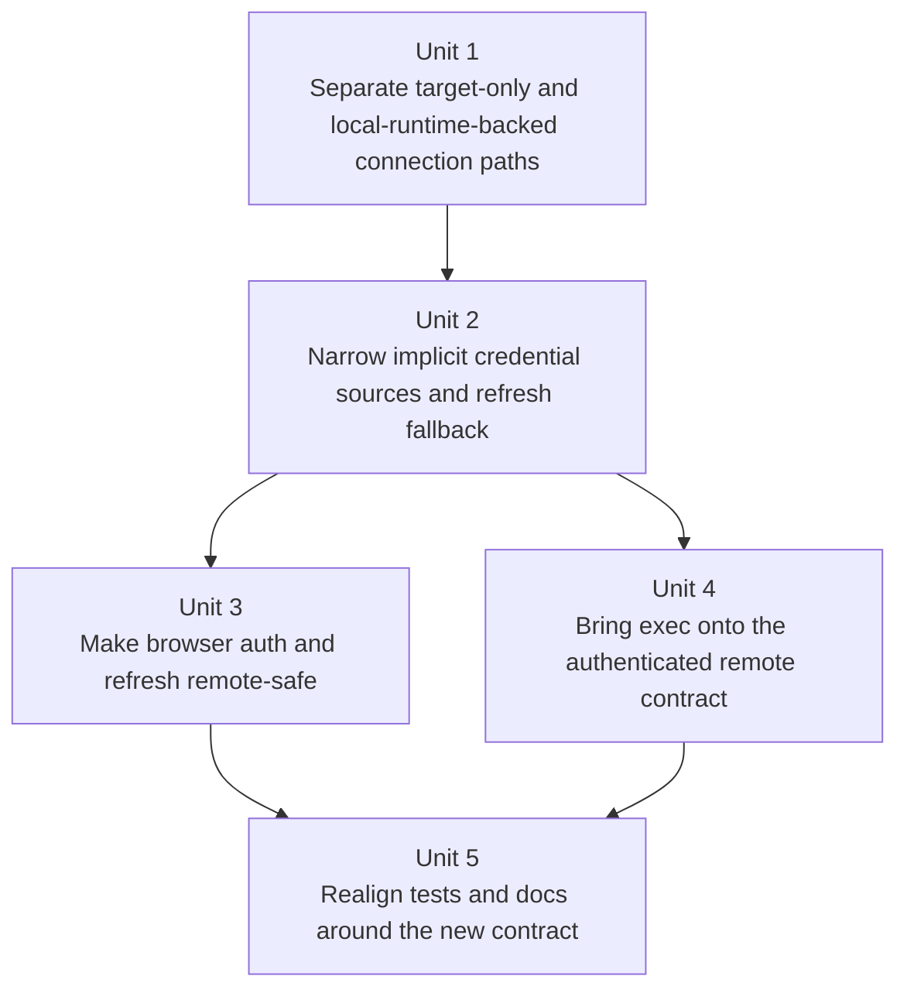

# fix: Remove lingering CLI/server same-host assumptions

## Overview

Tighten the CLI/server contract so an explicit `http(s)://...` target is always treated as a remote server, never as a disguised local daemon. This removes the remaining places where the CLI still derives remote behavior from local storage, local dev-token files, or colocated-network assumptions left over from the earlier same-host architecture.

Historical note (2026-04-21): the auth flow now also assumes a single origin. `fabro auth login` opens the browser flow on the resolved HTTP(S) target directly; the old `/api/v1/auth/cli/config` preflight no longer exists.

## Problem Frame

The codebase already moved most commands to a server-target model, but a few central helpers still collapse explicit remote targets back into local-machine state:

- explicit HTTP targets can inherit local dev-token files or active local server records
- OAuth refresh failure can downgrade a remote session into local dev-token auth
- remote auth flows still force direct-network behavior in production instead of respecting normal HTTP proxy policy
- `fabro exec --server ...` bypasses the authenticated client stack entirely
- explicit remote commands still eagerly resolve local server storage settings before they connect

Those behaviors were survivable when the CLI and server were assumed to live on the same machine. They become contract violations now that users can run the CLI on one host and talk to a server deployed elsewhere behind a TLS-terminating proxy.

## Requirements Trace

- R1. Explicit `http(s)://...` targets never inherit authentication from local storage, local server records, or `~/.fabro/dev-token`.
- R2. Local implicit dev-token conveniences remain available only on genuinely local transports and storage-owning flows.
- R3. Remote OAuth refresh failure never downgrades a session into local dev-token auth; the CLI either refreshes successfully or returns a session-expired outcome.
- R4. Production browser auth, refresh, and logout flows for remote HTTP targets respect normal HTTP transport policy instead of forcing direct no-proxy behavior.
- R5. `fabro exec --server ...` uses the same authenticated remote-server contract as other explicit server-targeted commands.
- R6. Explicit remote server commands do not require unrelated local server storage settings to resolve successfully.
- R7. Tests and docs stop asserting the old colocated behavior and instead lock down the explicit target contract.

## Scope Boundaries

- In scope:
  - shared CLI connection/auth plumbing in `fabro-cli`
  - remote auth login/logout/refresh transport behavior
  - remote `exec` auth behavior
  - command, scenario, and crate-level regression coverage
  - user-facing contract notes where current docs or help still imply colocated behavior
- Out of scope:
  - reintroducing mTLS
  - moving TLS termination back into `fabro server`
  - redesigning server auth methods
  - changing local server lifecycle commands (`fabro server start|stop|status`) away from storage ownership
  - making `fabro exec` server-owned

## Context & Research

### Relevant Code and Patterns

- `lib/crates/fabro-cli/src/command_context.rs` already distinguishes `ServerTargetArgs` (`for_target`) from `ServerConnectionArgs` (`for_connection`), which is the right contract boundary to preserve.
- `lib/crates/fabro-cli/src/server_client.rs` is the central seam for target resolution, bearer selection, auto-start, refresh, and raw HTTP access. Most user-visible contract fixes can land here once.
- `lib/crates/fabro-cli/src/commands/exec.rs` is a separate path that currently constructs a raw `FabroServerAdapter` directly instead of reusing the authenticated client stack.
- `lib/crates/fabro-cli/tests/it/cmd/ps.rs` currently encodes the old colocated assumption with `ps_accepts_local_tcp_server_target`.
- `lib/crates/fabro-cli/tests/it/cmd/exec.rs` already proves routing precedence for `exec`, but does not prove remote auth behavior.
- `lib/crates/fabro-cli/tests/it/scenario/auth.rs` and `tests/it/support/auth_harness.rs` provide the existing black-box auth harness for real login/refresh/logout flows.

### Institutional Learnings

- No `docs/solutions/` directory exists in this repository, so there are no institutional learnings to carry forward from that source.
- `files-internal/testing-strategy.md` reinforces the right split for this work:
  - connection/auth selection logic should get crate-level tests
  - single-command contract regressions should stay in `tests/it/cmd`
  - cross-command auth or exec narratives should stay in `tests/it/scenario`

### External References

- None. The repo already has enough local context and prior planning history to ground this cleanup.

## Key Technical Decisions

- Explicit `http(s)://...` targets are always treated as remote by contract.
  - Rationale: once the user names a network URL, the CLI should stop inferring local identity from the machine it is running on.
- Explicit loopback HTTP does not get a special local-auth exception.
  - Rationale: that convenience adds edge cases around port-forwards, tunnels, and local proxies without improving the core remote/local contract.
- Implicit dev-token lookup stays only on local transports and storage-owned flows.
  - Rationale: Unix sockets and daemon auto-start are machine-local by design; explicit HTTP targets are not.
- Remote OAuth refresh failure should degrade to “session expired,” not to local dev-token auth.
  - Rationale: remote identity should remain bound to the explicit target and the auth store entry for that target.
- `fabro exec` stays CLI-owned, but its server-routed `/completions` transport must become auth-aware.
  - Rationale: this preserves the design established in [2026-04-05-cli-exec-explicit-local-and-mode-removal-plan.md](./2026-04-05-cli-exec-explicit-local-and-mode-removal-plan.md) while removing the last unauthenticated remote path.
- Remote HTTP auth helpers should respect normal HTTP proxy policy.
  - Rationale: users now deploy Fabro behind TLS-terminating proxies; forcing `.no_proxy()` for every production HTTP auth call is another leftover same-host assumption.
- Test-only HTTP helpers should continue forcing `no_proxy` or equivalent disabled-proxy policy.
  - Rationale: macOS proxy detection adds measurable overhead in the test suite, and the repo already treats test-only no-proxy clients as an intentional performance and determinism pattern.

## Open Questions

### Resolved During Planning

- Should explicit loopback HTTP retain special local dev-token auto-auth?
  - No. Explicit URL means remote-by-contract, even if the host text looks local.
- Should this plan revisit mTLS or in-process TLS termination?
  - No. Those are intentionally out of contract now.
- Should `fabro exec` become server-owned as part of this cleanup?
  - No. Keep the agent session local and only fix the remote completions transport.

### Deferred to Implementation

- Whether the smallest `exec` fix is:
  - a CLI-local authenticated completions adapter backed by `ServerStoreClient`, or
  - a small extension to the existing Fabro server provider surface.
  - The implementation should choose the smaller option that preserves bearer refresh semantics without pushing CLI auth concerns into unrelated layers.
- Whether any doc changes beyond CLI help/reference pages are necessary.
  - Decide after diffing current user-facing docs for explicit `--server` and CLI auth guidance.

## High-Level Technical Design

> *This illustrates the intended approach and is directional guidance for review, not implementation specification. The implementing agent should treat it as context, not code to reproduce.*

### Target Contract Matrix

| Invocation shape | May consult local storage or active server record? | Allowed implicit credentials | Auto-start? | Proxy handling |
|---|---|---|---|---|
| Storage-owning local flow (`for_connection`, `connect_api_client_bundle`) | Yes | local dev token from env/storage/home | Yes, for local daemon flows | local transport may use `no_proxy` |
| Explicit Unix socket target | No storage lookup for target resolution | env dev token, auth-store OAuth entry, local Unix-socket dev-token convenience | No new storage-driven target fallback | `no_proxy` |
| Explicit HTTP(S) target | No | env dev token and auth-store OAuth entry for that exact target only | Never | production respects normal HTTP proxy policy; tests may force `no_proxy` |

### Unit Dependency Graph

## Implementation Units

- [x] **Unit 1: Separate target-only and local-runtime-backed connection paths**

**Goal:** Preserve the architectural distinction between “I have a server target” and “I have a local storage-backed runtime context” all the way down into shared connection setup.

**Requirements:** R1, R2, R6

**Dependencies:** None

**Files:**
- Modify: `lib/crates/fabro-cli/src/command_context.rs`
- Modify: `lib/crates/fabro-cli/src/server_client.rs`
- Modify: `lib/crates/fabro-cli/src/user_config.rs`
- Test: `lib/crates/fabro-cli/src/server_client.rs`
- Test: `lib/crates/fabro-cli/tests/it/cmd/ps.rs`

**Approach:**
- Stop `connect_server_with_settings(...)` from always resolving `user_config::storage_dir(settings)` up front.
- Keep local storage resolution only on the `ServerConnectionArgs` / storage-owning path.
- Make the `ServerTargetArgs` path target-only:
  - resolve the `ServerTarget`
  - connect to it
  - avoid deriving remote behavior from local server runtime settings
- Preserve the existing local daemon auto-start and local TCP helper behavior only on the storage-owned local path.

**Patterns to follow:**
- `CommandContext::for_target(...)` vs `CommandContext::for_connection(...)` in `lib/crates/fabro-cli/src/command_context.rs`
- prior separation direction in [2026-04-06-cli-config-socket-storage-separation-plan.md](./2026-04-06-cli-config-socket-storage-separation-plan.md)

**Test scenarios:**
- Happy path — an explicit remote `--server https://...` command succeeds or reaches the remote server even when local server storage settings are invalid or unresolved.
- Edge case — an explicit Unix socket target still resolves and connects without requiring a storage-dir override.
- Error path — an unreachable explicit HTTP target fails with a reachability/auth error, not a local settings or storage-resolution error.
- Integration — `fabro ps --server http://...` no longer succeeds solely because the CLI also knows about a local storage dir.

**Verification:**
- Explicit target-only commands can connect or fail based on the target alone; they no longer fail because unrelated local server storage settings are broken.

- [x] **Unit 2: Narrow implicit credential sources and refresh fallback**

**Goal:** Make bearer selection and refresh behavior respect the explicit remote/local target contract.

**Requirements:** R1, R2, R3

**Dependencies:** Unit 1

**Files:**
- Modify: `lib/crates/fabro-cli/src/server_client.rs`
- Test: `lib/crates/fabro-cli/src/server_client.rs`
- Test: `lib/crates/fabro-cli/tests/it/cmd/ps.rs`
- Test: `lib/crates/fabro-cli/tests/it/scenario/auth.rs`

**Approach:**
- Split bearer resolution by target class instead of one shared fallback chain:
  - explicit HTTP(S): only explicit env `FABRO_DEV_TOKEN` and stored OAuth entry for that exact target
  - local Unix socket / storage-owned local flow: keep local dev-token conveniences
- Remove local dev-token fallback from the refresh rebuild path for explicit HTTP targets.
- Remove the “remote target can fall back to `~/.fabro/dev-token`” behavior from `connect_server_target_direct(...)`.
- Replace the current `ps_accepts_local_tcp_server_target` expectation with a deliberate contract:
  - explicit HTTP target requires explicit credentials, or
  - the test should use the normal local command path instead of `--server http://...`.

**Execution note:** Start with failing crate-level tests for explicit HTTP bearer selection and a failing regression around the current `ps_accepts_local_tcp_server_target` assumption before changing the shared fallback chain.

**Patterns to follow:**
- existing `ResolvedBearer` / `RefreshableOAuth` structure in `lib/crates/fabro-cli/src/server_client.rs`
- black-box auth flow style in `lib/crates/fabro-cli/tests/it/scenario/auth.rs`

**Test scenarios:**
- Happy path — an explicit HTTP target with a stored OAuth session still attaches the correct bearer token and succeeds.
- Edge case — an explicit HTTP target with only local dev-token files present sends no implicit bearer token and receives an auth-required failure.
- Error path — when a remote refresh token is expired or revoked, the CLI clears the auth-store entry and reports session expiry without downgrading to local dev-token auth.
- Integration — the normal local server flow still works through the local-storage/Unix-socket path after the shared fallback chain is narrowed.

**Verification:**
- An explicit HTTP target can no longer authenticate solely because the same machine has a local dev-token file or active local server record.

- [x] **Unit 3: Make browser auth and refresh remote-safe**

**Goal:** Remove lingering direct-network assumptions from production CLI auth transport while preserving the existing token-safety guardrails and keeping test-only no-proxy behavior.

**Requirements:** R3, R4

**Dependencies:** Unit 2

**Files:**
- Modify: `lib/crates/fabro-cli/src/commands/auth/login.rs`
- Modify: `lib/crates/fabro-cli/src/commands/auth/logout.rs`
- Modify: `lib/crates/fabro-cli/src/server_client.rs`
- Test: `lib/crates/fabro-cli/src/server_client.rs`
- Test: `lib/crates/fabro-cli/tests/it/scenario/auth.rs`

**Approach:**
- Remove unconditional `.no_proxy()` from HTTP auth helpers used by:
  - `GET /api/v1/auth/cli/config`
  - `POST /auth/cli/token`
  - `POST /auth/cli/refresh`
  - `POST /auth/cli/logout`
- Keep Unix-socket auth helpers as explicitly local and `no_proxy`.
- Keep test-only builders, harnesses, and fixtures on explicit `no_proxy` or disabled-proxy policy so the test suite does not pay macOS proxy-discovery overhead.
- Preserve the existing sensitive-credential transport guard:
  - token and refresh submission still require HTTPS, loopback HTTP, or Unix socket transport
  - plaintext non-loopback HTTP remains rejected
- Keep target normalization and browser URL generation unchanged except where needed to stop treating generic HTTP as colocated/local.

**Patterns to follow:**
- `is_loopback_or_unix_socket(...)` in `lib/crates/fabro-cli/src/loopback_target.rs`
- existing auth scenario harness in `lib/crates/fabro-cli/tests/it/support/auth_harness.rs`

**Test scenarios:**
- Happy path — HTTPS remote login, refresh, and logout continue to work end-to-end.
- Edge case — loopback HTTP auth still succeeds for local CLI OAuth flows.
- Error path — non-loopback plaintext HTTP refresh or token exchange is rejected before credentials are sent.
- Integration — with normal production proxy policy enabled for a remote HTTP(S) auth target, the CLI auth flow uses the proxy-aware HTTP builder rather than forcing direct `no_proxy` behavior.

**Verification:**
- Remote HTTP auth behavior is shaped only by target safety rules and normal HTTP client policy, not by same-host shortcuts.

- [x] **Unit 4: Bring `fabro exec --server` onto the authenticated remote contract**

**Goal:** Make server-routed `exec` completions use the same auth and refresh semantics as the rest of the explicit remote CLI surface.

**Requirements:** R3, R5

**Dependencies:** Unit 2

**Files:**
- Modify: `lib/crates/fabro-cli/src/commands/exec.rs`
- Modify: `lib/crates/fabro-cli/src/server_client.rs`
- Test: `lib/crates/fabro-cli/tests/it/cmd/exec.rs`
- Test: `lib/crates/fabro-cli/tests/it/scenario/auth.rs`

**Approach:**
- Keep `fabro exec` local and CLI-owned.
- Stop constructing a bare remote `FabroServerAdapter` from `user_config::build_server_client(...)`.
- Reuse the authenticated CLI server client contract for `/api/v1/completions`:
  - either by adding a small CLI-local authenticated completions adapter backed by `ServerStoreClient`
  - or by extending the existing completions transport in the smallest way that preserves bearer refresh semantics
- Preserve the existing command precedence contract:
  - explicit `--server` reroutes `exec`
  - configured server target alone still does not reroute `exec`

**Execution note:** Start with a failing remote-auth `exec` contract test so the auth integration shape is locked down before refactoring the provider transport.

**Patterns to follow:**
- `ServerStoreClient::send_http(...)` and refresh flow in `lib/crates/fabro-cli/src/server_client.rs`
- server `/completions` auth requirement in `lib/crates/fabro-server/src/server.rs`
- existing routing-precedence tests in `lib/crates/fabro-cli/tests/it/cmd/exec.rs`

**Test scenarios:**
- Happy path — `fabro exec --server https://...` with valid stored CLI auth reaches `/api/v1/completions` without requiring a local provider API key.
- Edge case — configured server target alone still does not reroute `exec`.
- Error path — expired access token during remote exec completion refreshes once and retries, or surfaces the same session-expired outcome used by other remote commands when refresh is no longer possible.
- Integration — login to a real authenticated server, then run `fabro exec --server ...` successfully against `/api/v1/completions`.

**Verification:**
- The `exec` remote path no longer bypasses CLI auth state or raw bearer selection logic.

- [x] **Unit 5: Realign tests and docs around the new contract**

**Goal:** Remove stale colocated assumptions from black-box coverage and user-facing contract text.

**Requirements:** R7

**Dependencies:** Units 1-4

**Files:**
- Modify: `lib/crates/fabro-cli/tests/it/cmd/ps.rs`
- Modify: `lib/crates/fabro-cli/tests/it/cmd/exec.rs`
- Modify: `lib/crates/fabro-cli/tests/it/scenario/auth.rs`
- Modify: `lib/crates/fabro-cli/tests/it/support/auth_harness.rs`
- Modify: `docs/reference/cli.mdx`
- Modify: `docs/reference/user-configuration.mdx`

**Approach:**
- Update black-box tests so explicit HTTP targets are treated as remote-by-contract.
- Keep low-level credential selection checks close to `server_client.rs`; do not simulate internal runtime files in CLI integration tests.
- Add one regression proving an explicit remote command still works when local storage config is broken.
- Add one remote-auth `exec` regression so the new authenticated completions path stays covered.
- Update docs/help copy anywhere it still implies that explicit `--server` may inherit local daemon identity or local dev-token convenience.

**Patterns to follow:**
- `files-internal/testing-strategy.md` placement rules for crate-level vs `cmd/*` vs `scenario/*`
- existing real auth harness organization in `lib/crates/fabro-cli/tests/it/support/auth_harness.rs`

**Test scenarios:**
- Happy path — documented explicit remote auth flow matches the CLI’s actual behavior after login.
- Edge case — explicit HTTP target with a local daemon running on the same machine is still treated as remote unless the user provides explicit credentials.
- Error path — a broken or missing local storage config no longer breaks explicit remote commands.
- Integration — the end-to-end auth harness covers login -> remote command -> refresh -> logout with the tightened explicit-target contract, and `exec --server` has equivalent authenticated coverage.

**Verification:**
- No command test, scenario test, or reference doc still depends on “explicit HTTP target inherits local server identity.”

## System-Wide Impact

- **Interaction graph:** `CommandContext` -> `ServerStoreClient` -> `AuthStore` / local dev-token lookup -> generated API client and raw `/completions` transport. Fixing this seam affects every command using `for_target(...)`, plus the separate `exec` transport path.
- **Error propagation:** explicit remote commands should fail as remote commands:
  - reachability errors stay reachability errors
  - auth failures stay auth failures
  - expired sessions stay session-expired failures
  - they should not turn into local settings-resolution failures or hidden local-auth success
- **State lifecycle risks:** auth-store removal on refresh failure must remain targeted to the remote session for that server key; local dev-token files should remain untouched.
- **API surface parity:** every command using `CommandContext::for_target(...)` should inherit the same explicit-target behavior once the shared client plumbing is fixed. `exec` needs the parity fix separately because it bypasses that stack today.
- **Integration coverage:** `ps`, auth scenario coverage, and `exec` all need regression protection because they represent three different surfaces exercising the same contract:
  - generated API client
  - browser auth endpoints
  - raw `/completions` transport
- **Unchanged invariants:** local server lifecycle commands, local daemon auto-start, Unix-socket targeting, and plaintext non-loopback refresh rejection remain unchanged in principle.

## Risks & Dependencies

| Risk | Mitigation |
|------|------------|
| Narrowing implicit dev-token fallback breaks existing local-HTTP tests or undocumented workflows | Update tests to use the deliberate local path or explicit credentials; document the new contract explicitly |
| `exec` auth integration grows into a broad provider-layer refactor | Keep the fix CLI-local if possible and reuse `ServerStoreClient` rather than pushing CLI auth concerns into generic shared layers |
| Production proxy handling changes accidentally slow or destabilize tests | Keep test-only builders and harnesses on explicit `no_proxy` or disabled-proxy policy; reserve proxy-aware assertions for a small number of targeted production-path regressions |
| Shared client changes accidentally affect storage-owning local flows | Keep the `for_connection(...)` / local auto-start path explicit and preserve existing local-only regression coverage |

## Documentation / Operational Notes

- The user-facing message should become simpler, not more nuanced:
  - explicit URL target = remote server
  - Unix socket and storage-owned local flow = local server conveniences
- No deployment rollout or server config migration is required.
- Do not add new deployment guidance around mTLS or built-in TLS termination; those are no longer part of the supported deployment story.

## Sources & References

- Related plans:
  - [2026-04-06-cli-config-socket-storage-separation-plan.md](./2026-04-06-cli-config-socket-storage-separation-plan.md)
  - [2026-04-05-cli-exec-explicit-local-and-mode-removal-plan.md](./2026-04-05-cli-exec-explicit-local-and-mode-removal-plan.md)
  - [2026-04-19-003-feat-cli-auth-login-plan.md](./2026-04-19-003-feat-cli-auth-login-plan.md)
- Related code:
  - `lib/crates/fabro-cli/src/command_context.rs`
  - `lib/crates/fabro-cli/src/server_client.rs`
  - `lib/crates/fabro-cli/src/commands/auth/login.rs`
  - `lib/crates/fabro-cli/src/commands/auth/logout.rs`
  - `lib/crates/fabro-cli/src/commands/exec.rs`
  - `lib/crates/fabro-server/src/server.rs`
- Related tests:
  - `lib/crates/fabro-cli/tests/it/cmd/ps.rs`
  - `lib/crates/fabro-cli/tests/it/cmd/exec.rs`
  - `lib/crates/fabro-cli/tests/it/scenario/auth.rs`
  - `lib/crates/fabro-cli/tests/it/support/auth_harness.rs`
- Repo guidance:
  - `files-internal/testing-strategy.md`
