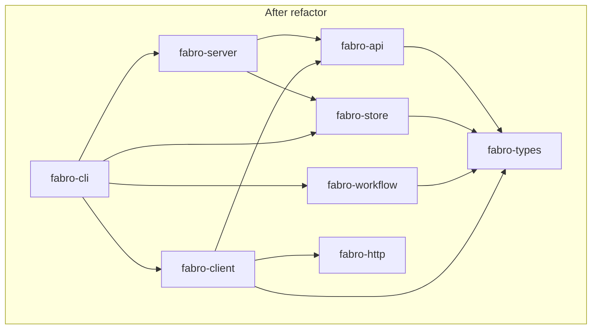
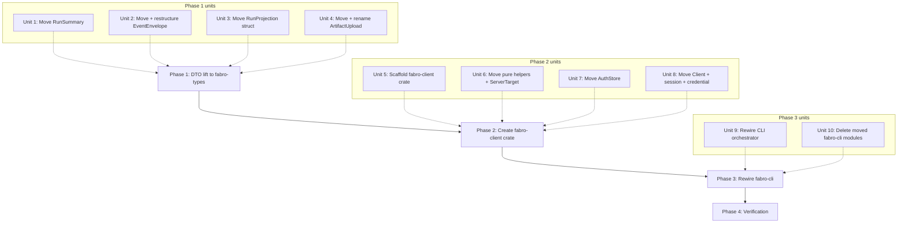

Historical note (2026-04-21): the follow-up auth-surface tightening removed `LoopbackClassification`, `target.loopback_classification()`, `ensure_refresh_target_transport`, and the plain-HTTP refresh rejection. References to those APIs below describe the planned state at the time, not the current implementation.

# refactor: Extract fabro-client crate and lift domain DTOs to fabro-types

## Overview

Extract the typed Fabro-API client currently embedded in `fabro-cli` into a new reusable crate, `fabro-client`. Lift the domain data types the client uses (`RunSummary`, `EventEnvelope`, `RunProjection`, and an artifact-upload DTO) from `fabro-store` and `fabro-workflow` down to `fabro-types`, so `fabro-client` stays light on dependencies. Apply a short list of in-flight naming cleanups while we touch this code.

## Problem Frame

`lib/crates/fabro-cli/src/server_client.rs` is a 1941-line file that implements a fully-featured HTTP client for the Fabro API (40+ typed method wrappers, OAuth refresh, SSE streaming, error classification, Unix-socket transport, artifact multipart uploads). The logic is reusable in spirit, but today it:

- lives inside the CLI binary crate, so nothing else in the workspace can reuse it
- imports `fabro-store` DTOs (`RunSummary`, `EventEnvelope`, `RunProjection`) — entangling every consumer of the client with the storage layer
- imports `fabro-workflow::artifact_snapshot::CapturedArtifactInfo` — pulling the workflow engine in for four artifact fields
- mixes CLI concerns (subprocess autostart, dev-token-from-disk lookup, TOML-driven target resolution) with SDK concerns (make-a-request, parse-a-response) in the same file
- carries several awkward names (`ClientBundle`, `RefreshableOAuth`, `ResolvedBearer`, `HttpResponseFailure`, `RunAttachEventStream`, `CapturedArtifactInfo`) that fight domain-driven naming

These were all reasonable while the client had exactly one caller. They prevent a second caller (an SDK, an IDE extension, future automation tooling) from emerging cleanly, and they block the layering story "`fabro-client` is to the API server what a typed SDK is to any HTTP service."

## Requirements Trace

- R1. A new `fabro-client` crate exists at `lib/crates/fabro-client/`, declared in the workspace, publishing a typed `Client` and its connection machinery.
- R2. `fabro-client` does **not** depend on `fabro-cli`, `fabro-store`, `fabro-workflow`, `fabro-server`, `fabro-config`, or any other CLI-bound or server-bound crate.
- R3. `fabro-client` returns rich domain types from `fabro-types` (`RunSummary`, `EventEnvelope`, `RunProjection`, `StageId`, `RunId`, `RunBlobId`, `RunEvent`, `ArtifactUpload`) and wire-shape types re-exported from `fabro-api::types` (e.g. `SystemInfoResponse`, `PreviewUrlResponse`, `SecretMetadata`, `PruneRunsRequest`, `ModelTestResult`).
- R4. `fabro-store` no longer owns `RunSummary`, `EventEnvelope`, or `RunProjection` (at the struct level). `fabro-workflow` no longer owns `CapturedArtifactInfo`.
- R5. Type renames applied:
  - `ClientBundle` → inlined into `Client` (no separate type).
  - `RefreshableOAuth` → `OAuthSession`.
  - `ResolvedBearer` → `Credential`.
  - `HttpResponseFailure` → `ApiError`.
  - `RunAttachEventStream` → `RunEventStream`.
  - `CapturedArtifactInfo` → `ArtifactUpload`.
- R6. `ServerTarget` is canonical-by-construction using lexical-only canonicalization (no `fs::canonicalize`, no existence checks). `ServerTargetKey` is deleted; `ServerTarget` serves as its own map key.
- R7. `AuthStore` lives in `fabro-client`, defaults to `~/.fabro/auth.json`, and keys OAuth entries by `ServerTarget` directly.
- R8. `fabro-cli` keeps CLI-owned orchestration: subprocess autostart, server-record lookup, dev-token-from-disk loading, `[cli.target]` TOML resolution, and the wrapper that stitches these together into a ready-to-use `fabro_client::Client`.
- R9. The full workspace build passes (`cargo build --workspace`), clippy is clean (`cargo +nightly-2026-04-14 clippy --workspace --all-targets -- -D warnings`), rustfmt check passes, and all workspace tests continue to pass (`cargo nextest run --workspace`).

## Review Adjustments

- Remaining gaps against this plan in the current landed code:
  - `HttpResponseFailure` → `ApiError` rename is still open.
  - `ServerTarget` canonical-by-construction / lexical-only Unix-path canonicalization is still open; canonicalization still partly lives in `AuthStore`.
  - `RunAttachEventStream` → `RunEventStream` rename is still open at the CLI boundary.
  - Because the two rename cleanups above are still open, Unit 11's "no leaked old names" grep is currently expected to fail until that follow-up cleanup lands.
- Clarifications after implementation review:
  - `RunProjection` ownership moved to `fabro-types`; external callers may continue to import it through `fabro_store`'s re-export. Verification should check type ownership and dependency boundaries, not the literal import spelling.
  - `Client::from_http_client(...)` is the required public constructor. `Client::new_no_proxy(...)` may remain as a convenience wrapper, primarily for tests.
  - `TransportConnector` is an acceptable internal helper inside `fabro-client` when needed to preserve caller-specific transport configuration across refresh/rebuild flows.
  - `fabro-cli` may retain multiple thin `connect_*` convenience wrappers so long as they preserve CLI-only orchestration and funnel into `Client::builder()` under the hood.

## Scope Boundaries

**In scope:**
- Creating the `fabro-client` crate.
- Lifting the four DTOs to `fabro-types` (`RunSummary`, `EventEnvelope`, `RunProjection`, `ArtifactUpload`).
- The six type renames above.
- `ServerTarget` canonical-by-construction + `ServerTargetKey` deletion.
- Updating import sites across `fabro-cli`, `fabro-server`, `fabro-store`, `fabro-workflow`, `fabro-retro` (compiler-driven).
- Keeping the existing behavior of every CLI command intact.

**Out of scope:**
- Renaming `RunSummary`, `EventEnvelope`, `RunProjection`, `AuthEntry`, `StoredSubject` (structure moves, names stay; deferred per user direction).
- Publishing `fabro-client` to crates.io or adding external-consumer documentation.
- Writing a second consumer of `fabro-client` (SDK example, IDE integration, etc.) — the crate exists to enable that, not to deliver it.
- Changing wire semantics (OpenAPI contract stays identical).
- Migrating existing `~/.fabro/auth.json` entries. The canonical key format for HTTP targets remains identical (same `normalized_http_base_url` logic); Unix-socket canonicalization changes from `fs::canonicalize` (symlink-resolving) to lexical-only (`.`/`..` cleanup, no symlink chasing). Existing sessions against socket paths written as absolute non-symlinked paths continue to match. Users with symlinked socket paths may need to re-login — acceptable per `CLAUDE.md` ("We don't care about migration").
- `RunEvent` unknown-variant handling. Already present today via `EventBody::Unknown` at `lib/crates/fabro-types/src/run_event/mod.rs:695` (covered by `:974`). Unit 2 verifies the `EventEnvelope` restructure preserves this existing behavior — no new variant, no new code.
- Splitting the ~40 client methods into separate `client/runs.rs`, `client/secrets.rs`, etc. modules. A single `client.rs` is acceptable at ~900 lines; cosmetic domain splitting can happen later if the file grows.

## Context & Research

### Relevant Code and Patterns

- `lib/crates/fabro-cli/src/server_client.rs:1-1941` — the entire current client implementation, including `Client`, `ClientBundle`, connection builders, error classification, `send_api`/`send_http`, `RunAttachEventStream`, and 40 typed wrapper methods.
- `lib/crates/fabro-cli/src/auth_store.rs` — file-locked `~/.fabro/auth.json` persistence. Its `ServerTargetKey` is the canonical-key type that's about to go away.
- `lib/crates/fabro-cli/src/loopback_target.rs` — pure URL classification, no dependencies outside `fabro-http` and `thiserror`. Moves cleanly.
- `lib/crates/fabro-cli/src/sse.rs` — pure SSE line-buffer parser. Moves cleanly.
- `lib/crates/fabro-cli/src/user_config.rs` — today owns `ServerTarget`, `normalized_http_base_url`, `cli_http_client_builder`, and TOML target resolution. `ServerTarget` and `normalized_http_base_url` move to `fabro-client`; the rest stays.
- `lib/crates/fabro-cli/src/commands/server/{start,record}.rs` — CLI-owned autostart + pidfile. Stays.
- `lib/crates/fabro-store/src/types.rs` — home of `RunSummary`, `EventEnvelope`, and `EventPayload`. `RunSummary` moves cleanly. `EventEnvelope` restructures (new shape `{ seq, event: RunEvent }`) and moves; `EventPayload` stays behind as an internal validation helper.
- `lib/crates/fabro-store/src/run_state.rs` — home of `RunProjection`. The struct moves to `fabro-types` with its pure-data accessors; the event-reducer methods (`apply_event`, `apply_events`) move into a `RunProjectionReducer` trait in `fabro-store` implemented on `fabro_types::RunProjection`. See Unit 3.
- `lib/crates/fabro-workflow/src/artifact_snapshot.rs:20-26` — `CapturedArtifactInfo` definition. Four pure-data fields, serde derives only.
- `docs/api-reference/fabro-api.yaml:3452-3461` — OpenAPI defines `EventEnvelope` as `allOf [EventSeq, RunEvent]`, wire format `{ seq, event_fields_flattened_in }`. `fabro_types::EventEnvelope { seq: u32, #[serde(flatten)] event: RunEvent }` matches the wire contract exactly — no serialization change, only the Rust representation changes.
- `lib/crates/fabro-types/Cargo.toml` — deps are already lightweight (`chrono`, `fabro-model`, `fabro-util`, `serde`, `serde_json`). Our new DTOs fit inside this dep envelope.
- Plan format precedent: `docs/plans/2026-04-20-001-fix-cli-server-same-host-assumptions-plan.md` — recently-landed refactor in the same subsystem; we model frontmatter and section style on it.

### Institutional Learnings

- No `docs/solutions/` directory in this repo — no prior captured learnings apply. Historical plans in `docs/plans/` around CLI/server boundary (`2026-04-02-001-feat-server-daemon-management-plan.md`, `2026-04-05-cli-deglobalize-server-url-and-storage-dir-plan.md`, `2026-04-20-001-fix-cli-server-same-host-assumptions-plan.md`) have tightened the target-resolution contract progressively. This plan's `fabro-client` extraction is the next step in that direction: after target resolution became disciplined, pull the pure client *out* of the CLI and make its purity enforceable by the crate graph.
- `CLAUDE.md` reminds: "We want the simplest change possible. We don't care about migration. Code readability matters most, and we're happy to make bigger changes to achieve it." We lean on this for the `ServerTarget` canonicalization change and the "delete the alias" step in the `Client` rename we just finished.
- `files-internal/testing-strategy.md` — most existing CLI tests exercise the client through CLI-level commands; those tests continue to live in `fabro-cli` and don't need to migrate. Tests of internal helpers (auth-store round-trips, `ServerTargetKey` canonicalization, loopback classification, SSE parsing, dev-token resolution) fall into three buckets: (a) auth-store/SSE/loopback/ServerTarget tests migrate to `fabro-client`; (b) dev-token resolution tests stay in `fabro-cli`; (c) server-client unit tests for refresh-token transport checks migrate.

### External References

None. Internal refactor; the patterns are all established locally.

## Key Technical Decisions

- **`fabro-client` has zero CLI/server/workflow/store coupling.** Its dep list is `fabro-api`, `fabro-http`, `fabro-model`, `fabro-types`, `fabro-util`, plus general-purpose async/serialization crates. Rationale: this is the whole point — make reuse a compile-time guarantee, not a convention. Consumers inherit the transitive surface of these deps (reqwest via `fabro-http`, progenitor-generated client via `fabro-api`, chrono/serde via the rest) — not minimal, but consistent with the crate's "typed SDK for the Fabro HTTP API" scope.
- **Domain DTOs live in `fabro-types`; wire shapes live in `fabro-api`.** Rich Rust types (`RunSummary` with `HashMap<String,String>` and `RunId` newtype, `RunProjection` with all the `fabro-types` sub-records) belong with the rest of the domain vocabulary. Single-use request/response shapes (`PruneRunsRequest`, `SandboxFileEntry`, etc.) stay in the auto-generated `fabro-api::types` and are re-exported from `fabro-client::types`.
- **`EventEnvelope` restructure.** Change from `{ seq, payload: EventPayload(serde_json::Value) }` to `{ seq: u32, #[serde(flatten)] event: RunEvent }`. The wire contract is unchanged (OpenAPI already specifies `allOf [EventSeq, RunEvent]`). The Rust representation becomes typed end-to-end, eliminating `.payload.as_value() → RunEvent::from_ref(...)` conversions at every consumer. `EventPayload` stays in `fabro-store` as an internal validation helper used by the storage path.
- **`RunProjection` method split via `RunProjectionReducer` extension trait.** Move the struct (data) to `fabro-types`, including its pure-data accessors (`node`, `iter_nodes`, `is_empty`, `set_node`, `list_node_visits`, `node_mut`, `current_visit_for`, `reset_for_rewind`) as `pub` inherent methods. Define `RunProjectionReducer` in `fabro-store` with `apply_event`/`apply_events` (and `impl RunProjectionReducer for fabro_types::RunProjection`) so storage behavior stays in `fabro-store` while call-site syntax remains method-style: `use fabro_store::RunProjectionReducer; projection.apply_event(ev)?`. The trait form preserves OOP-style method chaining at ~10 call sites and fits the workspace's preferred convention (methods over free helpers). `build_summary` stays as a `pub(crate)` free function in `fabro-store` — it's a projection-derived summary, not a mutation on the projection itself.
- **`ServerTarget` canonical-by-construction, lexical only.** `ServerTarget::from_url` applies today's full HTTP canonicalization inline: lowercase scheme, lowercase host, strip default ports (`:443` on https, `:80` on http), strip trailing `/`, strip `/api/v1` suffix, rebuild authority as `{scheme}://{host}[:{port}]`. `ServerTarget::from_unix_path` applies lexical `.`/`..` resolution (no FS access, no symlink chasing). `PartialEq`/`Eq`/`Hash` operate on the canonical form directly. `ServerTargetKey` is deleted; `ServerTarget` itself serves as the `AuthStore` map key. In OOP style: construction *is* the canonicalizer — no separate `canonicalize()` method. Related helpers attach to `ServerTarget` as inherent methods (`target.loopback_classification()`, `target.build_public_http_client()`) rather than free functions.
- **`AuthStore` moves to `fabro-client`.** Default path remains `~/.fabro/auth.json` via `fabro_util::Home`. The public API (`get`/`put`/`remove`/`list`) is narrow enough that we keep it concrete — no `TokenRefresher` trait abstraction. Callers wanting alternative storage can pass an explicit path to `AuthStore::new`. If external-consumer flexibility becomes a real need later, we extract a trait then, not now.
- **Renames applied inline with moves.** We don't do a separate rename pass — the DTOs and internal types are renamed as they move. This keeps the compiler-driven find-all-callers loop honest: every broken import is both a move and a rename in one commit.
- **Connection API centers on one builder.** Today's `connect_*` functions in `server_client.rs` are CLI-opinionated convenience wrappers. `fabro-client` exposes `Client::builder().target(t).credential(c).oauth_session(s).connect().await?` as the underlying connection API. `fabro-cli` may keep several thin `connect_*` wrappers, but they must remain orchestration-only and funnel into the builder instead of duplicating transport/session assembly logic.
- **Refresh rebuilds may use a transport connector hook.** If the CLI needs request-transport customization across OAuth refresh rebuilds (for example, preserving a CLI-specific user-agent), `fabro-client` may carry a `TransportConnector`-style helper as an internal implementation detail. This does not count as a second public connection API.

- **`OAuthSession` refresh fallback via `CredentialFallback` trait.** Today's refresh flow falls back to a dev-token-from-disk when the OAuth entry is missing, expired, or revoked. That fallback lookup reads CLI-owned sources (`FABRO_DEV_TOKEN` env, `~/.fabro/dev-token`, storage-dir dev-token file, fabro-server pidfile record) that don't belong in `fabro-client`. `OAuthSession` takes an optional `Box<dyn CredentialFallback>` at build time:
  ```text
  // Directional — not implementation
  pub trait CredentialFallback: Send + Sync {
      fn resolve(&self) -> Option<Credential>;
  }
  ```
  On refresh failure modes that previously triggered fallback, `OAuthSession` calls `fallback.resolve()`. If `Some(Credential)`, the session rebuilds the client bundle with that credential; if `None`, it surfaces "session expired." The CLI provides a concrete impl in `fabro-cli` that wraps the existing dev-token-loading logic. Named trait (vs bare `Fn` closure) makes the role obvious at the `OAuthSession::builder` call site.

- **`fabro_types::RunEvent` already tolerates unknown event names.** `EventBody::Unknown { name, properties }` at `lib/crates/fabro-types/src/run_event/mod.rs:695` is the existing fallback — a newer server's unknown event type deserializes into this variant without error. Unit 2's responsibility is to *preserve* this behavior across the `EventEnvelope { seq, #[serde(flatten)] event: RunEvent }` restructure, not to add a new variant.
- **Phased delivery.** DTO lift must land before the client extraction — otherwise `fabro-client`'s deps can't be correct. We split the work into three phases (DTO lift → `fabro-client` extraction → `fabro-cli` rewire) and land each phase as a coherent chunk. Each phase compiles and tests pass at its boundary.

## Open Questions

### Resolved During Planning

- **Where do `apply_events`/`apply_event` live after `RunProjection` moves?** In `fabro-store` as an extension trait `RunProjectionReducer` implemented on `fabro_types::RunProjection`. Preserves OOP-style method-call syntax at call sites via `use fabro_store::RunProjectionReducer;`. Chosen over free functions because the workspace leans toward methods over free helpers.
- **HTTP canonicalization scope in `ServerTarget::from_url`.** Preserve today's full normalization: lowercase scheme + lowercase host + strip default ports + strip trailing `/` + strip `/api/v1` suffix + rebuild authority. Matches today's `canonical_http_target` in `auth_store.rs:350-383` and the existing `https_normalization_collapses_equivalent_urls` test at line 507. Simpler "strip slash + api-v1 only" form was rejected because it would silently invalidate AuthStore entries for users whose URLs differed only in case or default-port.
- **OAuthSession refresh fallback mechanism.** Add a `CredentialFallback` trait; `fabro-cli` implements it against its dev-token sources; `OAuthSession` holds `Option<Box<dyn CredentialFallback>>` and calls `fallback.resolve()` on the failure modes that previously fell back to dev-token. Named trait (not bare `Fn`) chosen for role clarity.
- **`RunEvent` unknown-variant forward-compat.** Already handled today via `EventBody::Unknown` at `lib/crates/fabro-types/src/run_event/mod.rs:695` (tested at `:974`). Unit 2 verifies the `EventEnvelope` restructure preserves this existing behavior — no new variant, no new code.
- **Does `EventEnvelope` need `EventPayload` to travel with it?** No. OpenAPI already defines the wire shape as `seq + RunEvent flattened`. `EventPayload` is a storage-internal validation helper and stays behind.
- **Does `AuthStore` need a trait-based abstraction?** No. Concrete type with a configurable file path is sufficient; we extract a trait the day a second implementation exists.
- **Does `ArtifactUpload` live in `fabro-types` or `fabro-client`?** `fabro-types`. Source is `fabro-workflow` (capture) → sink is `fabro-client` (upload). Placing the DTO in `fabro-types` prevents `fabro-workflow` from having to depend on `fabro-client`.
- **How do we handle the `Client::new_no_proxy(base_url)` constructor used by CLI tests today?** Expose `Client::from_http_client(base_url, http_client)` as the stable public `pub fn`. `Client::new_no_proxy(base_url)` may remain as a small convenience wrapper (in `fabro-client` or CLI-local test code) if it continues to earn its keep.
- **`convert_type` serde round-trip helper — does it stay in the CLI or move with the client?** Moves with the client. It's how the client bridges `fabro_api::types::RunSummary` (wire) → `fabro_types::RunSummary` (domain) at response boundaries.

### Deferred to Implementation

- Exact module file layout inside `fabro-client/src/` may shift slightly as we go (e.g., whether `credential.rs` and `session.rs` stay separate or merge). Guide: keep the sketched layout unless one file shrinks under ~50 lines, at which point merge.
- Whether any `pub(crate)` items inside the current `server_client.rs` need to become `pub` when exposed from `fabro-client`. Driven by compiler errors when `fabro-cli` imports across the crate boundary.
- Exact form of the CLI's `Credential`-building helper after the move (currently called `resolve_target_bearer`). The shape depends on what survives in `fabro-cli` after the extraction.
- Whether `Client` ends up `#[derive(Debug)]` or implements `Debug` manually. Today it isn't. Driven by whether any downstream consumer needs it.

## High-Level Technical Design

> *This illustrates the intended approach and is directional guidance for review, not implementation specification. The implementing agent should treat it as context, not code to reproduce.*

### Target crate dependency graph



Key property: `fabro-client` has **no** arrow into `fabro-store`, `fabro-workflow`, `fabro-server`, `fabro-cli`, or `fabro-config`.

### fabro-client module layout

```text
lib/crates/fabro-client/
├── Cargo.toml
└── src/
    ├── lib.rs            — re-exports, crate docs, `pub use types` from fabro-api
    ├── client.rs         — Client struct (flattened, no Bundle), send_api/send_http,
    │                        Client::builder(), all ~40 wrapper methods
    ├── target.rs         — ServerTarget (canonical-by-construction), Display, FromStr
    ├── credential.rs     — Credential { DevToken, OAuth }
    ├── session.rs        — OAuthSession, refresh_access_token flow
    ├── auth_store.rs     — AuthStore, AuthEntry, StoredSubject
    ├── error.rs          — ApiError, classify_api_error, classify_http_response, map_api_error
    ├── sse.rs            — drain_sse_payloads, RunEventStream
    └── loopback.rs       — LoopbackClassification (accessed via target.loopback_classification())
```

### Phase sequencing



Within a phase, units may execute in parallel when independent; across phases, the order is strict.

### Connection API shape

```text
// Directional sketch — not implementation.
// fabro-client exposes one builder that replaces today's four connect_* fns.

Client::builder()
    .target(ServerTarget::from_str("https://fabro.example.com/api/v1")?)
    .credential(Credential::DevToken("fabro_dev_...".into()))
    .oauth_session(session)   // optional; enables auto-refresh on 401
    .connect()
    .await?

// fabro-cli's orchestrator becomes roughly:
// 1. resolve ServerTarget from args + settings
// 2. if Unix + not running: ensure_server_running_on_socket
// 3. build Credential from env / auth_store / dev-token-file
// 4. Client::builder().target(t).credential(c).oauth_session(s).connect()
```

## Implementation Units

### Phase 1 — DTO lift to fabro-types

- [ ] **Unit 1: Move `RunSummary` to `fabro-types`**

**Goal:** Relocate the `RunSummary` struct from `fabro-store` to `fabro-types` so that crates consuming runs-list data no longer depend on the storage layer.

**Requirements:** R3, R4.

**Dependencies:** None.

**Files:**
- Create: `lib/crates/fabro-types/src/run_summary.rs`
- Modify: `lib/crates/fabro-types/src/lib.rs` (add `pub mod run_summary;` + re-export)
- Modify: `lib/crates/fabro-store/src/types.rs` (delete `RunSummary` definition; keep re-export `pub use fabro_types::RunSummary;` during transition, or update all call sites and delete outright — prefer the latter)
- Modify: call sites across `lib/crates/fabro-cli/` (~4 files), `lib/crates/fabro-server/src/server.rs`, `lib/crates/fabro-store/` (internal uses), any others the compiler surfaces
- Test: `lib/crates/fabro-types/src/run_summary.rs` (inline `#[cfg(test)]` module with a round-trip serde test)

**Approach:**
- Copy the struct verbatim from `fabro-store/src/types.rs:10-24` into a new `fabro-types/src/run_summary.rs`. The struct already references only `fabro_types` types (`RunId`, `RunStatus`, `BlockedReason`, etc.), so no type-substitution is needed.
- Re-export from `fabro-types/src/lib.rs`: `pub use run_summary::RunSummary;`.
- In `fabro-store/src/types.rs`, delete the struct and update any store-internal references to import from `fabro_types::RunSummary`.
- Update import sites. Compiler drives the list; expect ~6 files.

**Patterns to follow:**
- Mirror the style of existing small DTO modules in `fabro-types`: `fabro-types/src/run_blob_id.rs`, `fabro-types/src/sandbox_record.rs`.

**Test scenarios:**
- Happy path: `RunSummary` serialized and round-tripped through `serde_json` produces an identical value. (Carry over or adapt any existing test from `fabro-store`.)

**Verification:**
- `cargo build --workspace` succeeds.
- `cargo nextest run -p fabro-types -p fabro-store -p fabro-server -p fabro-cli` passes.
- `grep -rn "fabro_store::RunSummary\|fabro_store::types::RunSummary" lib/` returns no results outside `fabro-store` internals.

---

- [ ] **Unit 2: Move and restructure `EventEnvelope` in `fabro-types`**

**Goal:** Replace `fabro-store`'s `EventEnvelope { seq, payload: EventPayload(serde_json::Value) }` with `fabro-types`'s `EventEnvelope { seq: u32, #[serde(flatten)] event: RunEvent }`. The wire format is unchanged (OpenAPI already flattens `RunEvent` fields alongside `seq`).

**Requirements:** R3, R4.

**Dependencies:** None (independent of Unit 1, can run in parallel).

**Files:** (verified call-site inventory; compiler drives any residual sites)

Construction sites (switch to `fabro_types::EventEnvelope { seq, event }`):
- Create: `lib/crates/fabro-types/src/event_envelope.rs`
- Modify: `lib/crates/fabro-types/src/lib.rs` (module + re-export)
- Modify: `lib/crates/fabro-store/src/types.rs` (delete old `EventEnvelope`; keep `EventPayload` internal; update tests at lines 127 and 171)
- Modify: `lib/crates/fabro-store/src/slate/run_store.rs` (production constructors at lines 194 and 342)
- Modify: `lib/crates/fabro-store/src/run_state.rs` (apply_event body at line 79; test fixtures at lines 728, 741, 1086, 1112; test assertions at lines 1133, 1137)
- Modify: `lib/crates/fabro-cli/src/commands/run/runner.rs:372-373` (write path that also constructs an envelope)

Read sites (switch from `envelope.payload.as_value()` / `&envelope.payload` → `&envelope.event`):
- Modify: `lib/crates/fabro-server/src/server.rs` (7 sites: 888, 1776, 1794, 3307, 3581, 8770, 8771 — includes the `api_event_envelope_from_store` merge-seq logic and two test assertions)
- Modify: `lib/crates/fabro-retro/src/retro_agent.rs:311`
- Modify: `lib/crates/fabro-workflow/src/lib.rs:95` (`extract_stage_durations_from_events`)
- Modify: `lib/crates/fabro-workflow/src/event.rs:3169` (test read)
- Modify: `lib/crates/fabro-workflow/src/operations/create.rs:1026` (test read)
- Modify: `lib/crates/fabro-cli/src/commands/run/logs.rs:91, 271`
- Modify: `lib/crates/fabro-cli/src/commands/run/attach.rs:395, 465, 480`
- Modify: `lib/crates/fabro-cli/src/commands/store/rebuild.rs:20` (read-then-write hybrid). Reads become `envelope.event`; write-path re-validation becomes `EventPayload::new(event.to_value()?, run_id)?` — note `RunEvent::to_value()` returns `serde_json::Result<Value>` (was infallible `.as_value().clone()`), so the `?` propagates. Callers that already return `anyhow::Result` absorb it naturally.
- Modify: `lib/crates/fabro-cli/tests/it/workflow/mod.rs:59`
- Modify: `lib/crates/fabro-cli/tests/it/cmd/support.rs:794`
- Modify: `lib/crates/fabro-cli/tests/it/cmd/runner.rs:32`
- Modify: `lib/crates/fabro-cli/tests/it/cmd/rewind.rs` (seven `.payload.as_value()` reads at 132, 156, 160, 165, 169, 173, 177)

Type-only references (import switch; no body change needed — compiler drives):
- `lib/crates/fabro-cli/src/server_client.rs`, `src/commands/store/{dump,run_export}.rs`
- `lib/crates/fabro-workflow/src/run_dump.rs`
- `lib/crates/fabro-cli/tests/it/support/mod.rs`

Write-path `EventPayload::new` sites (UNAFFECTED — stay in fabro-store as internal validation; listed here to document scope):
- `lib/crates/fabro-store/src/slate/mod.rs:346`
- `lib/crates/fabro-workflow/src/operations/create.rs:259`
- `lib/crates/fabro-workflow/src/event.rs:2625, 2643`
- `lib/crates/fabro-server/src/server.rs:5226, 8025`
- Test fixtures in `lib/crates/fabro-cli/src/commands/store/dump.rs:669` and the store's own test modules

**Approach:**
- New struct in `fabro-types`:
  ```text
  // Directional — not implementation
  pub struct EventEnvelope {
      pub seq: u32,
      #[serde(flatten)]
      pub event: RunEvent,
  }
  ```
- Confirm today's `EventBody::Unknown { name, properties }` fallback (at `lib/crates/fabro-types/src/run_event/mod.rs:695`) continues to round-trip through the new `EventEnvelope { seq, #[serde(flatten)] event: RunEvent }` shape — the `#[serde(flatten)]` interacts cleanly with the existing catch-all. No new variant is added; we are only confirming the existing forward-compat behavior survives.
- `fabro-store` keeps `EventPayload` strictly internal — every existing write path continues to call `EventPayload::new(value, run_id)?` for `expected_run_id` validation before persisting (unchanged behavior). No write path bypasses that check. Only the external-facing read-path return type changes.
- At the store's read boundary (`slate/run_store.rs:194, 342` — where the old `EventEnvelope { seq, payload }` was constructed by pairing a separately-tracked seq with decoded payload bytes): deserialize the raw bytes as `RunEvent` (the on-disk format is raw RunEvent JSON without `seq`), then wrap in `fabro_types::EventEnvelope { seq, event }`. The write path at `slate/run_store.rs:201-203` continues to persist `serde_json::to_vec(payload)?` of the `EventPayload`; the `seq` comes from a separate counter, same as today.
- CLI callers that did `event.payload.as_value()` + `RunEvent::from_ref(...)` → change to `&event.event`. This is a win at every call site (fewer conversions).
- `runner.rs:372-373` currently builds an `EventPayload::new(event.to_value()?, run_id)?` + `EventEnvelope { seq, payload }`. After this unit, build `fabro_types::EventEnvelope { seq, event }` directly.

**Patterns to follow:**
- Serde `#[serde(flatten)]` usage elsewhere in `fabro-types` (`fabro-types/src/run_event/` has flatten in some variants).
- OpenAPI contract at `docs/api-reference/fabro-api.yaml:3452-3461`.

**Test scenarios:**
- Happy path: `EventEnvelope` round-trips through `serde_json` preserving both `seq` and all `RunEvent` fields, and deserializes the existing wire format identically.
- Integration: existing `fabro-store` test `wire_event_envelope_round_trips` still passes after porting (adapt it to construct the new struct shape).
- Integration: CLI integration tests that consume events over SSE or HTTP (e.g., `fabro-cli/tests/it/workflow/mod.rs`, `cmd/attach.rs`) continue to pass — proves the wire shape is unchanged.
- Forward-compat regression guard: an `EventEnvelope` JSON payload whose event name is unknown to this build of `fabro-types` deserializes into the existing `EventBody::Unknown { name, properties }` without error and re-serializes losslessly. (Covers: the `EventEnvelope` restructure did not break today's fallback at `run_event/mod.rs:695`.)

**Verification:**
- `cargo build --workspace` succeeds.
- `cargo nextest run --workspace` passes, including all `fabro-cli::it` event-consuming tests.
- `grep -rn "EventPayload" lib/crates/fabro-cli/src/` shows only `runner.rs` / `rebuild.rs` / `dump.rs` usage that persists into the store (legitimate — those write events *into* storage and need the validating wrapper). Read paths no longer touch `EventPayload`.

---

- [ ] **Unit 3: Move `RunProjection` struct to `fabro-types`**

**Goal:** Relocate `RunProjection` (the data struct) to `fabro-types`. Move pure-data methods with it. Keep event-reducer methods (`apply_event`, `apply_events`) in `fabro-store` behind a `RunProjectionReducer` extension trait implemented on `fabro_types::RunProjection`, so call-site syntax stays method-style (OOP preference).

**Requirements:** R3, R4.

**Dependencies:** Unit 2 (apply_event references EventEnvelope's new shape).

**Files:**
- Create: `lib/crates/fabro-types/src/run_projection.rs` (struct `RunProjection` + `PendingInterviewRecord` + `NodeState`; pub inherent data-method accessors)
- Modify: `lib/crates/fabro-types/src/lib.rs` (add module + re-exports)
- Modify: `lib/crates/fabro-store/src/run_state.rs`:
  - Delete the struct definitions moving to `fabro-types`.
  - Keep `EventProjectionCache` (storage-internal).
  - Define `RunProjectionReducer` trait with `apply_event`/`apply_events` and `impl RunProjectionReducer for fabro_types::RunProjection`.
  - Keep `build_summary` as a `pub(crate)` free function (it's a derived projection-to-summary builder, not a reducer).
- Modify: call sites in `lib/crates/fabro-cli/` (~4 store/dump/rebuild/runner files), `lib/crates/fabro-retro/src/retro_agent.rs`, `lib/crates/fabro-workflow/src/run_dump.rs`, `lib/crates/fabro-server/src/server.rs` — add `use fabro_store::RunProjectionReducer;` where the trait methods are called.

**Approach:**
- Copy `RunProjection`, `PendingInterviewRecord`, `NodeState` into `fabro-types/src/run_projection.rs`. All field types are already in `fabro-types`, so this is a straight move.
- Move the struct's data-operating methods *with* it to `fabro-types` as `pub` inherent methods: `node`, `iter_nodes`, `is_empty`, `set_node`, `list_node_visits`, `node_mut`, `current_visit_for`, `reset_for_rewind`. These touch only `self` fields and `fabro-types` types. Private fields (e.g., `nodes: HashMap<StageId, NodeState>`) stay private; the reducer trait in `fabro-store` calls these public methods to perform its mutations.
- In `fabro-store/src/run_state.rs`, define the reducer trait:
  ```text
  // Directional — not implementation
  pub trait RunProjectionReducer {
      // Primitive reducer: mutate the projection with one event.
      fn apply_event(&mut self, envelope: &EventEnvelope) -> Result<()>;
      // Constructor helper: build a fresh projection by folding events over Default.
      fn apply_events(events: &[EventEnvelope]) -> Result<RunProjection>
      where Self: Sized;
  }

  impl RunProjectionReducer for fabro_types::RunProjection {
      fn apply_event(&mut self, envelope: &EventEnvelope) -> Result<()> { /* moved from impl */ }
      fn apply_events(events: &[EventEnvelope]) -> Result<RunProjection> {
          let mut state = RunProjection::default();
          for event in events { state.apply_event(event)?; }
          Ok(state)
      }
  }
  ```
  Call-site change: `projection.apply_event(envelope)?` keeps working with one added `use fabro_store::RunProjectionReducer;` per file that uses it (~5-6 files).
- Orphan rule permits this — `RunProjectionReducer` is local to `fabro-store`, `fabro_types::RunProjection` is foreign but we're implementing the local trait on it.
- `build_summary(projection: &RunProjection, run_id: RunId, ...) -> RunSummary` stays as a `pub(crate)` free function in `fabro-store` — it's a pure builder from projection → summary, not a mutation on the projection.

**Patterns to follow:**
- Extension-trait-on-foreign-struct pattern: `trait LocalTrait { ... }` + `impl LocalTrait for foreign::Struct { ... }`. Standard Rust. The trait name `RunProjectionReducer` communicates the role (it reduces events into the projection).
- The workspace's OOP preference: callers invoke `projection.apply_event(ev)?` as a method, not `some_module::apply_event(&mut projection, ev)?` as a free function.

**Test scenarios:**
- Happy path: constructing a default `RunProjection` and applying a sequence of events produces the same projection as before the move (carry over existing fabro-store tests).
- Integration: `fabro-cli` store-dump and rebuild scenarios continue to produce byte-identical output (existing scenario tests in `tests/it/scenario/` provide this coverage implicitly).

**Verification:**
- `cargo build --workspace` succeeds.
- `cargo nextest run --workspace` passes.
- `grep -rn "struct RunProjection" lib/crates/fabro-store lib/crates/fabro-types` shows the concrete struct definition only in `fabro-types`; external callers may import either `fabro_types::RunProjection` or the `fabro-store` re-export.

---

- [ ] **Unit 4: Rename and move `CapturedArtifactInfo` → `ArtifactUpload` in `fabro-types`**

**Goal:** Rename `CapturedArtifactInfo` to `ArtifactUpload` and move it from `fabro-workflow` to `fabro-types`. Break the `fabro-client → fabro-workflow` dependency chain (not yet active — prevents it from forming during Phase 2).

**Requirements:** R3, R4, R5.

**Dependencies:** None (independent of Units 1-3; can run in parallel).

**Files:**
- Create: `lib/crates/fabro-types/src/artifact.rs` (struct `ArtifactUpload` with the same four fields).
- Modify: `lib/crates/fabro-types/src/lib.rs` (add module + re-export).
- Modify: `lib/crates/fabro-workflow/src/artifact_snapshot.rs` (delete `CapturedArtifactInfo`; update `ArtifactCollectionSummary.captured_assets` to `Vec<ArtifactUpload>`; update constructor sites to build `ArtifactUpload`).
- Modify: `lib/crates/fabro-workflow/src/artifact_upload.rs`, `src/lifecycle/artifact.rs` — update type refs.
- Modify: `lib/crates/fabro-cli/src/server_client.rs`, `src/commands/run/runner.rs` — update type refs.

**Approach:**
- Define `ArtifactUpload` in `fabro-types/src/artifact.rs` with identical fields: `path: String`, `mime: String`, `content_md5: String`, `content_sha256: String`, `bytes: u64`. Same serde derives.
- Delete `CapturedArtifactInfo` from `fabro-workflow/src/artifact_snapshot.rs`.
- Compiler drives the renames across ~6 files.

**Patterns to follow:**
- DTO placement: mirror `fabro-types/src/sandbox_record.rs`.
- Field naming stays identical — no rename of fields, only the struct name.

**Test scenarios:**
- Happy path: round-trip serde test for `ArtifactUpload` (inline in the module).
- Integration: fabro-workflow's artifact-collection integration tests continue to pass with no behavior change.

**Verification:**
- `cargo build --workspace` succeeds.
- `cargo nextest run -p fabro-types -p fabro-workflow -p fabro-cli` passes.
- `grep -rn "CapturedArtifactInfo" lib/ docs/` returns only results in `docs/plans/` (historical) — no code hits.

### Phase 2 — Create `fabro-client` crate

- [ ] **Unit 5: Scaffold `fabro-client` crate**

**Goal:** Create the new crate with its `Cargo.toml`, empty module structure, and workspace registration. No logic yet.

**Requirements:** R1.

**Dependencies:** None (can start any time, but Phase 1 must complete before Units 6-8 can compile).

**Files:**
- Create: `lib/crates/fabro-client/Cargo.toml`
- Create: `lib/crates/fabro-client/src/lib.rs` (empty except for `pub mod` declarations and crate-level docs)
- Create: `lib/crates/fabro-client/src/{client,target,credential,session,auth_store,error,sse,loopback}.rs` as empty stubs
- Modify: root `Cargo.toml` — the workspace `members = ["lib/crates/*", ...]` glob already picks up the new crate; also register `fabro-client = { path = "lib/crates/fabro-client" }` under `[workspace.dependencies]` if that pattern is used (it is — see `fabro-http` and `fabro-test` entries in root `Cargo.toml`).

**Approach:**
- Model `Cargo.toml` on `lib/crates/fabro-http/Cargo.toml` (similar scope: a typed wrapper over an HTTP layer). Dependencies:
  ```text
  fabro-api, fabro-http, fabro-model, fabro-types, fabro-util,
  anyhow, bytes, chrono, futures, fs2, progenitor-client, rand,
  serde, serde_json, thiserror, tokio, tokio-util, tracing
  ```
- `[dev-dependencies]`: `tempfile`.
- Mirror fabro-types's `publish = false`, `edition.workspace = true`, `version.workspace = true`, `[lints] workspace = true`.
- Crate-level doc comment in `lib.rs` explaining: typed client for the Fabro HTTP API; the CLI's `fabro-cli` uses this crate; future SDKs will too.

**Patterns to follow:**
- `lib/crates/fabro-http/Cargo.toml` — similar scope (infrastructure crate, no domain logic).
- `lib/crates/fabro-types/Cargo.toml` — modest dep list, `doctest = false`, workspace lints.

**Test scenarios:**
- Test expectation: none — pure scaffolding. This unit introduces no behavior.

**Verification:**
- `cargo build -p fabro-client` succeeds (should be a no-op build — no code yet).
- `cargo build --workspace` still succeeds (adding an empty crate doesn't break anything).

---

- [ ] **Unit 6: Move pure helpers and `ServerTarget` into `fabro-client`**

**Goal:** Move modules with no CLI coupling: SSE parsing, loopback classification, error classification, and the `ServerTarget` enum with canonical-by-construction behavior. Delete `ServerTargetKey`.

**Requirements:** R2, R5, R6.

**Dependencies:** Unit 5 (crate must exist).

**Files:**
- Modify: `lib/crates/fabro-client/src/sse.rs` — populate from `lib/crates/fabro-cli/src/sse.rs`.
- Modify: `lib/crates/fabro-client/src/loopback.rs` — populate from `lib/crates/fabro-cli/src/loopback_target.rs` (rename module).
- Modify: `lib/crates/fabro-client/src/error.rs` — populate with `ApiError` (ex-`HttpResponseFailure`), `ApiFailure`, `StructuredApiError`, `classify_api_error`, `classify_http_response`, `map_api_error`, `parse_error_response_value`, `is_not_found_error`, `raw_response_failure_error`.
- Modify: `lib/crates/fabro-client/src/target.rs` — populate with `ServerTarget { Http(Url), Unix(PathBuf) }`, `FromStr`, `Display`, `PartialEq`/`Eq`/`Hash` on the canonical form. Include `normalized_http_base_url` as a private helper used at construction.
- Modify: `lib/crates/fabro-client/src/lib.rs` — re-export `ServerTarget`, `LoopbackClassification`, `ApiError`.
- Delete from `fabro-cli`: `lib/crates/fabro-cli/src/loopback_target.rs` (after Phase 3 rewires CLI to use `fabro-client`). **For this unit, replace each CLI file's entire content with a one-line re-export — e.g., `pub(crate) use fabro_client::*;` (or the specific items the CLI consumes).** The file stays on disk as a thin forwarder until Unit 10 deletes it. This avoids duplicate-symbol errors during the intermediate state. Alternative: skip the shim and update every call site in the same commit per-module — more churn per commit, but no intermediate layer to reason about.

**Approach:**
- Rename `HttpResponseFailure` → `ApiError`. Leave `ApiFailure` (internal, used in `should_refresh` logic) as-is — it's not in the user-facing rename list.
- Canonicalization in `ServerTarget::from_url`: parse via `fabro_http::Url::parse`, then apply today's full `canonical_http_target` normalization (lowercase scheme, lowercase host, strip default ports `:443`/`:80`, strip trailing `/`, strip `/api/v1` suffix, rebuild authority as `{scheme}://{host}[:{port}]`). Store the canonical `Url`. Implement `Display` to return the canonical string. `PartialEq`/`Eq`/`Hash` on the canonical form directly.
- Canonicalization in `ServerTarget::from_unix_path`: lexical cleanup of `.`/`..` components; no FS access. Use `Path::components()` + manual `PathBuf` reconstruction, or consider adding the `path-clean` crate if the hand-rolled version proves ugly (deferred — try stdlib first).
- OOP-style methods on `ServerTarget` (replacing today's free helpers):
  - `target.loopback_classification() -> Result<LoopbackClassification, TargetSchemeError>` (was `is_loopback_or_unix_socket(&target)`)
  - `target.build_public_http_client() -> Result<(HttpClient, String)>` (was `build_public_http_client(&target)`)
- Delete `ServerTargetKey` entirely. `AuthStore` will key by `ServerTarget` directly (Unit 7).
- `cli_http_client_builder()` currently lives in `fabro-cli/src/user_config.rs`. It stays in `fabro-cli` — the user-agent string identifies the CLI specifically; other consumers of `fabro-client` will build their own `HttpClient` with their own UA. The builder API `Client::builder()` will accept a pre-built `HttpClient` when the caller wants control, or default to a bare `fabro_http::HttpClientBuilder::new()` for generic consumers.

**Patterns to follow:**
- `lib/crates/fabro-cli/src/sse.rs` and `src/loopback_target.rs` — copy verbatim into new locations; these modules have no CLI-specific deps.
- Error-classification pattern from `server_client.rs:1625-1790` — move wholesale with the rename.
- `Url` canonicalization: `reqwest`/`url` crate's default behavior handles scheme lowercase, default port stripping. We add `trim_end_matches('/')` and `strip_suffix("/api/v1")` on top.
- Lexical path cleaning: standard idiom is to iterate `Path::components()` and skip `.`, pop on `..`, otherwise append.

**Test scenarios:**
- Happy path: `ServerTarget::from_url("https://fabro.example.com/api/v1/")` and `ServerTarget::from_url("https://fabro.example.com")` produce equal values.
- Happy path: `ServerTarget::from_url("https://EXAMPLE.COM/")`, `"https://example.com:443"`, and `"https://example.com"` all compare equal (migrates today's `https_normalization_collapses_equivalent_urls` test from `auth_store.rs:507`).
- Happy path: `ServerTarget::from_url("http://127.0.0.1:80/")` and `"http://127.0.0.1"` compare equal (default-port strip for http).
- Happy path: `ServerTarget::from_unix_path("/tmp/./foo/../fabro.sock")` canonicalizes to `ServerTarget::Unix("/tmp/fabro.sock")`.
- Edge case: `ServerTarget::from_url("not a url")` returns a parse error.
- Edge case: `ServerTarget::from_unix_path("relative/path")` returns an error (relative paths rejected — today's contract).
- Edge case: two distinct URL inputs with different casing on scheme (`HTTPS://` vs `https://`) produce equal `ServerTarget`s.
- Edge case: Unix paths with trailing `/` canonicalize identically to without it.
- Happy path: `target.loopback_classification()` tests (migrate today's `is_loopback_or_unix_socket` tests from `loopback_target.rs`).
- Happy path: `drain_sse_payloads` parsing tests (migrate today's tests from `sse.rs`).
- Happy path: `ApiError` (ex-`HttpResponseFailure`) classification for 401/404/500 preserves status, body, and parsed error codes.

**Verification:**
- `cargo build --workspace` succeeds after the shim is added to `fabro-cli`.
- Migrated tests pass in `fabro-client`.
- `grep -rn "HttpResponseFailure\|RunAttachEventStream\|CapturedArtifactInfo\|RefreshableOAuth\|ResolvedBearer\|ClientBundle\|ServerTargetKey" lib/` returns no results outside `docs/plans/` after all Phase 2 units complete. (This unit handles `HttpResponseFailure` and `ServerTargetKey`; others land in later units.)

---

- [ ] **Unit 7: Move `AuthStore`, `AuthEntry`, `StoredSubject` into `fabro-client`**

**Goal:** Relocate the file-locked OAuth token store, keyed by `ServerTarget` (not `ServerTargetKey`).

**Requirements:** R2, R6, R7.

**Dependencies:** Unit 6 (`ServerTarget` canonical-by-construction must exist).

**Files:**
- Modify: `lib/crates/fabro-client/src/auth_store.rs` — populate with `AuthStore`, `AuthEntry`, `StoredSubject`, `AuthStoreError`, `LockError`, adapted to key by `&ServerTarget` directly (via `ServerTarget::to_string()` as the on-disk key).
- Modify: `lib/crates/fabro-client/src/lib.rs` — re-export `AuthStore`, `AuthEntry`, `StoredSubject`.
- Modify: `lib/crates/fabro-cli/src/auth_store.rs` — replace content with `pub use fabro_client::{AuthStore, AuthEntry, StoredSubject};` shim. Deleted in Unit 10.
- Modify: `lib/crates/fabro-cli/Cargo.toml` — add `fabro-client` dep; remove `fs2` (moves to `fabro-client`).
- Modify: `lib/crates/fabro-client/Cargo.toml` — add `fs2 = "0.4"`.

**Approach:**
- Wholesale move of `lib/crates/fabro-cli/src/auth_store.rs:1-440` (non-test code) into the new location.
- `AuthStore` API changes:
  - `get(&self, target: &ServerTarget) -> ...` instead of `get(&self, key: &ServerTargetKey) -> ...`
  - Same for `put`, `remove`, `list` (returns `Vec<(ServerTarget, AuthEntry)>`)
- On-disk key stored as `ServerTarget::to_string()` canonical form (which is what `ServerTargetKey::as_str()` returns today — bit-exact for HTTP targets, different for symlinked Unix sockets).
- `AuthStoreError::InvalidServerTarget` becomes unreachable because `ServerTarget` is validated at construction — consider removing or keeping as defensive.
- Move the test module too. Tests that constructed `ServerTargetKey::new(&target)` simplify to using the `ServerTarget` directly.

**Patterns to follow:**
- Preserve file-locking semantics (flock-based, currently via `fs2::FileExt`).
- Preserve the `FABRO_AUTH_FILE` env override.
- Default path resolution via `fabro_util::Home::from_env().root().join("auth.json")` stays identical.

**Test scenarios:**
- Happy path: put/get round-trip for an HTTP target (migrated from `auth_store.rs` tests).
- Happy path: put/get round-trip for a Unix-socket target.
- Edge case: two HTTP URLs that differ only in trailing `/` or case canonicalize to the same key and collide on put (last write wins).
- Edge case: list returns all stored entries sorted by key.
- Integration: concurrent shared-lock readers don't deadlock with exclusive writers (migrate any existing test of this behavior).
- Error path: corrupt JSON file surfaces `AuthStoreError::Corrupt`.
- Security: after `put()`, the on-disk `auth.json` has mode `0o600` on Unix (permission bits exactly owner-rw).

**Verification:**
- `cargo build --workspace` succeeds.
- `cargo nextest run -p fabro-client -p fabro-cli` passes.
- No remaining `fabro_cli::auth_store::ServerTargetKey` references.

---

- [ ] **Unit 8: Move `Client`, `Credential`, `OAuthSession`, and wire the connection builder**

**Goal:** Move the `Client` struct and all its wrapper methods into `fabro-client`, flatten `ClientBundle` inline, rename `RefreshableOAuth` → `OAuthSession`, rename `ResolvedBearer` → `Credential`, rename `RunAttachEventStream` → `RunEventStream`, and expose `Client::builder()` as the new connection API.

**Requirements:** R1, R2, R3, R5.

**Dependencies:** Units 1-4 (DTOs must be in `fabro-types`), Units 5-7 (crate, helpers, ServerTarget, AuthStore must exist).

**Files:**
- Modify: `lib/crates/fabro-client/src/credential.rs` — populate with `Credential { DevToken(String), OAuth(AuthEntry) }`, `bearer_token() -> &str`, and the `CredentialFallback` trait.
- Modify: `lib/crates/fabro-client/src/session.rs` — populate with `OAuthSession { target, auth_store, fallback: Option<Box<dyn CredentialFallback>> }` and the `refresh_access_token` flow logic.
- Modify: `lib/crates/fabro-client/src/client.rs` — populate with `Client` (state flattened, no `Bundle`), `Client::builder()`, `send_api`, `send_http`, `send_http_response`, all 40 typed method wrappers, `RunEventStream` (formerly `RunAttachEventStream`).
- Modify: `lib/crates/fabro-client/src/lib.rs` — re-export `Client`, `Credential`, `OAuthSession`, `RunEventStream`, plus `pub mod types` → `pub use fabro_api::types;`.
- Modify: `lib/crates/fabro-cli/src/server_client.rs` — replace entire content with `pub use fabro_client::{Client, RunEventStream, Credential, OAuthSession};` + any CLI-specific helpers that don't move (e.g., `load_dev_token_if_available`, `wait_for_local_dev_token`, `resolve_target_bearer`). File shrinks from 1941 → ~200 lines.
- Modify: `lib/crates/fabro-cli/Cargo.toml` — remove deps now owned by `fabro-client` only (e.g., `progenitor-client`, `tokio-util`, `bytes` if no other CLI callers remain — verify).

**Approach:**
- Flattening `ClientBundle`: `Client` becomes
  ```text
  // Directional — not implementation
  pub struct Client {
      state: Arc<RwLock<ClientState>>,
      base_url: String,
      session: Option<OAuthSession>,
      refresh_lock: Arc<Mutex<()>>,
  }
  struct ClientState {
      api: fabro_api::ApiClient,
      http: fabro_http::HttpClient,
      bearer: Option<String>,
  }
  ```
  The old `ClientBundle` name disappears; `ClientState` is private to the module.
- `Client::builder()`: new public API. It becomes the underlying connection API. The CLI may keep thin `connect_*` orchestration wrappers around it (handled in Unit 9), but transport/session assembly should live in the builder path rather than being duplicated across wrappers.
- `RunEventStream` rename: the struct, its `next_event`/`buffer_sse_events` methods, and the `VecDeque<EventEnvelope>` field. `EventEnvelope` is now `fabro_types::EventEnvelope`.
- Method bodies: the 40 wrappers move verbatim. They call `send_api(|client| ...)` — `client` is the `fabro_api::ApiClient` from `ClientState`. `convert_type::<_, fabro_types::RunSummary>(...)` continues to bridge wire → domain.
- `Client::from_http_client(base_url, http_client)` — public `pub fn` constructor for test use and non-builder callers. `Client::new_no_proxy(base_url)` may remain as a small convenience wrapper built on top of it.
- Preserve `send_api`'s 401 → refresh → retry auto-logic. `OAuthSession` owns the refresh state it needs (`target`, `auth_store`, optional `fallback`); the actual refresh HTTP call uses a bespoke HTTP client built via `target.build_public_http_client()` (method on `ServerTarget`, not a free function — OOP style).
- If preserving caller-specific transport behavior across refresh rebuilds requires it, `Client` may carry an internal `TransportConnector` helper that can rebuild the transport with the same customization after credentials change.
- `CredentialFallback` trait lives in `fabro-client::credential`:
  ```text
  // Directional — not implementation
  pub trait CredentialFallback: Send + Sync {
      fn resolve(&self) -> Option<Credential>;
  }
  ```
  When refresh fails with missing/expired/revoked entry, `OAuthSession` consults `fallback.resolve()`. If `Some(Credential)`, the session rebuilds the client bundle with that credential; if `None`, it raises "session expired" and clears its auth-store entry as today. `fabro-cli` provides a concrete `CliDevTokenFallback` impl (in the CLI's auth layer) that wraps today's `load_dev_token_if_available` logic.
- `target.loopback_classification() -> Result<LoopbackClassification, TargetSchemeError>` replaces today's `is_loopback_or_unix_socket(&target)` free helper. Used by `OAuthSession` to enforce the plain-HTTP/loopback guard before refresh.
- `ensure_refresh_target_transport` and `refresh_transport_error` move with the refresh logic. They use `LoopbackClassification` (moved in Unit 6).
- CLI-specific helpers that stay in `fabro-cli`: `load_dev_token_if_available`, `load_dev_token_if_available_from_sources`, `wait_for_local_dev_token`, `apply_bearer_token_auth`, `apply_dev_token_auth`, `build_authed_unix_socket_client`, `build_unix_socket_probe_client`, `try_connect_unix_socket_api_client_bundle`, `connect_unix_socket_api_client_bundle`, `check_server_ready`, `wait_for_server_ready`. These read fabro-server state on disk or stage dev tokens — CLI concerns. The `Client::builder()` in `fabro-client` offers sufficient primitives for the CLI to compose these around.

**Patterns to follow:**
- `send_api` generic wrapper pattern at `server_client.rs:603-632` — preserve its shape.
- OAuth refresh flow at `server_client.rs:642-749` — preserve its error-path branching.

**Test scenarios:**
- Happy path: `Client::builder().target(http_target).connect()` produces a usable `Client` whose wrapped `fabro_api::ApiClient` points at the canonical base URL (derived from the target).
- Happy path: `Client::builder().target(unix_target).connect()` produces a usable `Client` with `http://fabro` base URL and a Unix-socket-dialing `HttpClient`.
- Happy path: call `Client::get_health()` against a mock HTTP server (`mockito` or similar) — fire and forget.
- Happy path: each of the 40 wrapper methods continues to work (this is implicitly covered by the full `fabro-cli` integration test suite — no need for per-method unit tests).
- Error path: 401 with `access_token_expired` code triggers refresh via `OAuthSession` (migrated from today's server-client tests).
- Error path: refresh fails with `refresh_token_expired` → `AuthStore` entry is removed and session-expired error surfaces when no fallback is configured.
- Error path: refresh fails with `refresh_token_expired` and a `CredentialFallback` returns `Some(Credential::DevToken(...))` → client rebuilds with the dev-token credential and the subsequent call succeeds. This preserves today's silent-degrade behavior for local dev targets.
- Error path: refresh fails and `CredentialFallback::resolve()` returns `None` → session-expired error surfaces (same as no-fallback case).
- Error path: `refresh_access_token` rejects plain-HTTP non-loopback targets (migrate the existing `refresh_access_token_rejects_plain_http_non_loopback_targets` test).
- Error path: `refresh_access_token` against an HTTP target whose hostname resolves to loopback but isn't a loopback literal is rejected (classification is by literal authority, not DNS).
- Happy path: `refresh_access_token` against `http://127.0.0.1:3000` and `http://[::1]:3000` succeeds (loopback literals accepted).
- Happy path: `refresh_access_token` against `https://non-loopback.example.com` succeeds (HTTPS accepted regardless of host).
- Security: `Credential::DevToken(...)`, `Credential::OAuth(entry)`, `OAuthSession`, and `AuthEntry` either do not derive `Debug` or their `Debug` output does not contain the raw token string.
- Edge case: `RunEventStream::next_event` handles SSE chunk boundaries (migrated from today's sse.rs tests).
- Integration: `fabro-cli` integration tests continue to pass against the real local `fabro server`. These prove the connection wire-up is correct without fabro-client needing its own integration server.

**Verification:**
- `cargo build --workspace` succeeds.
- `cargo nextest run --workspace` passes (4395 tests).
- `cargo +nightly-2026-04-14 clippy -p fabro-client --all-targets -- -D warnings` clean.
- `grep -rn "fabro_cli::server_client::" lib/` returns zero hits outside `fabro-cli/src/server_client.rs` (shim) — all external callers go through `fabro_client::...`.

### Phase 3 — Rewire `fabro-cli`

- [ ] **Unit 9: Rewire CLI orchestrator to use `Client::builder()`**

**Goal:** Update `connect_server_with_settings` and its helpers to build a `fabro_client::Client` via the new builder, pulling `Credential` and `OAuthSession` from CLI-owned sources (env vars, dev-token files, `AuthStore`).

**Requirements:** R8, R9.

**Dependencies:** Unit 8 (`Client::builder()` exists).

**Files:**
- Modify: `lib/crates/fabro-cli/src/server_client.rs` — shrink the remaining file to just the orchestrator + CLI-specific helpers. Remove dead imports.
- Modify: `lib/crates/fabro-cli/src/commands/auth/{login,logout,status}.rs` — import `fabro_client::{AuthStore, AuthEntry, StoredSubject}` instead of `crate::auth_store::`.
- Modify: `lib/crates/fabro-cli/src/commands/install.rs`, `src/commands/run/runner.rs`, and any other file currently importing `crate::server_client::{Client, RunEventStream, ...}` — update to `fabro_client::`.
- Modify: `lib/crates/fabro-cli/src/user_config.rs` — `ServerTarget` moves to `fabro-client`; re-export from `user_config` for CLI convenience *or* update all in-crate call sites. Prefer the latter (update call sites) for cleanliness.

**Approach:**
- `connect_server_with_settings(args, settings, base_config_path)` becomes roughly:
  1. Resolve `ServerTarget` from args + settings (CLI-owned).
  2. If Unix and no server responds to `/health`: call `start::ensure_server_running_on_socket` (CLI-owned).
  3. Build `Credential` from `FABRO_DEV_TOKEN` env / `AuthStore` OAuth entry / dev-token file (CLI-owned).
  4. Build optional `OAuthSession` if the credential is OAuth.
  5. `Client::builder().target(t).credential(c).oauth_session(s).connect().await`.
- `resolve_target_bearer` stays (renamed to `resolve_credential`) but returns `fabro_client::Credential` and calls into `fabro_client::AuthStore`.
- `build_public_http_client(target) -> (HttpClient, String)` moves to `fabro-client` (as an inherent method on `ServerTarget` or a module-level helper) because `OAuthSession::refresh_access_token` is its only caller after the split. This is UA-neutral: the refresh call deliberately does not stamp the CLI's user-agent onto OAuth-server traffic. `cli_http_client_builder` is distinct — it stays in `fabro-cli` and applies the `fabro-cli/{version}` user-agent to command traffic from this binary. The two coexist for different purposes; the names communicate the intent.

**Patterns to follow:**
- Today's `connect_managed_unix_socket_api_client_bundle` at `server_client.rs:219-251` shows the try-connect-fail-autostart-retry pattern. Preserve it.
- Today's `connect_local_api_client_bundle` at `server_client.rs:253-282` shows the CLI's storage-first flow. Preserve it.

**Test scenarios:**
- Integration: `fabro-cli` integration tests continue to pass. No new unit tests needed — behavior is unchanged from the user's perspective.
- Happy path: the three current `connect_*` flows (with-settings, target-direct, local-storage) still produce working clients. Covered by existing tests in `fabro-cli/tests/it/`.

**Verification:**
- `cargo build --workspace` succeeds.
- `cargo nextest run --workspace` passes.
- `grep -rn "crate::auth_store\|crate::server_client" lib/crates/fabro-cli/src/ --include="*.rs"` returns only the shrunk `server_client.rs` and `auth_store.rs` shim files themselves.

---

- [ ] **Unit 10: Delete moved fabro-cli modules and clean up shims**

**Goal:** Remove the transitional shim files and dead code from `fabro-cli`. Final dep-list cleanup.

**Requirements:** R9.

**Dependencies:** Unit 9 (all callers must already use `fabro_client::...` imports).

**Files:**
- Delete: `lib/crates/fabro-cli/src/sse.rs`
- Delete: `lib/crates/fabro-cli/src/loopback_target.rs`
- Delete: `lib/crates/fabro-cli/src/auth_store.rs`
- Modify: `lib/crates/fabro-cli/src/server_client.rs` — trim to only the CLI-specific orchestrator + helpers. Likely ends up ~200-400 lines.
- Modify: `lib/crates/fabro-cli/src/main.rs` or `src/lib.rs` — remove `pub mod sse;`, `pub mod loopback_target;`, `pub mod auth_store;`.
- Modify: `lib/crates/fabro-cli/Cargo.toml` — remove deps now used only by `fabro-client` (`fs2`, possibly `progenitor-client`, `tokio-util`, `bytes`, `rand` if no other consumer — verify each by grep).

**Approach:**
- Delete the shim files that were added in Units 6-8.
- Verify no residual references to the deleted modules: `grep -rn "mod sse\|mod loopback_target\|mod auth_store" lib/crates/fabro-cli/`.
- Dep cleanup: for each candidate-removed dep in `fabro-cli/Cargo.toml`, grep `lib/crates/fabro-cli/src/` for direct usage. Remove only if no usage remains.

**Patterns to follow:**
- Previous dep-cleanup pattern from `docs/plans/2026-04-20-001-fix-cli-server-same-host-assumptions-plan.md` — audit Cargo.toml against direct usage.

**Test scenarios:**
- Test expectation: none — pure deletion. Existing tests provide the regression safety net.

**Verification:**
- `cargo build --workspace` succeeds.
- `cargo +nightly-2026-04-14 clippy --workspace --all-targets -- -D warnings` clean (catches unused deps via `unused_crate_dependencies` if enabled, or via `cargo machete` optionally).
- `cargo nextest run --workspace` passes.
- `ls lib/crates/fabro-cli/src/` no longer shows `sse.rs`, `loopback_target.rs`, or `auth_store.rs`.

### Phase 4 — Verification

- [ ] **Unit 11: Full workspace verification**

**Goal:** Confirm the refactor is complete, clean, and behaviorally identical.

**Requirements:** R9.

**Dependencies:** Units 1-10.

**Files:**
- None modified; pure verification.

**Approach:**
- Run the full verification matrix from this repo's `CLAUDE.md`:
  - `cargo +nightly-2026-04-14 fmt --check --all`
  - `cargo build --workspace`
  - `cargo +nightly-2026-04-14 clippy --workspace --all-targets -- -D warnings`
  - `cargo nextest run --workspace`
- Confirm dep graph: `cargo tree -p fabro-client | grep -E "fabro-(cli|store|workflow|server|config)"` returns no rows.
- Confirm no leaked old names: `grep -rn "ClientBundle\|RefreshableOAuth\|ResolvedBearer\|HttpResponseFailure\|RunAttachEventStream\|CapturedArtifactInfo\|ServerTargetKey" lib/ --include="*.rs"` returns zero.
- Confirm doc `docs/reference/` and `docs/administration/` don't mention removed internals.

**Test scenarios:**
- Test expectation: none — this unit runs existing tests.

**Verification:**
- All four verification commands pass.
- Both grep checks return empty.
- `cargo tree -p fabro-client` deps align with the Target graph in the High-Level Technical Design section.

## System-Wide Impact

- **Interaction graph:** The touched crates are `fabro-types` (gains DTOs), `fabro-store` (loses DTOs, keeps free-function reducers over `fabro_types::RunProjection`), `fabro-workflow` (`CapturedArtifactInfo` → `ArtifactUpload`), `fabro-retro` (imports shift), `fabro-server` (imports shift), `fabro-cli` (loses the 1941-line `server_client.rs`; the residual orchestrator still depends on `fabro-server` for `Bind`, `fabro-config` for `Storage`, and other CLI-scoped crates — "the client surface moves out; CLI orchestration stays"), `fabro-client` (new). Downstream test crates (`fabro-test`, `test/twin/openai`, `test/twin/github`) should not need changes since they don't import from the moved modules — verify during implementation.
- **Error propagation:** `ApiError` (ex-`HttpResponseFailure`) is now in `fabro-client`. CLI commands that match on its fields (`status`, `body`, `headers`) continue to work via re-export; no behavior change.
- **State lifecycle risks:** `AuthStore` file format is unchanged for HTTP targets (same canonicalization). For Unix-socket targets, the switch from `fs::canonicalize` to lexical-only means existing keys with symlinked socket paths may no longer match after the change. Acceptable per user direction ("We don't care about migration"); users with OAuth sessions against symlinked sockets will re-login.
- **API surface parity:** No wire-format changes. OpenAPI spec unchanged. `fabro-server` continues to emit the same JSON for `EventEnvelope` and `RunSummary` responses.
- **Integration coverage:** Existing `fabro-cli` integration tests exercise every code path — 4395 tests provide strong safety net. No new integration tests needed.
- **Unchanged invariants:**
  - Subprocess autostart (`fabro server` self-spawn) remains a CLI concern.
  - Dev-token-from-disk loading (reads `~/.fabro/dev-token`, storage-dir dev-token, fabro-server pidfile record) stays CLI-owned.
  - TOML-driven `[cli.target]` resolution stays in `fabro-cli/src/user_config.rs`.
  - OAuth login browser-popup flow (`fabro auth login`) stays in `fabro-cli`.
  - The CLI's `ServerTargetArgs`, `ServerConnectionArgs`, and command-context plumbing (`command_context.rs`) are untouched.

## Risks & Dependencies

| Risk | Mitigation |
|------|------------|
| `EventEnvelope` restructure breaks a serde consumer that relied on `payload.as_value()` round-tripping unknown JSON. | OpenAPI already defines the wire shape as `seq + RunEvent flattened` — all wire consumers already get the typed shape. `EventPayload` stays in `fabro-store` for write-path validation, so the store-internal round-trip is preserved. Compiler drives CLI/server read-path updates. |
| `RunProjection` extension-trait split requires `use fabro_store::RunProjectionReducer;` at call sites that invoke reducer methods. | One added `use` per file (~5-6 files); call sites keep method-call syntax unchanged. |
| `ServerTarget` canonical form diverges from today's `ServerTargetKey::as_str()` for symlinked Unix sockets, invalidating existing `AuthStore` entries. | Accepted per user direction. HTTP target canonicalization is bit-identical to today's, so most users are unaffected. |
| `fabro-client` ends up with a leaky CLI dep we didn't catch (e.g., the `cli_http_client_builder` user-agent string or a hidden `fabro_util::Home` call). | Unit 11 grep check + `cargo tree -p fabro-client` dep-graph audit catches any leak. `fabro-util` is an allowed dep (we need `Home` for `AuthStore` default); the check is "no `fabro-cli`, `fabro-store`, `fabro-workflow`, `fabro-server`, `fabro-config`". |
| Tests in `fabro-cli/tests/it/` rely on `Client::new_no_proxy` via internal visibility. | Replace with `fabro_client::Client::from_http_client(base_url, http_client)` public constructor + local CLI test helper that wraps `no_proxy()` builder. |
| Phased rollout leaves `fabro-cli` in a partially-migrated state if we stop after Phase 2. | Each phase compiles and tests pass at its boundary. If we stop mid-refactor, the shim layer keeps `fabro-cli` working. But we shouldn't stop mid-refactor — commit the whole thing. |
| `fabro-store::EventPayload` validation semantics subtly change if Unit 2 restructures how events are built server-side. | Server-side write path stays in `fabro-store` and continues to use `EventPayload::new` for validation. Only the read-path return type changes. Unit 2 explicitly calls this out. |
| `progenitor-client` version drift between `fabro-api` (0.13) and `fabro-client`'s direct use. | Match versions exactly. Check today's `fabro-cli/Cargo.toml` to confirm `progenitor-client = "0.13"`; copy that version literal. |

## Security Considerations

This is a pure refactor — no new endpoints, data stores, or attack surface. However, security-sensitive code is moving, so preserve these invariants across the move:

- **`auth.json` file mode.** `AuthStore::put` must write the file with mode `0600` on Unix (owner read/write only). Add or carry forward whatever umask/`OpenOptions::mode` the current implementation uses, and add a unit test asserting the resulting permission bits after `put()`. Do not assume umask handles this; set it explicitly.
- **Refresh-flow plain-HTTP/loopback guard.** The guard that refuses to send refresh-token credentials over plaintext HTTP to non-loopback targets (today's `ensure_refresh_target_transport` + `is_loopback_or_unix_socket`) is being split across `loopback.rs` (Unit 6), `session.rs` (Unit 8), and `target.rs` canonicalization (Unit 6). Beyond migrating the existing `refresh_access_token_rejects_plain_http_non_loopback_targets` test, add Unit 8 scenarios for: (a) refresh against `https://non-loopback` succeeds; (b) refresh against an IP literal that happens to be loopback (e.g., `http://127.0.0.1:3000`) succeeds; (c) refresh against a hostname that resolves to loopback but is not a loopback literal is rejected (classification is based on literal authority, not DNS — preserve that).
- **`Debug`/`Display` impls on token-bearing types.** `Credential` (holds raw bearer strings), `OAuthSession` (carries `AuthStore` which holds `AuthEntry`), and `AuthEntry` must not derive `Debug` in a form that prints token bytes. Either don't derive `Debug` at all, or implement it manually to redact `access_token`/`refresh_token` fields (use `fabro-util`'s redaction helper if it suits). Add one unit test per secret-bearing type asserting the `Debug` output does not contain a known fixture token. The `Open Questions` entry about `Client` deriving `Debug` is resolved here for the token-bearing types: do not auto-derive anything that prints tokens.
- **`ServerTarget` symlink trust boundary.** Switching from `fs::canonicalize` to lexical canonicalization means the `ServerTarget` key is a best-effort identity, not a security boundary — two symlinked paths that point to the same socket now compare unequal, and a third-party-writable symlink could cause an `AuthStore` lookup against path A to return a token that's presented to a socket opened via path B. This is fine for the intended operating model (fabro's socket lives under user-controlled `~/.fabro/` and the user trusts that directory). Document this as an explicit assumption in the `fabro-client` crate docs so a future consumer choosing a non-home socket path understands the trust boundary.

## Documentation / Operational Notes

- No user-facing documentation changes. Reference docs (`docs/reference/`, `docs/administration/`) describe the CLI from the outside; internal crate reorganization is invisible to users.
- No rollout / monitoring / migration concerns — pure refactor.
- Consider adding a `lib/crates/fabro-client/README.md` later that describes the crate's purpose and points to integration examples. Deferred to follow-up work (not part of this plan).
- The file `CLAUDE.md`'s "Rust crates" inventory at line 43 mentions `fabro-cli`, `fabro-workflow`, `fabro-agent`, `fabro-server`, etc. Add a one-line entry for `fabro-client` during Unit 5 or 11.

## Sources & References

- **Origin document:** No `ce:brainstorm` requirements doc — this plan was scoped directly through conversation. Problem frame, decisions, and scope were confirmed interactively.
- **Prior plans in the same subsystem:**
  - `docs/plans/2026-04-20-001-fix-cli-server-same-host-assumptions-plan.md` — tightened the CLI/server target contract; this plan continues that direction.
  - `docs/plans/2026-04-05-cli-deglobalize-server-url-and-storage-dir-plan.md` — made target resolution explicit; precondition for this extraction.
  - `docs/plans/2026-04-02-002-feat-http-store-client-auto-start-plan.md` — introduced the autostart logic this plan explicitly keeps in `fabro-cli`.
- **Primary code:**
  - `lib/crates/fabro-cli/src/server_client.rs`
  - `lib/crates/fabro-cli/src/auth_store.rs`
  - `lib/crates/fabro-cli/src/loopback_target.rs`
  - `lib/crates/fabro-cli/src/sse.rs`
  - `lib/crates/fabro-cli/src/user_config.rs`
  - `lib/crates/fabro-store/src/types.rs`
  - `lib/crates/fabro-store/src/run_state.rs`
  - `lib/crates/fabro-workflow/src/artifact_snapshot.rs`
- **OpenAPI contract:** `docs/api-reference/fabro-api.yaml:3452-3461` (EventEnvelope schema confirms `seq + RunEvent flattened` wire shape).
