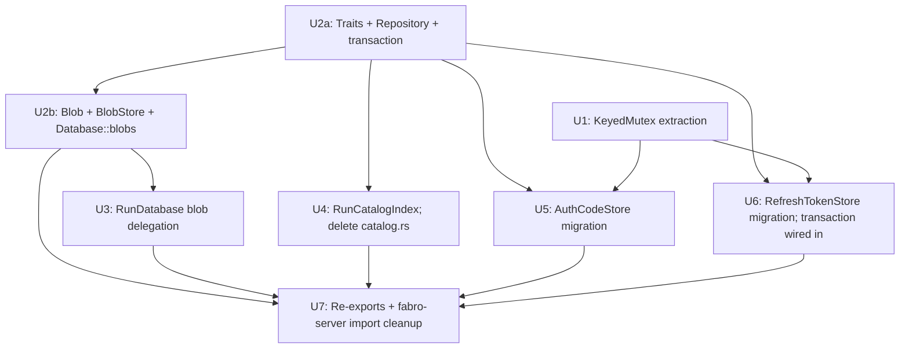

# refactor: Extract Record/Repository abstractions in fabro-store

## Overview

`fabro-store` currently has four hand-written `Slate*Store` types (`SlateAuthCodeStore`, `SlateAuthTokenStore`, blob plumbing on `RunDatabase`, free functions in `catalog.rs`) that each duplicate the same K/V plumbing on top of SlateDB: key construction, JSON serialization, get/put/delete/scan loops, optional per-key consume mutex, optional GC-by-prefix-scan. This plan replaces that duplication with a thin reusable typed K/V layer (`Repository<R: Record>`) plus per-record wrapper Stores that hold any domain-specific helpers (consume locks, replay caches, etc.).

The Run aggregate (event log, projection cache, broadcast channel) stays as it is. Only the simple K/V records (RefreshToken, AuthCode, Blob, RunCatalogEntry) move to the new shape.

This is a greenfield refactor — no production deployments, backwards-compat can be broken freely (see origin: `docs/brainstorms/2026-04-20-fabro-store-record-abstractions-requirements.md`).

## Problem Frame

Adding a new persisted record type today requires copying ~200 LOC of plumbing into a new `Slate*Store` and editing names. Each copy is one more place where serialization, locking, or key encoding can drift. As more record families land (sessions, vault entries, agent state), the duplication compounds.

The brainstorm's chosen response: a `Record` trait + `Repository<R>` typed K/V layer + named domain `*Store` wrappers + a security boundary that's designed once for the whole crate (see origin Key Decisions).

## Requirements Trace

All requirements traced from the origin document.

- **R1.** `trait Record` with associated `type Id: RecordId`, `type Codec: Codec<Self>` (no default — explicit per impl), `const PREFIX: &'static str`, and `fn id(&self) -> Self::Id`. `PREFIX` MUST be a non-empty `/`-separated path of non-empty segments — no leading or trailing `/`, no empty segments, `/` is reserved within a segment. `Repository::new` `debug_assert!`s the constraint. (origin R1)
- **R2.** `trait RecordId: Sized { fn key_segments(&self) -> Vec<String>; fn from_key_segments(segs: &[&str]) -> Result<Self>; }` with built-in impls for `[u8; 32]` (hex), `String`, `RunBlobId`, and `RunId` (date + ulid). `from_key_segments` is the parse counterpart used by `Repository::scan_stream` and `scan_ids_stream` — the only path to reconstruct `R::Id` from the SlateDB key for both value-carrying records and ZST marker records (e.g. `RunCatalogEntry`). Implementations of `key_segments` MUST NOT include the `\0` byte in any returned segment. `Repository` validates this **at runtime** before assembling any SlateKey (in `put`/`put_at`/`get`/`delete`/`exists`/scan-prefix construction): a segment containing `\0` returns `Err(Error::InvalidKeySegment)` rather than silently corrupting the keyspace. Validation is one byte scan per segment per call — negligible vs the SlateDB op. (origin R2 — extended at plan time)
- **R3.** `trait Codec<R>` with three built-in implementations: `JsonCodec` (literal `serde_json` forwarding for value-carrying records), `RawBytesCodec` (byte-identity for `Blob`), `MarkerCodec` (for ZST marker records — `encode(_) -> Vec::new()`, `decode(&[]) -> R::default()`; bound `R: Default + Sized`). Snapshot test on a stable synthetic struct locks the `JsonCodec` wire format. **Wire-format change tracking:** `RefreshToken` JSON wire format is byte-identical to today (literal serde_json forward). `AuthCode` JSON wire format gains a new `code` field per R7 — acceptable under greenfield. (origin R3)
- **R4.** `Repository<R>` (`pub(crate)`) exposes:
  - For value-carrying records: `get(&id)`, `put(&r)`, `delete(&id)`, `scan_stream() -> Stream<(R::Id, R)>`, `scan_prefix_stream(extra_segments)`, `gc(predicate)`.
  - For all records (including markers): `put_at(&id, &r)` (writes a key derived from the explicit id rather than from `r.id()`; `put` becomes sugar for `put_at(&r.id(), r)`), `exists(&id) -> bool`, `scan_ids_stream() -> Stream<R::Id>` (keys-only enumeration; doesn't touch values). Marker records (`R::Codec = MarkerCodec`) interact with `Repository` exclusively through the id-only API: `put_at`, `delete`, `exists`, `scan_ids_stream`. (origin R4 — extended at plan time)
- **R5.** Named domain `*Store` wrappers; `Repository` field is private; security boundary against external callers walking sensitive tables. (origin R5)
- **R6.** `RefreshTokenStore` keeps existing API; `consume_and_rotate` uses `transaction(...)` under `KeyedMutex` guard; replay cache stays in-memory. (origin R6)
- **R7.** `AuthCodeStore` keeps observable behaviour but `insert` changes signature from `insert(code: &str, entry: AuthCode)` to `insert(entry: AuthCode)` since `AuthCode` now carries its own `code` field (per the brainstorm decision). All existing callers update their construction pattern: compute the code, then construct `AuthCode { code, identity, ... }` in one literal. This is a public API change accepted under greenfield. (origin R7 — clarified at plan time)
- **R8.** `BlobStore` exposes `read`/`write`/`exists` (no `delete`, no `list`/`scan` — see R5 boundary). `RunDatabase::write_blob` and `RunDatabase::read_blob` keep signatures and delegate to `BlobStore`. `RunDatabase::list_blobs` keeps signature and continues using its existing free-function key scan path until/unless a future record needs blob enumeration through `Repository`. (origin R8 — clarified at plan time)
- **R9.** `RunCatalogIndex` exposes `add(&run_id)` (writes a `RunCatalogEntry` marker key), `remove(&run_id)`, `list(query)` (uses `Repository::scan_ids_stream` to enumerate marker keys, applies query filter, sorts by `(year, month, day, hour, minute, run_id)` per `catalog.rs:39-49`). Replaces `catalog.rs` free functions. `RunCatalogEntry` is a ZST marker (no fields); the run id lives only in the key. (origin R9 — extended at plan time)
- **R10.** `transaction(&db, |tx| ...)` helper, `pub(crate)`, `FnOnce`, single-batch atomic write, encode errors short-circuit; fault-injection test required. (origin R10)
- **R11.** `Database` exposes five accessors (lazy `OnceCell` init): `blobs()` lands in U2b, `catalog_index()` in U4, `auth_codes()` is preserved in U5, `refresh_tokens()` (renamed from `auth_tokens()`) lands in U6, `runs()` is unchanged. (origin R11)
- **R12.** `RunDatabase`'s event-sourcing machinery + public method signatures unchanged. `Database` consumes `RunCatalogIndex`. `RunDatabase::write_blob`/`read_blob` delegate to `BlobStore` (per R8); `RunDatabase::list_blobs` keeps its current free-function path. (origin R12 — clarified at plan time)
- **R13.** `KeyedMutex<K>` extracted as shared helper; cleanup-under-shard-lock invariant; never exposes the inner Arc. (origin R13)

## Scope Boundaries

- Run aggregate event-sourcing machinery (`RunDatabase` event log, projection cache, broadcast channel, `recover_next_seq`, `EventProjectionCache`, atomic seq counter) is not refactored.
- No marker capability traits (`ExpiringRecord`, `ConsumableRecord`, `IndexedRecord`, `ContentAddressed`).
- No record schema versioning or migration framework.
- No swap-out of the storage backend (still SlateDB on `Arc<dyn ObjectStore>`).
- No changes to `ArtifactStore` or other non-SlateDB storage.
- No changes to public `Database::create_run` / `open_run` / `delete_run` / `list_runs` API signatures or observable behaviour. Internals consume new `RunCatalogIndex` per R12.

## Context & Research

### Relevant Code and Patterns

- `lib/crates/fabro-store/src/slate/auth_tokens.rs` — `SlateAuthTokenStore`, the most complex existing store (consume_and_rotate with WriteBatch, KeyedMutex, replay cache).
- `lib/crates/fabro-store/src/slate/auth_codes.rs` — `SlateAuthCodeStore`, mirror of the same pattern minus replay cache.
- `lib/crates/fabro-store/src/slate/run_store.rs:283-302` — `RunDatabase::write_blob`/`read_blob`/`list_blobs`, today's blob plumbing.
- `lib/crates/fabro-store/src/slate/catalog.rs` — three free functions (`write_index`, `delete_index`, `list_run_ids`) called from `Database::create_run`/`list_runs`/`delete_run`.
- `lib/crates/fabro-store/src/slate/mod.rs` — `Database` (lazy `OnceCell` per store), `Runs` accessor, run lifecycle methods that thread catalog calls.
- `lib/crates/fabro-store/src/keys.rs` — `SlateKey` builder (`pub(crate)`, `\0`-separated segments), per-record key constructors, parse helpers. **Stays `pub(crate)`** under R2's data-only `key_segments()` design.
- `lib/crates/fabro-store/src/lib.rs` — current `pub use` re-exports of `Slate*Store` types.

### Pattern: lazy store init via `OnceCell`

Today (`slate/mod.rs:208-228`):

```text
auth_codes:  Arc<OnceCell<Arc<SlateAuthCodeStore>>>
auth_tokens: Arc<OnceCell<Arc<SlateAuthTokenStore>>>
```

`Database::auth_codes()` / `auth_tokens()` use `get_or_try_init` to construct the store with `Arc::new(self.open_db().await?)`. New `BlobStore`, `RunCatalogIndex` follow the same shape. No new pattern needed.

### Pattern: KeyedMutex (today inlined per store)

Both `auth_tokens.rs:85-118` and `auth_codes.rs:48-77` carry the same `DashMap<K, Arc<Mutex<()>>>` + clone Arc + lock + decide-on-drop-via-strong-count==2 pattern. R13 extracts it.

### Pattern: today's WriteBatch usage

`auth_tokens.rs:101-110` builds one `slatedb::WriteBatch`, puts both keys, calls `db.write(batch).await?`. The `transaction(...)` helper preserves this exact shape — single batch, single commit.

### External References

None — this is an internal refactor. SlateDB API is already understood from existing usage. No new dependencies.

### Institutional Learnings

No prior `docs/solutions/` entries on this topic — first refactor of this kind in `fabro-store`.

## Key Technical Decisions

Most decisions carry forward from the origin Key Decisions section.

- **Two worlds**: Run aggregate stays as-is; only K/V records move to `Repository<R>`. (origin)
- **Hand-written `*Store` wrappers on a thin `Repository`**, no marker capability traits. (origin)
- **Multi-segment IDs via data-only `key_segments() -> Vec<String>`**: keeps `SlateKey` `pub(crate)`. (origin)
- **Codec specified explicitly per impl** (no associated-type default): avoids unstable `associated_type_defaults`. (origin)
- **`transaction(...)` is `pub(crate)`**, single-batch atomic, `FnOnce`. Wrapper Stores compose it via domain-named methods. (origin)
- **Repository for security-sensitive records is store-private** (`pub(crate)` Repository, `pub(super)` field on the wrapper Store). External boundary enforced by visibility; internal discipline by code review. (origin + pass-2 review)

Plan-time additions:

- **KeyedMutex location**: `lib/crates/fabro-store/src/keyed_mutex.rs` (top-level module, not under `slate/`, since it's not slatedb-specific). Resolves origin deferred Q1.
- **Migration order** (resolves origin deferred Q2): U1 (KeyedMutex precursor) and U2a (trait scaffolding + Repository + transaction) are independent and can land in either order. U2b (Blob + BlobStore + Database::blobs) follows U2a. Then U3, U4, U5, U6 can be parallelized. U7 closes with re-exports + fabro-server cleanup. Each unit lands as one commit; each compiles and tests pass independently. See dependency graph in Implementation Units.
- **Per-Repository batch helper deferred** (resolves origin deferred Q3): not added in this refactor. Only `transaction(...)` ships. If profiling shows the cross-record machinery cost is meaningful for the single-type case, add later.
- **Module organization**: traits + Repository + Tx live in a new top-level `record/` module (`lib/crates/fabro-store/src/record/{mod,codec,repository,transaction}.rs`); per-record wrapper Stores stay under `slate/` (since they're slatedb-bound). `KeyedMutex` is its own top-level module.
- **`AuthCode` schema change**: `code` becomes the first field. JSON shape changes by one field. Acceptable under greenfield; test fixtures update mechanically.
- **Test approach**: continue the existing pattern — real SlateDB on `object_store::memory::InMemory`, no mocks (per repo `CLAUDE.md` testing posture and existing `auth_tokens.rs:194-201` style).

## Open Questions

### Resolved During Planning

- **Where does `KeyedMutex` live?** → `lib/crates/fabro-store/src/keyed_mutex.rs` (top-level module).
- **Migration order?** → U1 + U2a parallelizable → U2b → U3, U4, U5, U6 parallelizable → U7. See Implementation Units dependency graph.
- **Per-Repository batch helper?** → Deferred, not in this refactor.
- **Module organization for traits?** → New `record/` module at `lib/crates/fabro-store/src/record/`.

### Deferred to Implementation

- **Exact internal types for `Tx`** — whether it owns or borrows the `WriteBatch`, whether `put` returns `&mut Self` for chaining. Mechanical; affects no caller. The contract (`FnOnce`, single commit, encode short-circuit) is fixed in R10.
- **Stream adapter for `scan_stream`** — `slatedb::DbIterator` exposes `async fn next(&mut self)` but does not impl `Stream`. Implementer chooses between `futures::stream::unfold`, a hand-rolled `poll_next`, or returning the iterator directly behind a thin newtype. None affect callers; pick the simplest that types cleanly.
- **`gc(predicate)` exact signature for the closure capture lifetime** — `impl Fn(&R) -> bool` may need a `+ Send` bound depending on how the stream-and-batch implementation interleaves with `Send` futures. Implementer adjusts at the type-error site.
- **Whether `BlobStore` lives at `lib/crates/fabro-store/src/slate/blob_store.rs` or a deeper path** — file location is mechanical.

## High-Level Technical Design

> *This illustrates the intended approach and is directional guidance for review, not implementation specification. The implementing agent should treat it as context, not code to reproduce.*

### Trait scaffolding shape

```text
trait Record: Sized + Send + Sync + 'static {
    type Id: RecordId;
    type Codec: Codec<Self>;
    const PREFIX: &'static str;            // "/"-separated, split by Repository
    fn id(&self) -> Self::Id;
}

trait RecordId: Sized {
    fn key_segments(&self) -> Vec<String>;
    fn from_key_segments(segs: &[&str]) -> Result<Self>;
}

trait Codec<R> {
    fn encode(r: &R) -> Result<Vec<u8>>;
    fn decode(bytes: &[u8]) -> Result<R>;
}

// Built-in codecs
struct JsonCodec;        // literal forward to serde_json::to_vec / from_slice
struct RawBytesCodec;    // identity on bytes — encode(&Blob(bytes)) returns bytes; decode(bytes) returns Blob(bytes)
struct MarkerCodec;        // for ZST marker records (R: Default + Sized) — encode(_) -> Vec::new(); decode(&[]) -> R::default()

// Built-in RecordId impls (each implements both directions)
impl RecordId for [u8; 32]  { /* key_segments: vec![hex(self)]; from_key_segments: parse hex */ }
impl RecordId for String    { /* key_segments: vec![self.clone()]; from_key_segments: clone segs[0] */ }
impl RecordId for RunBlobId { /* one hex segment, both directions */ }
impl RecordId for RunId     { /* key_segments: [<YYYY-MM-DD>, <ulid>]; from_key_segments: parse segs[1] */ }
```

### Repository shape

```text
pub(crate) struct Repository<R: Record> {
    db: Arc<slatedb::Db>,
    _r: PhantomData<R>,
}

impl<R: Record> Repository<R> {
    // Value-carrying API
    pub(crate) async fn get(&self, id: &R::Id) -> Result<Option<R>>;
    pub(crate) async fn put(&self, r: &R) -> Result<()>;     // sugar for put_at(&r.id(), r)
    pub(crate) async fn delete(&self, id: &R::Id) -> Result<()>;
    pub(crate) fn scan_stream(&self) -> impl Stream<Item = Result<(R::Id, R)>>;
    pub(crate) fn scan_prefix_stream(&self, extra: &[&str]) -> impl Stream<Item = Result<(R::Id, R)>>;
    pub(crate) async fn gc(&self, predicate: impl Fn(&R) -> bool) -> Result<u64>;

    // Id-only API — works for any record, required for ZST marker records
    pub(crate) async fn put_at(&self, id: &R::Id, r: &R) -> Result<()>;
    pub(crate) async fn exists(&self, id: &R::Id) -> Result<bool>;
    pub(crate) fn scan_ids_stream(&self) -> impl Stream<Item = Result<R::Id>>;
    pub(crate) fn scan_prefix_ids_stream(&self, extra: &[&str]) -> impl Stream<Item = Result<R::Id>>;
}

// Marker (index) record example
#[derive(Default)]
pub(crate) struct RunCatalogEntry;          // ZST — id lives only in the key

impl Record for RunCatalogEntry {
    type Id = RunId;
    type Codec = MarkerCodec;
    const PREFIX: &'static str = "runs/_index/by-start";
    fn id(&self) -> RunId { unreachable!("marker — use put_at(&id, &RunCatalogEntry)") }
}

// RunCatalogIndex usage:
//   add(&run_id) -> repo.put_at(&run_id, &RunCatalogEntry).await
//   remove(&run_id) -> repo.delete(&run_id).await
//   list(query) -> repo.scan_ids_stream().filter(query).sort()
```

### transaction shape

```text
pub(crate) async fn transaction<T, F>(db: &slatedb::Db, f: F) -> Result<T>
where F: FnOnce(&mut Tx) -> Result<T>
{
    let mut tx = Tx::new();
    let value = f(&mut tx)?;          // closure Err → return early, no DB write
    db.write(tx.into_batch()).await?; // exactly one commit
    Ok(value)
}

pub(crate) struct Tx { batch: WriteBatch }
impl Tx {
    pub(crate) fn put<R: Record>(&mut self, r: &R) -> Result<&mut Self> { ... }
    pub(crate) fn delete<R: Record>(&mut self, id: &R::Id) -> Result<&mut Self> { ... }
}
```

### Wrapper Store shape (RefreshTokenStore example)

```text
pub struct RefreshTokenStore {
    db: Arc<slatedb::Db>,             // for transaction(...)
    repo: Repository<RefreshToken>,   // pub(super) at most
    consume_locks: KeyedMutex<[u8; 32]>,
    replay_revocations: DashMap<[u8; 32], DateTime<Utc>>,  // in-memory only
}

impl RefreshTokenStore {
    pub async fn consume_and_rotate(...) -> Result<ConsumeOutcome> {
        let _guard = self.consume_locks.lock(presented_hash).await;
        let existing = self.repo.get(&presented_hash).await?;
        match existing {
            None => Ok(ConsumeOutcome::NotFound),
            Some(token) if now >= token.expires_at => Ok(ConsumeOutcome::Expired),
            Some(token) if token.used => Ok(ConsumeOutcome::Reused(token)),
            Some(token) => {
                let mut old = token.clone();
                old.used = true;
                old.last_used_at = now;
                transaction(&self.db, |tx| {
                    tx.put(&old)?;
                    tx.put(&new_token)?;
                    Ok(())
                }).await?;
                Ok(ConsumeOutcome::Rotated(old, Box::new(new_token)))
            }
        }
    }
}
```

## Implementation Units



U1 and U2a are independent of each other and can land in either order. U2b depends on U2a. U3 depends on U2b (it needs `BlobStore`). U4, U5, U6 each depend on U2a (they need `Repository` and `transaction`); U5 and U6 also depend on U1 (`KeyedMutex`). U3, U4, U5, U6 can be parallelized after their dependencies land. U7 is the final cleanup pass.

---

- [x] **Unit 1: Extract `KeyedMutex<K>` shared helper**

**Goal:** Move the per-key `DashMap<K, Arc<Mutex<()>>>` + auto-cleanup-at-strong-count-2 pattern out of `auth_tokens.rs` and `auth_codes.rs` into a single shared helper. No behaviour change.

**Requirements:** R13.

**Dependencies:** None. Independent precursor PR.

**Files:**
- Create: `lib/crates/fabro-store/src/keyed_mutex.rs`
- Modify: `lib/crates/fabro-store/src/lib.rs` (add `mod keyed_mutex;` + `pub(crate) use`)
- Modify: `lib/crates/fabro-store/src/slate/auth_tokens.rs` (replace `refresh_locks: DashMap<...>` field + inline lock pattern with `consume_locks: KeyedMutex<[u8; 32]>`)
- Modify: `lib/crates/fabro-store/src/slate/auth_codes.rs` (replace `code_locks: DashMap<...>` similarly)
- Test: `lib/crates/fabro-store/src/keyed_mutex.rs` (unit tests inline)

**Approach:**
- `KeyedMutex<K: Hash + Eq + Clone>` exposes only `pub async fn lock(&self, key: K) -> Guard<'_>`.
- `Guard<'_>` holds the `Arc<Mutex<()>>` internally, releases the inner `Mutex` on drop, then performs the cleanup check (strong_count == 2 → remove from `DashMap`).
- The cleanup check and entry insertion happen under the same `DashMap` shard lock — use `DashMap::entry().and_modify().or_insert_with()` or equivalent so a concurrent `lock(&key)` cannot observe a stale Arc.
- No public access to the inner `Arc`.

**Patterns to follow:**
- `lib/crates/fabro-store/src/slate/auth_tokens.rs:85-118` (today's inline pattern — preserve semantics).
- `lib/crates/fabro-store/src/slate/auth_codes.rs:48-77` (mirror pattern).

**Test scenarios:**
- *Happy path:* `lock(K1)` then `lock(K2)` proceed independently (no contention between distinct keys).
- *Edge case:* `lock(K1)` from two tasks serializes — second waits until first drops Guard.
- *Edge case:* Auto-cleanup — after the only outstanding Guard drops, the `DashMap` no longer contains the entry for that key (verified via internal accessor or by counting `len()`).
- *Integration:* Stress test — 16 concurrent tasks `lock(K)` on the same key; verify exactly one progresses at a time and the map is empty after all complete.
- *Integration race regression:* Stress test that hammers the same key from N tasks across many drop cycles — verify two threads cannot acquire `lock(&key)` and end up with different `Mutex` instances (cleanup-under-shard-lock invariant).

**Verification:**
- `cargo nextest run -p fabro-store` passes.
- `auth_tokens.rs` and `auth_codes.rs` no longer carry their inline `refresh_locks` / `code_locks` fields and inline lock plumbing.
- All existing concurrent_consume_has_one_winner / concurrent_rotation_has_one_winner tests pass unmodified.

---

- [x] **Unit 2a: Trait scaffolding (`Record`, `RecordId`, `Codec`, `Repository`, `transaction`)**

**Goal:** Land the new abstraction with a synthetic test-only Record exercising the full `Repository` API and the `transaction(...)` atomicity contract. No production consumer yet.

**Requirements:** R1, R2, R3, R4, R5 (boundary spec), R10 (transaction).

**Dependencies:** None. Independent of U1; either order fine.

**Files:**
- Create: `lib/crates/fabro-store/src/record/mod.rs` (re-exports `Record`, `RecordId`)
- Create: `lib/crates/fabro-store/src/record/codec.rs` (`trait Codec<R>`, `JsonCodec`, `RawBytesCodec`, `MarkerCodec`)
- Create: `lib/crates/fabro-store/src/record/repository.rs` (`Repository<R>` and methods)
- Create: `lib/crates/fabro-store/src/record/transaction.rs` (`Tx`, `transaction()`)
- Create: `lib/crates/fabro-store/src/record/record_id.rs` (built-in `impl RecordId` for `[u8; 32]`, `String`, `RunId`, `RunBlobId` — both `key_segments` and `from_key_segments` directions)
- Modify: `lib/crates/fabro-store/src/error.rs` — add a new public variant `Error::InvalidKeySegment { segment: String }` returned by `Repository` key-assembly when a `RecordId::key_segments` impl produces a segment containing the `\0` separator byte. Also add `Error::KeyParse(String)` returned by `Repository::scan_stream` / `scan_ids_stream` when `RecordId::from_key_segments` rejects the parsed segments.
- Modify: `lib/crates/fabro-store/src/lib.rs` (add `mod record;`, `pub(crate) use record::...;`)
- Test: `lib/crates/fabro-store/src/record/repository.rs` (unit tests with a synthetic test-only Record to exercise get/put/delete/scan_stream/scan_prefix_stream/gc)
- Test: `lib/crates/fabro-store/src/record/transaction.rs` (unit tests for `transaction(...)` including encode-failure fault injection)
- Test: `lib/crates/fabro-store/src/record/codec.rs` (snapshot test for `JsonCodec` byte-identity using a stable synthetic struct via `insta::assert_snapshot!`)

**Approach:**
- `Record::PREFIX` is a `&'static str` containing `/`-separated segments (`"auth/refresh"`, `"blobs/sha256"`, etc.). `Repository` splits on `/` once and writes `\0`-separated `SlateKey` segments. `/` is reserved inside any single segment. **Key-assembly invariant (runtime-enforced):** `Repository` checks every segment (PREFIX-derived OR id-derived) for `\0` before assembling the SlateKey, in every operation that constructs a key (`put`/`put_at`/`get`/`delete`/`exists`/scan-prefix). A segment containing `\0` returns `Err(Error::InvalidKeySegment { segment: String })`. This is a runtime error, not a `debug_assert!` — release builds get the same protection. Adds one byte-scan per segment per call (negligible).
- `Repository::scan_stream` adapts `slatedb::DbIterator::next` into `impl Stream<Item = Result<(R::Id, R)>>` via `futures::stream::unfold` or hand-rolled `poll_next` (implementer's choice). For each scanned entry: parse the SlateDB key into segments (split on `\0`), strip the `R::PREFIX` segments, pass the remaining segments to `R::Id::from_key_segments` to reconstruct the typed Id; decode the value via `R::Codec::decode`; yield `(id, value)`. For ZST marker records using `MarkerCodec`, decode is trivially `R::default()` — yielding `(id, marker)` where the marker carries no data and the id from the key is the actual information.
- `Repository::scan_ids_stream` is a keys-only variant: same key-parsing as `scan_stream`, but skips value bytes entirely (yields `Stream<Item = Result<R::Id>>`). Required for ZST marker records (where `decode` would be wasted), useful as a perf optimization for any record where the caller only needs ids.
- `Repository::put_at(id, &r)` is the explicit-id put: writes the key derived from `id` (not from `r.id()`). `Repository::put(&r)` is sugar for `put_at(&r.id(), r)`. ZST markers use `put_at` exclusively because they don't carry an id (their `Record::id` is `unreachable!`).
- `Repository::gc(predicate)` scans the prefix, decodes each value, evaluates the (sync, no-I/O) predicate, collects matching keys into a `Vec`, then issues a single `slatedb::WriteBatch` containing all deletes. Returns the count.
- `JsonCodec::encode` is literally `serde_json::to_vec(value)`; `decode` is `serde_json::from_slice(bytes)`. The implementation IS the byte-identity proof. Snapshot test guards against accidental future changes.
- `MarkerCodec::encode<R>(_: &R) -> Ok(Vec::new())`; `decode<R: Default>(bytes) -> Ok(R::default())` (asserts `bytes.is_empty()`).
- `transaction(&db, f)` runs `f(&mut tx)`. On `Err`, returns the error without writing anything. On `Ok`, calls `db.write(tx.into_batch()).await`. `Tx::put` calls `R::Codec::encode(value)` and pushes onto the batch — encode errors propagate via `?` from inside the closure. `Tx::put_at(&id, &r)` is the explicit-id variant for ZST markers.

**Patterns to follow:**
- `lib/crates/fabro-store/src/slate/mod.rs:208-228` (`OnceCell`-based store accessor on `Database`).
- `lib/crates/fabro-store/src/slate/auth_tokens.rs:79-121` (single `WriteBatch` + single `db.write` — `transaction(...)` mirrors this).
- `lib/crates/fabro-store/src/keys.rs:11-23` (`SlateKey` builder usage — `Repository` calls these `pub(crate)` methods).
- `lib/crates/fabro-store/src/slate/auth_tokens.rs:194-201` (test fixture pattern: `Database::new(Arc::new(InMemory::new()), "", Duration::from_millis(1), None)` then `db.<store>().await.unwrap()`).

**Test scenarios:**
- *Happy path (Repository):* `put` then `get` returns the same value; `delete` then `get` returns `None`.
- *Happy path (scan_stream):* `put` 5 records, `scan_stream().collect()` yields all 5 with correct `(id, value)` pairs.
- *Happy path (scan_prefix_stream):* records under different sub-prefixes filter correctly.
- *Happy path (gc):* `put` 10 records, `gc(|r| predicate true for half)` deletes 5, returns count 5; `scan_stream` confirms 5 remain.
- *Edge case (Repository):* `get` on missing id returns `None`; `delete` on missing id is a no-op.
- *Edge case (Repository):* empty prefix scan returns empty stream.
- *Error path (Codec):* malformed bytes from `decode` propagate as `Error::Other` (or whatever the existing error type is).
- *Error path (transaction):* closure returns `Err` → `db.write` is NOT called (verify via store state unchanged after).
- *Error path (transaction fault injection):* in the test module, define `TestRecord` with `type Codec = TestFailCodec;` where `TestFailCodec::encode` returns `Err` on a poisoned input. Run `transaction(&db, |tx| { tx.put(&good)?; tx.put(&poisoned)?; Ok(()) })` and assert: (1) the helper returns `Err`, (2) `db.get(key_for(&good))` returns `None`, (3) `db.get(key_for(&poisoned))` returns `None`. This proves the all-or-nothing invariant against the encode-error-mid-batch path (not just the closure-Err short-circuit). **Required by R10.**
- *Edge case (transaction):* empty closure (no puts/deletes) → no batch commit overhead, returns `Ok`.
- *Happy path (MarkerCodec / ZST marker):* define a synthetic `TestMarker` ZST + `impl Record for TestMarker { type Codec = MarkerCodec; ... }`. `repo.put_at(&id, &TestMarker)` then `repo.exists(&id) == true`; `repo.scan_ids_stream().collect()` yields the id; `repo.delete(&id)` then `exists == false`.
- *Edge case (key-assembly invariant):* in release builds, `RecordId::key_segments` returning a string containing `\0` causes the next `Repository` op to return `Err(Error::InvalidKeySegment)` rather than silently corrupting the keyspace. Test asserts the error is returned and the DB is unchanged.
- *Snapshot (JsonCodec byte-identity):* `insta::assert_snapshot!(std::str::from_utf8(&JsonCodec::encode(&sample)?).unwrap())` against a fixed synthetic struct with deterministic timestamps and IDs. Locks the JSON wire format string itself; any future change to `JsonCodec` (envelope, version tag, field reordering) fails the snapshot.

**Verification:**
- `cargo nextest run -p fabro-store` passes including the new synthetic-record tests.
- `cargo +nightly-2026-04-14 clippy --workspace --all-targets -- -D warnings` passes.
- `Repository<R>` and `transaction` are `pub(crate)`; the `record/` module is internal to `fabro-store`.

---

- [x] **Unit 2b: `Blob` record + `BlobStore` wrapper + `Database::blobs()` accessor**

**Goal:** First production consumer of the new abstraction. Land `BlobStore` and the `Database::blobs()` accessor. `RunDatabase::write_blob` continues to use the raw DB this unit (delegation lands in U3).

**Requirements:** R5 (boundary applied to first wrapper), R8 (`BlobStore` API), R11 (`Database::blobs()`).

**Dependencies:** U2a.

**Files:**
- Create: `lib/crates/fabro-store/src/slate/blob_store.rs` (`Blob` record + `BlobStore` wrapper)
- Modify: `lib/crates/fabro-store/src/lib.rs` (public re-export of `BlobStore` and `Blob`)
- Modify: `lib/crates/fabro-store/src/slate/mod.rs` (`Database` gets `blobs: Arc<OnceCell<Arc<BlobStore>>>` field + `Database::blobs() -> Result<Arc<BlobStore>>` accessor)
- Test: `lib/crates/fabro-store/src/slate/blob_store.rs` (unit tests inline)

**Approach:**
- `Blob(pub Bytes)` newtype. `impl Record for Blob { type Id = RunBlobId; type Codec = RawBytesCodec; const PREFIX = "blobs/sha256"; fn id(&self) -> RunBlobId { RunBlobId::new(&self.0) } }`. (`RunBlobId::new(content)` is the actual constructor in `lib/crates/fabro-types/src/run_blob_id.rs`; it computes the sha256 internally.)
- `BlobStore` wraps `Repository<Blob>`. `Repository` field is private. No `.scan_stream()` or `.gc()` exposed.
- `Database::blobs()` follows the existing `auth_codes()`/`auth_tokens()` pattern at `slate/mod.rs:208-228`.

**Patterns to follow:**
- `lib/crates/fabro-store/src/slate/mod.rs:208-228` (`OnceCell`-based store accessor on `Database`).
- `lib/crates/fabro-store/src/slate/auth_tokens.rs:194-201` (test fixture pattern: `Database::new(Arc::new(InMemory::new()), "", Duration::from_millis(1), None)`).

**Test scenarios:**
- *Happy path:* `write(bytes_a)` returns `id_a`; `read(&id_a)` returns `Some(bytes_a)`; `write(bytes_a)` again returns the same `id_a` (content-addressed); `exists(&id_a) == true`, `exists(&unknown) == false`.
- *Edge case:* `write(empty bytes)` succeeds; reading back returns `Some(empty)`.
- *Integration (no delete):* `BlobStore` exposes no `delete` — verified at compile time by the absence of the method.
- *Integration (cross-path equivalence with raw DB):* a blob written via `BlobStore::write(bytes)` is byte-identical when read directly from SlateDB via `db.get(blob_key(&id))`. Locks the invariant that `RawBytesCodec::encode` is byte-identity (no envelope, no length prefix). The same equivalence is checked end-to-end in U3 once `RunDatabase::write_blob` delegates.

**Verification:**
- `cargo nextest run -p fabro-store` passes including new tests.
- `Database::blobs()` returns an `Arc<BlobStore>` and supports the round-trip tests.
- Existing tests (including `delete_run_keeps_global_cas_blobs` at `slate/mod.rs:451-466`) still pass — `RunDatabase::write_blob` continues to use the raw DB this unit, so no existing observable behaviour changes.

---

- [x] **Unit 3: `RunDatabase` blob methods delegate to `BlobStore`**

**Goal:** Internal refactor only — `RunDatabase::write_blob` and `RunDatabase::read_blob` keep their public signatures and delegate to `BlobStore`. `RunDatabase::list_blobs` is **not touched**; it keeps its existing free-function key-scan path at `run_store.rs:365-380` since `BlobStore` intentionally has no `list` method per R8's boundary. No callers change. No tests change. (If a future record needs blob enumeration through `Repository`, `BlobStore::list_ids` could be added later via `Repository::scan_ids_stream`; out of scope for this refactor.)

**Requirements:** R8 (delegation), R12 (`RunDatabase` public surface unchanged).

**Dependencies:** U2b.

**Files:**
- Modify: `lib/crates/fabro-store/src/slate/run_store.rs` — `write_blob` and `read_blob` only. Each constructs a stack-local `BlobStore::new(self.inner.db.clone())` and delegates. `list_blobs` is left exactly as-is. No `RunDatabaseInner` field changes. No constructor signature changes. No `Database::create_run`/`open_run`/`open_run_reader` changes.

**Approach:**
- `RunDatabase` keeps the raw `Db` field as today. `write_blob` and `read_blob` construct a stack-local `BlobStore` from the existing `Arc<Db>` and delegate (~24-byte stack alloc per call; `BlobStore` is stateless). `list_blobs` is unchanged — it continues calling the existing free function at `run_store.rs:365-380`.
- Existing `delete_run_keeps_global_cas_blobs` test (`slate/mod.rs:451-466`) MUST continue to pass — it accesses blobs through `RunDatabase::write_blob`/`read_blob` and the test is the canonical contract that blobs survive run deletion.

**Patterns to follow:**
- `lib/crates/fabro-store/src/slate/run_store.rs:283-302` (today's `write_blob`/`read_blob` bodies — preserve return types and error behavior; only the implementation changes).
- `lib/crates/fabro-store/src/slate/run_store.rs:365-380` (today's `list_blobs` free function — left untouched).

**Test scenarios:**
- *Integration:* `RunDatabase::write_blob(bytes)` followed by `RunDatabase::read_blob(&id)` returns `Some(bytes)` (existing behaviour).
- *Integration:* `Database::create_run` → `run.write_blob` → `Database::delete_run` → blob still readable via a different run's `read_blob` (the `delete_run_keeps_global_cas_blobs` invariant).
- *Integration:* `RunDatabase::list_blobs` returns the same set as before for a run that wrote N blobs.

**Verification:**
- All existing tests in `lib/crates/fabro-store/src/slate/mod.rs` pass unmodified.
- `RunDatabase::write_blob`/`read_blob`/`list_blobs` signatures and behaviour are observably unchanged (no caller in `fabro-workflow`, `fabro-server`, etc. needs updating).
- `cargo nextest run --workspace` passes.

---

- [x] **Unit 4: `RunCatalogIndex` replaces `catalog.rs`**

**Goal:** Migrate the three free functions in `catalog.rs` to a `RunCatalogIndex` wrapper Store on top of `Repository<RunCatalogEntry>`. Wire `Database::create_run`/`list_runs`/`delete_run` to use it. Delete `catalog.rs`.

**Requirements:** R9 (`RunCatalogIndex` API + sort matches today), R12 (catalog calls live on `Database`), R11 (`Database::catalog_index()`).

**Dependencies:** U2a.

**Files:**
- Create: `lib/crates/fabro-store/src/slate/run_catalog_index.rs` (`RunCatalogEntry` record + `RunCatalogIndex` wrapper)
- Modify: `lib/crates/fabro-store/src/slate/mod.rs`:
  - Add `catalog_index: Arc<OnceCell<Arc<RunCatalogIndex>>>` field on `Database`
  - Add `Database::catalog_index()` accessor
  - `Database::create_run` (lines 119, 127) replaces `catalog::write_index(&db, run_id).await?` with `self.catalog_index().await?.add(run_id).await?`
  - `Database::list_runs` (line 169) replaces `catalog::list_run_ids(&db, query).await?` with `self.catalog_index().await?.list(query).await?`
  - `Database::delete_run` (line 204) replaces `catalog::delete_index(&db, run_id).await?` with `self.catalog_index().await?.remove(run_id).await?`
- Delete: `lib/crates/fabro-store/src/slate/catalog.rs`
- Modify: `lib/crates/fabro-store/src/slate/mod.rs` (remove `mod catalog;` import; remove the test-side `use catalog::*` if any)
- Test: `lib/crates/fabro-store/src/slate/run_catalog_index.rs` (unit tests inline)

**Approach:**
- `RunCatalogEntry` is a ZST marker: `#[derive(Default)] pub(crate) struct RunCatalogEntry;`. `Record::Id = RunId`, `Codec = MarkerCodec`, `PREFIX = "runs/_index/by-start"`. `id(&self)` is `unreachable!("marker — use put_at(&id, &RunCatalogEntry)")` since the marker carries no id.
- `impl RecordId for RunId` writes two segments: `<YYYY-MM-DD>` (from `self.created_at().format("%Y-%m-%d")`) followed by `self.to_string()`. `from_key_segments` parses the ULID from `segs[1]` (the date segment is redundant — derivable from the ULID timestamp).
- `RunCatalogIndex::add(&RunId)` calls `repo.put_at(&run_id, &RunCatalogEntry).await`. Value bytes are empty per `MarkerCodec`.
- `RunCatalogIndex::remove(&RunId)` calls `repo.delete(&run_id).await`.
- `RunCatalogIndex::list(query)` uses `repo.scan_ids_stream()` to enumerate marker keys (no value decoding — cheap), collects into a `Vec<RunId>`, filters by `query.start`/`query.end` against `run_id.created_at()` (today's logic at `catalog.rs:27-37`), and sorts by `(year, month, day, hour, minute, run_id)` — the same key as `catalog.rs:39-49`.
- `Database::list_runs`'s post-list summary-building loop (lines 170-183) is **NOT** absorbed into `RunCatalogIndex` — only the catalog scan + filter + sort move. The summary loop stays in `Database` because it needs `RunDatabase::has_any_events` and `RunDatabase::build_summary`.

**Patterns to follow:**
- `lib/crates/fabro-store/src/slate/catalog.rs:7-50` (today's three functions — preserve filter and sort semantics exactly).
- `lib/crates/fabro-store/src/slate/auth_codes.rs::SlateAuthCodeStore::new` (wrapper Store construction signature).
- `lib/crates/fabro-store/src/slate/mod.rs:208-228` (`OnceCell` accessor pattern).

**Test scenarios:**
- *Happy path:* `add(run_id_1); add(run_id_2); list(default query)` returns both, sorted by `(year, month, day, hour, minute, run_id)` ascending exactly per `catalog.rs:39-49`. Existing `create_open_list_and_delete_full_lifecycle_in_shared_db` test (`slate/mod.rs:421-447`) is the canonical regression — it MUST pass with identical output before and after migration.
- *Edge case:* `list` with `query.start` set later than all `run_id.created_at()` returns empty.
- *Edge case:* `list` with `query.end` set earlier than all `run_id.created_at()` returns empty.
- *Edge case:* `add(run_id); remove(run_id); list()` returns empty.
- *Integration:* `Database::create_run(rid_1); Database::list_runs(default)` returns the run summary (full integration through `Database` — verifies the migration didn't break the surface).
- *Integration:* `Database::delete_run(rid_1); Database::list_runs(default)` no longer returns it.
- *Integration:* All existing tests in `slate/mod.rs::tests` (notably `create_open_list_and_delete_full_lifecycle_in_shared_db`, `delete_run_keeps_global_cas_blobs`, `reopening_store_rebuilds_from_shared_db`) pass unmodified.

**Verification:**
- `lib/crates/fabro-store/src/slate/catalog.rs` is deleted.
- `cargo nextest run -p fabro-store` passes.
- `Database::list_runs` produces identical results to the pre-refactor state for the same input.

---

- [x] **Unit 5: Migrate `AuthCodeStore` to `Repository<AuthCode>`; add `code` field to `AuthCode`**

**Goal:** Refactor `SlateAuthCodeStore` → `AuthCodeStore` on top of `Repository<AuthCode>` and `KeyedMutex<String>`. Add `code: String` as the first field of `AuthCode` so `Record::id` can return it. Update insert/consume signatures and call sites.

**Requirements:** R7 (API + struct change), R5 (security boundary), R13 (uses KeyedMutex from U1).

**Dependencies:** U1, U2a.

**Files:**
- Modify: `lib/crates/fabro-store/src/slate/auth_codes.rs`:
  - Rename `SlateAuthCodeStore` → `AuthCodeStore`
  - Add `code: String` as first field of `AuthCode`
  - `impl Record for AuthCode { type Id = String; type Codec = JsonCodec; const PREFIX = "auth/code"; fn id(&self) -> String { self.code.clone() } }`
  - Refactor `insert(code: &str, entry: AuthCode)` → `insert(&self, entry: AuthCode)` per R7 (the `entry` now carries its own `code`; one-arg form is the chosen signature)
  - Refactor `consume(&self, code: &str)` to use `self.repo.get(&code.to_string())` then `self.repo.delete(...)` under `KeyedMutex` guard
  - Refactor `gc_expired(&self, cutoff)` to use `self.repo.gc(|entry| entry.expires_at <= cutoff)`
  - Field changes: drop `db: Arc<slatedb::Db>` (now via `repo`); drop `code_locks: DashMap<...>` (now via `consume_locks: KeyedMutex<String>`)
- Modify: `lib/crates/fabro-store/src/slate/mod.rs`:
  - Rename the field `auth_codes: Arc<OnceCell<Arc<SlateAuthCodeStore>>>` → `Arc<OnceCell<Arc<AuthCodeStore>>>`
  - Update `Database::auth_codes()` return type
- Modify: `lib/crates/fabro-store/src/lib.rs`: drop `SlateAuthCodeStore` from `pub use`; add `AuthCodeStore` and `AuthCode`; **add temporary alias** `pub type SlateAuthCodeStore = AuthCodeStore;` so `fabro-server` keeps compiling until U7 lands. (Without this alias the workspace breaks between U5 and U7.)
- Modify: `lib/crates/fabro-server/src/auth/cli_flow.rs:1226` (OAuth code-mint AuthCode literal — add `code: code.clone()` as first field; reorder so `code` is computed before the literal). After this change, the call switches from `store.insert(&code, entry)` (today's `auth_codes.rs:41`) to `store.insert(entry)` per R7.
- Modify: `lib/crates/fabro-server/src/auth/cli_flow.rs:1390` (test fixture AuthCode literal)
- Modify: `lib/crates/fabro-server/tests/it/api/cli_auth_token.rs:82` (test fixture AuthCode literal)
- Test: `lib/crates/fabro-store/src/slate/auth_codes.rs` (existing test module updates to construct `AuthCode { code: "...", ... }` — `auth_codes.rs:126`)

**Approach:**
- The `code` field becomes the first field of `AuthCode` so the JSON shape is `{"code":"...","identity":...,...}` — adds one field to the wire format. Greenfield → acceptable.
- `AuthCodeStore::insert(entry)` calls `self.repo.put(&entry)` (no extra arg needed since `entry.code` carries the key).
- `AuthCodeStore::consume(code)` takes `&str`, holds `consume_locks.lock(code.to_string())` guard, then `repo.get(&code.to_string())`, branches on expiry/found, deletes via `repo.delete(&code.to_string())`. Single-use semantics preserved.
- `gc_expired` is one line via `repo.gc(|c| c.expires_at <= cutoff)`.
- Repository field is `pub(super)` per R5 boundary.

**Patterns to follow:**
- `lib/crates/fabro-store/src/slate/auth_codes.rs:33-100` (preserve API behavior).
- `lib/crates/fabro-store/src/slate/auth_codes.rs:103-200` (existing test patterns — update for new struct shape, otherwise preserve).

**Test scenarios:**
- *Happy path:* `insert(AuthCode { code, ... })` then `consume(&code)` returns the entry and a second `consume` returns `None` (single-use).
- *Edge case:* `consume` on a non-existent code returns `None`.
- *Edge case:* `consume` on an expired code deletes the row and returns `None` (today's behaviour at `auth_codes.rs:67-71`).
- *Error path:* none surfaced by today's code beyond serde errors — preserve.
- *Integration:* All existing `auth_codes.rs` tests pass with updated struct construction (e.g., `concurrent_consume_has_one_winner` at `auth_codes.rs:152` MUST still pass — KeyedMutex preserves single-winner behaviour).
- *Integration (boundary):* `AuthCodeStore`'s `repo` field is not accessible from outside the wrapper (compile-time check via test that the field is private; or simply: no public method on `AuthCodeStore` returns `&Repository<AuthCode>`).

**Verification:**
- `cargo nextest run -p fabro-store` passes.
- `cargo nextest run -p fabro-server` passes (if server uses `AuthCode` struct literally; update imports per U7 if needed).
- `lib/crates/fabro-store/src/slate/auth_codes.rs` no longer imports `slatedb::Db` directly.

---

- [x] **Unit 6: Migrate `RefreshTokenStore` to `Repository<RefreshToken>` + `transaction(...)` for `consume_and_rotate`**

**Goal:** The most complex migration. Refactor `SlateAuthTokenStore` → `RefreshTokenStore` on top of `Repository<RefreshToken>` and `KeyedMutex<[u8; 32]>`. Replace the hand-built `slatedb::WriteBatch` in `consume_and_rotate` with `transaction(&db, ...)`. Preserve replay revocation cache as in-memory only. R10 atomicity is verified by U2a's transaction-layer fault-injection test (no separate U6 fault-injection test — see Execution note).

**Requirements:** R6 (API + transaction usage + replay cache invariant), R5 (security boundary), R10 (transaction atomicity), R13 (KeyedMutex).

**Dependencies:** U1, U2a.

**Execution note:** `consume_and_rotate` is security-sensitive. The R10 atomicity contract is exercised by U2a's transaction-layer fault-injection test using a synthetic test-only `Record` + `Codec` whose `encode` fails on the second `put` (`RefreshToken` cannot itself trigger a JSON encode failure). U6 keeps the existing `concurrent_rotation_has_one_winner` (`auth_tokens.rs:311`) test as the consume-layer atomicity regression net.

**Files:**
- Modify: `lib/crates/fabro-store/src/slate/auth_tokens.rs`:
  - Rename `SlateAuthTokenStore` → `RefreshTokenStore`
  - `impl Record for RefreshToken { type Id = [u8; 32]; type Codec = JsonCodec; const PREFIX = "auth/refresh"; fn id(&self) -> [u8; 32] { self.token_hash } }`
  - Refactor `insert_refresh_token(token)` → uses `self.repo.put(&token)`
  - Refactor `find_refresh_token(&hash)` → uses `self.repo.get(&hash)`
  - Refactor `consume_and_rotate(presented_hash, new_token, now)` → uses `transaction(&self.db, |tx| { tx.put(&old_token)?; tx.put(&new_token)?; Ok(()) })` while holding `consume_locks.lock(presented_hash)` guard. Outcomes (`Rotated`, `Reused`, `Expired`, `NotFound`) preserved exactly.
  - Refactor `delete_chain(chain_id)` → uses `self.repo.gc(|t| t.chain_id == chain_id)`
  - Refactor `gc_expired(cutoff)` → uses `self.repo.gc(|t| t.expires_at <= cutoff)`
  - Field changes: drop `refresh_locks: DashMap<...>` (now `consume_locks: KeyedMutex<[u8; 32]>`); keep `replay_revocations: DashMap<[u8; 32], DateTime<Utc>>` UNCHANGED (in-memory only per R6). Add a doc-comment on the `replay_revocations` field: `/// In-memory only by design (origin R6) — persisting attacker-supplied hashes adds an unbounded-growth surface under token-stuffing attack with no security benefit. Do NOT migrate to Repository<R>.` so future contributors don't "complete the abstraction" by routing this through a persisted Repository.
  - `mark_refresh_token_replay` and `was_recently_replay_revoked` keep their existing impls — they touch only the in-memory `DashMap`.
- Modify: `lib/crates/fabro-store/src/slate/mod.rs` (rename field type; update `Database::auth_tokens()` → `Database::refresh_tokens()` per R11; **add temporary inherent shim** `pub async fn auth_tokens(&self) -> Result<Arc<RefreshTokenStore>> { self.refresh_tokens().await }` so existing `fabro-server` callers compile until U7 removes them.)
- Modify: `lib/crates/fabro-store/src/lib.rs`: drop `SlateAuthTokenStore` from `pub use`; add `RefreshTokenStore` and `RefreshToken`; **add temporary alias** `pub type SlateAuthTokenStore = RefreshTokenStore;` so `fabro-server` keeps compiling until U7 lands.
- Modify: `lib/crates/fabro-store/src/slate/auth_tokens.rs:201` (the in-crate test fixture call `db.auth_tokens().await.unwrap()` → `db.refresh_tokens().await.unwrap()`)
- Test: `lib/crates/fabro-store/src/slate/auth_tokens.rs` (preserve all existing tests; the U2a transaction-layer fault-injection test covers R10)

**Approach:**
- `RefreshTokenStore` holds `db: Arc<slatedb::Db>` (for `transaction`), `repo: Repository<RefreshToken>` (`pub(super)`), `consume_locks: KeyedMutex<[u8; 32]>`, `replay_revocations: DashMap<[u8; 32], DateTime<Utc>>`.
- `consume_and_rotate` flow:
  1. `let _guard = self.consume_locks.lock(presented_hash).await;`
  2. `let existing = self.repo.get(&presented_hash).await?;`
  3. Branch on `None` / expired / used / proceed exactly as today.
  4. For the "proceed" branch: clone `existing` as `old_token`, set `used = true`, `last_used_at = now`. Then `transaction(&self.db, |tx| { tx.put(&old_token)?; tx.put(&new_token)?; Ok(()) }).await?`.
  5. Return `ConsumeOutcome::Rotated(old_token, Box::new(new_token))`.
  6. Mutex strong-count cleanup happens via `KeyedMutex` per U1 — no inline check here.
- Replay cache: `mark_refresh_token_replay` and `was_recently_replay_revoked` stay as-is. R6 explicitly forbids moving them into `Repository<R>`.

**Patterns to follow:**
- `lib/crates/fabro-store/src/slate/auth_tokens.rs:79-121` (today's `consume_and_rotate` — preserve outcomes and ordering exactly; only the WriteBatch construction moves into `transaction(...)`).
- `lib/crates/fabro-store/src/slate/auth_tokens.rs:123-161` (today's `delete_chain` and `gc_expired` — both collapse to `repo.gc(predicate)` calls).
- `lib/crates/fabro-store/src/slate/auth_tokens.rs:163-178` (replay revocation methods — preserve unchanged).

**Test scenarios:**
- *Happy path:* `insert_refresh_token(t1); find_refresh_token(&hash) == Some(t1)`.
- *Happy path (rotation):* `insert(old); consume_and_rotate(old_hash, new, now)` returns `Rotated(old_used, new)`; both `find(&old_hash)` and `find(&new_hash)` succeed; `old.used == true`.
- *Edge case (NotFound):* `consume_and_rotate(unknown_hash, ...)` returns `NotFound`.
- *Edge case (Expired):* `consume_and_rotate(expired_hash, ...)` returns `Expired`; old token is NOT marked `used`.
- *Edge case (Reused):* `consume_and_rotate(used_hash, ...)` returns `Reused(existing)`.
- *Integration (concurrency):* 16 concurrent `consume_and_rotate` on the same hash — exactly one returns `Rotated`, 15 return `Reused`. (Existing `concurrent_rotation_has_one_winner` test, MUST pass unmodified.)
- *Integration (delete_chain):* `insert` two tokens with the same `chain_id`, `delete_chain(chain_id)` returns 2, both vanish.
- *Integration (gc_expired):* `insert` an expired token + a live token, `gc_expired(now)` returns 1, expired vanishes, live remains.
- *Integration (replay revocation):* `mark_refresh_token_replay(h)` then `was_recently_replay_revoked(&h)` is true; after 60s TTL, false.
- *Integration (atomicity):* the R10 transaction-layer atomicity test lives in U2a (synthetic Record + Codec). U6 does not duplicate it — `RefreshToken` cannot itself trigger a JSON encode failure without unrealistic fixtures, so the consume-layer test would either reduce to a closure-Err short-circuit (strictly weaker) or require a fragile mock. The U2a test plus `concurrent_rotation_has_one_winner` are the regression net.

**Verification:**
- All existing tests in `auth_tokens.rs:181-403` pass without behavioural change (the test fixtures may need import-rename updates only).
- `cargo nextest run -p fabro-store` passes.
- `cargo nextest run --workspace` passes.
- `lib/crates/fabro-store/src/slate/auth_tokens.rs` no longer imports `slatedb::WriteBatch` directly.
- `RefreshTokenStore`'s `repo` field is private (compile-time check).

---

- [x] **Unit 7: Update public re-exports + `fabro-server` imports**

**Goal:** Update `fabro-store::lib.rs` re-exports to the new names; update `fabro-server` to use the new type names. Mechanical cleanup.

**Requirements:** R11 (Database surface).

**Dependencies:** U2b, U3, U4, U5, U6.

**Files:**
- Modify: `lib/crates/fabro-store/src/lib.rs`:
  - Drop temporary `pub type SlateAuthCodeStore = AuthCodeStore;` and `pub type SlateAuthTokenStore = RefreshTokenStore;` aliases that U5/U6 introduced
  - Add `BlobStore`, `RunCatalogIndex` to `pub use slate::{...}` (the new accessor types from U2b/U4)
  - Verify other re-exports (`AuthCode`, `RefreshToken`, `ConsumeOutcome`, `Database`, `RunDatabase`, `Runs`, `AuthCodeStore`, `RefreshTokenStore`) are still correct
- Modify: `lib/crates/fabro-store/src/slate/mod.rs`: drop the temporary `Database::auth_tokens()` shim that U6 introduced (callers now use `refresh_tokens()` directly)
- Modify: `lib/crates/fabro-server/src/serve.rs:799-829` (4 type-name sites: `Arc<SlateAuthCodeStore>` → `Arc<AuthCodeStore>`, `Arc<SlateAuthTokenStore>` → `Arc<RefreshTokenStore>`)
- Modify: `lib/crates/fabro-server/src/serve.rs:507,508` (2 accessor sites: `db.auth_tokens()` → `db.refresh_tokens()`)
- Modify: `lib/crates/fabro-server/src/auth/cli_flow.rs:380, 462, 541, 660, 1236, 1388, 1660, 1898, 1987, 2042, 2126` (12 accessor sites: `db.auth_tokens()` → `db.refresh_tokens()`; verify each by grep before edit)
- Modify: `lib/crates/fabro-server/src/auth/cli_flow.rs:449, 1039, 1410, 2129` (4 `RefreshToken { ... }` literal sites — should be unchanged in shape since `RefreshToken` struct itself doesn't change, but verify imports)
- Modify: `lib/crates/fabro-server/tests/it/api/cli_auth_token.rs:80, 82, 146, 149` (4 sites: accessor calls + `AuthCode { ... }` and `RefreshToken { ... }` literals — `AuthCode` literal needs `code` field per U5)
- Note: `server.rs`, `jwt_auth.rs`, `auth/mod.rs`, `web_auth.rs` were spot-checked and contain no `SlateAuth*Store` or accessor references — no edits needed there. Final verification grep below catches drift.

**Approach:**
- Rename via grep-replace, since the types are referenced by qualified name only.
- `Database::auth_tokens()` → `Database::refresh_tokens()` per R11. Update all callers accordingly.
- If any `fabro-server` code constructs `AuthCode` literals (e.g., during the OAuth code flow), add the `code` field to those literals.

**Patterns to follow:**
- N/A — pure rename + import update.

**Test scenarios:**
- *Test expectation: none — pure rename / re-export update.* No new behavioural test required.
- *Verification:* `cargo build --workspace` passes; `cargo nextest run --workspace` passes.

**Verification:**
- `cargo build --workspace` succeeds.
- `cargo nextest run --workspace` passes (including `fabro-server` and `fabro-cli` integration tests).
- `cargo +nightly-2026-04-14 clippy --workspace --all-targets -- -D warnings` passes.
- `cargo +nightly-2026-04-14 fmt --check --all` passes.
- `grep -r "Slate\(Auth\|RefreshToken\)" lib/ apps/` returns no production references (test-fixture references are also updated).
- `grep -rn '\.auth_tokens()' lib/ apps/` returns zero matches (the `auth_tokens()` accessor was renamed to `refresh_tokens()`; this catches any caller the import-update missed, since a stale `.auth_tokens()` would only fail at compile time if no other type in scope happens to expose a method by that name).

## System-Wide Impact

- **Interaction graph:** `fabro-server` (`serve.rs`, `auth/mod.rs`, `auth/cli_flow.rs`, `jwt_auth.rs`, `web_auth.rs`) imports `Slate*Store` types from `fabro-store` and calls `Database::auth_codes()` / `auth_tokens()`. All of these need import + accessor-name updates in U7. No `fabro-server` logic changes — purely mechanical.
- **Error propagation:** `fabro_store::Error` gains two new public variants in U2a: `InvalidKeySegment { segment: String }` (returned by `Repository` key-assembly when a `RecordId::key_segments` impl produces a segment containing the `\0` separator) and `KeyParse(String)` (returned by `scan_stream`/`scan_ids_stream` when `RecordId::from_key_segments` rejects the parsed segments). Existing variants are unchanged. New error paths from `JsonCodec::encode` (`serde_json::Error`) and `MarkerCodec` propagate through the same `Result<T, Error>` shape via the existing variants.
- **State lifecycle risks:**
  - U2a's `transaction(...)` MUST commit all-or-nothing — covered by R10's fault-injection test in U2a (synthetic Record + TestFailCodec).
  - U5's `AuthCode` schema change (adding `code` field) means any in-flight or persisted code from before the migration would not deserialize. Greenfield → no concern in practice; flag in PR description anyway.
  - U1's `KeyedMutex` cleanup race (cleanup-under-shard-lock invariant) is the load-bearing concurrency guarantee — covered by U1 stress test.
- **API surface parity:** `Database::auth_tokens()` rename → `refresh_tokens()` is observable. Callers in `fabro-server` are the only consumers; updating them in U7. No external repos consume `fabro-store`.
- **Integration coverage:** Cross-layer scenarios (Database → wrapper Store → Repository → SlateDB) are covered by:
  - U2a's transaction fault-injection test (proves R10 atomicity at the helper layer)
  - U2b's `BlobStore` round-trip + cross-path equivalence test (proves the full stack works for the simplest record and that `RawBytesCodec` is byte-identity)
  - U4's `Database::list_runs` integration test (proves the catalog migration preserves observable behaviour)
  - U6's `concurrent_rotation_has_one_winner` (proves KeyedMutex + transaction integration at the consume layer)
  - The `delete_run_keeps_global_cas_blobs` test in `slate/mod.rs:451` continues to enforce the cross-store blob invariant.
- **Unchanged invariants:**
  - `RunDatabase` event log, projection cache, broadcast channel, `recover_next_seq`, `EventProjectionCache` — all untouched.
  - `Database::create_run` / `open_run` / `delete_run` / `list_runs` public signatures and observable behaviour — preserved.
  - `RunDatabase::write_blob` / `read_blob` / `list_blobs` public signatures — preserved (delegation is internal).
  - All existing `*_db.rs` tests pass without modification (tests touching renamed types update imports; tests touching `AuthCode` literals add the `code` field).
  - Wire format for `RefreshToken` JSON is byte-identical to today (`JsonCodec` is literal `serde_json::to_vec` forwarding; U2a's snapshot test on a synthetic struct catches accidental future envelope/version/reordering changes).
  - Wire format for `AuthCode` JSON gains a new `code` field per R7/U5 — the value goes from `{"identity":...,"login":...,...}` to `{"code":"...","identity":...,...}`. Acceptable under greenfield (no production deployments). All existing AuthCode rows in any non-empty test/dev SlateDB become un-decodable after upgrade and must be discarded.

## Risks & Dependencies

| Risk | Mitigation |
|------|------------|
| `transaction(...)` is implemented with non-atomic semantics (e.g., commits per-put on closure error), silently weakening refresh-token rotation atomicity. | R10 fault-injection test in U2a explicitly asserts an encode error on the Nth `put` leaves the DB unchanged. Implementer cannot ship a non-atomic helper without breaking the test. `concurrent_rotation_has_one_winner` in U6 is the consume-layer regression net. |
| `AuthCode` struct change in U5 breaks `fabro-server` OAuth code flow. | U5 includes a grep for `AuthCode { ` literals; all are updated in the same commit. `cargo build --workspace` failure is the canary. |
| `KeyedMutex` cleanup race: a concurrent `lock(K)` observes a stale Arc after `strong_count == 2` cleanup, leading to two threads holding "the lock for K" against different Mutex instances. | U1 implementation MUST hold the `DashMap` shard lock for both the cleanup check and the entry insertion. U1 includes a stress test that hammers the same key across many drop cycles. |
| `Repository<R>::scan_stream` cannot reconstruct `R::Id` from values for records whose Id isn't a field (e.g. ZST markers, content-addressed records). | Resolved at plan time: `RecordId::from_key_segments` parses Id from the key, and `Repository::scan_ids_stream` enumerates ids without touching values. ZST markers (`MarkerCodec`) use the id-only API exclusively. |
| `RunDatabase` blob delegation in U3 changes construction of `RunDatabase` inside `Database::create_run`/`open_run`/`open_run_reader`, breaking subtle ordering assumptions. | Resolved at plan time: U3 uses stack-local `BlobStore` construction inside each blob method — no `RunDatabaseInner` field changes, no constructor signature changes. Existing `delete_run_keeps_global_cas_blobs` and full-lifecycle tests are the regression net. |
| `gc(predicate)` predicate is `impl Fn(&R) -> bool` — a future caller passes an `async` closure or one that does I/O, blocking the scan. | R4 explicitly states the predicate is sync `Fn` and MUST NOT perform I/O or block. Documented; relies on convention + code review (no compile-time enforcement). |
| `JsonCodec::encode` is "literally `serde_json::to_vec`" but a future maintainer adds an envelope/version tag for "v2" without realizing it breaks every existing on-disk record. | U2a's snapshot test on a stable synthetic struct fails loudly on any byte change to JsonCodec output (envelope, version tag, field reordering). PR review should catch the snapshot acceptance. |
| Migration order assumption: U2b lands and exposes `BlobStore` publicly before U3 wires `RunDatabase` to it; an external caller could start using `Database::blobs()` directly between U2b and U3. | Acceptable — both paths produce identical results; cross-path equivalence is locked by U2b's test (RawBytesCodec is byte-identity). After U3, `RunDatabase::write_blob` and `Database::blobs().write` are equivalent surfaces. |
| Pinning `Repository<R>` to `pub(crate)` is by convention only against future in-crate contributors — nothing prevents a new module under `fabro-store/src/` from constructing a second `Repository<RefreshToken>` and bypassing `RefreshTokenStore`. | Documented in R5: "for crate-internal contributors it is convention + code review." Considered alternative (sealed-per-record module with `pub(super)`) was rejected in pass-2 review for being heavier than the threat warrants. |

## Documentation / Operational Notes

- No external docs to update — `fabro-store` has no public-facing documentation in `docs/`.
- No CLI changes; no rollout/monitoring impact.
- No migration script needed — greenfield, on-disk format for `RefreshToken` is byte-identical (locked by snapshot); `AuthCode` schema change in U5 is an additive field, but greenfield means existing dev databases are throwaway.
- After U7 lands, a follow-up issue may be filed for: (a) per-Repository batch helper (deferred from origin Q3); (b) `BlobStore` lifecycle question if the simpler stack-local construction in U3 ages poorly.

## Verification Notes (2026-04-21)

Post-implementation audit against the plan. All 7 units are implemented; build, nextest (`fabro-store` 68 / `fabro-server` 359), clippy (nightly-2026-04-14 `-D warnings`), and fmt pass. U7 grep checks (`Slate(Auth|RefreshToken)`, `.auth_tokens()`) return zero hits. `slate/catalog.rs` is deleted.

Minor gaps that do not affect correctness or production surface:

- **U2a — `scan_prefix_ids_stream` not implemented.** Appears in the Repository *design* sketch (line 186) but is not listed in R4. No current caller. Add lazily if a future consumer needs prefix-scoped id enumeration.
- **U4 — two edge-case tests from plan not individually present.** `run_catalog_index.rs` tests cover add/list/remove round-trip and start/end filter, but not (a) `add(rid); remove(rid); list()` returns empty, nor (b) start-later-than-all / end-earlier-than-all returning empty. The integration paths in `slate::tests` and `list_applies_start_and_end_filters` exercise the same code paths, so no functional regression risk.
- **U3 — `BlobStore::new(Arc::new(self.inner.db.clone()))` shape.** Plan suggested stack-local `BlobStore::new(self.inner.db.clone())`, but `BlobStore::new` requires `Arc<Db>` so the call wraps in `Arc::new`. Functionally equivalent; cosmetic.

## Sources & References

- **Origin document:** `docs/brainstorms/2026-04-20-fabro-store-record-abstractions-requirements.md`
- Today's K/V stores:
  - `lib/crates/fabro-store/src/slate/auth_tokens.rs`
  - `lib/crates/fabro-store/src/slate/auth_codes.rs`
  - `lib/crates/fabro-store/src/slate/catalog.rs`
  - `lib/crates/fabro-store/src/slate/run_store.rs`
- Database accessor pattern: `lib/crates/fabro-store/src/slate/mod.rs:208-228`
- Key construction: `lib/crates/fabro-store/src/keys.rs`
- Public re-exports today: `lib/crates/fabro-store/src/lib.rs`
- Server callers: `lib/crates/fabro-server/src/serve.rs:799-829`, `lib/crates/fabro-server/src/server.rs`, `lib/crates/fabro-server/src/auth/mod.rs`
- Workspace build commands and test posture: `CLAUDE.md` (`cargo nextest`, `cargo +nightly-2026-04-14 clippy`, `cargo +nightly-2026-04-14 fmt`)
