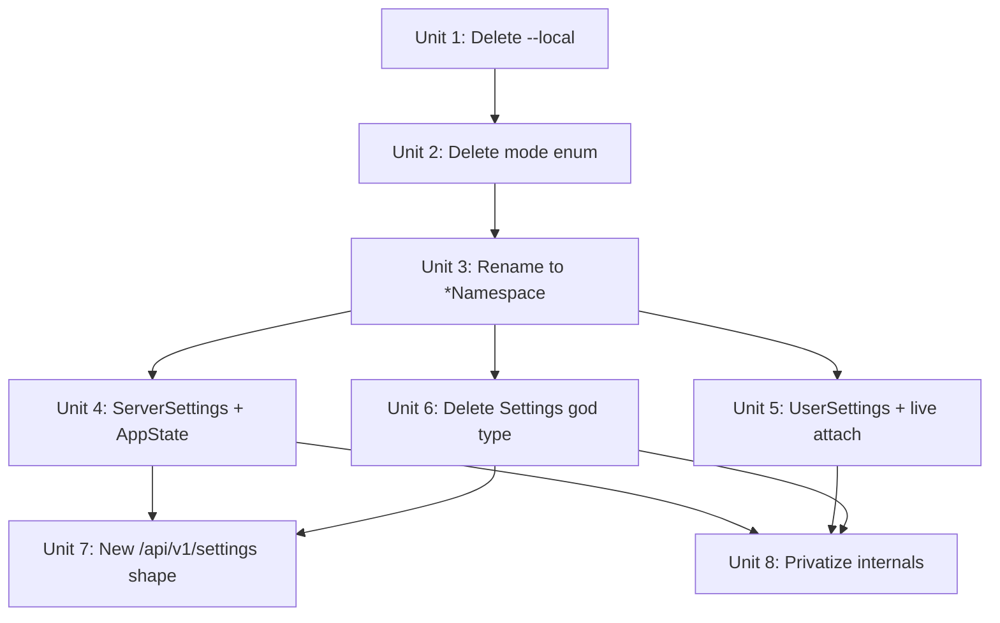

# Settings API Entrypoints — Owner-First Context Types

## Overview

Replace the free-function settings API with two owner-first context types
that expose dense, resolved views of current config. The elegance rule:

- **`SettingsLayer`** is the sparse transport/storage form — what TOML
  files parse into, what's persisted in run manifests, what merges with
  precedence.
- **Context types** (`ServerSettings`, `UserSettings`) are dense,
  owner-scoped, resolved views of a *current process's* config,
  computed from a layer at the moment a consumer needs them.

These roles do not overlap: stored artifacts are layers; current-config
reads are views. Stored-layer readers (code that reads specific
namespaces off a persisted run's `SettingsLayer`) keep using
per-namespace resolvers — the layer is the real artifact there.

After this refactor:

- **`ServerSettings`** — `server` + `features` namespaces. Derived from
  the server's **effective runtime layer** (the post-`apply_runtime_settings`
  `SettingsLayer` that folds in CLI overrides like `--storage-dir` and
  `--bind`) at startup and whenever hot-reload refreshes the layer.
  Held in `AppState` alongside the shared layer itself.
  `GET /api/v1/settings` serves the current in-memory view directly —
  no per-request disk read, no view toggle, no redaction.
- **`UserSettings`** — `cli` + `features` namespaces. The CLI process
  builds one from its own `~/.fabro/settings.toml`. `fabro run attach`
  uses the *live* `UserSettings` at attach time.

Both context types expose `from_layer(&SettingsLayer)` (primitive) and
`resolve()` (convenience that loads the default file; used by tools
and tests, not the server startup path which composes `from_layer`
against the effective runtime layer).

The god type `Settings` goes away with no named replacement — its
former consumers either migrate to per-namespace resolvers (the
stored-layer readers) or are deleted wholesale (the view-toggle
machinery removed by Unit 7). `EffectiveSettingsMode` goes away;
`fabro settings --local` goes away; redaction machinery goes away.

Settings contain no secrets — `InterpString` templates preserve
`{{ env.NAME }}` unresolved on the wire. Actual secrets live in
`ServerSecrets` / Vault.

## Problem Frame

The settings API grew around a layered-config design that's now visibly
clunky:

- Every caller that wants a resolved value first takes a `SettingsLayer`,
  then picks the right `resolve_*_from_file` helper. The layer plumbing is
  on the public surface even though most callers just want "give me the
  server config."
- `EffectiveSettingsMode` has three variants; production code always picks
  `LocalDaemon`. The enum is dead ceremony.
- `fabro_types::settings::Settings` is a god type — server-side execution
  code needing `run.*` also gets `cli.*` in the same struct.
- The CLI/server trust boundary is enforced by `fabro_cli::local_server`
  convention plus `bin/dev/check-boundary.sh`. Type-level projection does
  this at compile time.

The settings schema itself is fine. This plan is the programmatic API over
it.

## Requirements Trace

- **R1.** Current-config callers (the server's in-memory settings, the
  CLI process's settings) use the context types. Stored-layer readers —
  code that reads specific namespaces off a persisted `SettingsLayer`
  (`runner.rs`, `operations/create.rs`) — continue to use per-namespace
  resolvers. The layer is the real artifact there and must not be
  contorted to fit the context-type API.
- **R2.** Each context type exposes namespaces owned by its consumer,
  plus the cross-cutting `features.*` namespace.
- **R3.** `EffectiveSettingsMode` is deleted. One merge path remains.
- **R4.** `fabro settings --local` and its filesystem-walking assembly
  are deleted.
- **R5.** `GET /api/v1/settings` returns the server's in-memory
  `ServerSettings` as a typed JSON body. No `view=` query param, no
  `X-Fabro-Settings-View` header, no disk re-read, no redaction.
- **R6.** Today's per-namespace resolved types (`ServerSettings`,
  `CliSettings`, `ProjectSettings`, `WorkflowSettings`, `RunSettings`,
  `FeaturesSettings`) rename with a `*Namespace` suffix, freeing the
  short names for context types. Only `ServerSettings` and `UserSettings`
  are defined as context types in this PR.
- **R7.** The `Settings` god type (and the public `fabro_config::resolve`
  function that returns it, and the `load_and_resolve` helper that
  wraps them) are deleted. No named replacement type is introduced;
  consumers migrate to per-namespace resolvers or disappear with the
  view-toggle machinery Unit 7 removes.
- **R8.** Layer-merge internals are `pub(crate)` or private.
  Per-namespace resolver visibility matches reality (see Key Technical
  Decisions).
- **R9.** The CLI/server trust boundary survives. `fabro_cli::local_server`
  remains the only sanctioned CLI-side gateway to `[server.*]`;
  `bin/dev/check-boundary.sh` updates to cover the new symbols.

## Scope Boundaries

- **Not changing** the TOML schema, namespace inventory, merge precedence,
  or owner-domain stripping rules.
- **Not changing** `PreparedManifest.settings` — stays `SettingsLayer`.
  Wire format for persisted run settings unchanged.
- **Not migrating** stored-layer readers. `runner.rs:507-508`
  (`resolve_run_from_file` / `resolve_server_from_file` on `record.settings`)
  and `operations/create.rs` (metadata aggregation from stored layers) are
  legitimate consumers of the sparse layer, not candidates for
  context-type migration.
- **Not adding** endpoints or CLI commands.
- **Settings contain no secrets** (invariant, with documented gaps).
  Secret-bearing fields should be `InterpString`. Known gaps not addressed
  here: `McpTransport::Http.headers`, `McpTransport::Stdio.env`,
  `McpTransport::Sandbox.env`, `HookType::Http.headers`, `run.inputs`,
  `run.metadata`. Pre-existing; deferred to a follow-up plan that retypes
  the maps to `HashMap<String, InterpString>` and adds submit-time
  validation. Any new field added by this refactor must satisfy the
  invariant.

## Context & Research

### Relevant Code and Patterns

- `lib/crates/fabro-config/src/effective_settings.rs` — layer merge +
  owner-domain stripping.
- `lib/crates/fabro-config/src/resolve/` — per-namespace resolve helpers.
- `lib/crates/fabro-config/src/user.rs` — loads
  `~/.fabro/settings.toml` into a `SettingsLayer`.
- `lib/crates/fabro-types/src/settings/resolved.rs` — god type `Settings`.
- `lib/crates/fabro-types/src/settings/mod.rs` — re-exports per-namespace
  types to be renamed.
- `lib/crates/fabro-cli/src/local_server.rs` — single sanctioned CLI
  gateway to `[server.*]`.
- `lib/crates/fabro-cli/src/commands/config/mod.rs` — `fabro settings`
  command; contains `--local` branch to delete.
- `lib/crates/fabro-server/src/run_manifest.rs` — sole production caller
  of `materialize_settings_layer`.
- `lib/crates/fabro-server/src/settings_view.rs` — deleted by this
  refactor.
- `lib/crates/fabro-server/src/server.rs` — `AppState` will hold the
  server's `ServerSettings`; the settings endpoint handler serves it
  directly.
- `docs/api-reference/fabro-api.yaml` — OpenAPI spec.
- `bin/dev/check-boundary.sh` — CLI/server boundary regression guard.

### Related Context

- `docs/brainstorms/2026-04-08-settings-toml-redesign-requirements.md` —
  defined the six-namespace schema and owner-first trust boundaries. This
  plan operationalizes those boundaries in code.

### Call-Site Inventory

- `resolve_server_from_file` outside `fabro-config`: ~20 call sites across
  `fabro-cli`, `fabro-server`, `fabro-workflow`, `fabro-install`. Re-run
  `grep -rn "resolve_server_from_file" lib/` before Unit 4 to confirm the
  full set.
- `resolve_cli_from_file` outside `fabro-config`: `user_config.rs`,
  `attach.rs` (deleted in Unit 5).
- `materialize_settings_layer` outside tests: `run_manifest.rs` only.
- Per-namespace type name references to rename: ~57.

### Institutional Learnings

- No prior `docs/solutions/` entries cover this area.

## Key Technical Decisions

- **Layer and view are distinct roles.** `SettingsLayer` is sparse
  transport/storage. Context types are dense, owner-scoped, resolved views
  computed from a layer (or combination) at read time. Persisted artifacts
  are layers; live reads are views. These don't overlap and don't convert
  in place.

- **`GET /api/v1/settings` serves `AppState` in memory.** The server
  builds its `ServerSettings` at startup from the *effective runtime
  layer* (post-`apply_runtime_settings`, which folds in CLI overrides
  like `--storage-dir` and `--bind`) and stores it in `AppState`.
  Hot-reload keeps the derived view in sync via
  `state.replace_settings(...)`. The handler returns a clone of the
  current value. No per-request disk read. No view toggle. No
  redaction. No response header.

- **No `WorkflowSettings` in this PR.** An earlier draft introduced a
  `WorkflowSettings` context type as the dense resolved view for
  server-side execution, but the refactor has no production caller that
  needs it: `operations/create.rs` migrates to per-namespace resolvers
  (legitimate stored-layer read), `server.rs:1337` is deleted wholesale
  as part of Unit 7's view-toggle removal, and `settings_view.rs`
  disappears entirely. Introducing `WorkflowSettings::resolve_for_run`
  with no caller is speculative abstraction. If future server code
  wants a dense multi-namespace view, it can add the type then with a
  real consumer. `PreparedManifest.settings` stays `SettingsLayer`
  (unchanged by this refactor); server execution code reads specific
  namespaces via per-namespace resolvers as it does today.

- **Attach honors live CLI settings.** `fabro run attach` calls
  `UserSettings::resolve()` on the attaching process's config.
  Submit-time `cli.*` on a stored run is inert — no code reads it back.

- **Two constructors per context type.**
  `ServerSettings::from_layer(&SettingsLayer)` is the primitive;
  `ServerSettings::resolve()` loads the default
  `~/.fabro/settings.toml` and delegates. `UserSettings` has the same
  pair. No `resolve_from(path)`: `--config` handling is an existing
  `serve.rs` concern that produces the on-disk settings layer before
  `apply_runtime_settings` runs; the new `ServerSettings::from_layer`
  is invoked on the resulting *effective runtime layer*, not on a
  fresh disk read.

- **Delete `EffectiveSettingsMode`.** Production always picks
  `LocalDaemon`; the enum is ceremony. `materialize_settings_layer`
  becomes a single straight-line function.

- **Delete redaction.** Settings contain no secrets. `settings_view.rs`,
  `redact_for_api`, `redact_resolved_value`, `SettingsApiView`,
  `SettingsQuery`, `X-Fabro-Settings-View` — all deleted. Both settings
  endpoints serialize directly. If a future field should not be exposed,
  the fix is to type it as `InterpString`, not to reintroduce redaction.

- **`fabro settings` composes local + server.** The CLI renders
  `UserSettings::resolve()` (local) plus the server's `ServerSettings`
  (fetched via the endpoint). Two sections.

- **Typed OpenAPI schema via `Deserialize` + `with_replacement`.**
  Aligned with CLAUDE.md's API type ownership doctrine. The `ServerSettings`
  OpenAPI schema describes the internal Rust type directly; progenitor
  reuses it via `with_replacement`. Reachable namespace types gain
  `Deserialize` derives; types with custom `Serialize` get matching custom
  `Deserialize` (notably `InterpString`, which must preserve unresolved
  templates).

- **`features.*` on both context types — the one carve-out to
  owner-first.** Cross-cutting by design; server and CLI both gate
  behavior on feature flags, and server execution code consumes them
  via its per-namespace `resolve_features_from_file` reads on stored
  layers.

- **Context types live in `fabro-config`.** Inherent `impl` blocks must
  live with the type per Rust's orphan rules. `fabro-types` keeps only
  per-namespace shape types.

- **Per-namespace resolver visibility, decided once:** all six
  `resolve_*_from_file` helpers stay `pub`, because each has at least
  one cross-crate consumer:
  - `resolve_server_from_file` — `runner.rs:508` reads `server.*` off
    stored `record.settings`.
  - `resolve_run_from_file` — `runner.rs:507`, `run_manifest.rs:369`,
    `operations/create.rs` read `run.*` off stored layers.
  - `resolve_project_from_file`, `resolve_workflow_from_file` —
    `operations/create.rs` reads their `.metadata` for label
    aggregation.
  - `resolve_cli_from_file` — `fabro-cli/tests/it/cmd/create.rs:364`
    integration test asserts the persisted `cli.*` wire shape.
  - `resolve_features_from_file` — `fabro-server/src/server.rs:1414`
    reads `features.session_sandboxes`; the
    `fabro-config/tests/resolve_features.rs` integration test also
    depends on it.
- **Other `fabro-config` visibility:**
  - `pub(crate)`: `materialize_settings_layer` — internal helper; the
    merge step stays inside `run_manifest.rs`'s call site, consumed only
    via the public `SettingsLayer` output.
  - `pub`: `user::load_settings_config` — external caller in
    `fabro-server/src/serve.rs` loads the on-disk config layer before
    `apply_runtime_settings`.
  - `pub(crate)`: `EffectiveSettingsLayers` — no external consumer
    remains after `WorkflowSettings` is dropped (`run_manifest.rs`
    builds layers internally for its own `materialize_settings_layer`
    call).

## Open Questions

### Resolved During Planning

- *Introduce a `WorkflowSettings` context type?* No. The refactor has
  no production caller that needs a dense multi-namespace view —
  `operations/create.rs` migrates to per-namespace resolvers, the
  view-toggle branches are deleted. Adding the type speculatively
  violates the no-speculative-cleanup directive.
- *Context types' crate?* `fabro-config`.
- *`GET /api/v1/settings` re-read from disk per request?* No. Serves
  `AppState.server_settings`.
- *`PreparedManifest.settings` retype?* No. Stays `SettingsLayer`.
- *Stored-layer readers migrate to context types?* No. They stay on
  per-namespace resolvers.
- *Redaction for the new endpoints?* None. Deleted entirely.

### Deferred to Implementation

- `fabro settings` output layout (two-section render — labels, ordering,
  field suppression). Snapshot tests drive.

## High-Level Technical Design

> *Directional guidance, not implementation specification.*

**Type inventory:**

```
// Per-namespace dense types (renamed from today's *Settings)
ServerNamespace, CliNamespace, ProjectNamespace,
WorkflowNamespace, RunNamespace, FeaturesNamespace

// Context types (new; all in fabro-config)
ServerSettings   { server: ServerNamespace, features: FeaturesNamespace }
UserSettings     { cli: CliNamespace,       features: FeaturesNamespace }
```

**Public constructors:**

```
impl ServerSettings {
    fn from_layer(&SettingsLayer) -> Result<Self>;
    fn resolve() -> Result<Self>;
}

impl UserSettings {
    fn from_layer(&SettingsLayer) -> Result<Self>;
    fn resolve() -> Result<Self>;
}
```

**Role separation:**

```
SettingsLayer           — sparse transport/storage. Unchanged.
ServerSettings          — dense view. AppState holds one; API serves it.
UserSettings            — dense view. CLI process builds one.
```

**Call-site topology:**

```
Before                                      After
──────                                      ─────
resolve_server_from_file(&layer)       ─►   ServerSettings::from_layer(&layer)
  (for current-config reads)                (stored-layer reads keep
                                             resolve_*_from_file)

GET /api/v1/settings: load + resolve   ─►   GET /api/v1/settings: clone AppState.server_settings
  + redact + serialize per request

resolve_cli_from_file(&layer)          ─►   UserSettings::resolve() or ::from_layer
attach reads stored cli.*              ─►   attach calls UserSettings::resolve()

fabro_config::resolve(&layer)          ─►   per-namespace resolvers at each call site
  (god-type god fn) in create.rs            (project/workflow/run metadata reads)

materialize_settings_layer(...)        ─►   materialize_settings_layer(...)
                                             (stays at run_manifest.rs merge site;
                                              loses the `mode` parameter; output
                                              still stored in PreparedManifest.settings
                                              as SettingsLayer)

Settings god type                      ─►   deleted; no named replacement

runner.rs / operations/create.rs:      ─►   unchanged (pub per-namespace resolvers)
  per-namespace stored-layer reads
```

**Unit dependency graph:**



## Implementation Units

- [ ] **Unit 1: Delete `fabro settings --local` and the `LocalOnly` path**

**Goal:** Remove `--local`, its helpers, and the `LocalOnly` variant.

**Requirements:** R4.

**Dependencies:** None.

**Files:**
- Modify: `lib/crates/fabro-cli/src/args.rs` — remove `local` and
  `workflow` fields from `SettingsArgs`.
- Modify: `lib/crates/fabro-cli/src/commands/config/mod.rs` — delete
  `local_settings_value`, `workflow_and_project_layers`, `config_layers`,
  `strip_nulls`, `resolve_local_settings_value`, `render_resolve_errors`,
  and the `args.local` / `args.workflow` branches.
- Modify: `lib/crates/fabro-cli/src/main.rs` — remove `args.local`
  snapshot-test assertions.
- Modify: `lib/crates/fabro-config/src/effective_settings.rs` — remove
  `LocalOnly` variant and its match arm.
- Modify: `lib/crates/fabro-config/tests/resolve_root.rs` and the
  `effective_settings.rs` tests module — drop `LocalOnly` cases.
- Delete: `lib/crates/fabro-cli/tests/it/cmd/config.rs` tests that depend
  on `--local` (e.g., `settings_local_merges_cli_and_project_defaults`,
  `settings_local_workflow_name_applies_run_overlay_and_deep_merges`).
  They assert filesystem-walked behavior that's being removed entirely.

**Approach:**
- `--workflow WORKFLOW` was only meaningful with `--local`. Both go.
- `fabro settings` continues to work via the server path (reshaped in
  Unit 7).
- `LocalOnly` removal is dead-code deletion once the CLI stops calling it.

**Test scenarios:**
- *Contract:* `fabro settings` with a running server returns the
  server's settings (shape reshaped in Unit 7).
- *Parser-level:* `fabro settings --local` fails to parse. `fabro settings
  WORKFLOW_ARG` fails to parse.

**Verification:**
- `cargo build --workspace` and `cargo nextest run -p fabro-cli` pass.
- `grep -rn "LocalOnly\|args\.local" lib/` returns only deliberate doc
  references.

---

- [ ] **Unit 2: Delete `EffectiveSettingsMode` entirely**

**Goal:** Kill the mode enum. `materialize_settings_layer` becomes a
single straight-line function.

**Requirements:** R3.

**Dependencies:** Unit 1.

**Files:**
- Modify: `lib/crates/fabro-config/src/effective_settings.rs` — delete
  `EffectiveSettingsMode`; remove `mode` parameter from
  `materialize_settings_layer`; flatten to a single path (strip owner
  domains, merge, apply server authority). Rename
  `apply_local_daemon_overrides` → `enforce_server_authority`. Delete
  `apply_server_defaults` (no surviving caller).
- Modify: `lib/crates/fabro-config/src/lib.rs` — update internal
  `load_and_resolve` to match.
- Modify: `lib/crates/fabro-server/src/run_manifest.rs` — call
  `materialize_settings_layer(layers, Some(server_settings))` without a
  mode.
- Modify: `lib/crates/fabro-server/src/server.rs` — remove the
  `local_daemon_mode` field from `AppState` and `AppStateConfig`; update
  the three handler call sites that thread it (`create_run` ~line 4104,
  `run_preflight` ~line 4212, `render_graph_from_manifest` ~line 4242);
  update helper signatures (~lines 2515, 2541, 2641, 2708); remove the
  test helper at ~line 2575.
- Modify: `effective_settings.rs` tests module — delete the
  `RemoteServer` test case (`cli_and_server_domains_from_fabro_toml_are_inert_under_remote_mode`).
  Verify its unique assertions are covered by the surviving `LocalDaemon`
  test at ~line 437; if any coverage is unique, fold that assertion into
  the surviving test.

**Approach:**
- `apply_server_defaults` (the `RemoteServer` code path) has no surviving
  caller; delete along with the enum.
- Keep `strip_owner_domains` and `enforce_server_authority` as private
  helpers.

**Test scenarios:**
- *Contract:* `materialize_settings_layer` with representative layers
  produces the same output as the pre-refactor `LocalDaemon` invocation.
- *Edge case:* `Some(empty_layer)` for server settings preserves client
  values and doesn't panic.

**Verification:**
- `cargo build --workspace` and `cargo nextest run -p fabro-config` pass.
- `grep -rn "EffectiveSettingsMode\|RemoteServer\|LocalDaemon\|local_daemon_mode" lib/`
  returns zero hits.

---

- [ ] **Unit 3: Rename per-namespace resolved types to `*Namespace`**

**Goal:** Free the short names for context types.

**Requirements:** R6.

**Dependencies:** Units 1, 2.

**Files:**
- Modify: `lib/crates/fabro-types/src/settings/{mod,server,cli,project,workflow,run,features}.rs`
  — rename each per-namespace type (`ServerSettings` → `ServerNamespace`,
  etc.).
- Modify: `lib/crates/fabro-types/src/settings/resolved.rs` — update the
  god-type field types (the god type itself goes away in Unit 6).
- Modify: `lib/crates/fabro-config/src/resolve/mod.rs` and siblings —
  update return types.
- Modify: ~57 other references across the workspace (mechanical).

**Approach:** Type-only rename. Function names, field names, and serde
wire format unchanged. Use `cargo check --workspace` between file batches.

**Execution note:** Mechanical; suitable for `Execution target:
external-delegate`.

**Test scenarios:** All existing tests continue to pass. Compiler is the
primary witness.

**Verification:**
- `cargo build --workspace` and `cargo nextest run --workspace` pass.
- `grep -rn "fabro_types::settings::\(ServerSettings\|CliSettings\|ProjectSettings\|WorkflowSettings\|RunSettings\|FeaturesSettings\)\b" lib/`
  returns zero hits.
- Clippy clean.

---

- [ ] **Unit 4: Introduce `ServerSettings`; `AppState` holds one**

**Goal:** Add `ServerSettings` with `from_layer` + `resolve`. Build one at
server startup and store in `AppState`. Migrate current-config callers.

**Requirements:** R1, R2.

**Dependencies:** Unit 3.

**Files:**
- Create: `lib/crates/fabro-config/src/context.rs` — `ServerSettings {
  server: ServerNamespace, features: FeaturesNamespace }`. Inherent
  `from_layer(&SettingsLayer) -> Result<Self>` and `resolve() ->
  Result<Self>`.
- Modify: `lib/crates/fabro-config/src/lib.rs` — re-export `ServerSettings`.
- Modify: `lib/crates/fabro-server/src/serve.rs` (~lines 478-482) —
  startup already computes
  `effective_settings = apply_runtime_settings(&disk_settings, &args, &data_dir)`
  (the post-runtime-override layer that folds in `--storage-dir`,
  `--bind`, etc.). Add
  `let server_settings = ServerSettings::from_layer(&effective_settings)?;`
  alongside the existing `resolved_server_settings =
  resolve_server_settings(&effective_settings)?` line, and thread
  `server_settings` into `AppState`. Derive from the effective runtime
  layer, not from a fresh `~/.fabro/settings.toml` read; a fresh read
  would drop the CLI overrides.
- Modify: `lib/crates/fabro-server/src/serve.rs` (~line 600, the
  hot-reload path) — when `apply_runtime_settings(...)` is rerun and
  `state_for_poll.replace_settings(effective)` is called, also refresh
  `AppState.server_settings` from the new layer so the typed view
  stays in sync with the `Arc<RwLock<SettingsLayer>>`.
- Modify: `lib/crates/fabro-server/src/server.rs` — add
  `server_settings: Arc<ServerSettings>` (or equivalent interior
  mutability for hot-reload refresh) to `AppState`. Extend
  `replace_settings(...)` to also update the derived `ServerSettings`
  so both are consistent after reload.
- Modify: every current-config caller of `resolve_server_from_file` (~20
  sites across `fabro-cli`, `fabro-server`, `fabro-workflow`,
  `fabro-install`) — switch to `ServerSettings::from_layer(&layer)` where
  a layer is already in hand, or `ServerSettings::resolve()` where
  defaults apply. Stored-layer readers (`runner.rs:507-508`) stay on
  `resolve_server_from_file`.
- Modify: `bin/dev/check-boundary.sh` — add grep patterns for
  `ServerSettings::resolve` and `ServerSettings::from_layer` so the
  regression guard covers the migration window.
- Test: `lib/crates/fabro-config/tests/resolve_server.rs` — add tests for
  `ServerSettings::from_layer` and `ServerSettings::resolve`.

**Approach:**
- `from_layer` invokes the per-namespace resolver and wraps the result.
  Single primitive.
- `resolve()` loads the default `~/.fabro/settings.toml` and delegates
  to `from_layer`. Useful for tools (`fabro doctor`-style),
  integration tests, and any process that wants "the defaults on this
  machine." **Not** used by the server startup path: the server's
  authoritative settings are the *effective runtime layer* produced by
  `apply_runtime_settings`, which a fresh disk read doesn't see.
- Server startup: after `serve.rs` builds `effective_settings =
  apply_runtime_settings(...)`, it calls
  `ServerSettings::from_layer(&effective_settings)` and stores the
  result in `AppState`. Hot-reload (`state.replace_settings(...)`) also
  refreshes that derived view.
- `AppState.server_settings` is the server's canonical current-config
  value. Handlers read it, not disk. It's always in sync with the
  layer in `AppState`'s `RwLock<SettingsLayer>`.

**Test scenarios:**
- *Contract:* `from_layer(&layer)` returns the same data as the old
  free function on the same layer.
- *Contract:* `resolve()` with `$FABRO_HOME` set to a temp dir loads
  that directory's `settings.toml`.
- *Integration:* Server startup derives `AppState.server_settings`
  from the effective runtime layer (post-`apply_runtime_settings`).
  A startup with `--storage-dir /tmp/foo` produces
  `AppState.server_settings.server.storage` reflecting `/tmp/foo`,
  confirming CLI overrides flow through to the typed view.
- *Integration:* Hot-reload (triggered via the existing
  `state.replace_settings(effective)` pathway) refreshes
  `AppState.server_settings` so the typed view reflects the updated
  layer.

**Verification:**
- `cargo build --workspace` and `cargo nextest run --workspace` pass.
- `grep -rn "resolve_server_from_file" lib/` returns only
  `fabro-config/src/` and stored-layer reader call sites.
- `bin/dev/check-boundary.sh` still passes; verify on a throwaway branch
  that it catches a deliberate unsanctioned `ServerSettings::resolve*`
  import.

---

- [ ] **Unit 5: Introduce `UserSettings`; attach uses live config**

**Goal:** Add `UserSettings` with `from_layer` + `resolve`.
`fabro run attach` reads the attaching process's live `UserSettings`.

**Requirements:** R1, R2.

**Dependencies:** Unit 3.

**Files:**
- Modify: `lib/crates/fabro-config/src/context.rs` — add `UserSettings {
  cli: CliNamespace, features: FeaturesNamespace }`. Inherent
  `from_layer(&SettingsLayer)` and `resolve()`.
- Modify: `lib/crates/fabro-config/src/lib.rs` — re-export `UserSettings`.
- Modify: `lib/crates/fabro-cli/src/user_config.rs` — replace
  `resolve_cli_from_file` usage with `UserSettings::from_layer` or
  `UserSettings::resolve()`.
- Modify: `lib/crates/fabro-cli/src/commands/run/attach.rs` — delete the
  stored-layer `resolve_cli_from_file(&record.settings)` read at ~line 90.
  Attach reads the attaching process's `UserSettings` (already threaded
  through the command context) and honors its verbosity.
- Delete: any test that asserted submit-time verbosity preservation on
  attach. Add a test that attach honors the attaching CLI's live
  verbosity.
- Test: `lib/crates/fabro-config/tests/resolve_cli.rs` — add
  `UserSettings::from_layer` and `UserSettings::resolve` cases.

**Approach:**
- Mirror `ServerSettings`'s shape.
- Attach-verbosity behavior changes: attach honors live settings. Stored
  `cli.*` on a run is inert; wire format unchanged.

**Test scenarios:**
- *Contract:* `from_layer` and `resolve` return the expected namespaces.
- *Edge case:* Missing `~/.fabro/settings.toml` returns defaults without
  erroring.
- *Behavior:* `fabro run attach --verbose` against a non-verbose submitted
  run prints verbose output; reversed case prints non-verbose output.

**Verification:**
- `cargo build --workspace` and `cargo nextest run --workspace` pass.
- `grep -rn "resolve_cli_from_file" lib/` returns only
  `fabro-config/src/` internal references **plus**
  `fabro-cli/tests/it/cmd/create.rs:364` (the integration test that
  asserts the persisted `cli.*` wire shape — per the KTD visibility
  policy, this test intentionally keeps `resolve_cli_from_file`
  public). The `--local` call site at `commands/config/mod.rs:121`
  was deleted in Unit 1; `user_config.rs` migrates to
  `UserSettings::from_layer` in this unit; the `attach.rs` read is
  deleted in this unit.

---

- [ ] **Unit 6: Delete the `Settings` god type and its ecosystem**

**Goal:** Remove `fabro_types::settings::Settings`, the
god-type-returning `fabro_config::resolve` function, the
`fabro_config::load_and_resolve` helper, and all their dependent code
— tests and production — without introducing a named replacement
type.

**Requirements:** R7.

**Dependencies:** Units 3 (renames) and 4 (context types exist for
migrated callers).

**Files:**

*Delete the type and wrapper functions:*
- Delete: `lib/crates/fabro-types/src/settings/resolved.rs` (the
  `Settings` struct itself).
- Modify: `lib/crates/fabro-types/src/settings/mod.rs` — remove the
  `Settings` re-export.
- Modify: `lib/crates/fabro-config/src/lib.rs` — delete the
  `load_and_resolve` public helper (it returns `Settings`); delete the
  `use fabro_types::settings::{Settings, SettingsLayer}` import (keep
  the `SettingsLayer` import via its own `use`).
- Modify: `lib/crates/fabro-config/src/resolve/mod.rs` — delete the
  public `fn resolve(&SettingsLayer) -> Result<Settings>` function
  (the god-type-returning one); remove it from `pub use
  resolve::{...}` in `lib.rs`. Per-namespace resolvers are unaffected.

*Migrate the one production caller of `fabro_config::resolve`:*
- Modify: `lib/crates/fabro-workflow/src/operations/create.rs` — uses
  `Settings` at ~line 19 (import) and ~lines 289-298
  (`resolve_settings_tree` / `combined_labels`). The caller at ~line
  107 reads **both** `resolved_settings.server.storage.root` (to
  compute `storage_root` for run persistence) and
  `combined_labels(&resolved_settings)` (project/workflow/run
  metadata). Replace `resolve_settings_tree` so it returns a small
  struct (or 4-tuple) containing `ServerNamespace` +
  `ProjectNamespace` + `WorkflowNamespace` + `RunNamespace`, built
  from `fabro_config::resolve_server_from_file`,
  `resolve_project_from_file`, `resolve_workflow_from_file`, and
  `resolve_run_from_file` on the same `SettingsLayer`. Update the
  call site at ~line 107 to read `.server.storage.root` off the
  returned `ServerNamespace`, and `combined_labels` to read
  `.metadata` off each of `ProjectNamespace` / `WorkflowNamespace` /
  `RunNamespace`. All four per-namespace resolvers stay `pub` per
  Unit 8.

*Migrate or delete dependent tests:*
- Modify: `lib/crates/fabro-config/tests/resolve_root.rs` — tests
  (including ~line 12 imports and ~line 43 call) currently exercise
  `fabro_config::resolve`. Rewrite each assertion against the
  surviving per-namespace resolvers: e.g.,
  `resolve_root.rs::resolves_root_settings_require_explicit_server_auth_methods`
  becomes a test on `resolve_server_from_file(&SettingsLayer::default())`.
  Tests that check multi-namespace behavior split into per-namespace
  assertions.
- Modify: `lib/crates/fabro-config/tests/defaults.rs` — ~line 94 calls
  `resolve(&SettingsLayer::default())`. Rewrite to target the specific
  per-namespace resolver whose default the test is asserting (likely
  `resolve_server_from_file`, from the `server.auth.methods` check
  shown by grep).
- Modify: `lib/crates/fabro-cli/tests/it/cmd/config.rs` — ~line 160
  `resolved_server_settings_fixture` calls `fabro_config::resolve(...)`
  to produce a Settings-shaped fixture for the settings command tests.
  Replace with a fixture built via
  `ServerSettings::from_layer(&server_settings_layer_fixture())`
  (produces only `server` + `features`, matching the new
  `GET /api/v1/settings` response shape).

*Server.rs branch removed by Unit 7:*
- `lib/crates/fabro-server/src/server.rs:1337` (the
  `fabro_config::resolve(&settings)` call inside the `?view=resolved`
  branch of `retrieveServerSettings`) is already deleted by Unit 7's
  handler simplification. No separate action needed here.

*Settings_view deletion by Unit 7:*
- `lib/crates/fabro-server/src/settings_view.rs` (the
  `redact_resolved_value(&Settings)` function plus test at ~line 257)
  is deleted entirely by Unit 7. No separate action needed here.

*Run_manifest.rs: mode parameter only:*
- Modify: `lib/crates/fabro-server/src/run_manifest.rs` — the existing
  `materialize_settings_layer(layers, Some(server_settings), mode)`
  call **stays**; this unit only removes the `mode` argument (Unit 2
  deleted the enum). `materialize_settings_layer` still produces the
  merged `SettingsLayer` stored in `PreparedManifest.settings`. No
  `WorkflowSettings` or other context type is constructed here.

**Approach:**
- The god type has exactly one production consumer outside the
  view-toggle machinery (`operations/create.rs`); migrate it. Every
  other `fabro_config::resolve` call site is either a test (migrate or
  delete) or inside code already being deleted by Unit 7.
- No replacement context type: stored-layer readers keep using
  per-namespace resolvers per R1; current-config reads are covered by
  `ServerSettings`/`UserSettings` (Units 4-5).
- `PreparedManifest.settings: SettingsLayer` is unchanged; the
  run_manifest merge pipeline stays intact.

**Test scenarios:**
- *Contract:* `operations/create.rs` label aggregation produces the
  same result as before — per-namespace metadata combined by the
  replacement `resolve_settings_tree`.
- *Migration:* rewritten `resolve_root.rs` and `defaults.rs` tests
  cover the same assertions at the per-namespace resolver level.
- *Migration:* the `fabro settings` command test in
  `tests/it/cmd/config.rs` still passes with the `ServerSettings`-shaped
  fixture.

**Verification:**
- `cargo build --workspace` and `cargo nextest run --workspace` pass.
- `grep -rn "fabro_types::settings::Settings\b" lib/` returns zero
  hits.
- `grep -rn "fabro_config::resolve\b" lib/` returns zero hits (the
  god-type-returning function is gone; per-namespace
  `fabro_config::resolve_*_from_file` and the new context-type
  constructors remain).
- `grep -rn "load_and_resolve" lib/` returns zero hits.

---

- [ ] **Unit 7: Typed `GET /api/v1/settings` served from `AppState`; delete redaction**

**Goal:** The handler returns a typed `ServerSettings` from `AppState` in
memory. Delete the redaction machinery. Typed OpenAPI schema via
`Deserialize` + `with_replacement`.

**Requirements:** R5.

**Dependencies:** Units 4, 6.

**Files:**
- Modify: `docs/api-reference/fabro-api.yaml`:
  - Remove the `view` query parameter and `X-Fabro-Settings-View` header
    from the `retrieveServerSettings` operation.
  - Replace `ServerSettings`'s `additionalProperties: true` with a typed
    schema (two fields: `server`, `features`) matching the Rust
    `ServerSettings`.
  - Rename the `RunSettings` schema to `RunSettingsLayer` and update its
    description to reflect that the endpoint returns the persisted
    `SettingsLayer` as-is.
  - Remove all `redact`, `redaction`, `secret subtrees` language across
    the YAML.
- Modify: `lib/crates/fabro-api/build.rs` — add `with_replacement(...)`
  entries mapping the OpenAPI `ServerSettings` schema (and nested types)
  to the internal Rust types.
- Modify: `lib/crates/fabro-types/src/settings/server.rs`, `features.rs`,
  and reachable child types — add `Deserialize` derives. For types with
  custom `Serialize` (`serialize_socket_addr`, `InterpString`, etc.),
  implement matching custom `Deserialize`. `InterpString::Deserialize`
  must preserve unresolved `{{ env.NAME }}` templates.
- Add: `lib/crates/fabro-api/tests/` type-identity + JSON-parity test
  (per CLAUDE.md's `with_replacement` requirement).
- Regenerate: `cargo build -p fabro-api` (progenitor runs in build.rs).
- Regenerate: `cd lib/packages/fabro-api-client && bun run generate`.
- Modify: `lib/crates/fabro-server/src/server.rs` — the
  `retrieveServerSettings` handler returns a clone of
  `AppState.server_settings`. No view toggle, no response header, no
  redaction. The `/runs/:id/settings` handler serializes
  `run_spec.settings` (the `SettingsLayer`) directly.
- Modify: `lib/crates/fabro-client/src/client.rs` (~lines 493-513) —
  simplify `retrieve_resolved_server_settings` to drop `?view=resolved`
  and the header check.
- Delete: `lib/crates/fabro-server/src/settings_view.rs` (module + tests).
  This removes `SettingsApiView`, `SettingsQuery`,
  `RESOLVED_VIEW_HEADER_NAME`, `RESOLVED_VIEW_HEADER_VALUE`,
  `redact_for_api`, `redact_resolved_value`.
- Modify: `lib/crates/fabro-server/src/demo/mod.rs` (~lines 602-621 and
  ~line 242) — the parallel demo settings handler imports
  `settings_view::{SettingsQuery, SettingsApiView, RESOLVED_VIEW_HEADER_NAME}`.
  Replace with direct serialization of the demo fixture in the new shape.
- Delete or rewrite every test still wired to the old view-toggle /
  `X-Fabro-Settings-View` contract:
  - `lib/crates/fabro-server/tests/it/api/settings.rs:63` and `:143`
    (the entire
    `retrieve_server_settings_resolved_view_returns_dense_settings_and_marker`
    test goes away; layer-view test reshapes to the new single-shape
    response).
  - `lib/crates/fabro-server/tests/it/api/runs.rs:116` (redaction
    assertion on `/runs/:id/settings` — the endpoint now returns the
    layer unredacted).
  - `lib/crates/fabro-server/src/server.rs:7491` (inline unit test
    that issues `GET /settings?view=resolved` — rewrite to hit
    `/settings` without the query parameter, or delete if it was only
    covering the resolved view branch).
  - `lib/crates/fabro-cli/tests/it/cmd/config.rs:923, :1008, :1011`
    (CLI config-command integration tests mock
    `/api/v1/settings?view=resolved` with an
    `X-Fabro-Settings-View: resolved` response header; migrate the
    mocks to the new single-shape contract — no `view` query param,
    no custom header, body = typed `ServerSettings` fixture built via
    `ServerSettings::from_layer(&server_settings_layer_fixture())`).
- Modify: `lib/crates/fabro-cli/src/commands/config/mod.rs` —
  `rendered_config` fetches the new `ServerSettings` from the endpoint
  and merges with `UserSettings::resolve()` for a two-section display.
- Modify: `apps/fabro-web/app/routes/settings.tsx` — consume the newly
  typed `ServerSettings` shape explicitly.
- Run: `scripts/refresh-fabro-spa.sh`.

**Approach:**
- The endpoint returns the in-memory `AppState.server_settings`. No
  per-request disk read.
- OpenAPI conformance (`openapi_conformance.rs`) verifies the new
  single-shape endpoint against the spec.

**Test scenarios (canonical only):**
- *Contract:* `GET /api/v1/settings` returns JSON with exactly two
  top-level keys, `server` and `features`. The typed shape matches the
  OpenAPI `ServerSettings` schema.
- *Contract:* Generated TypeScript client returns a typed object with
  `server` and `features` fields.
- *Contract:* `GET /api/v1/runs/:id/settings` returns the persisted
  `SettingsLayer` (renamed `RunSettingsLayer` in the spec) directly.
- *Behavior:* `server.listen` is present and visible in the main settings
  response.
- *Integration:* OpenAPI conformance passes.
- *Integration:* `fabro settings` renders two sections (user / server)
  without errors.

**Verification:**
- `cargo build -p fabro-api` succeeds (progenitor codegen clean).
- `cargo nextest run -p fabro-server` passes, including conformance.
- `cd lib/packages/fabro-api-client && bun run generate && bun run
  typecheck` succeeds.
- CI's SPA-drift check passes.

---

- [ ] **Unit 8: Privatize merge internals**

**Goal:** Minimize the public surface of `fabro-config`. Context types
and their constructors are the primary API; internal helpers go
`pub(crate)`.

**Requirements:** R1, R8.

**Dependencies:** Units 4, 5, 6.

**Files:**
- Modify: `lib/crates/fabro-config/src/effective_settings.rs` —
  `materialize_settings_layer` → `pub(crate)`.
- `lib/crates/fabro-config/src/resolve/mod.rs` — all six
  `resolve_*_from_file` functions (`project`, `workflow`, `run`, `cli`,
  `server`, `features`) keep their existing `pub` visibility. Each has
  at least one cross-crate consumer; see the KTD visibility decision
  for the specific sites.
- Keep `pub`: `lib/crates/fabro-config/src/user.rs::load_settings_config`
  — `fabro-server/src/serve.rs` loads the on-disk settings layer via
  it. No visibility change.
- Modify: `lib/crates/fabro-config/src/lib.rs` — **settings-entrypoint
  re-exports only**. Narrow scope:
  - **Add:** `ServerSettings`, `UserSettings` (the new context types).
  - **Remove:** the `Settings` type and the god-type-returning
    `resolve` function from the public re-export list (both deleted in
    Unit 6).
  - **Leave untouched:** existing re-exports of `Error`, `Result`,
    `Home`, `expand_tilde`, `apply_builtin_defaults`,
    `defaults_layer`, `load_settings_*`, `parse_settings_layer`, the
    `storage` module, and any other non-settings-entrypoint APIs.
    These serve cross-workspace consumers (e.g.,
    `fabro-workflow/src/run_lookup.rs`,
    `fabro-workflow/src/operations/create.rs`) whose API surface is
    out of scope for this refactor.
  - Update the *settings-entrypoint* paragraph in the crate-level
    doc comment to describe the two context types and their
    constructors as the primary resolution API. Do **not** rewrite
    the full crate doc comment.

**Approach:** Cleanup pass. Flip visibility; compile.

**Test scenarios:**
- *Integration:* Downstream crates compile after visibility narrowing.

**Verification:**
- `cargo build --workspace` and `cargo nextest run --workspace` pass.
- `grep -rn "pub fn resolve_\(project\|workflow\|run\|cli\|server\|features\)_from_file" lib/crates/fabro-config/`
  returns six hits (all six per-namespace resolvers remain `pub`
  because each has cross-crate consumers).
- `bin/dev/check-boundary.sh` passes.

## System-Wide Impact

- **Interaction graph:** ~20 current-config call sites migrate from
  `resolve_server_from_file(&layer)` to `ServerSettings::from_layer(&layer)`
  (or `::resolve()`). Stored-layer reads unchanged.
- **Error propagation:** Resolver errors flow back unchanged; constructors
  wrap today's error types.
- **API surface:** `GET /api/v1/settings` shape changes (single dense
  `ServerSettings` served from `AppState`). `GET /api/v1/runs/:id/settings`
  shape unchanged (still the persisted `SettingsLayer`; OpenAPI schema
  renamed `RunSettingsLayer`).
- **Integration coverage:** OpenAPI conformance guards spec/router
  alignment. Progenitor regen + `bun run generate` + SPA refresh is the
  known hygiene.
- **Unchanged invariants:** TOML file format, namespace inventory,
  layering precedence, server authority over server-owned fields,
  `PreparedManifest.settings` wire format, `fabro_cli::local_server` as
  the sanctioned CLI gateway to `[server.*]`.

## Risks & Dependencies

| Risk | Mitigation |
|------|------------|
| The ~57-reference rename (Unit 3) lands incomplete, breaking the build mid-merge | Atomic commit for Unit 3; `cargo check --workspace` between file batches |
| TypeScript regen drift fails CI's SPA-bundle check | Run `scripts/refresh-fabro-spa.sh` after `bun run generate` |
| `fabro settings` snapshot tests drift | `cargo insta pending-snapshots` + review per-snapshot before accept |
| `bin/dev/check-boundary.sh` silently passes after the rename | Script updated in Unit 4 (not Unit 8) so coverage never drops; verified on a throwaway branch |

## Documentation / Operational Notes

- OpenAPI description prose for `/api/v1/settings` updated to reflect the
  single-shape response.
- `CLAUDE.md`'s "API workflow" section already describes the
  OpenAPI → Rust → TypeScript pipeline; no changes needed.
- Release notes: `fabro settings --local` removed; `GET /api/v1/settings`
  response shape changed; redaction removed.

## Sources & References

- Related code: `lib/crates/fabro-config/src/effective_settings.rs`,
  `lib/crates/fabro-types/src/settings/resolved.rs`,
  `lib/crates/fabro-cli/src/local_server.rs`,
  `lib/crates/fabro-server/src/run_manifest.rs`,
  `docs/api-reference/fabro-api.yaml`.
- Adjacent brainstorm:
  `docs/brainstorms/2026-04-08-settings-toml-redesign-requirements.md`
  (R16 on owner-first namespace boundaries).
- Boundary-enforcement commit: `5b1c40764` + `bin/dev/check-boundary.sh`.
