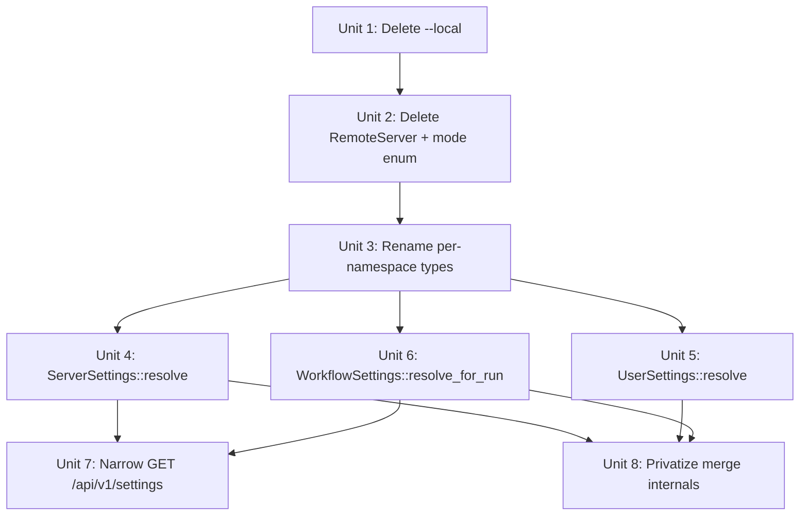

# Settings API Entrypoints — Owner-First Context Types

## Overview

Replace the current free-function / layer-passing settings API with three
owner-first context types that expose `::resolve*()` constructors. Callers ask
for exactly the settings their context owns, and the merge/layer machinery
becomes an internal concern of `fabro-config`.

Today, reading resolved settings means composing free functions
(`fabro_config::resolve_server_from_file`, `resolve_cli_from_file`, etc.) over
a sparse `SettingsLayer`, driven by a three-variant `EffectiveSettingsMode`
enum (`LocalOnly`, `RemoteServer`, `LocalDaemon`). Two of those variants are
effectively dead: `RemoteServer` is only reached by test helpers, and
`LocalOnly` is only reached by `fabro settings --local`. A single god type
`Settings` carries all six namespaces, and callers freely reach into namespaces
they don't own.

After this refactor:

- **`ServerSettings`** — `server` + `features` namespaces. Resolved by the
  server at startup; returned by `GET /api/v1/settings`.
- **`UserSettings`** — `cli` + `features` namespaces. Resolved by the CLI
  process from its local `~/.fabro/settings.toml`.
- **`WorkflowSettings`** — all six namespaces (`server`, `project`, `workflow`,
  `run`, `cli`, `features`). Resolved server-side when a submitted run is
  materialized. Replaces today's `Settings` god type.

Each type gets an `::resolve*()` constructor; each hides the `SettingsLayer`
plumbing. The mode enum disappears, the `--local` diagnostic path is deleted,
and `materialize_settings_layer` becomes a single straight-line function
behind `WorkflowSettings::resolve_for_run`.

## Problem Frame

The settings API grew around a layered-config design (`SettingsLayer` +
free-function resolvers + mode enum) that is now visibly clunky. Symptoms:

- Every caller that wants a resolved value first needs a `SettingsLayer`, then
  picks the right `resolve_*_from_file` helper. The layer is exposed in the
  public API even though few callers should care.
- The `EffectiveSettingsMode` enum has three variants encoding
  client/server trust rules, but today's production code path always picks
  `LocalDaemon`. `RemoteServer` is test-only (a vestige of the removed
  "CLI executes workflows directly" flow), and `LocalOnly` exists only to
  back `fabro settings --local`.
- The god type `fabro_types::settings::Settings` carries all six namespaces
  indiscriminately. A server-side path that needs `run.*` also gets `cli.*`
  in the same struct, obscuring ownership.
- A recent CLI/server boundary cleanup (commit `5b1c40764`) moved all
  `[server.*]` reads into `fabro_cli::local_server` so general CLI commands
  couldn't accidentally reach them. That boundary is preserved today by
  convention + a shell script (`bin/dev/check-boundary.sh`). Type-level
  projection — where a CLI command that holds a `UserSettings` *cannot*
  read `server.*` at all — is a stronger form of the same invariant.

The settings schema itself is in good shape (see origin-adjacent context
below). This plan is the programmatic API layer over that schema.

## Requirements Trace

- **R1.** Outside code calls `ServerSettings::resolve()`,
  `UserSettings::resolve()`, or `WorkflowSettings::resolve_for_run(...)` — no
  caller outside `fabro-config` constructs a `SettingsLayer` or calls
  `resolve_*_from_file` for normal resolution.
- **R2.** Each context type exposes only the namespaces it owns (strict
  projection): `ServerSettings` has `server` + `features`; `UserSettings`
  has `cli` + `features`; `WorkflowSettings` has all six.
- **R3.** The `EffectiveSettingsMode` enum is deleted. The merge code path
  that survives is the current `LocalDaemon` behavior (strip owner domains
  from project/workflow; server is authoritative for server-owned fields).
- **R4.** The `fabro settings --local` flag and all supporting CLI-side
  filesystem-walking layer assembly is removed. `fabro settings` always
  talks to the server.
- **R5.** `GET /api/v1/settings` returns a dense `ServerSettings` payload
  (no `view=layer|resolved` toggle, no `X-Fabro-Settings-View` header).
  The OpenAPI schema describes the dense shape properly, not
  `additionalProperties: true`.
- **R6.** Today's per-namespace resolved types (`ServerSettings`,
  `CliSettings`, `ProjectSettings`, `WorkflowSettings`, `RunSettings`,
  `FeaturesSettings`) are renamed with a `*Namespace` suffix, freeing the
  shorter names for the new context types.
- **R7.** Today's god type `fabro_types::settings::Settings` is deleted;
  callers migrate to `WorkflowSettings`, which has the same field set.
- **R8.** `materialize_settings_layer`, `EffectiveSettingsLayers`'s
  construction path, and `user::load_settings_config` are no longer part of
  the public API of `fabro-config`. (`EffectiveSettingsLayers` the struct
  may remain `pub` as the input to `WorkflowSettings::resolve_for_run`,
  since only `fabro-server/run_manifest.rs` builds it.)
- **R9.** The CLI/server boundary enforced today by
  `fabro_cli::local_server` + `bin/dev/check-boundary.sh` stays intact or
  strengthens. In particular, CLI commands that don't need
  `server.*` never hold a `ServerSettings` — they hold `UserSettings`
  instead.

## Scope Boundaries

- **Not changing** the TOML schema, namespace inventory, merge precedence,
  or strip-owner-domains trust rules. The *rules* survive; only the API that
  exposes them changes.
- **Not changing** the wire format of persisted run settings (still a
  `SettingsLayer` serialized into the run spec).
- **Not adding** new endpoints or new CLI commands. Only the response shape
  of `GET /api/v1/settings` changes.
- **Not reworking** the CLI/server boundary enforcement script beyond the
  mechanical updates that follow from renames.
- **Not relocating** the `fabro_cli::local_server` module. Its three
  boundary helpers (`storage_dir`, `bind_request`, `auth_methods`) continue
  to be the sanctioned entry points from CLI lifecycle commands into
  `[server.*]`.
- **Out of scope:** any UX redesign of `fabro settings` output beyond the
  minimal change required by the narrower server response (see Unit 7).

## Context & Research

### Relevant Code and Patterns

- `lib/crates/fabro-config/src/effective_settings.rs` — layer merge, mode
  enum, owner-domain stripping, server-authoritative overrides.
- `lib/crates/fabro-config/src/resolve/` — per-namespace resolve helpers
  (`resolve_server_from_file` and siblings).
- `lib/crates/fabro-config/src/user.rs` — loads `~/.fabro/settings.toml`
  into a `SettingsLayer`; exposes `default_settings_path()` via
  `fabro_util::home::Home::from_env()`.
- `lib/crates/fabro-types/src/settings/resolved.rs` — the god type
  `Settings` (six-field struct).
- `lib/crates/fabro-types/src/settings/mod.rs` — re-exports the
  per-namespace resolved types that will be renamed.
- `lib/crates/fabro-cli/src/local_server.rs` — the single sanctioned CLI
  entry point into `[server.*]`. Today's example of the owner-first
  boundary pattern we're lifting to the type system.
- `lib/crates/fabro-cli/src/commands/config/mod.rs` — current
  `fabro settings` command; contains the `--local` branch and the
  filesystem-walking layer assembly that will be deleted.
- `lib/crates/fabro-server/src/run_manifest.rs` — the sole production
  caller of `materialize_settings_layer`; always picks `LocalDaemon`.
- `lib/crates/fabro-server/src/settings_view.rs` — redacts `Settings` for
  API responses. Signature retypes as part of the god-type removal.
- `docs/api-reference/fabro-api.yaml` — OpenAPI spec. `GET /api/v1/settings`
  at line 1947; `ServerSettings` schema at line 4897 (currently
  `additionalProperties: true`, with `view=layer|resolved` query param).
  Rust types regenerate via `lib/crates/fabro-api/build.rs`; TypeScript
  client regenerates via `cd lib/packages/fabro-api-client && bun run
  generate`.
- `lib/crates/fabro-server/tests/it/openapi_conformance.rs` — conformance
  test that catches spec/router drift; the refactor must keep this green.
- `bin/dev/check-boundary.sh` — regression guard for the
  `fabro_cli::local_server` boundary; needs a pass after the renames to
  confirm the grep patterns still work.

### Related Context

- `docs/brainstorms/2026-04-08-settings-toml-redesign-requirements.md`
  defined the six-namespace schema (R3), owner-first trust boundaries (R16),
  and the paste-anywhere / strict-namespacing rules this refactor now
  operationalizes in code. Not a strict origin for this plan — it defined
  the file schema; this plan defines the programmatic API over it — but
  the motivation is directly downstream of R16.
- Recent cleanup commit `7cb6c65d5 Remove dev-token minting from server
  start` and `77fc77872 Gate dev-token handling on explicit auth methods`
  are the most recent touches in this area; they didn't change the settings
  API shape.

### Call-Site Inventory

To size the migration:

- `resolve_server_from_file` outside `fabro-config`: ~20 call sites across
  `fabro-cli` (`local_server.rs`, `commands/exec.rs`, `commands/install.rs`,
  `commands/pr/mod.rs`, `commands/run/attach.rs`, `commands/run/runner.rs`),
  `fabro-server` (`serve.rs`, `run_manifest.rs`, `install.rs`, `server.rs`,
  `jwt_auth.rs`), and `fabro-install/src/lib.rs`.
- `resolve_cli_from_file` outside `fabro-config`: 3 call sites —
  `fabro-cli/src/user_config.rs`, `fabro-cli/src/commands/run/attach.rs`,
  `fabro-cli/src/commands/config/mod.rs` (`--local` path, will be deleted).
- `materialize_settings_layer`: 3 call sites —
  `fabro-config/src/lib.rs` (internal `load_and_resolve`),
  `fabro-cli/src/commands/config/mod.rs` (`--local`, will be deleted),
  `fabro-server/src/run_manifest.rs` (becomes
  `WorkflowSettings::resolve_for_run`).
- References to per-namespace resolved type names that will be renamed to
  `*Namespace`: ~57 across the workspace.

### Institutional Learnings

- No prior `docs/solutions/` entries cover this area; the refactor starts
  from current code and the adjacent brainstorm.

## Key Technical Decisions

- **Four types collapse to three.** An earlier sketch carried a
  `LocalWorkflowSettings` type to serve `fabro settings --local`. Deleting
  the `--local` flag eliminates the only caller and lets
  `LocalWorkflowSettings` go away entirely. **Rationale:** the
  diagnostic value of `--local` is narrow (first-run sanity checks,
  debugging a server that can't start), mostly covered by reading
  `~/.fabro/settings.toml` directly or by a future purpose-built
  `fabro doctor`-style command. The simplification — one fewer type, no
  mode enum, one merge path — dominates.
- **`UserSettings`, not `CliSettings`, for the CLI-process context type.**
  Reflects both the *source* (`~/.fabro/settings.toml` is the user's file)
  and the *scope* (personal/machine preferences). Also avoids the collision
  with the now-renamed `cli.*` namespace type (`CliNamespace`) that lives
  inside it.
- **`WorkflowSettings` includes `cli.*`.** The server does not read
  `cli.*` for any decision (audited: zero reads in `fabro-server`,
  `fabro-workflow`, `fabro-agent`). But `cli.*` is meaningfully *stored
  per-run* so that `fabro run attach` can reproduce submit-time
  `output.verbosity`. Treating `cli.*` inside `WorkflowSettings` as an
  opaque snapshot of client state at submit time, not as a server input,
  matches this usage and lets the CLI round-trip the info it needs.
- **`features.*` appears on all three context types.** Feature flags are
  cross-cutting; both the CLI process and the server consult them, and a
  run carries its own snapshot. Small cost for a uniform rule.
- **Delete `EffectiveSettingsMode` entirely, not just `RemoteServer`.**
  After `LocalOnly` (Unit 1) and `RemoteServer` (Unit 2) are both removed,
  the only remaining variant is `LocalDaemon`. A one-variant enum has no
  value; the function loses its `mode` parameter and becomes a single
  straight-line implementation.
- **`GET /api/v1/settings` collapses to one dense shape.** The current
  `view=layer|resolved` toggle and `X-Fabro-Settings-View` header go away.
  The endpoint returns a typed `ServerSettings` (schema properly described,
  not `additionalProperties: true`). **Rationale:** the layer shape is an
  internal representation, not a client contract; once internal code doesn't
  pass layers around, the API shouldn't either.
- **`fabro settings` composes local + remote views.** Without `--local`
  and with a narrower server response, the CLI constructs its display from
  both sides: local `UserSettings::resolve()` (for `cli` + local `features`)
  and the server's `ServerSettings` (for `server` + server's `features`).
  This is more truthful than today's behavior, where the server synthesizes
  a cross-namespace view that conflates its `cli.*` with the client's.
- **`EffectiveSettingsLayers` stays `pub`** (in `fabro-config`), since
  `fabro-server/run_manifest.rs` is the one external caller that needs to
  build one to pass to `WorkflowSettings::resolve_for_run`. Its
  construction is simple enough that a builder isn't warranted.
- **Placement of context types.** New context types live in `fabro-types`
  alongside existing namespace types (keeping the type definitions in one
  crate and the resolution logic in `fabro-config`). `impl` blocks for
  `::resolve*()` live in `fabro-config` via extension traits or inherent
  impls in the resolution module — whichever is mechanically simplest
  given orphan rules; this is an implementation-time call.

## Open Questions

### Resolved During Planning

- *Should `cli.*` be on `WorkflowSettings`?* Yes — see "Key Technical
  Decisions." Snapshot semantics for attach, not a server input.
- *Should `features.*` duplicate across all three types?* Yes. Uniform
  rule; low cost; all three contexts consult feature flags.
- *Should we keep a `fabro settings --local` equivalent for diagnostics?*
  No. Deleted outright; re-introduce as a targeted `fabro doctor`-style
  command later if needed.
- *Does the OpenAPI response narrow?* Yes. `GET /api/v1/settings` returns
  only `server` + `features` namespaces. The CLI composes the rest locally.

### Deferred to Implementation

- **Exact placement of `impl ServerSettings { fn resolve() ... }` etc.**
  Likely in `fabro-config` to keep resolution logic colocated with the
  merge code, but orphan rules may push them back into `fabro-types`.
  Mechanical call at implementation time.
- **`fabro settings` output layout.** The command currently dumps a flat
  JSON/YAML tree with all six namespaces. Post-refactor it renders two
  sections (user / server). The exact shape is a small UX call; snapshot
  tests drive the answer during implementation.
- **Whether `resolve_run_from_file` and siblings survive.** Callers like
  `fabro-cli/src/commands/run/attach.rs` and
  `fabro-cli/src/commands/run/runner.rs` currently pluck individual
  namespaces out of a stored `SettingsLayer`. They may migrate to
  `WorkflowSettings::from_stored_layer(layer, server)` or keep using
  per-namespace resolvers (now `pub(crate)`-visible through an adapter).
  Resolved during Unit 6 based on which reads cleanly; either is fine.
- **Whether `EffectiveSettingsLayers::new` should gain a fluent builder.**
  Single caller today; keep the existing positional constructor unless
  Unit 6 surfaces a reason.

## High-Level Technical Design

> *This illustrates the intended approach and is directional guidance for
> review, not implementation specification. The implementing agent should
> treat it as context, not code to reproduce.*

**Type inventory after refactor:**

```
// Per-namespace resolved types (renamed)
ServerNamespace       // was ServerSettings
CliNamespace          // was CliSettings
ProjectNamespace      // was ProjectSettings
WorkflowNamespace     // was WorkflowSettings
RunNamespace          // was RunSettings
FeaturesNamespace     // was FeaturesSettings

// Context types (new)
ServerSettings    { server: ServerNamespace, features: FeaturesNamespace }
UserSettings      { cli: CliNamespace,       features: FeaturesNamespace }
WorkflowSettings  { server, project, workflow, run, cli, features }
                  // same field set as today's `Settings` god type
```

**Public entry points (sketch — directional):**

```
impl ServerSettings {
    fn resolve()                     -> Result<Self>;  // reads ~/.fabro/settings.toml
    fn resolve_from(path: &Path)     -> Result<Self>;  // honors --config override
}

impl UserSettings {
    fn resolve()                     -> Result<Self>;
    fn resolve_from(path: &Path)     -> Result<Self>;
}

impl WorkflowSettings {
    fn resolve_for_run(
        layers: EffectiveSettingsLayers,
        server: &ServerSettings,
    ) -> Result<Self>;
}
```

**Call-site topology, before and after:**

```
Before                                    After
──────                                    ─────
user::load_settings_config(path)     ─►   ServerSettings::resolve_from(path)
  → resolve_server_from_file(&layer)

user::load_settings_config(None)     ─►   UserSettings::resolve()
  → resolve_cli_from_file(&layer)

EffectiveSettingsLayers + layers     ─►   WorkflowSettings::resolve_for_run(
  materialize_settings_layer(                 layers, &server_settings)
    layers, Some(server), LocalDaemon)
```

**Unit dependency graph:**



`U4`, `U5`, and `U6` can progress in parallel once `U3` lands. `U7`
depends on `U4` and `U6` (the server handler for `GET /api/v1/settings`
needs `ServerSettings::resolve`, and the CLI's `fabro settings` command
consumes both the remote `ServerSettings` and local `UserSettings`).

## Implementation Units

- [ ] **Unit 1: Delete `fabro settings --local` and the `LocalOnly` path**

**Goal:** Remove `--local` flag, its helpers, and the `LocalOnly` variant
of `EffectiveSettingsMode`. `fabro settings` always talks to the server.

**Requirements:** R4.

**Dependencies:** None.

**Files:**
- Modify: `lib/crates/fabro-cli/src/args.rs` — remove `local` and
  `workflow` fields from `SettingsArgs`.
- Modify: `lib/crates/fabro-cli/src/commands/config/mod.rs` — delete
  `local_settings_value`, `workflow_and_project_layers`, `config_layers`,
  `strip_nulls`, `resolve_local_settings_value`, `render_resolve_errors`,
  and the `args.local` / `args.workflow` branches in `rendered_config`.
- Modify: `lib/crates/fabro-cli/src/main.rs` — remove the `args.local`
  snapshot-test assertions (lines ~1072, ~1097).
- Modify: `lib/crates/fabro-config/src/effective_settings.rs` — remove
  `LocalOnly` variant and its match arm.
- Modify: `lib/crates/fabro-config/tests/resolve_root.rs` — drop the
  `LocalOnly` test case (or migrate to `LocalDaemon` if still useful).
- Modify: `lib/crates/fabro-config/src/effective_settings.rs` (tests
  module) — drop the `LocalOnly` test at line ~218/~307.
- Modify: CLI snapshot fixtures for `fabro settings --local` if any exist
  under `lib/crates/fabro-cli/tests/`.
- Test: `lib/crates/fabro-cli/tests/it/cmd/config.rs` (or wherever the
  settings-command tests live) — replace `--local` cases with
  through-server cases.

**Approach:**
- `--workflow WORKFLOW` was only meaningful together with `--local` (the
  current code bails if it's passed alone). Both flags go.
- Keep the `fabro settings` command working via the existing
  `ctx.server().retrieve_resolved_server_settings()` path. That path
  changes shape in Unit 7, not here.
- `LocalOnly` removal is purely dead-code deletion once the CLI stops
  calling it; safe to do in the same unit.

**Patterns to follow:**
- Existing CLI argument deletion pattern (check recent commits for
  precedent on removed flags).

**Test scenarios:**
- *Happy path:* `fabro settings` (no args) with a running server returns
  the server's resolved settings. Unchanged from pre-refactor behavior
  modulo Unit 7's narrowing.
- *Error path:* `fabro settings --local` no longer parses;
  the CLI's usage error mentions the flag is gone (or the help output
  omits it, which is enough).
- *Error path:* `fabro settings WORKFLOW_ARG` no longer parses — the
  positional was only meaningful with `--local`.

**Verification:**
- `cargo build --workspace` succeeds.
- `cargo nextest run -p fabro-cli` passes; snapshot tests for
  `fabro settings` no longer reference `--local`.
- `grep -rn "LocalOnly\|args\.local\|SettingsArgs.*local" lib/` returns
  only deliberate references (e.g., doc comments), not code paths.

---

- [ ] **Unit 2: Delete `EffectiveSettingsMode::RemoteServer` and collapse the enum**

**Goal:** Migrate test-only `RemoteServer` calls to `LocalDaemon`, then
delete the enum entirely. `materialize_settings_layer` loses its `mode`
parameter.

**Requirements:** R3.

**Dependencies:** Unit 1 (removes `LocalOnly`; after both are gone, only
`LocalDaemon` remains).

**Files:**
- Modify: `lib/crates/fabro-config/src/effective_settings.rs` — delete
  `EffectiveSettingsMode` enum, remove `mode` parameter from
  `materialize_settings_layer`, flatten the match into a single code path
  (strip owner domains, merge, apply `apply_local_daemon_overrides`).
- Modify: `lib/crates/fabro-config/src/lib.rs` — update internal
  `load_and_resolve` to match new signature.
- Modify: `lib/crates/fabro-server/src/run_manifest.rs` — call
  `materialize_settings_layer(layers, Some(server_settings))` without a
  mode; remove the `local_daemon_mode` plumbing if it was solely driving
  the enum choice. If `local_daemon_mode` is used elsewhere in AppState
  for non-settings purposes, leave that alone.
- Modify: `lib/crates/fabro-server/src/server.rs` — remove the
  `local_daemon_mode` field from `AppState` (~line 581) and
  `AppStateConfig` (~line 598); update the three handler call sites
  that pass it into `run_manifest::prepare_manifest_with_mode`
  (`create_run` ~line 4104, `run_preflight` ~line 4212,
  `render_graph_from_manifest` ~line 4242); update helper function
  signatures (~lines 2515, 2541, 2641, 2708); remove the test helper
  at ~line 2575. Can be phrased as "remove the `local_daemon_mode`
  field and all its threading."
- Modify: `lib/crates/fabro-config/src/effective_settings.rs` (tests
  module) — replace `RemoteServer` test at line ~378 with a
  `LocalDaemon`-style assertion, or delete if redundant.

**Approach:**
- Verify `local_daemon_mode` in `fabro-server` is only used for settings
  mode selection before deleting it. Preliminary inspection says yes
  (`serve.rs:523` sets it true, tests set it false, `run_manifest.rs`
  consumes it only to pick between `RemoteServer` and `LocalDaemon`).
- `apply_server_defaults` (the RemoteServer-specific code path) should be
  deletable along with the enum — no surviving caller.
- Keep `apply_local_daemon_overrides` (now the only override strategy);
  consider renaming it to `apply_server_overrides` since "LocalDaemon" is
  about to stop being a named concept.

**Patterns to follow:**
- `strip_owner_domains` and `apply_local_daemon_overrides` stay as
  private helpers inside `effective_settings`.

**Test scenarios:**
- *Happy path:* `materialize_settings_layer` with representative layers
  produces the same output as the pre-refactor `LocalDaemon` invocation
  (server owns storage/scheduler/artifacts/web; project/workflow
  `[cli]/[server]` stripped).
- *Edge case:* When `server_settings` is `Some(empty_layer)`, the output
  preserves client values and doesn't panic.

**Verification:**
- `cargo build --workspace` succeeds.
- `cargo nextest run -p fabro-config` passes.
- `grep -rn "EffectiveSettingsMode\|RemoteServer\|LocalDaemon" lib/`
  returns no hits.

---

- [ ] **Unit 3: Rename per-namespace resolved types to `*Namespace` suffix**

**Goal:** Free the short names (`ServerSettings`, `CliSettings`, etc.) for
the new context types by renaming today's per-namespace types.

**Requirements:** R6.

**Dependencies:** Units 1 and 2 (so the file churn touches stable code).

**Files:**
- Modify: `lib/crates/fabro-types/src/settings/mod.rs` — rename the
  re-exports.
- Modify: `lib/crates/fabro-types/src/settings/server.rs` — rename
  `ServerSettings` to `ServerNamespace`; adjust references.
- Modify: `lib/crates/fabro-types/src/settings/cli.rs` — rename
  `CliSettings` to `CliNamespace`; propagate.
- Modify: `lib/crates/fabro-types/src/settings/project.rs`,
  `workflow.rs`, `run.rs`, `features.rs` — same pattern.
- Modify: `lib/crates/fabro-types/src/settings/resolved.rs` — update the
  `Settings` god-type field types.
- Modify: `lib/crates/fabro-config/src/resolve/mod.rs` and siblings —
  update return types of `resolve_server_from_file` (now `ServerNamespace`)
  and similar; function names unchanged in this unit.
- Modify: all ~57 other references across the workspace (mechanical).

**Approach:**
- Type-only rename. Function names, field names, and serde wire format
  are unchanged.
- Use `cargo check --workspace` after each rename to catch missed sites.
- `replace_all` is safe for most grep hits; verify nothing outside the
  settings domain shares these names (prior grep confirmed no collisions).

**Execution note:** Mechanical rename, suitable for `Execution target:
external-delegate` if desired.

**Patterns to follow:**
- Recent refactors in this repo tend to land renames in one commit per
  type-family when the blast radius is contained. Single unit per this
  plan is fine.

**Test scenarios:**
- *Happy path:* All existing tests continue to pass — this unit changes
  no behavior. The compiler is the primary witness.

**Verification:**
- `cargo build --workspace` and `cargo nextest run --workspace` pass.
- `grep -rn "fabro_types::settings::\(ServerSettings\|CliSettings\|ProjectSettings\|WorkflowSettings\|RunSettings\|FeaturesSettings\)\b" lib/`
  returns no hits (all references now use `*Namespace`).
- `cargo +nightly-2026-04-14 clippy --workspace --all-targets
  -- -D warnings` clean.

---

- [ ] **Unit 4: Introduce `ServerSettings` context type and `::resolve*()` constructors**

**Goal:** Add the new `ServerSettings { server, features }` type with
constructors, and migrate all existing `resolve_server_from_file` callers.

**Requirements:** R1, R2.

**Dependencies:** Unit 3.

**Files:**
- Create / Modify: `lib/crates/fabro-types/src/settings/context.rs`
  (new module) — define `ServerSettings` struct.
- Modify: `lib/crates/fabro-types/src/settings/mod.rs` — re-export
  `ServerSettings` at the crate root.
- Modify: `lib/crates/fabro-config/src/resolve/mod.rs` or a new
  `context.rs` — add `impl ServerSettings { fn resolve(); fn resolve_from(path); }`.
- Modify: every caller of `resolve_server_from_file` (~20 sites across
  `fabro-cli`, `fabro-server`, `fabro-install`).
- Modify: `lib/crates/fabro-workflow/src/operations/start.rs` — the
  `resolve_server_from_file` call at ~line 384 migrates along with the
  other sites. (Earlier call-site inventory missed `fabro-workflow`;
  re-run `grep -rn "resolve_server_from_file" lib/` before Unit 4 to
  confirm the full set, including test harnesses under
  `fabro-server/tests/it/` and `fabro-cli/tests/it/support/`.)
- Modify: `lib/crates/fabro-config/src/user.rs` — make
  `load_settings_config` `pub(crate)` (it becomes an implementation detail
  of `ServerSettings::resolve_from`).
- Modify: `bin/dev/check-boundary.sh` — add grep patterns for the new
  `ServerSettings::resolve` / `ServerSettings::resolve_from` symbols so
  the regression guard covers the migration window, not just the
  pre-rename state. (Moved here from Unit 8 so the script never goes
  blind to the new symbol between Unit 4 and Unit 8.)
- Test: `lib/crates/fabro-config/tests/resolve_server.rs` — add tests
  for `ServerSettings::resolve_from(path)` that parallel existing
  per-function tests.

**Approach:**
- `ServerSettings::resolve()` reads `Home::from_env().user_config()`.
- `ServerSettings::resolve_from(path)` honors an explicit override (the
  `--config` flag case).
- Internally both call the same `user::load_settings_config` →
  `resolve_server_from_file(&layer)` pipeline; the free function
  `resolve_server_from_file` stays available as `pub(crate)` for
  Unit 6 / Unit 8 to handle.
- Mechanical migration of ~20 call sites. Most are a one-line
  substitution (`fabro_config::resolve_server_from_file(&layer)` →
  `ServerSettings::resolve_from(path)` or similar).

**Patterns to follow:**
- Existing inherent-impl pattern in `fabro-types` for dense types.
- `fabro_cli::local_server` continues to be the only module importing
  `ServerSettings` in the CLI crate (with a narrow API surface); confirm
  `bin/dev/check-boundary.sh` still passes.

**Test scenarios:**
- *Happy path:* `ServerSettings::resolve_from(valid_path)` returns the
  same `ServerNamespace` + `FeaturesNamespace` values that
  `resolve_server_from_file(&parsed_layer)` would have returned.
- *Happy path:* `ServerSettings::resolve()` with `$FABRO_HOME` set points
  to a temp dir successfully loads that directory's `settings.toml`.
- *Error path:* `ServerSettings::resolve_from(nonexistent_path)` returns
  the file-not-found error (not a panic, matches current behavior).
- *Error path:* `ServerSettings::resolve_from(path_with_invalid_toml)`
  returns a parse error that preserves today's error formatting.
- *Integration:* the server's startup path (`serve.rs:353`) boots
  successfully using `ServerSettings::resolve_from`.

**Verification:**
- `cargo build --workspace` and `cargo nextest run --workspace` pass.
- `grep -rn "resolve_server_from_file" lib/` returns only
  `fabro-config/src/` internal references.
- `bin/dev/check-boundary.sh` still passes.
- `bin/dev/check-boundary.sh` catches a deliberate unsanctioned
  `ServerSettings::resolve*` import outside the allowlist (confirm by
  temporarily introducing one in a throwaway branch before merging).

---

- [ ] **Unit 5: Introduce `UserSettings` context type and `::resolve*()` constructors**

**Goal:** Add `UserSettings { cli, features }` with constructors; migrate
`resolve_cli_from_file` callers outside the `--local` path (already
deleted in Unit 1).

**Requirements:** R1, R2.

**Dependencies:** Unit 3.

**Files:**
- Modify: `lib/crates/fabro-types/src/settings/context.rs` — add
  `UserSettings` next to `ServerSettings`.
- Modify: `lib/crates/fabro-config/src/resolve/mod.rs` (or the
  context module) — add `impl UserSettings { fn resolve();
  fn resolve_from(path); }`.
- Modify: `lib/crates/fabro-cli/src/user_config.rs` — replace the
  `resolve_cli_from_file` usage with `UserSettings::resolve_from`.
- Modify: `lib/crates/fabro-cli/src/commands/run/attach.rs` — the
  call at line ~90 reads `cli.output.verbosity` from a *stored* run
  layer (not the user's live config). Decide in Unit 6 whether this
  migrates to a `WorkflowSettings`-shaped access or keeps a
  `pub(crate)` per-namespace resolver. Leave this call site alone in
  Unit 5.
- Test: `lib/crates/fabro-config/tests/resolve_cli.rs` — add
  `UserSettings::resolve_from` cases.

**Approach:**
- `UserSettings::resolve()` is the counterpart to
  `ServerSettings::resolve()` for CLI-owned namespaces. Same loader,
  different resolver.
- Today's `user_config.rs` wraps `resolve_cli_from_file` with error
  formatting; shape that error formatting into `UserSettings::resolve_from`
  or wrap at the call site.

**Patterns to follow:**
- Same as Unit 4.

**Test scenarios:**
- *Happy path:* `UserSettings::resolve_from(valid_path)` returns
  `cli` + `features` namespaces, matching
  `resolve_cli_from_file(&layer)` output.
- *Happy path:* `UserSettings::resolve()` picks up
  `$FABRO_HOME/settings.toml`.
- *Edge case:* Missing `~/.fabro/settings.toml` returns defaults without
  erroring (current behavior).
- *Error path:* Invalid TOML returns a parse error with the same shape as
  today.

**Verification:**
- `cargo build --workspace` and `cargo nextest run --workspace` pass.
- `grep -rn "resolve_cli_from_file" lib/` returns only internal
  `fabro-config/src/` references and (temporarily) the attach.rs site
  to be addressed in Unit 6.

---

- [ ] **Unit 6: Introduce `WorkflowSettings` context type and `::resolve_for_run()`**

**Goal:** Add `WorkflowSettings` with all six namespaces, replace today's
`Settings` god type, and migrate the one `materialize_settings_layer`
call site in `fabro-server`.

**Requirements:** R1, R2, R7.

**Dependencies:** Unit 3, Unit 4 (needs `ServerSettings` as the second
parameter to `resolve_for_run`).

**Files:**
- Modify: `lib/crates/fabro-types/src/settings/context.rs` — add
  `WorkflowSettings { server, project, workflow, run, cli, features }`.
- Modify: `lib/crates/fabro-types/src/settings/resolved.rs` — delete the
  `Settings` god type (now shadowed by `WorkflowSettings`).
- Modify: `lib/crates/fabro-types/src/settings/mod.rs` — remove the
  `Settings` re-export.
- Modify: `lib/crates/fabro-config/src/resolve/mod.rs` (or context
  module) — add `impl WorkflowSettings { fn resolve_for_run(
  layers: EffectiveSettingsLayers, server: &ServerSettings) -> Result<Self> }`.
- Modify: `lib/crates/fabro-server/src/run_manifest.rs` — replace the
  `materialize_settings_layer` call at line ~88 with
  `WorkflowSettings::resolve_for_run(layers, &server_settings)`;
  retype `PreparedManifest.settings` from `SettingsLayer` to
  `WorkflowSettings`.
- Modify: `lib/crates/fabro-server/src/settings_view.rs:66` — update
  `redact_resolved_value(&Settings)` to take `&WorkflowSettings`.
- Modify: downstream server code that reads `prepared.settings` — its
  type narrowed from `SettingsLayer` to `WorkflowSettings`, which should
  be a tightening rather than a loss (dense resolved values instead of
  sparse layer).
- Modify: `lib/crates/fabro-cli/src/commands/run/attach.rs` and
  `lib/crates/fabro-cli/src/commands/run/runner.rs` — migrate the
  per-namespace resolver calls (`resolve_run_from_file`,
  `resolve_server_from_file`, `resolve_cli_from_file` applied to a
  stored `SettingsLayer`) to a single `WorkflowSettings::from_stored_layer`
  constructor *or* keep the per-namespace access via a `pub(crate)`
  adapter. Choose based on which reads cleanly at the call sites.
- Modify: `lib/crates/fabro-workflow/src/operations/create.rs` — imports
  and uses the `Settings` god type (~line 19 import; ~line 289 read via
  `resolve_settings_tree` / `combined_labels`). Retype alongside the
  god-type removal.
- Test: add tests in `lib/crates/fabro-config/tests/` for
  `WorkflowSettings::resolve_for_run` covering owner-domain stripping
  and server-authoritative overrides.

**Approach:**
- `WorkflowSettings` has the identical field set as today's `Settings`.
  This unit is as much a rename + method-attachment as a new type. Once
  renamed, the conceptual purpose is sharper: it's the per-run resolved
  view, not a god bucket.
- `resolve_for_run` internally calls the (now private)
  `materialize_settings_layer` and then the per-namespace resolvers to
  produce each dense namespace. The implementation is straight-line.
- For `attach.rs` / `runner.rs`: a stored run's `SettingsLayer` is a
  post-merge artifact (see `run_manifest.rs` where it's captured). A
  `WorkflowSettings::from_stored_layer(layer, server)` that re-resolves
  may be cleaner than three per-namespace calls. Confirm at
  implementation time.

**Execution note:** Start with a passing test for
`WorkflowSettings::resolve_for_run` that reproduces the current
`run_manifest.rs` output for a representative layer set; then migrate
the call site; then delete `Settings`.

**Patterns to follow:**
- The existing resolve pipeline in `fabro-config/src/resolve/` — keep the
  per-namespace resolvers as building blocks; `WorkflowSettings::resolve_for_run`
  composes them.

**Test scenarios:**
- *Happy path:* `WorkflowSettings::resolve_for_run` with layers
  containing `[project]`, `[workflow]`, `[run]` sections plus a
  `ServerSettings` carrying non-default `server.storage` produces a
  result where `server.storage` came from `ServerSettings` and run-level
  fields came from the layers.
- *Happy path:* `cli.*` stanzas in the `project` or `workflow` layers
  are stripped (owner-domain rule); only the user layer's `cli.*`
  reaches the result.
- *Edge case:* Empty layers + non-empty `ServerSettings` produce a
  result with `ServerSettings` values for server/features and default
  values elsewhere.
- *Error path:* `resolve_for_run` returns the same resolution errors
  (missing required fields, invalid enum values) that
  `resolve_run_from_file` produces today on equivalent input.
- *Integration:* The full `run_manifest.rs` pipeline produces a
  `PreparedManifest` whose `settings` field is a `WorkflowSettings` that
  downstream validation (`validate_prepared_manifest`) accepts.

**Verification:**
- `cargo build --workspace` and `cargo nextest run --workspace` pass.
- `grep -rn "fabro_types::settings::Settings\b" lib/` returns no hits.
- `grep -rn "materialize_settings_layer" lib/` returns only
  `fabro-config/src/` internal references.

---

- [ ] **Unit 7: Narrow `GET /api/v1/settings` to dense `ServerSettings`; compose `fabro settings` output**

**Goal:** Change the server's settings endpoint to return a single dense
shape matching the new `ServerSettings` context type. Update the CLI's
`fabro settings` to compose local `UserSettings` + remote `ServerSettings`.

**Requirements:** R5.

**Dependencies:** Unit 4 (needs `ServerSettings`), Unit 6 (needs
`settings_view` migrated off `Settings`).

**Files:**
- Modify: `docs/api-reference/fabro-api.yaml` — at line ~1947 remove the
  `view` query parameter and the `X-Fabro-Settings-View` header; at
  line ~4897 replace the `ServerSettings` schema's
  `additionalProperties: true` with a proper typed definition
  (two fields: `server`, `features`) whose child schemas match the
  new `ServerSettings` Rust type.
- Modify: `lib/crates/fabro-api/build.rs` — if `with_replacement(...)`
  adapters are needed to wire the new `ServerSettings` Rust type into
  the generated client, add them.
- Regenerate: `cargo build -p fabro-api` (build.rs runs progenitor).
- Regenerate: `cd lib/packages/fabro-api-client && bun run generate`.
- Modify: `lib/crates/fabro-server/src/server.rs` — the
  `retrieveServerSettings` handler (find by `operationId`) returns
  `ServerSettings::resolve()`'s serialized form; remove the view-toggle
  branching and the custom response header.
- Modify: `lib/crates/fabro-client/src/client.rs` — simplify
  `retrieve_resolved_server_settings` (~lines 493-513) to drop the
  `?view=resolved` query parameter and the `X-Fabro-Settings-View`
  response-header check; update the error message and any CLI-side test
  assertions that pin the old error text (e.g.,
  `lib/crates/fabro-cli/tests/it/cmd/config.rs`).
- Modify: `lib/crates/fabro-server/src/settings_view.rs` — reshape
  redaction to work on a `ServerSettings` (dense) rather than a
  `SettingsLayer` or `Settings` god type. `server.listen` still
  redacts.
- Modify: `lib/crates/fabro-cli/src/commands/config/mod.rs` — update
  `rendered_config` to fetch the new `ServerSettings` shape from the
  server and merge with a local `UserSettings::resolve()` for display.
- Modify: `apps/fabro-web/` or any other TypeScript consumer of the
  generated `retrieveServerSettings` — if any consumer exists, update
  to the new shape. (Initial inspection suggests the web app does not
  call this endpoint; confirm at implementation time.)
- Run: `scripts/refresh-fabro-spa.sh` if any `apps/fabro-web/` code
  changed.
- Test: `lib/crates/fabro-server/tests/it/openapi_conformance.rs` —
  conformance test should verify the new single-shape endpoint matches
  the spec.
- Test: snapshot tests for `fabro settings` output (under
  `lib/crates/fabro-cli/tests/`) — regenerate and review with
  `cargo insta pending-snapshots` → `cargo insta accept --snapshot ...`.

**Approach:**
- The endpoint's Rust handler path is selected via `operationId:
  retrieveServerSettings` in the spec. Find the corresponding function in
  `server.rs` and simplify it to `ServerSettings::resolve()` serialized
  to JSON (after redaction).
- The OpenAPI schema rewrite should describe the full nested shape of
  `ServerSettings` so generated clients get real types, not
  `additionalProperties: true`.
- `fabro settings` display: two sections — one labeled something like
  "user" (from local `UserSettings::resolve()`) and one labeled
  "server" (from the API). Exact label/format is a minor UX call; keep
  snapshot tests as the source of truth.

**Patterns to follow:**
- OpenAPI-first workflow per `CLAUDE.md`: edit the YAML, rebuild
  fabro-api, run conformance tests.
- `bun run generate` workflow for the TypeScript client.
- `scripts/refresh-fabro-spa.sh` if the SPA bundle is affected.

**Test scenarios:**
- *Happy path:* `GET /api/v1/settings` returns JSON with `server` and
  `features` top-level keys; no other keys.
- *Happy path:* `server.listen` remains redacted in the response (same
  policy as today).
- *Edge case:* The endpoint has no `view` query parameter; passing
  `?view=layer` returns a 200 with the new dense shape (query param
  silently ignored per OpenAPI's permissive defaults) *or* a 400 if the
  router rejects unknown params — assert whichever matches the router's
  current behavior for unknown params.
- *Edge case:* `fabro settings` output with a running server prints both
  the user section and the server section; output is stable across runs.
- *Integration:* OpenAPI conformance test
  (`openapi_conformance.rs`) passes — spec and router match.
- *Integration:* Generated TypeScript client's
  `retrieveServerSettings` returns a typed object with `server` and
  `features` fields.

**Verification:**
- `cargo build -p fabro-api` succeeds (progenitor codegen clean).
- `cargo nextest run -p fabro-server` passes, including conformance.
- `cd lib/packages/fabro-api-client && bun run generate && bun run
  typecheck` succeeds.
- `fabro settings` (manual smoke test) displays a two-section layout
  with no `SettingsLayer`-style sparse fields.
- CI's SPA-drift check passes (no uncommitted `lib/crates/fabro-spa/
  assets/` drift).

---

- [ ] **Unit 8: Privatize merge internals; delete dead helpers**

**Goal:** Reduce the public surface of `fabro-config` to the three
context types and their `::resolve*()` methods. Delete free functions
and helpers whose callers have all migrated.

**Requirements:** R1, R8.

**Dependencies:** Units 4, 5, 6.

**Files:**
- Modify: `lib/crates/fabro-config/src/effective_settings.rs` — make
  `materialize_settings_layer` `pub(crate)`.
- Modify: `lib/crates/fabro-config/src/lib.rs` — remove or privatize
  `load_and_resolve` (it became a thin wrapper when the mode enum went
  away; decide whether it's still worth keeping for tests or can be
  deleted).
- Modify: `lib/crates/fabro-config/src/user.rs` — make
  `load_settings_config` `pub(crate)`.
- Modify: `lib/crates/fabro-config/src/resolve/mod.rs` — make
  `resolve_server_from_file`, `resolve_cli_from_file`,
  `resolve_project_from_file`, `resolve_workflow_from_file`,
  `resolve_run_from_file`, `resolve_features_from_file` either
  `pub(crate)` or fully private. Some may still need visibility for
  tests or for the attach/runner code paths decided in Unit 6.
- Modify: `lib/crates/fabro-config/src/lib.rs` — update crate-level
  re-exports to expose only `ServerSettings`, `UserSettings`,
  `WorkflowSettings`, `EffectiveSettingsLayers` (as input type), and
  error types.
- Note: `bin/dev/check-boundary.sh` grep-pattern updates already
  landed in Unit 4 (moved earlier so the script never loses coverage
  during the Unit 4 → 7 migration window). Unit 8 only verifies the
  script still passes after the privatization pass.

**Approach:**
- This is a cleanup pass. After Units 4–6, the grep-verified callers
  are all internal; flipping visibility should compile cleanly.
- Prefer `pub(crate)` over fully private when the tests module in the
  same crate still needs access.
- Document in the `fabro-config` crate-level doc comment what the public
  surface is (three context types + their constructors + error types).

**Patterns to follow:**
- Minimum-visibility convention in this codebase: start private, widen
  only when a real caller needs it.

**Test scenarios:**
- *Happy path:* Downstream crates compile after the visibility
  narrowing; no caller had a dependency that got cut.
- *Integration:* `bin/dev/check-boundary.sh` passes with updated grep
  patterns.

**Verification:**
- `cargo build --workspace` succeeds.
- `cargo nextest run --workspace` passes.
- `grep -rn "pub fn resolve_.*_from_file" lib/crates/fabro-config/`
  returns zero hits (all are now `pub(crate)` or private).
- `bin/dev/check-boundary.sh` passes.

## System-Wide Impact

- **Interaction graph:** Every CLI command that reads user/server config
  changes its import. ~20 call sites across `fabro-cli`, `fabro-server`,
  and `fabro-install` migrate from free-function calls to context-type
  constructors. Mechanical but broad.
- **Error propagation:** Today's resolver errors flow back unchanged from
  `resolve_*_from_file`; the new constructors wrap the same error types
  at crate boundaries. No new error categories.
- **State lifecycle risks:** None. The refactor preserves merge semantics
  and the persisted `SettingsLayer` wire format for run manifests.
- **API surface parity:** `GET /api/v1/settings` changes shape (Unit 7).
  The CLI is the only known in-tree consumer. External API consumers
  that called `?view=resolved` will see a similar-shaped response
  (now the only shape); external consumers that called `?view=layer`
  see a different shape. The project is single-node and greenfield, so
  this break is acceptable per prior decisions; surface it in release
  notes regardless.
- **Integration coverage:** OpenAPI conformance test
  (`lib/crates/fabro-server/tests/it/openapi_conformance.rs`) is the
  primary cross-layer guardrail. Generated Rust types (via progenitor)
  and TypeScript client (via openapi-generator) must both regenerate
  cleanly.
- **Unchanged invariants:** TOML file format, namespace inventory (six
  namespaces), namespace ownership rules (cli/server are owner-first),
  layering precedence (user → project → workflow → args), server's
  authority over server-owned fields, `fabro_cli::local_server` as the
  single CLI-side gateway to `[server.*]` for lifecycle commands.

## Risks & Dependencies

| Risk | Mitigation |
|------|------------|
| The 57-reference mechanical rename (Unit 3) lands incomplete, leaving compilation broken mid-merge | Use `cargo check --workspace` after each file batch; prefer a single atomic commit for Unit 3; if splitting, keep the rename consistent within each commit so the build stays green |
| OpenAPI response shape change breaks an external consumer we don't know about | Single-node greenfield app; release notes flag the break; spec change is captured in git history for discoverability |
| `fabro settings` snapshot tests drift in non-obvious ways after Unit 7's output restructuring | Use `cargo insta pending-snapshots` and review diffs before accepting; don't batch-accept across unrelated changes |
| TypeScript client regeneration (Unit 7) drifts from committed bundle, failing CI's `git diff --exit-code` check on `lib/crates/fabro-spa/assets/` | Run `scripts/refresh-fabro-spa.sh` after `bun run generate`; confirm the committed SPA matches source before pushing |
| `fabro run attach` verbosity replay breaks if the stored-layer access pattern is migrated awkwardly in Unit 6 | Keep the attach test that asserts "submit-time verbosity is preserved on attach" green throughout; if needed, keep `resolve_cli_from_file` as `pub(crate)` for this specific read path |
| `bin/dev/check-boundary.sh` grep patterns reference old free-function names and silently pass after the rename (false-negative boundary check) | Script update moved from Unit 8 into Unit 4 so the guard never loses coverage during the Unit 4 → 7 migration window. Unit 4 verification includes a throwaway-branch test confirming the script catches an unsanctioned `ServerSettings::resolve*` import |

## Documentation / Operational Notes

- Update `docs/api-reference/fabro-api.yaml` description prose for
  `/api/v1/settings` to reflect the single dense response shape.
- Update any in-repo docs that reference `fabro settings --local` (if
  any; grep `docs/` during Unit 1).
- `CLAUDE.md`'s "API workflow" section already describes the OpenAPI →
  Rust → TypeScript pipeline; no changes needed there.
- Release notes (or changelog equivalent): call out the
  `fabro settings --local` removal and the `GET /api/v1/settings`
  response-shape change as deliberate breaking cleanups.

## Sources & References

- Related code: `lib/crates/fabro-config/src/effective_settings.rs`,
  `lib/crates/fabro-types/src/settings/resolved.rs`,
  `lib/crates/fabro-cli/src/local_server.rs`,
  `lib/crates/fabro-server/src/run_manifest.rs`,
  `lib/crates/fabro-server/src/settings_view.rs`,
  `docs/api-reference/fabro-api.yaml`.
- Related brainstorm (adjacent, not strict origin):
  `docs/brainstorms/2026-04-08-settings-toml-redesign-requirements.md`
  (especially R16 on owner-first namespace boundaries).
- Recent commits establishing the current boundary that this refactor
  lifts to the type system: `5b1c40764` (CLI server-settings reads
  restricted to `fabro_cli::local_server`), along with
  `bin/dev/check-boundary.sh`.
