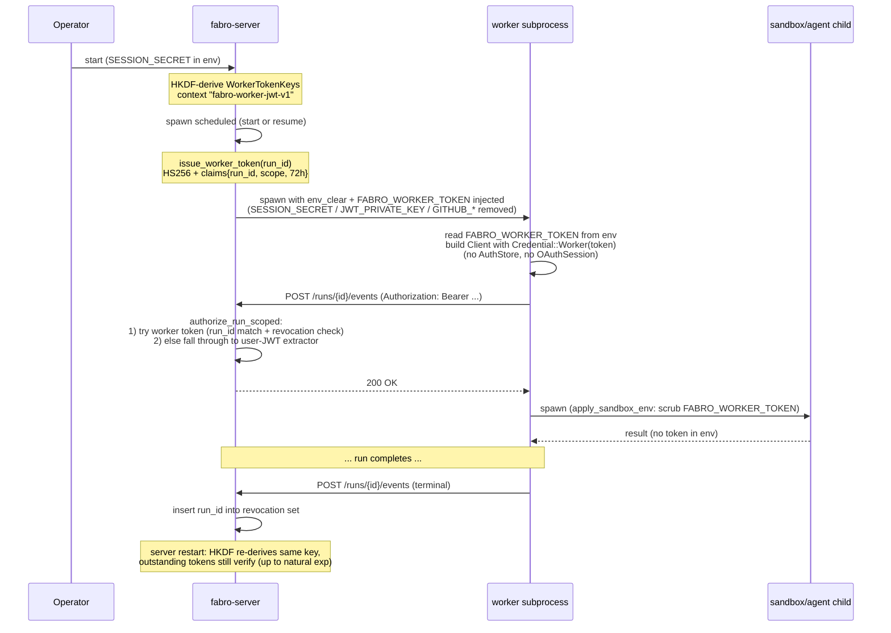

# refactor: Server-issued per-run JWT for worker subprocess auth

## Overview

Server mints one per-run JWT (HS256, 72h, claims include `run_id`) at every worker subprocess spawn, passes it to the worker via the `FABRO_WORKER_TOKEN` env var, and every run-scoped route accepts it. Worker stops reading `~/.fabro/auth.json`. Existing artifact-upload-token mechanism is folded into the new worker token (one credential covers all run-scoped routes). End-user auth (dev-token / github) is now strictly orthogonal to worker auth.

## Problem Frame

Workers POST back to the server (events, state, blobs, stage artifacts). Today the worker only authenticates because it inherits the CLI user's OAuth session from `~/.fabro/auth.json` (`fabro-cli/src/server_client.rs:312` → `AuthStore::default()` at `fabro-client/src/auth_store.rs:107`). Side effects:

- (a) worker authenticates *as the user* — events emitted by the worker get user identity, not "system";
- (b) any deployment where the worker doesn't share a home dir with an authenticated CLI user (containerized server, `fabro` system user, remote worker, multi-tenant) silently fails;
- (c) worker auth is implicitly coupled to end-user auth strategy when conceptually independent.

Today's GitHub-only install (`auth.methods = ["github"]`) writes no `FABRO_DEV_TOKEN` and `worker_command` (`server.rs:3836-3845`) injects nothing — the worker has no documented credential at all. Only the home-dir steal makes it work.

The artifact-upload-token mechanism (`server.rs:758`, `server.rs:861`) already proves the right pattern for one route. Generalize it.

## Requirements Trace

- R1. Worker subprocess authenticates to server with a credential the server explicitly issued, not one stolen from the user's home directory.
- R2. Credential is per-run (claim `run_id` must match path `run_id`); cross-run reuse rejected.
- R3. Credential survives server restart up to its natural 72h expiry (no operational events shortening the ceiling).
- R4. Both `start` and `resume` spawn paths re-mint a fresh 72h credential.
- R5. Worker auth works in any deployment topology, including GitHub-only installs with no `~/.fabro/auth.json` on the worker host.
- R6. Worker-emitted events stamped as a system principal (`system:worker`); originator user identity remains discoverable on the run record.
- R7. Run-scoped routes still accept end-user JWTs for non-worker callers (CLI, web UI) — fall-through, not replacement.

## Scope Boundaries

- Out: refresh tokens for workers (decided: hard 72h ceiling per spawn, fresh mint on resume).
- Out: multi-host / remote worker spawning (this plan makes it *possible*, doesn't deliver it).
- Out: changes to end-user auth methods (`ServerAuthMethod::DevToken | Github`).
- Out: any new `RunAuthMethod` variant — worker token bypasses `AuthenticatedSubject` entirely.
- Out: extending `RunSummary` with provenance — originator already on `RunSpec.provenance.subject` and that's enough.
- Out: SSE attach routes (`/runs/{id}/attach`, `/attach`). These are end-user read paths (web UI / CLI tail). The worker is an event *producer*, not consumer; it never calls them. They keep `AuthenticatedService` (user-JWT-only).
- Out: lifecycle endpoints (`/runs/{id}/cancel`, `/pause`, `/unpause`, `/archive`, `/unarchive`, `DELETE /runs/{id}`). The worker has no business invoking these — they remain user-JWT-only and the worker token is explicitly rejected on them (Unit 3).
- Out: any `Display` impl on `Credential::Worker` payload. Plan keeps redacted `Debug` only; do not add `Display`. Token must never be `format!`-able as a side effect.

## Threat Model

State the assumptions explicitly so reviewers and operators can challenge them.

- **Trust boundary:** the server process and any worker subprocess running under the same OS user are mutually trusted. The plan does not provide isolation between workers running as the same UID — a same-UID attacker (or a workflow stage that compromises the worker process) can read `FABRO_WORKER_TOKEN` from `/proc/<pid>/environ` on Linux. Multi-tenant deployments must use per-tenant OS users, per-tenant containers, or per-tenant namespaces for tenant isolation. Cross-run isolation between same-UID workers is NOT a property of this design.
- **`SESSION_SECRET` is the master key.** It signs both user JWTs (via existing `derive_jwt_key` HKDF) and worker JWTs (via new `derive_worker_jwt_key` HKDF, distinct context label). Any leak vector — backup including `server.env`, environment dump in logs, ECS task definition exposure, accidental commit, breadcrumb capture — gives the attacker the ability to mint both kinds of tokens for any user / any run. Operational guidance: store `SESSION_SECRET` in a secrets manager, exclude from logs/Sentry, document a rotation procedure (rotation invalidates ALL outstanding worker tokens AND ALL user sessions — accept as the cost of compromise response). A separate `WORKER_JWT_SECRET` could narrow this — out of scope, called out in Open Questions.
- **Worker token compromise (single run):** an attacker who exfiltrates a single worker token gains read/write on that one run's events/blobs/state for up to 72h or until terminal-status revocation, whichever first. Run-id binding limits cross-run damage. Server-side revocation set narrows the post-completion window (with the caveat in Risks: in-memory revocation does not survive server restart).
- **`SESSION_SECRET` rotation as defense:** rotating `SESSION_SECRET` is the only operator-facing mechanism today to invalidate all outstanding worker tokens. Acceptable for emergency response; not a regular rotation cadence.

## Context & Research

### Relevant Code and Patterns

- `lib/crates/fabro-server/src/server.rs:291-293, 758-826, 828-869` — artifact-upload-token: claims struct, key generation (`OsRng` per boot), mint, "service token first, else user JWT" check (`authorize_artifact_upload`). This is the exact shape of the new worker token, generalized to all run-scoped routes.
- `lib/crates/fabro-server/src/server.rs:3797-3851` — `worker_command`: single spawn site for both `start` and `resume`. Already passes `--artifact-upload-token` via argv. Replace with `--worker-token`.
- `lib/crates/fabro-server/src/server.rs:4760` — `execute_run_subprocess` calls `worker_command` once per spawn; `RunExecutionMode` flows from `start_run` (`server.rs:4385`) and `create_run` (`server.rs:4156`). Single mint site covers both modes.
- `lib/crates/fabro-server/src/auth/keys.rs:41` — `derive_jwt_key(secret: &[u8])` — existing HKDF helper for the user-JWT key. Mirror for worker JWT with distinct context label `b"fabro-worker-jwt-v1"` so worker keys survive server restarts.
- `lib/crates/fabro-cli/src/commands/run/runner.rs:55-125, 239-295` — `__run-worker` entry, `HttpRunStore`, `HttpArtifactUploader`. Only seven server endpoints touched (catalogued below).
- `lib/crates/fabro-cli/src/server_client.rs:51-58, 133-137, 312-335` — `connect_server_target_direct` → `connect_target_api_client_bundle` → `resolve_target_credential` → `AuthStore::default()`. Sole worker caller is `runner.rs:66`. Can be replaced for worker only via a sibling constructor.
- `lib/crates/fabro-client/src/credential.rs:6-30` — `Credential` enum. Add `Worker(String)` variant; `bearer_token()` returns the string.
- `lib/crates/fabro-types/src/run_event/mod.rs:29-81` — `ActorRef`/`ActorKind { User | Agent | System }`. No new variant needed — stamp worker events with `ActorKind::System`.
- `lib/crates/fabro-types/src/run.rs:34-49, 68` — `RunProvenance`/`RunSubjectProvenance` already on `RunSpec`. Originator preserved at run-creation time; no schema change.
- `lib/crates/fabro-workflow/src/event.rs:1340-1493, 2580-2603` — `stored_event_fields`/`to_run_event_at`: where `actor` is set on emitted events. Today most worker events ship `actor: None`; lifecycle events get user actor server-side; agent events get `ActorKind::Agent`. Default-fill at conversion time is the surgical change.

### Worker → server endpoint surface (the surface that needs `authorize_run_scoped`)

| Worker call | HTTP | Path | Server handler | Auth today |
|---|---|---|---|---|
| `client.get_run_state` | GET | `/runs/{id}/state` | `get_run_state` (`server.rs:5179`) | `AuthenticatedService` |
| `client.list_run_events` | GET | `/runs/{id}/events` | `list_run_events` (`server.rs:5249`) | `AuthenticatedService` |
| `client.append_run_event` | POST | `/runs/{id}/events` | `append_run_event` (`server.rs:5199`) | `AuthenticatedService` |
| `client.write_run_blob` | POST | `/runs/{id}/blobs` | `write_run_blob` (`server.rs:5455`) | `AuthenticatedService` |
| `client.read_run_blob` | GET | `/runs/{id}/blobs/{blobId}` | `read_run_blob` (`server.rs:5482`) | `AuthenticatedService` |
| `client.upload_stage_artifact_file` | POST | `/runs/{id}/stages/{stageId}/artifacts` (octet-stream) | `put_stage_artifact` (`server.rs:5941`) | `authorize_artifact_upload` |
| `client.upload_stage_artifact_batch` | POST | same path (multipart) | same handler | same |

### Coordination with concurrent plans

- `docs/plans/2026-04-22-003-refactor-lock-down-server-secrets-plan.md` partially landed: `apply_worker_env` exists at `lib/crates/fabro-server/src/spawn_env.rs:22` and is already invoked from `worker_command` at `server.rs:3835`. The allowlist keeps `HOME`, so the env scrub alone does NOT fix the OAuth-from-disk steal. This plan is the worker-side fix. Per the user's "share" decision, both `apply_worker_env` (server-side) and the new `apply_sandbox_env` (worker-side) move into `fabro-util` so they share a single denylist constant — coordinate with whatever else of `2026-04-22-003` is still in flight.
- `docs/plans/2026-04-19-003-feat-cli-auth-login-plan.md` Unit 8 created `lib/crates/fabro-server/src/auth/jwt.rs` (`Claims`, `issue`, `verify`, `JwtError`) and `auth/keys.rs::derive_jwt_key`. Reuse the HKDF derivation pattern (distinct context label) and the `jsonwebtoken` primitives directly — do not route worker-token claims through user-`JwtSubject`.
- `docs/plans/2026-04-20-001-fix-cli-server-same-host-assumptions-plan.md` deliberately closed the "trust local files because same host" pattern. This plan preserves that closure — no new same-host exceptions; the worker uses an explicitly-passed token.

### Institutional Learnings

- No `docs/solutions/` directory exists. Prior decisions live in `docs/plans/` (see above).
- Artifact-upload-token TTL precedent is 24h (`server.rs:293`). New worker-token TTL is 72h (3× expansion) — justified because worker tokens must survive long human-in-the-loop pauses and there's no in-process refresh.

## Key Technical Decisions

| Decision | Rationale |
|---|---|
| Replace artifact-upload-token entirely; one JWT per run covers all run-scoped routes | Two parallel per-run JWTs is bookkeeping. Run-id binding gives the same blast-radius constraint without a separate scope. |
| Pass JWT to worker via env var `FABRO_WORKER_TOKEN`, NOT CLI arg | Symmetric with existing `FABRO_DEV_TOKEN` re-injection model (`worker_command` at `server.rs:3836-3845`). Plays naturally with the `env_clear` + explicit re-injection model in `2026-04-22-003`. Avoids token strings in `ps` output. |
| HS256, key derived from `SESSION_SECRET` via HKDF (context `b"fabro-worker-jwt-v1"`) | Workers must survive server restarts up to natural 72h expiry. `OsRng`-per-boot (artifact-upload precedent) defeats the long TTL. Distinct context label keeps it isolated from the user-JWT key. Operator rotation of `SESSION_SECRET` invalidates outstanding worker tokens — accepted. |
| 72h TTL, no refresh | Decided by user. Long-paused runs need a generous outer ceiling. Resume re-mints. Workers running > 72h continuously fail loudly — acceptable outer bound. |
| Per-run `run_id` claim, path-vs-claim check | Mirrors `maybe_authorize_artifact_upload_token`. Cross-run reuse → 403. |
| Add `Credential::Worker(String)` variant (not reuse `DevToken`) | Debug printing stays accurate; type lets us prove "worker code only constructs `Worker`" structurally. |
| New worker-only client constructor `connect_server_target_with_bearer(target, token)`, bypasses `AuthStore`/`OAuthSession` entirely | Worker should never read user OAuth. Surgical to fix at the worker callsite (one caller, `runner.rs:66`) rather than gating `resolve_target_credential` with a "are you a worker" flag. |
| Worker default-fills `actor` on emitted events to `ActorRef { kind: System, id: Some("worker"), display: Some("system:worker") }` only when variant doesn't already set it | Lifecycle events keep user actor (set server-side at the lifecycle endpoint, not by worker). Agent events keep `ActorKind::Agent`. Surgical change in `to_run_event_at`. |
| `authorize_run_scoped(parts, state, run_id)` is the single helper for all worker-touched routes | Replaces five `_auth: AuthenticatedService` extractors and the existing `authorize_artifact_upload`. One helper, one fall-through behavior. |
| Delete artifact-upload-token mechanism atomically (no transition period) | Single-server, single-codebase change. No external consumers of the old token shape. In-flight workers survive deploy via user-JWT fall-through (they hold OAuth from `auth.json`); only newly-spawned post-deploy workers exercise the new contract — those start cleanly. Atomic swap. |
| Server-only secrets (`SESSION_SECRET`, `FABRO_JWT_PRIVATE_KEY`, `GITHUB_APP_*`) must NOT leak to the worker process | **Already structurally mitigated**: `apply_worker_env` at `spawn_env.rs:22` does `env_clear` + an 8-name allowlist that excludes all of these. `worker_allowlist_is_fail_closed` test (`spawn_env.rs:80-113`) asserts `SESSION_SECRET` doesn't leak. Without this protection, an inherited `SESSION_SECRET` would let the worker derive `WorkerTokenKeys` locally and mint tokens for any run — defeating per-run binding. Verification: extend the existing fail-closed test to also assert `FABRO_JWT_PRIVATE_KEY`, `FABRO_JWT_PUBLIC_KEY`, `GITHUB_APP_PRIVATE_KEY`, `GITHUB_APP_CLIENT_SECRET`, `GITHUB_APP_WEBHOOK_SECRET` don't leak. |
| Server-side per-run revocation set populated when run reaches terminal status | 72h compromise window is severe under the multi-tenant threat model. In-memory `DashSet<RunId>` checked in `authorize_worker_token` cuts post-completion blast radius to zero without changing the TTL ceiling. ~10 lines. |
| Worker-side env scrubbing via single chokepoint helper, not per-call `env_remove` | Per-call rots: every new spawn site forgets. Codebase already uses chokepoint pattern in `LocalSandbox::execute` (allowlist + suffix filter). Mirror with `fabro-sandbox/src/spawn_env.rs::apply_sandbox_env(&mut Command)`, route remaining unscrubbed sites through it. `LocalSandbox::execute`'s incidental `_token`-suffix filter already catches `FABRO_WORKER_TOKEN` today — make that explicit (denylist entry, not coincidence). |
| Worker exits with distinct non-zero code (`78` / `EX_NOPERM`) on missing/rejected `FABRO_WORKER_TOKEN`; emits `tracing::error!(target = "worker_auth", ...)` | Lets operators distinguish auth failures from generic crashes during deploy windows. Today all worker exit codes look identical at the server. |

### Worker-token vs artifact-upload-token (delta)

| Property | Artifact-upload-token (today) | Worker-token (new) |
|---|---|---|
| Coverage | One route (`/runs/{id}/stages/{stageId}/artifacts`) | All run-scoped routes the worker hits |
| TTL | 24h | 72h |
| Signing key | `OsRng` at server boot, in-memory only | HKDF from `SESSION_SECRET`, context `b"fabro-worker-jwt-v1"` |
| Survives server restart | No | Yes (up to natural expiry) |
| Issuer string | `"fabro-server-artifact-upload"` | `"fabro-server-worker"` |
| Scope claim | `"stage_artifacts:upload"` | `"run:worker"` |
| Passed to worker | `--artifact-upload-token` argv | `FABRO_WORKER_TOKEN` env var |
| Worker uses it as | Per-call method arg on the client | Client's bearer for every server call |

## Open Questions

### Resolved During Planning

- TTL: 72h (user). Refresh: none in-process; fresh mint at every spawn (start AND resume).
- Key derivation: HKDF from `SESSION_SECRET` with context `b"fabro-worker-jwt-v1"` (user, this session).
- Replace artifact-upload-token entirely vs. keep both: replace (user, this session).
- New `RunAuthMethod::Worker` variant: no — worker token bypasses `AuthenticatedSubject` entirely.
- Stamp worker events server-side vs. worker-side: worker-side, in a dedicated `SystemWorkerActorSink` wrapper inside the worker's `RunEventSink::fanout` chain (NOT in the shared `to_run_event_at` converter, which is also called server-side). Keeps the converter pure (passthrough semantics preserved) and avoids mis-stamping server-emitted events.

### Deferred to Implementation

- Exact module name for new server-side worker-token machinery — likely `fabro-server/src/worker_token.rs`, decide at implementation.
- Exact name of the new `Credential::Worker` variant on `fabro-client` — `Worker` likely, confirm against existing naming when implementing.
- Whether to enforce "worker module never imports `AuthStore`" structurally (clippy `disallowed_types` on the `commands::run` module). Nice-to-have; defer.
- Mechanism for the compile-time "no `Display` for `Credential::Worker`" guard — `static_assertions::assert_not_impl_any!` is the natural fit, but choose at implementation time based on whether the crate already pulls that dep.
- Reaper for the in-memory revocation set — defer; entries are bounded by terminal-state runs and process lifetime is the natural reaper. Add only if real workloads show unbounded growth.
- Core dump disable (`setrlimit(RLIMIT_CORE, 0)`) on the worker process to prevent token capture in crash dumps. Same-UID attacker assumption holds today; nice-to-have, defer.
- Centralizing terminal-status writes through a single `mark_run_terminal(run_id, status)` chokepoint that both writes the status AND inserts into the revocation set (instead of grep-and-wire-by-hand). Cleaner, more auditable; defer pending implementation discovery of how dispersed the current writes are.
- Whether `WORKER_JWT_SECRET` should be a separate operator-rotated secret (narrower than `SESSION_SECRET`) — defer; the SESSION_SECRET-as-master-key design is acceptable for the current threat model per Threat Model section, but the gap is documented for follow-up.

### Decisions surfaced by review (resolved)

- **Revocation persistence:** **document the gap, accept for now (option c).** In-memory revocation set, lost on restart. Combined with HKDF-derived signing key surviving restart, this leaves a known re-enablement window for tokens of completed runs across restarts. Documented in Risks and System-Wide Impact. Follow-up plan can add persistence if multi-tenant production demand surfaces it.
- **Multi-token-per-run on rapid pause/resume:** **accept and document (option c).** Each resume mints a fresh 72h token; prior tokens stay valid up to natural `exp` or run terminal status. Multiplied compromise window is bounded by run-id (still scoped to one run). Documented in Risks. Follow-up plan can add per-spawn nonce if it becomes a real problem.
- **Clippy lint extension to `tokio::process::Command::new`:** **no.** Do not extend the lint. Tokio-Command sites rely on code-review discipline to use `apply_sandbox_env`. Plan keeps `clippy.toml`'s existing `std::process::Command::new` denial only.
- **Share `apply_sandbox_env` / `apply_worker_env`:** **share.** Place the helper in `fabro-util` (or a new dedicated crate if `fabro-util` becomes too dumping-ground), expose two thin wrappers — `fabro_util::process::apply_worker_env` (server-side, used by `worker_command`) and `fabro_util::process::apply_sandbox_env` (worker-side, used by all worker-reachable spawn sites). Both call the same underlying scrub function with the same denylist constant. Coordinate with `2026-04-22-003` Unit 3 — whichever plan lands first creates the helper; the other plan adds the second wrapper.
- **Line-number drift in plan references:** addressed in this revision pass.

## High-Level Technical Design

> *This illustrates the intended approach and is directional guidance for review, not implementation specification. The implementing agent should treat it as context, not code to reproduce.*

## Implementation Units

- [ ] **Unit 1: Worker JWT primitives (claims, keys, mint)**

**Goal:** Server can mint a per-run worker JWT signed with a key derived from `SESSION_SECRET`. No callers yet.

**Requirements:** R2, R3.

**Dependencies:** None.

**Files:**
- Create: `lib/crates/fabro-server/src/worker_token.rs`
- Modify: `lib/crates/fabro-server/src/auth/keys.rs` (add `derive_worker_jwt_key`)
- Modify: `lib/crates/fabro-server/src/lib.rs` (module declaration)
- Modify: `lib/crates/fabro-server/src/server.rs` (`AppState` field for `WorkerTokenKeys`, construction in `build_app_state`)
- Test: `lib/crates/fabro-server/src/worker_token.rs` (unit tests inline)

**Approach:**
- Constants: `WORKER_TOKEN_ISSUER = "fabro-server-worker"`, `WORKER_TOKEN_SCOPE = "run:worker"`, `WORKER_TOKEN_TTL_SECS = 72 * 60 * 60`.
- `WorkerTokenClaims { iss, iat, exp, run_id, scope, jti }` — mirrors `ArtifactUploadClaims` plus a `jti` (random 128-bit hex) claim. `jti` enables per-token audit correlation in the future and lets logs distinguish two tokens minted for the same run (start vs resume) without leaking the token itself.
- `WorkerTokenKeys { encoding, decoding, validation }` — mirrors `ArtifactUploadTokenKeys`. Built from a 32-byte HKDF output keyed by `SESSION_SECRET`, context `b"fabro-worker-jwt-v1"`.
- `pub fn issue_worker_token(keys: &WorkerTokenKeys, run_id: &RunId) -> Result<String, ApiError>` — `jsonwebtoken::encode` with HS256.
- Add `worker_tokens: WorkerTokenKeys` field on `AppState` next to `artifact_upload_tokens` (keep both during this unit; the artifact field is deleted in Unit 3).
- `derive_worker_jwt_key(secret: &[u8]) -> [u8; 32]` in `auth/keys.rs` — same HKDF construction as `derive_jwt_key`, distinct `info` parameter.

**Patterns to follow:**
- `server.rs:291-293, 322-329, 758-780, 813-826` (artifact-upload-token, end-to-end).
- `auth/keys.rs:41` (`derive_jwt_key` HKDF construction).

**Test scenarios:**
- Happy path: `issue_worker_token` produces a token; `jsonwebtoken::decode` with the same `WorkerTokenKeys` returns the expected `WorkerTokenClaims` (iss, scope, run_id).
- Edge case: token issued with `WorkerTokenKeys` derived from secret S verifies under a *fresh* `WorkerTokenKeys` derived from the same S — proves restart survival (R3).
- Edge case: token issued under secret S1 fails to verify under keys derived from secret S2 (rotation invalidation).
- Edge case: derivation context label `b"fabro-worker-jwt-v1"` produces a key materially different from `derive_jwt_key(secret)` (no accidental cross-acceptance with user JWTs).

**Verification:**
- All worker-token unit tests pass.
- `cargo build -p fabro-server` succeeds.
- No production callers of new symbols yet — Unit 1 is purely additive infrastructure.

---

- [ ] **Unit 2: Server `authorize_run_scoped` helper (with revocation) + client `Credential::Worker` variant**

**Goal:** Single server-side helper accepts worker token (run-id-bound, not revoked) OR falls back to user JWT. Client crate gains a typed worker credential with no `Display` and redacted `Debug`.

**Requirements:** R2, R7.

**Dependencies:** Unit 1.

**Files:**
- Modify: `lib/crates/fabro-server/src/worker_token.rs` (add `authorize_worker_token`, `authorize_run_scoped`, `RevokedRunSet`)
- Modify: `lib/crates/fabro-server/src/server.rs` (`AppState` field for `revoked_runs: RevokedRunSet`; populate in run-terminal-status sites)
- Modify: `lib/crates/fabro-server/src/lib.rs` (re-export `authorize_run_scoped` if needed)
- Modify: `lib/crates/fabro-client/src/credential.rs` (add `Worker(String)` variant — no `Display`)
- Test: `lib/crates/fabro-server/src/worker_token.rs` (authorize helper tests inline)
- Test: `lib/crates/fabro-client/src/credential.rs` (Debug + bearer_token tests inline)

**Approach:**
- `authorize_worker_token(parts: &Parts, state: &AppState, run_id: &RunId) -> Result<bool, ApiError>` — mirror `maybe_authorize_artifact_upload_token` (`server.rs:828-859`): on decode fail return `Ok(false)`; on scope mismatch / run_id mismatch / `state.revoked_runs.contains(run_id)` return `Err(ApiError::forbidden())`; on success `Ok(true)`.
- `pub fn authorize_run_scoped(parts: &Parts, state: &AppState, run_id: &RunId) -> Result<(), ApiError>` — mirror `authorize_artifact_upload` (`server.rs:861-869`): try worker token first, else `authenticate_service_parts(parts)`.
- `RevokedRunSet` — wraps `Arc<DashSet<RunId>>` (or equivalent concurrent set). Bounded by terminal-state runs; entries can age out via a periodic reaper or simply persist for the process lifetime (simpler; bounded memory unless workload is pathological — defer reaper to a follow-up).
- Wire revocation insertion at every site that transitions a run to a terminal status (find via grep for `RunStatus::Succeeded | Failed | Cancelled` writes in `fabro-server` and `fabro-workflow`-reduced events on the server side).
- `Credential::Worker(String)` — `bearer_token() -> &str` returns the string; `Debug` prints `Credential::Worker(<redacted>)`. **Do NOT implement `Display`.** Compile-time hardening.
- **Audit logging at authorize time:** on successful worker-token auth, emit `tracing::info!(target = "worker_auth", run_id = %run_id, jti = %claims.jti, "worker token accepted")`. On rejection (wrong run_id, wrong scope, revoked, bad signature), emit `tracing::warn!(target = "worker_auth", reason = %rejection_reason, "worker token rejected")`. Never log the token string itself — only `jti`. Supports incident response: operators can correlate accepted/rejected tokens to specific runs without a token database.

**Patterns to follow:**
- `server.rs:828-869` (artifact-upload-token authorize pattern).
- `fabro-client/src/credential.rs:6-40` (existing `DevToken`/`OAuth` variants).

**Test scenarios:**
- Happy path (server): valid worker token for path run_id → `authorize_run_scoped` returns `Ok(())`.
- Error path (server): worker token with `claims.run_id != path.run_id` → 403.
- Error path (server): worker token with wrong scope → 403.
- Error path (server): expired worker token → falls through to user-JWT path (returns false from worker check), and user-JWT extractor then rejects → 401.
- Error path (server): bad signature → falls through to user-JWT path; user-JWT also rejects → 401.
- Error path (server): `alg=none` JWT → rejected (validation requires HS256).
- Error path (server, revocation): valid token but `run_id` in `revoked_runs` set → 403. Insert run_id into set, then re-attempt with a fresh-issued token for the same run → 403.
- Integration (server): no `Authorization` header → falls through to user-JWT extractor → 401 (no implicit acceptance).
- Integration (server): valid user JWT, no worker token → user-JWT path accepts (R7).
- Happy path (client): `Credential::Worker(s).bearer_token()` returns `s`.
- Edge case (client): `Debug` impl prints `Credential::Worker(<redacted>)` — token string never appears in debug output.
- Compile-time guard (client): assert `Credential::Worker` does not implement `Display` (e.g. via a `static_assertions::assert_not_impl_any!` or equivalent — defer exact mechanism to implementation, but the test must exist).

**Verification:**
- All `authorize_run_scoped` tests pass with both branches and revocation exercised.
- `cargo nextest run -p fabro-server -p fabro-client` succeeds.

---

- [ ] **Unit 3: Wire all run-scoped routes through `authorize_run_scoped`; replace artifact-upload-token at the spawn**

**Goal:** Every endpoint the worker hits accepts the worker token. Server spawn passes `--worker-token`. Old artifact-upload-token machinery deleted atomically.

**Requirements:** R1, R2, R4, R7.

**Dependencies:** Unit 1, Unit 2.

**Files:**
- Modify: `lib/crates/fabro-server/src/server.rs`
  - Replace `_auth: AuthenticatedService` with explicit `authorize_run_scoped(&parts, &state, &id)?` call inside handler bodies for: `get_run_state` (5162), `list_run_events` (5232), `append_run_event` (5182), `write_run_blob` (5438), `read_run_blob` (5465). Add `parts: Parts` extractor where needed.
  - `put_stage_artifact` (5924): swap `authorize_artifact_upload` → `authorize_run_scoped`.
  - `worker_command` (3797-3851): replace `state.issue_artifact_upload_token` → `state.issue_worker_token`. Drop the `--artifact-upload-token <jwt>` arg entirely. Set `cmd.env("FABRO_WORKER_TOKEN", token)` unconditionally (always, regardless of auth method). Also `cmd.env_remove("FABRO_WORKER_TOKEN")` before re-injection (defense against parent-env leakage). Delete the conditional `cmd.env("FABRO_DEV_TOKEN", token)` block (3836-3845) and the preceding `cmd.env_remove("FABRO_DEV_TOKEN")` (keep an unconditional `env_remove` if Unit 3 of `2026-04-22-003` hasn't landed yet — coordinate; once `apply_worker_env` lands, `FABRO_WORKER_TOKEN` becomes the only authority-bearing re-injection).
  - `worker_command`: ensure `SESSION_SECRET`, `FABRO_JWT_PRIVATE_KEY`, `FABRO_JWT_PUBLIC_KEY`, `GITHUB_APP_PRIVATE_KEY`, `GITHUB_APP_CLIENT_SECRET`, `GITHUB_APP_WEBHOOK_SECRET` are all stripped from the worker env. The existing `apply_worker_env` at `spawn_env.rs:22` (already wired in at `server.rs:3835`) does `env_clear` + allowlist, so as long as the allowlist excludes these names (verify), they're already structurally absent. Add explicit `env_remove`s as belt-and-suspenders only if the audit reveals any leak. **Critical context**: without these strips, an inherited `SESSION_SECRET` lets the worker derive `WorkerTokenKeys` locally and mint tokens for any run. Verify allowlist excludes them — this is the highest-impact verification in the plan.
  - **Lifecycle/admin routes**: enumerate the routes the worker token must NOT reach and confirm none of them call `authorize_run_scoped` (they keep `_auth: AuthenticatedSubject` / `AuthenticatedService` directly): `cancel_run`, `pause_run`, `unpause_run`, `archive_run`, `unarchive_run`, `delete_run`, `submit_answer` (interview answers are end-user actions), `start_run`/`create_run`. Add a one-line code comment at each such handler: "// Worker token intentionally not accepted; this is a user/admin action."
  - Delete: `ARTIFACT_UPLOAD_TOKEN_*` constants (290-292), `ArtifactUploadClaims` (322-329), `ArtifactUploadTokenKeys` (315-320), `artifact_upload_token_keys` (813-826), `AppState::issue_artifact_upload_token` (758-780), `AppState::artifact_upload_tokens` field (568), `maybe_authorize_artifact_upload_token` (827-858), `authorize_artifact_upload` (860-869).
- Test: existing tests in `lib/crates/fabro-server/src/server.rs` test module (rename / replace `worker_command_injects_dev_token_only_when_enabled` at 7911).

**Approach:**
- All handler signature changes are mechanical: `_auth: AuthenticatedService` → take `parts: Parts` (or use `axum::extract::Request` + `into_parts`), call `authorize_run_scoped(&parts, &state, &id)?` near the top of the body.
- Atomic swap, no transition period — cargo + tests catch any missed callsite.
- **Pre-implementation audit (must run BEFORE coding starts):**
  1. Grep all `client.*` and `api.*` callsites under `lib/crates/fabro-cli/src/commands/run/` (and any helpers it transitively uses) → confirm each resolves to a server handler in the worker-touched table above. Adds rows for any newly-discovered handlers (e.g. heartbeat, status report) and wires them through `authorize_run_scoped`.
  2. Grep all internal repos and `docs/api-reference/fabro-api.yaml` for `artifact-upload-token`, `artifact_upload_token`, `--artifact-upload-token`, and `stage_artifacts:upload`. Document zero hits in the PR description before merging. If any external consumer exists, add a deprecation cycle instead of atomic delete.
- **Structural rule:** `authorize_run_scoped` is invoked ONLY from handlers whose path contains `{id}` (`RunId`). Never invoke from non-run-scoped routes (list endpoints, admin endpoints). Verify by grep: every `authorize_run_scoped` callsite must be preceded by a path-extracted `RunId`.

**Patterns to follow:**
- `put_stage_artifact` handler (`server.rs:5941`) is the existing model: takes `parts: Parts`, calls `authorize_artifact_upload(&parts, &state, &id)?`.

**Test scenarios:**
- Happy path: each of the 5 newly-wired routes accepts a worker token whose `claims.run_id` matches the path `id` → expected response.
- Error path: each route with worker token whose `claims.run_id` ≠ path `id` → 403.
- Integration: each route with valid user JWT and no worker token → still works (R7 fall-through).
- Replacement test for `worker_command_injects_dev_token_only_when_enabled`: rename to `worker_command_always_sets_worker_token_env`. Build `worker_command` for both `methods=["github"]` and `methods=["dev-token"]` settings; assert `FABRO_WORKER_TOKEN` env is set to a valid token in BOTH cases (no longer conditional on auth method). Assert `FABRO_DEV_TOKEN` env is NOT set in either case. Assert no `--artifact-upload-token` or `--worker-token` arg appears in argv (env-only).
- Edge case (server secrets stripped): extend the existing `worker_allowlist_is_fail_closed` test (`spawn_env.rs:80-113`, currently asserts `SESSION_SECRET` and `MY_API_KEY` don't leak) to ALSO assert `FABRO_JWT_PRIVATE_KEY`, `FABRO_JWT_PUBLIC_KEY`, `GITHUB_APP_PRIVATE_KEY`, `GITHUB_APP_CLIENT_SECRET`, `GITHUB_APP_WEBHOOK_SECRET` don't leak. Critical: prevents the worker-mints-any-token escalation. The existing structure (env_clear + allowlist) already provides this; the test just needs to enumerate the additional names so future allowlist edits can't silently add them back.
- Negative path (route enumeration): for each lifecycle/admin route (`cancel_run`, `pause_run`, `unpause_run`, `archive_run`, `unarchive_run`, `delete_run`, `submit_answer`), assert that presenting a valid worker token for the same `run_id` is rejected (handler still requires user JWT). Use the existing JWT-extractor test pattern (`jwt_auth.rs::valid_jwt_bearer_authenticates_with_identity` shape) as a model.
- Negative path (SSE attach + non-run-scoped): assert a worker token is rejected on `/runs/{id}/attach`, `/attach`, `GET /runs` (list), `GET /usage`, `GET /sessions`, and any other non-run-scoped route discovered by the structural-rule grep above. Documents that worker authority does not bleed into list/admin surfaces.
- Audit logging: assert that successful auth emits a `target = "worker_auth"` info span with `run_id` and `jti`; assert that rejection emits a `warn` span with `reason`. Use a tracing test subscriber. Confirms incident-response observability.
- Edge case: assert deleted symbols (`ArtifactUploadClaims`, `authorize_artifact_upload`, etc.) no longer exist — covered implicitly by `cargo build`.

**Verification:**
- `cargo build --workspace` succeeds (no references to deleted artifact-upload-token symbols).
- `cargo nextest run -p fabro-server` passes.
- Server test for `worker_command` confirms `--worker-token` always present, `FABRO_DEV_TOKEN` never set.

---

- [ ] **Unit 4: Worker (CLI) — use injected worker token from env, stop reading `AuthStore`**

**Goal:** Worker subprocess reads its credential from `FABRO_WORKER_TOKEN` env at startup, uses it as its sole bearer for every server call, never constructs `AuthStore::default()`. Artifact uploads use the same client credential.

**Requirements:** R1, R5.

**Dependencies:** Unit 2 (`Credential::Worker` variant), Unit 3 (server sets `FABRO_WORKER_TOKEN` env on the worker subprocess).

**Files:**
- Modify: `lib/crates/fabro-cli/src/args.rs:815` — DELETE the `artifact_upload_token: Option<String>` field on `RunWorkerArgs`. Do NOT add a replacement clap arg — the worker reads from env directly.
- Modify: `lib/crates/fabro-cli/src/commands/run/mod.rs:88-100` — drop the `artifact_upload_token` plumbing on the dispatch path.
- Modify: `lib/crates/fabro-cli/src/server_client.rs` — add `pub(crate) async fn connect_server_target_with_bearer(target: &ServerTarget, bearer: &str) -> Result<Client>`. Builds `Client` with `.credential(Credential::Worker(bearer.to_owned()))`, no `oauth_session`, no `resolve_target_credential` call, no `AuthStore` access.
- Modify: `lib/crates/fabro-cli/src/commands/run/runner.rs`
  - At top of `execute`: read `FABRO_WORKER_TOKEN` from env via `std::env::var` and **immediately wrap in a `WorkerToken(SecretString)` newtype** (using `secrecy::SecretString` or a local equivalent: redacted `Debug`, no `Display`, no `Deref<Target=String>`). Never let the raw `String` escape the read site. Validate non-empty; bail with a clear error mentioning `FABRO_WORKER_TOKEN` if missing or empty. Drop `artifact_upload_token` from `execute`'s signature.
- Modify: `lib/crates/fabro-util/src/exit.rs` — add `ExitClass::WorkerAuthRequired` mapping to integer `78` (`EX_NOPERM`). The runner's missing-token error is classified as this variant via `.classify(ExitClass::WorkerAuthRequired)` so the existing `exit_code_for` mapper produces 78 cleanly. Avoids a divergent `std::process::exit` path that would bypass the runner's tracing/JSON-output flow.
  - Line 66: replace `connect_server_target_direct(&server)` with `connect_server_target_with_bearer(&target, &worker_token)`.
  - Lines 76-80: build the artifact uploader without a separate `bearer_token` field — the client already carries the credential.
  - Delete `MissingArtifactUploadTokenUploader` (298-315) and the `match artifact_upload_token { Some/None }` fork (244-251); always construct `HttpArtifactUploader`.
  - `HttpArtifactUploader`: drop the `bearer_token: String` field; `upload_stage_artifacts` no longer threads a per-call bearer.
- Modify: `lib/crates/fabro-client/src/client.rs:1053, 1091` — `upload_stage_artifact_*` no longer takes `bearer_token` parameter; uses the client's credential. (Confirm signature change is workable; if the client API forces per-call bearer for legacy reasons, leave the parameter and pass `client.credential().bearer_token()` from the worker side instead.)
- Modify: `runner::execute` exits with code `78` (`EX_NOPERM`) via `ExitClass::WorkerAuthRequired` when `FABRO_WORKER_TOKEN` is missing or invalid; emits `tracing::error!(target = "worker_auth", ...)` so operators can grep for it. Distinct from generic crash exits.
- Compile-time guards on `WorkerToken`: `static_assertions::assert_not_impl_any!(WorkerToken: Display, std::fmt::Display)` (or equivalent) — token cannot be `format!`-ed by accident. Test asserts `format!("{:?}", worker_token)` contains no substring of the actual token.

**Child-process env scrub (chokepoint pattern, NOT per-call):**

The codebase already has a chokepoint at `LocalSandbox::execute` (`lib/crates/fabro-sandbox/src/local.rs:223-242`): `env_clear` + `should_filter_env_var` heuristic with safelist + suffix denylist. `FABRO_WORKER_TOKEN` is incidentally caught by the `_token` suffix filter today — make this explicit (denylist entry, not coincidence). Then add a sibling helper for the unscrubbed sites.

- Modify: `lib/crates/fabro-sandbox/src/local.rs:43-66` — add `"FABRO_WORKER_TOKEN"` (and `SESSION_SECRET`, `FABRO_JWT_PRIVATE_KEY`, `FABRO_JWT_PUBLIC_KEY`, `GITHUB_APP_PRIVATE_KEY`, `GITHUB_APP_CLIENT_SECRET`, `GITHUB_APP_WEBHOOK_SECRET`) to an explicit denylist alongside the suffix heuristic. Comment why: future rename like `FABRO_WORKER_AUTH` would silently leak under the suffix heuristic alone.
- Create or extend: `lib/crates/fabro-util/src/process.rs` (new module) exposing both `pub fn apply_worker_env(cmd: &mut Command)` (server-side, used by `worker_command`) AND `pub fn apply_sandbox_env(cmd: &mut Command)` (worker-side, used by spawn sites below). Both call the same underlying scrub against the same denylist constant. **Shared with `2026-04-22-003`** — whichever plan lands first creates the module; the other adds the second wrapper. The denylist constant lives here too, single source of truth for "secret env names that must not leak across the worker boundary." Both `tokio::process::Command` and `std::process::Command` supported (the function takes a trait or has two overloads).
- Modify: route the following unscrubbed worker-reachable spawn sites through `apply_sandbox_env`:
  - `lib/crates/fabro-sandbox/src/local.rs:334, 355, 504` — `rg`, `grep`, `uname`.
  - `lib/crates/fabro-workflow/src/git.rs:35` (`git_cmd` helper — single chokepoint for git lines `342, 347, 414`).
  - `lib/crates/fabro-workflow/src/transforms/file_inlining.rs:124, 129` — git invocations.
  - `lib/crates/fabro-workflow/src/sandbox_git.rs` — production git sites (skip `#[cfg(test)]` blocks at 800-1053).
  - `lib/crates/fabro-workflow/src/pipeline/initialize.rs:417` — devcontainer `initializeCommand` (`sh -c`).
  - `lib/crates/fabro-devcontainer/src/features.rs:67, 80, 113, 150, 199` — `which`, `brew`, `sh -c curl|tar`, `tar`, `oras pull`.
  - `lib/crates/fabro-mcp/src/client.rs:47` — stdio MCP server subprocess.
  - `lib/crates/fabro-github/src/lib.rs:129` — `gh auth token`.
  - `lib/crates/fabro-hooks/src/executor.rs:187` — non-sandbox hook `sh -c`.
- Note: `fabro-agent` constructs zero `Command`s (all exec routes through `Sandbox::exec_command`). Fixing `LocalSandbox` covers the entire agent surface.
- Note: existing `clippy.toml` denies `std::process::Command::new` workspace-wide but does NOT deny `tokio::process::Command::new`. Most worker-reachable spawn sites use tokio Command, so the lint nudge is partial — tokio sites rely on code-review discipline to use `apply_sandbox_env`. Decision: do not extend the lint here (out of scope; bigger workspace-wide audit). Code review enforces tokio-side hygiene.

**Approach:**
- `connect_server_target_with_bearer` is the smallest possible surface: it skips the `AuthStore`/`OAuthSession` machinery entirely. The user-facing `connect_server_target` and `connect_server_with_settings` are unchanged.
- The new constructor is the *only* path the worker takes; verify by grep that `commands::run::runner` and `commands::run::mod` are the only modules importing it.

**Patterns to follow:**
- `server_client.rs:80-110` (`connect_managed_unix_socket_api_client_bundle`) for the client-builder shape; new constructor is a stripped-down version.

**Test scenarios:**
- Happy path: `connect_server_target_with_bearer` builds a `Client` whose outgoing requests carry `Authorization: Bearer <worker-token>`.
- Edge case: `connect_server_target_with_bearer` does NOT call `AuthStore::default()` — verify by injecting a `FABRO_AUTH_FILE=/nonexistent` env override and confirming construction succeeds (the helper must not even attempt to read the file).
- Edge case: `connect_server_target_with_bearer` does NOT install an `OAuthSession` (no refresh attempts on 401).
- Integration: `runner::execute` with `FABRO_WORKER_TOKEN=<jwt>` set in env POSTs an event using only the injected token; no fallback to `auth.json`.
- Error path: `runner::execute` invoked without `FABRO_WORKER_TOKEN` in env returns a clear error mentioning the variable name; does NOT silently fall back to user OAuth.
- Edge case: `RunWorkerArgs` no longer has `artifact_upload_token` field — `cargo build` confirms.
- Integration (env hygiene, sandbox path): a workflow stage Bash command `env | grep -E "FABRO_WORKER_TOKEN|SESSION_SECRET|FABRO_JWT_PRIVATE_KEY"` prints empty output. Covers `LocalSandbox::execute` denylist correctness.
- Integration (env hygiene, non-sandbox path): a unit test on `apply_sandbox_env` builds a `Command`, sets the denylist names in the parent test env, calls the helper, then asserts each name is `Removed` in the resulting `Command`'s env overrides.
- Error path (exit code): `runner::execute` invoked with no `FABRO_WORKER_TOKEN` exits with status 78 and emits a `target = "worker_auth"` tracing line. Verify via process spawn in a small integration test.

**Verification:**
- `cargo build --workspace` succeeds.
- `cargo nextest run -p fabro-cli` passes.
- grep for `AuthStore` from `commands/run/` returns no hits.

---

- [ ] **Unit 5: Stamp `system:worker` actor on worker-emitted events**

**Goal:** Events the worker emits without a typed actor get a `system:worker` stamp at the *worker-side sink layer*, not in shared event-conversion infrastructure. User identity stays on the run record (`RunSpec.provenance.subject`), where it already lives.

**Requirements:** R6.

**Dependencies:** Should land WITH the auth changes (Units 1-4), not in isolation. Landing this alone produces a wire-visible behavior change (worker events flip from `actor: None` to `actor: System(worker)`) without the auth context that justifies it. Sequence: land Unit 5 in the same release as Units 1-4 to keep the rationale visible in git history.

**Files:**
- Modify: `lib/crates/fabro-cli/src/commands/run/runner.rs` — install a worker-only sink wrapper in the `RunEventSink::fanout` chain at `runner.rs:100` that default-fills `actor` for events emitted by the worker.
- Test: `lib/crates/fabro-cli/src/commands/run/runner.rs` (test module inline).

**Approach:**
- **Critical: do NOT add the default-fill to `lib/crates/fabro-workflow/src/event.rs::to_run_event_at` or `stored_event_fields`.** Those helpers are shared infrastructure called by both the server (e.g. `server.rs:6805` lifecycle/error event flush via `workflow_event::to_run_event`) AND the worker. Default-filling there mis-stamps server-emitted events as `system:worker`.
- Helper function (not `const` — `ActorRef::id`/`display` are `Option<String>`, heap-allocated, not `const`-constructible): `fn system_worker_actor() -> ActorRef { ActorRef { kind: ActorKind::System, id: Some("worker".to_string()), display: Some("system:worker".to_string()) } }` lives in `runner.rs` (worker-local).
- Wrap `RunEventSink::backend(http_store)` in a `SystemWorkerActorSink` adapter that, before forwarding to the inner sink, applies the rule: **if `event.actor.is_none()`, fill with `system_worker_actor()`** (value-based, not variant-based). Variants like `RunArchived { actor: Some(user_actor) }` keep their actor unchanged because `actor.is_some()`. Variants like worker self-cancel `RunCancelRequested { actor: None }` correctly get the system actor.
- Agent events (`AssistantMessage`) are constructed with `actor: Some(ActorRef::agent(...))` upstream — they retain `ActorKind::Agent` because `actor.is_some()`.

**Patterns to follow:**
- `RunEventSink::fanout` composition (`fabro-workflow/src/event.rs` sink layer) — sink wrappers are the existing pattern for per-deployment behavior.
- Existing actor-stamping for lifecycle events at the server endpoints (`actor_from_subject` at `server.rs:6278`) — server-side stamping for user actions; worker-side wrapper for worker events. Symmetric.

**Test scenarios:**
- Happy path: a stage-execution `RunEvent { actor: None, ... }` flows through `SystemWorkerActorSink` → forwarded event has `actor: Some(ActorRef { kind: System, id: Some("worker"), display: Some("system:worker") })`.
- Edge case: `RunEvent { actor: Some(user_actor), ... }` (e.g. lifecycle event mirrored back) → forwarded event retains the user actor (`actor.is_some()` → no-op).
- Edge case: agent message `RunEvent { actor: Some(ActorKind::Agent), ... }` → forwarded event retains `ActorKind::Agent`.
- Edge case: worker self-cancel `RunEvent { actor: None, body: RunCancelRequested { ... } }` → forwarded event gets `system:worker`. (Catches the variant-vs-value-based bug from earlier draft.)
- Regression: server-side event flush via `workflow_event::to_run_event` (`server.rs:6805`) is unchanged — `to_run_event_at` retains its passthrough semantics. Verify by leaving `to_run_event_at` tests untouched.
- Regression: `create_hydrates_provenance_into_store_state` (`fabro-workflow/src/operations/create.rs:1037`) still passes — originator user identity still on `RunSpec.provenance.subject`.

**Verification:**
- `cargo nextest run -p fabro-workflow` passes.
- New tests for the default-fill and the override-protections both pass.

---

- [ ] **Unit 6: End-to-end regression — github-only worker run with no `~/.fabro/auth.json`**

**Goal:** Lock in the bug fix: a github-only deployment can spawn a worker that completes a run, with no user OAuth artifact present on the worker host.

**Requirements:** R1, R5.

**Dependencies:** Units 1-5.

**Files:**
- Create: an integration test under `lib/crates/fabro-cli/tests/it/cmd/` (existing test scaffolding) — file name per local convention (e.g. `worker_auth.rs` or `cmd/run_worker_auth_test.rs`).

**Approach:**
- Test fixture: server configured with `auth.methods = ["github"]` only; no `FABRO_DEV_TOKEN`; `FABRO_HOME` redirected to a fresh tempdir with no `auth.json`.
- Run a tiny workflow end-to-end via the daemon → worker spawn path.
- Assert the worker successfully POSTs at least one `RunEvent` and the run reaches a terminal status.
- Assert no `auth.json` file is touched (timestamp / non-existence).

**Patterns to follow:**
- Existing integration tests in `lib/crates/fabro-cli/tests/it/cmd/` (per `support.rs` helpers like `daemon.bind.to_target()` at `support.rs:718`).
- CLAUDE.md note: tests must use `.no_proxy()` HTTP clients.

**Test scenarios:**
- Integration: github-only server + no `auth.json` + minimal workflow → run completes successfully; events visible via `GET /runs/{id}/events`.
- Integration: same setup but worker token tampered (e.g. spawn with a manually-replaced bogus token) → worker fails fast on first server call.

**Verification:**
- `cargo nextest run -p fabro-cli --test it` passes the new test.
- Test fails on `main` (pre-Units 1-5) — confirms it covers the regression.

## System-Wide Impact

- **Interaction graph:** Worker subprocess no longer reads `~/.fabro/auth.json`. CLI user-facing commands (`fabro run`, `fabro ps`, `fabro auth`, etc.) unchanged — they still go through `connect_server_target` / `connect_server_with_settings`. SSE attach endpoints (`/runs/{id}/attach`, `/attach`) unchanged: worker is a producer, not a consumer; user-JWT-only auth on those routes preserved.
- **Error propagation:** Worker token expiry mid-run → next server call returns 401, worker exits 78 (`EX_NOPERM`), server marks run failed via existing `pump_worker_*` paths (`server.rs:4880`+). Distinct exit code separates auth failures from generic crashes. Worker token rejected as revoked after run terminal status → 403, same exit path.
- **State lifecycle risks:** Server restart with HKDF-derived key: outstanding worker tokens remain valid up to natural expiry. Server restart with `SESSION_SECRET` rotated: outstanding workers fail at next call (acceptable; matches user-session invalidation). Server-side revocation set is in-memory and lost on restart — combined with token survival across restart, this creates a post-restart re-enablement window for tokens of completed runs. See Risks for mitigation options. The previous draft's claim that revocation "cuts blast radius to zero" was wrong; the honest claim is "cuts post-completion blast radius to zero **between server restarts**."
- **Event sink uniformity:** Worker `RunEventSink::fanout([Store(http), Callback])` (`runner.rs:100`) — default-fill of `actor` happens upstream in `to_run_event_at`, so all sinks (HTTP backend, local callback, future telemetry) see the same `system:worker` actor. No per-sink divergence.
- **API surface parity:** `RunEvent.actor` shape unchanged (`ActorRef` already has `ActorKind::System`); worker-emitted events newly carry `system:worker` instead of `None`. Web UI audit (`apps/fabro-web/app/`) found ZERO references to `actor` or `author` — there's nothing to break or filter today. Risk of UI breakage was overstated in earlier draft; confirmed safe.
- **Worker-process trust degradation:** A workflow stage that compromises the worker process (malicious shell, code injection) gains read access to `FABRO_WORKER_TOKEN` for that worker's lifetime + 72h until natural expiry, *or* until the run reaches terminal status (revocation). Blast radius bounded by run-id claim: only the compromised run's blobs/events/state are accessible. Not cross-run. `SESSION_SECRET` is NOT in the worker's env (Unit 3) so the worker cannot mint cross-run tokens.
- **Integration coverage:** Unit 6 covers github-only-no-auth-store regression; existing CLI integration tests cover dev-token deployments.
- **Unchanged invariants:** End-user auth (dev-token / github) unchanged. `RunAuthMethod` enum unchanged. `RunSpec.provenance` shape unchanged. Webhook auth unchanged. Artifact upload route's behavior from a worker's perspective unchanged (worker still authenticates and uploads — just via the unified token). `OpenAPI` / `fabro-api-client` (TypeScript) DTOs unchanged.

## Risks & Dependencies

| Risk | Mitigation |
|------|------------|
| Worker process inherits `SESSION_SECRET` → can mint tokens for any run, defeating per-run binding | Unit 3 explicitly `env_remove`s `SESSION_SECRET` (and other server-only secrets) on every worker spawn. Verified by `worker_command_strips_server_secrets_from_worker_env` test. **Highest-impact mitigation in the plan.** |
| Token leaks via `format!`/`Display`/`tracing` of `Credential::Worker` payload | `Credential::Worker` has redacted `Debug`, no `Display`. Compile-time guard test in Unit 2 asserts `!impl Display`. Code review must reject any `format!("... {token}")` pattern in worker code paths. |
| Sentry / panic capture serializes the worker's env or backtrace locals | Sentry panic hook (`fabro-telemetry/src/panic.rs`) captures only panic message + stacktrace, not env or frame variables. Confirmed safe today. New panics in worker code with token in the formatted message would leak — code review responsibility, no structural fix. |
| 72h token compromised mid-run, attacker uses it from any host on network | Run-id binding limits blast radius to one run. Server-side revocation set (Unit 2) cuts post-completion blast radius to zero **between server restarts** — see the restart re-enablement risk row below. If the threat model demands more (multi-tenant production), follow-up plan should add IP binding, proof-of-possession, or persisted revocation — out of scope here. |
| `client.upload_stage_artifact_*` API forces per-call bearer parameter | Fallback in Unit 4: keep parameter, pass `client.credential().bearer_token()` from the worker side. |
| `2026-04-22-003-refactor-lock-down-server-secrets-plan.md` lands first; its `apply_worker_env` allowlist must include `FABRO_WORKER_TOKEN` and EXCLUDE `SESSION_SECRET`/`FABRO_JWT_PRIVATE_KEY`/`GITHUB_APP_*` | Coordinate at land time. Both plans converge on env_clear + explicit re-injection. `FABRO_WORKER_TOKEN` replaces `FABRO_DEV_TOKEN` as the single re-injected secret. Verify the allowlist excludes server-only secrets — if not, this plan's `env_remove`s in `worker_command` are the safety net. |
| Server restart mid-run with `SESSION_SECRET` rotated → outstanding workers die | Accepted. Same UX as user sessions. Operators who rotate `SESSION_SECRET` already accept session invalidation. |
| `FABRO_AUTH_FILE` env var present in worker subprocess somehow re-introduces user OAuth | Worker explicitly does not call `AuthStore::default()`; the env var is only consulted by that constructor. Unit 4 removes the worker callsite. |
| Worker child processes (sandbox, agent, devcontainer) inherit `FABRO_WORKER_TOKEN` | Chokepoint helper `apply_sandbox_env` (Unit 4) + explicit denylist in `LocalSandbox::should_filter_env_var` covers all worker-reachable spawn sites. Note: `clippy.toml` denies `std::process::Command::new` only — extend to `tokio::process::Command::new` (Unit 4) so the lint nudge actually catches the dominant async spawn pattern. |
| `FABRO_WORKER_TOKEN` readable via `/proc/<pid>/environ` to same-UID processes on Linux | Documented in Threat Model: env-var transport does not protect against same-UID reads. Multi-tenant deployments must isolate per-tenant via separate UIDs / containers / namespaces. NOT a property of this design. |
| Revocation set is in-memory; lost on server restart, but worker tokens survive restart by design (HKDF key persists) — creates post-restart re-enablement window for tokens belonging to terminated runs | **Known limitation, called out honestly.** A token captured pre-completion can be replayed for up to 72h after a routine deploy if the run completed before the deploy and the attacker waits out the restart. Mitigation options: (a) persist revocation set to a small KV (Redis or a SlateDB key), (b) at authorize time, look up the run's terminal status from the run store and reject if `claims.iat < run.terminal_at`. **Pick at implementation time** — see Open Questions. The plan explicitly does NOT claim revocation "cuts post-completion blast radius to zero" anymore. |
| Same-run concurrent worker spawn (scheduler race, manual operator action) → two valid tokens for one `run_id` racing on event/state appends | Scheduler's at-most-one-worker-per-run guarantee is assumed but not verified by this plan. Verification step in Unit 3 audit must check `start_run` / `resume_run` / `unarchive_run` paths for race conditions. If not enforced today, follow-up plan adds a server-side spawn lock or a per-spawn nonce. Out of scope for this plan to fix the scheduler; in scope to flag the assumption. |
| Rapid pause/resume cycles leave multiple valid tokens per run (each resume mints fresh, prior tokens not revoked) | Each prior worker token remains valid up to its 72h `exp`. Multiplicative compromise window. **Pick at implementation time:** (a) revoke prior tokens on every new spawn (requires tracking active tokens per run), (b) bind via `spawn_id` nonce that the server replaces on each spawn, (c) accept and document. See Open Questions. |
| Web UI renders `ActorKind::System` poorly (assumed `User` only) | **Downgraded.** Audit of `apps/fabro-web/app/` found zero references to `actor`/`author` today — nothing to break. If future UI surfaces author display, that's additive work, not a regression. |

## Documentation / Operational Notes

- `docs-internal/` — if any internal doc describes worker auth (search before landing), update to reflect: "worker → server auth uses a server-issued per-run JWT, independent of end-user auth method."
- No external user-facing doc impact (no public API change; CLI args on `__run-worker` are internal-only, hidden via `#[command(hide = true)]`).

### Deploy story (atomic swap, no shim)

Verified: in-flight workers spawned pre-deploy continue working post-deploy via user-JWT fall-through (R7) — they still hold OAuth from `auth.json`, and `authorize_run_scoped` accepts user JWTs. The artifact-upload route (the only worker-touched route that today does NOT use bare `AuthenticatedService`) already implements the same fall-through pattern — `authorize_artifact_upload` at `lib/crates/fabro-server/src/server.rs:868` calls `authenticate_service_parts(parts)` after the upload-token check, so existing workers' user JWTs authenticate against artifact uploads post-deploy. Only newly-spawned workers post-deploy exercise the new contract; those start cleanly with `FABRO_WORKER_TOKEN`. Resumed runs re-spawn via `worker_command`, get a fresh token, no orphaning. **No drain or backwards-compat shim required.**

**Pre-deploy checklist:**
- Confirm `SESSION_SECRET` is set and stable across the restart (HKDF key derives from it).
- Verify `apply_worker_env` (if `2026-04-22-003` landed) excludes `SESSION_SECRET` and other server-only secrets from the allowlist.
- Grep all internal repos and `docs/api-reference/fabro-api.yaml` for `artifact-upload-token`, `artifact_upload_token`, `--artifact-upload-token`, `stage_artifacts:upload`. Document zero hits in the PR description before merging — the atomic-delete decision depends on no external consumer existing.
- Baseline: record `count(runs where status=running)`.

**Post-deploy (within 5 min):**
- `count(runs where status=running)` matches baseline ± natural completions.
- grep server logs for `target=worker_auth` — expect zero hits (any hit means token-injection bug).
- `WorkflowRunFailed` rate vs. 7-day baseline.
- Spawn one new run end-to-end; confirm completion.
- If any HITL-paused runs exist, resume one and confirm event emission.

**Rollback:** redeploy old binary. Workers spawned during the new-binary window fail at next call → marked failed → user re-runs. No data restoration needed; `FABRO_WORKER_TOKEN` is env-only, never persisted.

## Sources & References

- Worker auth surface inventory: `lib/crates/fabro-cli/src/commands/run/runner.rs:55-125`
- Artifact-upload-token model to generalize: `lib/crates/fabro-server/src/server.rs:291-293, 757-869`
- Worker spawn site: `lib/crates/fabro-server/src/server.rs:3797-3851`
- Existing HKDF key derivation: `lib/crates/fabro-server/src/auth/keys.rs:41`
- `Credential` variants: `lib/crates/fabro-client/src/credential.rs:6-30`
- `ActorRef` / `ActorKind`: `lib/crates/fabro-types/src/run_event/mod.rs:29-81`
- `RunProvenance`: `lib/crates/fabro-types/src/run.rs:34-49`
- Coordinated plans: `docs/plans/2026-04-22-003-refactor-lock-down-server-secrets-plan.md`, `docs/plans/2026-04-19-003-feat-cli-auth-login-plan.md`, `docs/plans/2026-04-20-001-fix-cli-server-same-host-assumptions-plan.md`
- Origin of artifact-upload-token pattern: `docs/plans/2026-04-06-object-backed-artifact-uploads.md:42-45`
- Worker subprocess history: `docs/plans/2026-04-06-subprocess-run-workers-signal-control-plan.md`, `docs/plans/2026-04-07-worker-http-only-run-store-migration-plan.md`
