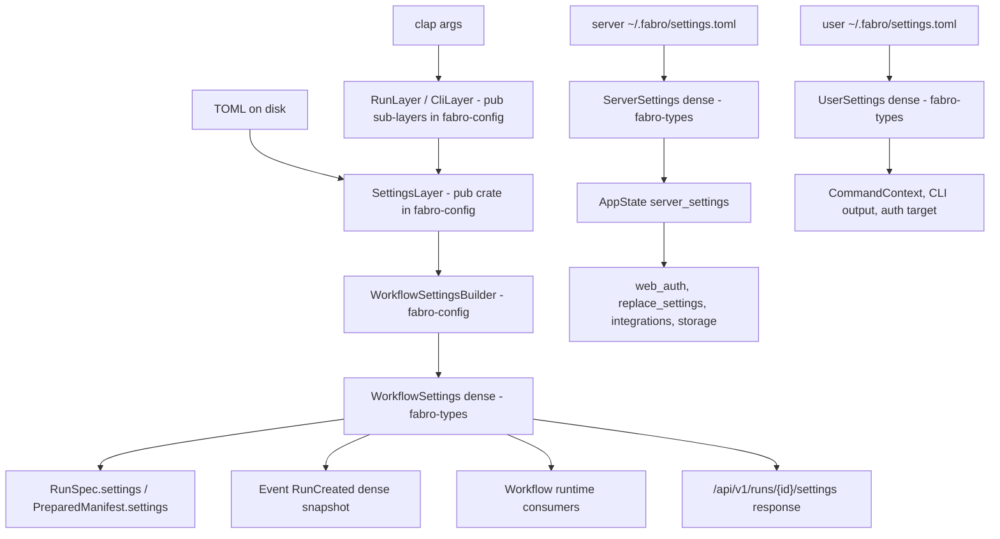
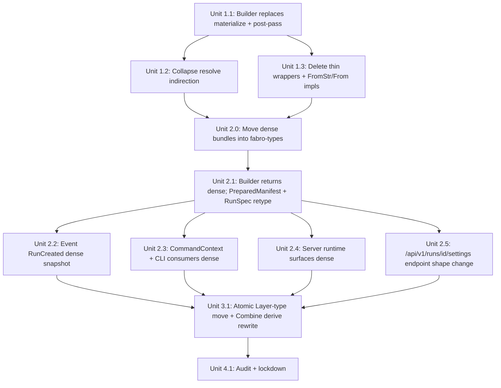

# Fabro Config: Types Boundary & Dense-Type Migration

## Overview

Finish the `fabro-config` boundary refactor by doing four things in one coherent sweep:

1. Replace the post-merge `enforce_server_authority` kludge with the existing `Combine` machinery. Strip `server.*`, `cli.*`, and `features.*` from the materialized run layer at the builder boundary. Server's `run.*` keeps its current semantic as a low-precedence default that client layers override — **no change to user-facing override behavior**.
2. Migrate every consumer of materialized run settings from sparse `SettingsLayer` to dense `WorkflowSettings` / `UserSettings` / `ServerSettings`. This includes retyping `RunSpec.settings` and `RunCreatedProps.settings` in `fabro-types` from sparse `SettingsLayer` to dense `WorkflowSettings`. Snapshot dense `WorkflowSettings` into `Event::RunCreated`. Update the `/api/v1/runs/{id}/settings` endpoint to return dense JSON.
3. Move the dense bundle types (`WorkflowSettings`, `UserSettings`, `ServerSettings`) from `fabro-config` to `fabro-types`. They're resolved vocabulary that consumers read from — construction stays in `fabro-config` as `XxxBuilder` types / free functions. This move is what unblocks (2), because `RunSpec` (in `fabro-types`) needs to reference `WorkflowSettings` without a reverse crate dependency.
4. Move `SettingsLayer`, all `*Layer` sub-layers, the `Combine` trait, and merge-specific collection types (`MergeMap`, `ReplaceMap`, `StickyMap`, `SpliceArray`) from `fabro-types` into `fabro-config`. Make `SettingsLayer` and the merge machinery `pub(crate)`. Keep sub-layer types `pub` (the CLI needs them for programmatic overrides from clap args). Rewrite the `fabro-macros::Combine` derive to use an absolute trait path so it still resolves after the move. Keep resolved `*Namespace` types and value types (`Duration`, `InterpString`, `ModelRef`, `Size`) in `fabro-types`.

Along the way, delete the one-liner free functions and thin resolver wrappers that have accumulated: `parse_settings_layer`, `apply_builtin_defaults`, `defaults_layer`, `render_resolve_errors`, `resolve_storage_root`, `EffectiveSettingsLayers`, `materialize_settings_layer` (free fn), `strip_owner_domains`, and the whole `resolve_*_from_file` stack.

**Why as one plan rather than split:** partial landings leave the codebase worse — half-migrated types, dead wrappers kept as "compat shims," and mechanism leaking back across the boundary. The anti-regression checklist at the end exists specifically to make the landed state observable and drift-resistant. Every item on that checklist must be true when the plan closes.

## Problem Frame

`fabro-config` has accumulated complexity across several dimensions. Prior plans tackled discrete slices (`Resolver` indirection, `Combine`-derive pattern, `CommandContext` alignment, owner-first context types). After those landed, these issues remain:

1. **`enforce_server_authority` is a post-pass kludge** in `effective_settings.rs`. It merges, then "fixes up" the merge for a curated subset of server-owned fields (`storage`, `scheduler`, `artifacts`, `web`, `api`) and overwrites `features` wholesale. The logic is split across three places (`strip_owner_domains`, the combine, `enforce_server_authority`) and maintains an implicit authoritative-subset list. An existing bug falls out of this pattern: if the server's `server.storage.root` is unset and a user's is set, the user's value leaks into runs rather than falling through to defaults.

2. **`SettingsLayer` leaks far past config resolution.** It appears as a field on `PreparedManifest`, `CommandContext.machine_settings`, `Event::RunCreated.settings` (via `serde_json::Value`), and in signatures of `fabro-server::replace_settings`, `web_auth`, and the entire `fabro-cli/src/local_server.rs` module. Consumers repeatedly do `.as_ref().and_then(...)` chains against the sparse shape. The `local_server.rs` docstring even admits: *"This module is the only generic CLI lifecycle surface allowed to read `[server.*]` settings"* — a carve-out that exists only because the type boundary failed.

3. **`fabro-types` conflates universal vocabulary with config-resolution mechanism.** `fabro-types` should be the language every crate speaks. The sparse `*Layer` types and `Combine` trait are specific to the act of config resolution — they belong in `fabro-config`, not in the shared vocabulary crate. See memory `project_fabro_types_vs_config`.

4. **`EffectiveSettingsLayers` is a random-looking parameter-bag type** with no domain content — a 4-field tuple with `new()` and `Default`.

5. **One-liner free functions** have accumulated: `parse_settings_layer` wrapping `toml::from_str`, `defaults_layer` returning a `&'static`, `apply_builtin_defaults` calling one `.combine()`, `render_resolve_errors` joining strings, the `resolve_*_from_file` stack each doing ~6 lines of pass-through. Each reader pays a jump cost to learn the wrapper does nothing. See memory `feedback_avoid_oneliner_free_functions`.

6. **Owner-specific domain stripping logic is scattered.** "`cli`/`server` only come from user/args," "`features` is server-authoritative," "runs never see server.*" — these rules live across multiple functions and docstring comments. Should be centralized at one boundary: the builder.

7. **`Event::RunCreated.settings` persists the sparse layer shape.** Replay reads a sparse merge intermediate rather than "what the run actually saw." A dense snapshot is strictly more reliable: defaults can't drift after the fact.

Greenfield app, no production deployments, single-node per memory `project_fabro_is_single_node` — product behavior changes are acceptable where they simplify the model.

## Requirements Trace

- **R1.** Server operator retains the ability to **supply defaults** for `run.*` fields (notably `run.sandbox.provider`). Client layers (args, workflow, project, user) continue to override these defaults exactly as they do today. No user-facing override behavior changes; the refactor only changes *how* the default flows into the merge (via `Combine`, not via a post-pass overlay).
- **R2.** Runs never see `server.*`, `cli.*`, or `features.*` in their materialized settings. Runtime code that needs those reads from the live `ServerSettings` / `UserSettings` directly.
- **R3.** `SettingsLayer` is `pub(crate)` inside `fabro-config` after this plan lands. No crate outside `fabro-config` names the type — **including integration tests under `lib/crates/fabro-config/tests/`**, which compile as external crates and therefore cannot access `pub(crate)` items. Existing integration tests that name `SettingsLayer` migrate into `#[cfg(test)] mod tests` blocks inside `src/**/*.rs` (or, if cross-file sharing matters, behind a `test-support` feature flag).
- **R4.** Sub-`*Layer` types (`RunLayer`, `CliLayer`, `ProjectLayer`, `WorkflowLayer`, `ServerLayer`, `FeaturesLayer`, plus their sub-sub-layers) remain `pub` in `fabro-config` to let CLI-arg adapters construct programmatic overrides.
- **R5.** Every consumer of materialized run settings takes or holds a dense type. No struct outside `fabro-config` has a `settings: SettingsLayer` field. Specifically, `RunSpec.settings` and `RunCreatedProps.settings` in `fabro-types` retype from `SettingsLayer` to `WorkflowSettings`.
- **R6.** `Event::RunCreated.settings` serializes a dense `WorkflowSettings` snapshot (naturally, once `RunCreatedProps.settings: WorkflowSettings`). Replay consumers see "what the run saw," not a sparse merge intermediate. Wire JSON shape changes — the event schema is internal, so this is acceptable.
- **R7.** Crate split: value types (`Duration`, `InterpString`, `ModelRef`, `Size`), resolved `*Namespace` types, **and the dense bundle types (`UserSettings`, `ServerSettings`, `WorkflowSettings`)** stay in (or move to) `fabro-types`. `*Layer` types, `SettingsLayer`, `Combine`, `MergeMap`/`ReplaceMap`/`StickyMap`/`SpliceArray` move to `fabro-config`. `fabro-types` must not depend on `fabro-config` — preserved as an absolute dependency-direction constraint. Rationale: memory `project_fabro_types_vs_config` — dense types are vocabulary that consumers reason about; construction is an operation.
- **R8.** One-liner wrappers listed in the anti-regression checklist are deleted — not kept as pass-through shims. Replaced either by inlining, `FromStr`/`From` impls, or methods on the relevant type.
- **R9.** Test scenarios exercising the existing `server.storage.root` user-leak bug (user sets `server.storage.root`, server does not) document the new "server-owned always means server-owned" behavior. Runs no longer see `server.*` at all, so the user's `server.storage.root` cannot leak into run storage.
- **R10.** The `Combine` derive macro in `fabro-macros` is rewritten to use an absolute trait path (`::fabro_config::layers::Combine`) so it resolves correctly after the trait moves out of `fabro-types`. The derive's output references a `pub(crate)` trait, so it is only usable *inside* fabro-config. That constraint is acceptable because after Unit 3.1 every `*Layer` struct lives in fabro-config and every `#[derive(Combine)]` site is inside fabro-config. The macro's rustdoc explicitly documents this scoping so a future engineer adding a layer type outside fabro-config understands why it won't compile.
- **R11.** The `/api/v1/runs/{id}/settings` API endpoint's response shape changes from sparse `RunSettingsLayer` (today) to dense `WorkflowSettings`. OpenAPI schema renamed accordingly. The TypeScript client and web UI (`apps/fabro-web/app/routes/run-settings.tsx`) update in lockstep. Internal wire contract; change is accepted.

## Scope Boundaries

**In scope:**
- Changes listed in Requirements.
- Deletion of the named wrappers and parameter-bag types.
- Splitting settings files in `fabro-types` so Namespaces stay and Layers move.
- **Moving dense bundle types (`WorkflowSettings`, `UserSettings`, `ServerSettings`) from `fabro-config::context` to `fabro-types`.**
- **Retyping `fabro-types::run::RunSpec.settings` and `fabro-types::run_event::run::RunCreatedProps.settings` from `SettingsLayer` to `WorkflowSettings`.**
- **Rewriting the `Combine` derive macro in `fabro-macros` to use an absolute trait path.**
- **Updating `/api/v1/runs/{id}/settings` endpoint + OpenAPI schema + TypeScript client + web UI renderer to the dense shape.**
- Updating `use` statements workspace-wide to point at the new homes.
- Updating `Cargo.toml` dependencies where callers now need `fabro-config` for a type they previously got from `fabro-types` (or vice-versa for the dense bundles).

**Out of scope:**
- Redesigning the TOML schema. All user-facing TOML shapes are unchanged.
- Changing `UserSettings` / `ServerSettings` / `WorkflowSettings` field layout beyond what's needed to relocate them (the shapes are structural moves, not redesigns).
- Touching `InterpString`, `Duration`, `Size`, `ModelRef` — they're correctly placed.
- Introducing new settings domains or feature flags.
- Altering the resolver error types beyond wrapping `Vec<ResolveError>` in a `ResolveErrors` newtype for `Display`.
- Multi-node / shared-server policy semantics (single-node, see memory).
- **Policy enforcement features — this plan keeps the existing "server supplies defaults, client overrides" semantic.** If hard enforcement becomes a requirement later, it'll be a distinct plan.
- Modifications to TOML parsing internals other than switching the parse entrypoint to `FromStr`.
- Renames of the resolved `*Namespace` types.

## Context & Research

### Prior plans (land this on top of)

- `docs/plans/2026-04-22-001-refactor-settings-api-entrypoints-plan.md` — introduces owner-first `ServerSettings` / `UserSettings` context types. Status: `active` at time of writing this plan. **This plan assumes those context types are in place.** If 04-22-001 has not yet landed, it must land first.
- `docs/plans/2026-04-23-001-refactor-collapse-settings-resolve-indirection-plan.md` — deletes `Resolver`, `ResolvedSettingsTree`, adds `WorkflowSettings`. Status: `completed`. **This plan assumes `WorkflowSettings` exists as a `{ project, workflow, run }` bundle.**
- `docs/plans/2026-04-23-002-refactor-combine-trait-uv-pattern-plan.md` — replaces `merge.rs` with `Combine` trait + derive macro. Status: `completed`. **This plan leverages the `Combine` trait directly for all layer merging. The derive macro itself needs a small rewrite (R10) to use an absolute path after the trait moves out of `fabro-types`.**
- `docs/plans/2026-04-23-001-refactor-command-context-alignment-plan.md` — finishes `CommandContext` abstraction. Status: `completed`. **This plan retypes `CommandContext.machine_settings` from `SettingsLayer` to the appropriate dense type.**

### Relevant code and patterns

- `lib/crates/fabro-config/src/effective_settings.rs` — home of `EffectiveSettingsLayers`, `materialize_settings_layer`, `enforce_server_authority`, `strip_owner_domains`. All four are deleted by this plan.
- `lib/crates/fabro-config/src/context.rs` — `UserSettings`, `ServerSettings`, `WorkflowSettings` live here today with `from_layer` associated functions. **These three type definitions move to `fabro-types`** (per R7); their construction moves to new `UserSettingsBuilder` / `ServerSettingsBuilder` / `WorkflowSettingsBuilder` types in `fabro-config`. Inherent `impl UserSettings { fn from_layer(...) }` blocks cannot live in fabro-config once the type is in fabro-types (Rust coherence). Because `SettingsLayer` is `pub(crate)`, every `*Builder` method that takes a `SettingsLayer` is `pub(crate)` (usable only by fabro-config itself for internal construction and tests). External callers use the public file/TOML-string/sub-Layer entry points documented in the High-Level Technical Design: `UserSettingsBuilder::load_from(&path)?`, `UserSettingsBuilder::from_toml(source)?`, `ServerSettingsBuilder::load_from(&path)?`, `WorkflowSettingsBuilder::new().user_file(...).build()?`, etc.
- `lib/crates/fabro-types/src/run.rs:54` — `RunSpec.settings: SettingsLayer` retypes to `WorkflowSettings`.
- `lib/crates/fabro-types/src/run_event/run.rs:12` — `RunCreatedProps.settings: SettingsLayer` retypes to `WorkflowSettings`. Knock-on: `fabro-workflow/src/event.rs:1513` (the `event_body_from_event` deserializer) now targets `WorkflowSettings` naturally — no dedicated handling needed, because the emitter side and the deserializer side agree on the dense shape after this plan.
- `lib/crates/fabro-macros/src/lib.rs:177-182` — `Combine` derive expansion uses `crate::settings::Combine` (relative). Rewrite to use the absolute path `::fabro_config::layers::Combine`. Because `Combine` is `pub(crate)` after Unit 3.1, the derive is only usable for types defined inside fabro-config — which is every `*Layer` struct after the move, so this suffices. Document the in-crate-only scoping in the macro's rustdoc.
- `docs/api-reference/fabro-api.yaml` — `/api/v1/runs/{id}/settings` endpoint (line ~1374) and its `RunSettingsLayer` schema (line ~5448). Schema renamed to something like `RunSettings` matching the dense shape; response type changes.
- `lib/packages/fabro-api-client/` — regenerated TypeScript Axios client picks up the new schema name and shape.
- `apps/fabro-web/app/routes/run-settings.tsx` — adjust to consume the new dense shape.
- `lib/crates/fabro-config/src/resolve/mod.rs` — home of `resolve_*_from_file` stack and `render_resolve_errors`. All of this is deleted or inlined; per-namespace resolution becomes methods on `XxxSettingsBuilder` types or a single internal helper. Known caller count: **~80–108 across 9 crates** (per P1-5 from the review); this caller migration is split across Units 1.2 and 2.x rather than one unit.
- `lib/crates/fabro-config/src/defaults.rs` — `defaults_layer` + `apply_builtin_defaults` one-liners. Inlined into builder `build()`.
- `lib/crates/fabro-config/src/parse.rs` — `parse_settings_layer` wraps `toml::from_str`. Replaced by `impl FromStr for SettingsLayer` and (optionally) a `pub(crate) fn SettingsLayer::parse(s)` convenience.
- `lib/crates/fabro-config/src/load.rs` — file-loading entry points. Each becomes either a builder method or a `pub(crate) SettingsLayer::load_from` associated function.
- `lib/crates/fabro-types/src/settings/` — current home of every Layer and Namespace. Each domain file splits; Layers move, Namespaces + value enums stay.
- `lib/crates/fabro-server/src/run_manifest.rs` — `PreparedManifest` bundle. `settings: SettingsLayer` field becomes `settings: WorkflowSettings`. Preflight code reading `resolve_run_from_file(&prepared.settings)` accesses `prepared.settings.run` directly. Existing test at `run_manifest.rs:1047` asserting `resolved_server.integrations.github.app_id` snapshotted into `prepared.settings` is obsolete — deleted (verified: production code reads integrations from `state.server_settings()`, not from `prepared.settings`).
- `lib/crates/fabro-workflow/src/event.rs` — `Event::RunCreated.settings: serde_json::Value` — the shape source switches from sparse `SettingsLayer` to dense `WorkflowSettings`. Emitters in `dump.rs`, `test_support.rs`, `runtime_store.rs` update.
- `lib/crates/fabro-cli/src/local_server.rs` — entire module takes `&SettingsLayer` today and `.as_ref().and_then(...)` chains values out. Switches to `&ServerSettings`. The "only surface allowed to read server.*" docstring is removed.
- `lib/crates/fabro-cli/src/command_context.rs` — `machine_settings: SettingsLayer` retyped. The field's two consumers (server connection, explicit settings accessor) both want server-scoped data — either split into two typed fields or collapse to the single `ServerSettings` needed.
- `lib/crates/fabro-cli/src/user_config.rs` — `load_settings() -> SettingsLayer` today. Returns dense types after this plan.
- `lib/crates/fabro-server/src/server.rs:785` `replace_settings(SettingsLayer)` — hot-swap API retyped to `replace_server_settings(ServerSettings)`.
- `lib/crates/fabro-server/src/web_auth.rs:907` — takes `SettingsLayer`; retyped to take `&ServerSettings`.
- `lib/crates/fabro-server/src/serve.rs` — `resolve_bind_request_from_settings(&SettingsLayer, ...)` retyped to take `&ServerSettings`.

### Institutional learnings

- Memory `feedback_avoid_oneliner_free_functions` — one-liner wrappers should be deleted, not kept as thin shims. Applies throughout this plan.
- Memory `feedback_oop_style_rust` — prefer methods on types over free functions. The builder choice and the `from_layer` method choice both follow this.
- Memory `feedback_prefer_robust_types_over_efficiency` — the whole plan is applying this principle (stronger typed boundaries, no allocation-based shortcuts to skip typed roundtrips).
- Memory `project_fabro_types_vs_config` — codifies the crate split this plan executes. `fabro-types = vocabulary`, `fabro-config = operation`.
- Memory `project_fabro_is_single_node` — constrains scope: no multi-node enforcement semantics.

### External references

None gathered. The refactor operates entirely within repo patterns and the `uv`-pattern `Combine` trait already cited in `docs/plans/2026-04-23-002-...` (which is already landed).

## Key Technical Decisions

- **Replace `enforce_server_authority` with `Combine`-based merge; don't change precedence.** Server's `run.*` continues to flow at its existing lowest-precedence default position. The post-pass overlay of `server.{storage,scheduler,artifacts,web,api}` and `features` disappears because runs no longer see any of those — consumers read them from `ServerSettings` directly. **Rationale:** eliminates the authoritative-subset list, `enforce_server_authority`, and `strip_owner_domains`. Client-override semantics (user can still set their own `run.sandbox.provider` to override a server-supplied default) are preserved exactly as today. Same user-visible behavior; simpler mechanism.

- **Precedence order for `run.*` (unchanged vs. today): `args > workflow > project > user > server.run > built-in defaults`.** Higher position wins. Server's `run.*` stays at the lowest-client-layer position, above only built-in defaults. The refactor does not flip this — my earlier draft misread the product intent, corrected after review.

- **Runs don't see `server.*`, `cli.*`, or `features.*` at all.** Ordering matters: the builder first **merges all layers including built-in defaults** (which today carry `[cli.*]`, `[server.*]`, and `[features]` entries), and **only then** zeroes `server`/`cli`/`features` to `None` on the returned sparse layer. Stripping before applying defaults would let the defaults reintroduce the fields; stripping after is correct. In practice the final dense `WorkflowSettings` structurally lacks those fields anyway, so even a mis-ordered strip would not show up in the resolved output — but the intermediate sparse layer must be clean for any caller that inspects it. **Rationale:** eliminates the flow-through and the authoritative-subset list; centralizes "what runs see" in one place; forces runtime code needing those values to read from the live `ServerSettings` / `UserSettings`, which is where they already should be coming from.

- **Dense bundle types (`WorkflowSettings`, `UserSettings`, `ServerSettings`) live in `fabro-types`; their construction lives in `fabro-config`.** The type definitions are vocabulary — consumers across the workspace read from them. Construction (from raw TOML, from file paths, from clap-arg-derived sub-Layers) is an operation that only fabro-config needs to know. Rust's coherence rule means inherent impls must live where the type is defined, so `UserSettings::from_layer` / `ServerSettings::from_layer` / `WorkflowSettings::builder()` as methods are not available — instead, construction uses sibling builder types in fabro-config. **`SettingsLayer` is `pub(crate)`, so any `*Builder` method that takes a `SettingsLayer` is `pub(crate)`** (serving fabro-config's own construction paths and tests). The public API of each `*Builder` takes only public input types — paths, TOML strings, sub-Layer types. **Rationale:** breaks the circular dependency that would otherwise prevent `RunSpec.settings: WorkflowSettings` (RunSpec lives in fabro-types and can't depend on fabro-config); keeps the `SettingsLayer` aggregator truly private (no `private_bounds` warnings under `clippy -D warnings`).

- **`Event::RunCreated.settings` serializes dense `WorkflowSettings` naturally, once `RunCreatedProps.settings: WorkflowSettings`.** No special emitter handling needed — the field type change propagates through the serde roundtrip. **Rationale:** replay gets "what the run saw" rather than a sparse merge intermediate vulnerable to later defaults drift. The event schema is internal to Fabro.

- **Introduce `WorkflowSettingsBuilder` in `fabro-config`.** Five internal slots (args, workflow, project, user, server). Because `SettingsLayer` is `pub(crate)`, the public setters accept only public input types: file paths, TOML strings, `&ServerSettings` (dense), and sub-Layer types (`RunLayer`, `CliLayer`) for clap-arg overrides. Internal `pub(crate)` setters accepting raw `SettingsLayer` exist for fabro-config's own tests. `build()` merges all slots with built-in defaults, then zeroes `server`/`cli`/`features` to `None` on the intermediate sparse layer, then resolves to dense `WorkflowSettings` (which lives in fabro-types). Call site: `WorkflowSettingsBuilder::new().user_file(&path)?.project_file(&p)?.run_overrides(run).build()?`. **Rationale:** replaces `materialize_settings_layer` free fn and the `EffectiveSettingsLayers` struct; names each layer at the call site; makes optional slots natural. Per-slot contribution rules live in the builder's docstring — the single place the stripping/merging policy is documented. The public API never exposes `SettingsLayer`, avoiding `private_bounds` warnings under `clippy -D warnings`.

- **`UserSettingsBuilder` / `ServerSettingsBuilder` replace the previous `UserSettings::from_layer` / `ServerSettings::from_layer` associated functions.** Each exposes a small set of associated constructors that return the dense bundle directly (not a builder chain — there's only one input, so there's nothing to chain):
  - `pub fn load_from(path: &Path) -> Result<Self::Output>` — loads the TOML file and resolves.
  - `pub fn from_toml(source: &str) -> Result<Self::Output>` — parses a TOML string and resolves.
  - `pub(crate) fn from_layer(layer: &SettingsLayer) -> Result<Self::Output>` — internal path for fabro-config's own consumers (e.g., the `WorkflowSettingsBuilder` machinery and internal tests). **`pub(crate)` because `SettingsLayer` is `pub(crate)`** — this signature cannot be public without a `private_bounds` warning.
  - `UserSettingsBuilder::load_default() -> Result<UserSettings>` loads from `~/.fabro/settings.toml` (the conventional path).
- **Storage-override replacement for `apply_storage_dir_override` is a post-resolve method on the dense type, not a builder step.** Define `ServerSettings::with_storage_override(self, path: &Path) -> ServerSettings` (inherent impl on `ServerSettings`, which lives in fabro-types). Callers do `ServerSettingsBuilder::load_from(&path)?.with_storage_override(&dir)`. This composes cleanly because `with_storage_override` takes `ServerSettings` and returns `ServerSettings` — exactly what `load_from` produces. Keeps `ServerSettingsBuilder` to just its three constructors (simpler API; no phantom lifecycle). **Rationale:** Rust coherence forces constructors to live where the type is defined; since the types now live in fabro-types and construction lives in fabro-config, sibling builder types are the mechanism. Post-resolve overrides on the dense type keep the builder API honest — builders build; they don't mutate.

- **Move all `*Layer` types and merge mechanism from `fabro-types` to `fabro-config`.** `SettingsLayer`, `Combine`, `MergeMap`, `ReplaceMap`, `StickyMap`, `SpliceArray` go with them. `SettingsLayer`, `Combine`, and `SpliceArray` become `pub(crate)`. `MergeMap` / `ReplaceMap` / `StickyMap` are `pub` (CLI adapters construct `ReplaceMap` values). Sub-Layer types (`RunLayer`, `CliLayer`, etc.) remain `pub` — the CLI needs them for constructing programmatic overrides from clap args. Encoded in memory `project_fabro_types_vs_config`.

- **Type-move is one atomic PR.** `fabro-types` must not depend on `fabro-config`; re-export bridges to ease transition would create a circular dep. Big diff, mechanical, unavoidable.

- **Rewrite the `Combine` derive macro in `fabro-macros` to use an absolute trait path.** Today it expands to `crate::settings::Combine::combine(...)` and `impl ... crate::settings::Combine for ...`. That only works because the trait lives at `fabro_types::settings::Combine` and all deriving types are in fabro-types. Once the trait moves into `fabro_config::layers::combine::Combine`, the relative path breaks. Rewrite the macro expansion to use `::fabro_config::layers::Combine` (absolute).

  **Visibility constraint:** `Combine` remains `pub(crate)` inside fabro-config. Proc-macro output is substituted at the call site and compiled as if the caller wrote it, which means downstream crates cannot produce `#[derive(Combine)]` expansions that reference a `pub(crate)` trait — they would fail to compile with "use of private trait." **This is acceptable because after Unit 3.1 every `#[derive(fabro_macros::Combine)]` call site is inside fabro-config** (every `*Layer` struct moved there). The derive is effectively scoped to fabro-config-internal use. Document this in the macro's own rustdoc so a future engineer adding a new layer type outside fabro-config gets a clear error. **Rationale:** unblocks Unit 3.1 for all in-scope deriving types; keeps the merge-trait surface tight.

- **`/api/v1/runs/{id}/settings` endpoint switches to dense `WorkflowSettings`.** OpenAPI schema renamed from `RunSettingsLayer` to `RunSettings`, TypeScript Axios client regenerates, web UI renderer at `apps/fabro-web/app/routes/run-settings.tsx` updates in the same PR. **Rationale:** internal endpoint with one known consumer (the fabro web UI); greenfield means we can just change the shape. Replay-shape and API-shape stay aligned with storage shape (dense throughout).

- **`FromStr` for `SettingsLayer` and `From<SubLayer> for SettingsLayer` for the six sub-layer types.** **Rationale:** `FromStr` replaces `parse_settings_layer` with a universally-recognized idiom (usable inside fabro-config); `From<RunLayer>`/`From<CliLayer>`/etc. collapse test fixture boilerplate (`SettingsLayer { run: Some(RunLayer { ... }), ..Default::default() }` becomes `RunLayer { ... }.into()`). After Unit 3.1, `SettingsLayer` is `pub(crate)` — **these trait impls are `pub(crate)`** and benefit only fabro-config's own unit tests (plus the internal `pub(crate)` builder setters). External callers access the builder through public file-path / TOML-string / sub-Layer setters instead.

- **`render_resolve_errors` becomes `impl Display for ResolveErrors` newtype.** `ResolveErrors(Vec<ResolveError>)` with a `;`-joined `Display`. Preserves the existing error-presentation format (R6 of 04-23-001-collapse called this out explicitly). Replaces the free fn without losing the formatting contract.

- **Delete the existing `resolve_*_from_file` free-fn stack.** Per 04-23-001-collapse these had "dozens of callers" — workspace grep finds ~80–108 across 9 crates. The caller migration is chunked across Units 1.2 and 2.x rather than one unit. Each caller is retyped to use the relevant dense bundle (`ServerSettings`, `UserSettings`, `WorkflowSettings`) or a `pub(crate)` helper within fabro-config. No top-level public free fn named `resolve_*_from_file` remains at end of plan. **Rationale:** memory `feedback_avoid_oneliner_free_functions`.

## Open Questions

### Resolved during planning

- **Should `cli.*` still flow through the materialized run layer for `--verbose` display?** No. `CliOutputLayer::verbosity` from args flows into `UserSettings` via the CLI-side loader, not into run settings. Any run-side code that today reads `cli.output.verbosity` from the materialized layer migrates to reading `UserSettings.cli` instead. Confirmed no production consumer today.
- **What about `features` flowing into runs?** Runs don't see features. Runtime code needing feature flags reads `ServerSettings::features` directly. Confirmed during earlier investigation: `WorkflowSettings` today already doesn't expose `features` to runs.
- **Backwards compatibility of `Event::RunCreated` JSON?** Schema is internal. Greenfield, no production consumers. Shape change is accepted.
- **Preserving existing `server.storage.root` user-leak behavior?** No — this is the bug referenced in R9. Runs no longer see `server.*` at all, so `user.server.storage.root` cannot leak into run storage regardless of what the server sets.
- **Can sub-Layer types be `pub(crate)` too?** No — CLI adapters in `fabro-cli/src/commands/run/overrides.rs` and `fabro-cli/src/args.rs` construct them from clap args. They must stay `pub`. Only the top-level aggregator (`SettingsLayer`), the `Combine` trait, and `SpliceArray` go `pub(crate)`. `MergeMap` / `ReplaceMap` / `StickyMap` stay `pub` because CLI-adapter code constructs `ReplaceMap` values.
- **Should `WorkflowSettingsBuilder` live on `WorkflowSettings` (as `WorkflowSettings::builder()`) or as a separate type?** As a separate type in `fabro-config`. Rust coherence forces this: `WorkflowSettings` lives in `fabro-types` after Decision 1, and `fabro-types` cannot depend on `fabro-config` to supply the builder. Call sites use `WorkflowSettingsBuilder::new().user(u)...build()?`.
- **Does the server's `run.*` precedence change?** No. It stays at its current lowest-client-layer position. The refactor replaces `enforce_server_authority` with straight `Combine` but does not flip precedence. Client override of server-supplied `run.*` defaults is preserved.
- **Where do the dense bundle types live?** In `fabro-types`, moved from `fabro-config::context` as part of this plan. Rationale: they're vocabulary that consumers reason about; construction is an operation. See memory `project_fabro_types_vs_config`.
- **How does `#[derive(fabro_macros::Combine)]` resolve the trait after the move?** The derive macro emits an absolute path `::fabro_config::layers::Combine`. Because `Combine` is `pub(crate)`, this absolute path only resolves from *inside* fabro-config. After Unit 3.1 every `*Layer` struct (and therefore every `#[derive(Combine)]` site) is inside fabro-config, so this works. If a future crate outside fabro-config wants to derive `Combine`, either `Combine` would need to be made `pub`, or that new layer type would need to live in fabro-config. This scoping is documented in the macro's rustdoc.
- **Does the `/api/v1/runs/{id}/settings` endpoint change shape?** Yes — it now returns dense `WorkflowSettings` JSON. OpenAPI schema renamed `RunSettingsLayer` → `RunSettings`. Web UI and TypeScript client update in lockstep.
- **`MergeMap`/`ReplaceMap`/`StickyMap` visibility after the move.** These appear only inside `*Layer` types — resolved `Namespace` types use plain `HashMap<String, String>` (e.g., `ProjectNamespace.metadata`) or concrete resolved wrappers (e.g., `RunNamespace.notifications: HashMap<String, NotificationRouteSettings>`), never these merge-specific newtypes. They move to `fabro-config/src/layers/maps.rs` alongside the other Layer machinery. Visibility is **`pub`** (not `pub(crate)`) because `fabro-cli/src/commands/run/overrides.rs` and `fabro-server/src/run_manifest.rs` construct `ReplaceMap` values at CLI-arg translation sites.

### Deferred to implementation

- **Home of `Storage`, `RuntimeDirectory`, `RunScratch` currently in `fabro-config/src/storage.rs`.** These may be runtime filesystem helpers rather than config. Skim and decide during the final audit unit. Not blocking.
- **Exact split of `CommandContext.machine_settings`.** Today one `SettingsLayer` field supports both server-connection needs (bind/storage) and "explicit read access for callers who ask." Implementer decides whether two dense fields or one `ServerSettings` plus the already-present `UserSettings` is cleaner.
- **Specific method/helper names during inlining.** Where this plan names a behavior (e.g., `SettingsLayer::load_from`), the implementer can choose a better name if one fits the actual use; naming decisions that require real-code-in-hand don't belong in the plan.
- **Whether `resolve_storage_root` becomes a method on `ServerSettings` or gets inlined at its one or two call sites.** Implementer decides. Either is acceptable as long as no top-level `pub fn resolve_storage_root` free function remains.

## High-Level Technical Design

> *This illustrates the intended approach and is directional guidance for review, not implementation specification. The implementing agent should treat it as context, not code to reproduce.*

### Builder shape

```rust
// Pseudo-code — the shape of the new entry point.
// Lives in fabro-config; WorkflowSettings itself lives in fabro-types.
// SettingsLayer is pub(crate) inside fabro-config, so it does NOT appear
// in public builder signatures (would trip `private_bounds` under
// clippy -D warnings). Public setters accept public input types only.

pub struct WorkflowSettingsBuilder {
    args:     SettingsLayer,  // pub(crate) field type — internal only
    workflow: SettingsLayer,
    project:  SettingsLayer,
    user:     SettingsLayer,
    server:   SettingsLayer,
}

impl WorkflowSettingsBuilder {
    pub fn new() -> Self { Self::default() }

    // Per-slot contribution rules documented in the type's docstring —
    // the single place that policy lives:
    //   args/workflow/project/user — all run/project/workflow fields
    //   workflow, project          — cli/server/features stripped at build
    //   user                       — server/features stripped at build
    //   server                     — only `run.*` is used (as lowest-precedence default)

    // Public setters accepting file paths / TOML strings / sub-Layer types.
    // All input types here are `pub` (sub-Layer types stay `pub` per R4;
    // paths and strings are std). None exposes `SettingsLayer`.
    pub fn user_file(self, path: &Path)           -> Result<Self>;
    pub fn user_toml(self, source: &str)          -> Result<Self>;
    pub fn project_file(self, path: &Path)        -> Result<Self>;
    pub fn project_toml(self, source: &str)       -> Result<Self>;
    pub fn workflow_file(self, path: &Path)       -> Result<Self>;
    pub fn workflow_toml(self, source: &str)      -> Result<Self>;
    pub fn server_settings(self, s: &ServerSettings) -> Self;  // dense, for the server contributing defaults

    // Programmatic overrides from clap args — the CLI adapters already
    // produce RunLayer / CliLayer; sub-Layer types are `pub`.
    pub fn run_overrides(self, run: RunLayer)     -> Self;
    pub fn cli_overrides(self, cli: CliLayer)     -> Self;

    // Internal ergonomic sugar for fabro-config's own tests only.
    // `pub(crate)` so the `SettingsLayer` bound does not escape.
    pub(crate) fn args_layer(self, layer: SettingsLayer)     -> Self;
    pub(crate) fn user_layer(self, layer: SettingsLayer)     -> Self;
    pub(crate) fn project_layer(self, layer: SettingsLayer)  -> Self;
    pub(crate) fn workflow_layer(self, layer: SettingsLayer) -> Self;
    pub(crate) fn server_layer(self, layer: SettingsLayer)   -> Self;

    pub fn build(self) -> Result<WorkflowSettings, ResolveErrors>;
}
```

### Precedence chain for `run.*`

Higher position = wins. **Unchanged vs. today.**

```
args.run                (CLI --sandbox etc.)
  combine (field-wise merge; unset falls through)
workflow.run            (workflow.toml)
  combine
project.run             (.fabro/project.toml)
  combine
user.run                (~/.fabro/settings.toml, CLI-side)
  combine
server.run              (lowest-precedence default from server's settings.toml)
  combine
defaults.run            (embedded defaults.toml)
```

For `project.*` and `workflow.*`: same chain minus `server` (which contributes only `run.*`).
For everything else (`server.*`, `cli.*`, `features.*`): stripped to `None` by `build()`. Runs never see them.

### Crate-boundary state transitions



The diagram encodes two key invariants: (1) `SettingsLayer` exists only inside `fabro-config`; every arrow crossing a crate boundary carries a dense type or a `pub` sub-layer. (2) Dense bundles (`WorkflowSettings`, `UserSettings`, `ServerSettings`) live in `fabro-types` and are reachable from both fabro-types consumers (`RunSpec`) and fabro-config builders.

### File-move map (Phase 3 atomic)

Each settings domain file in `fabro-types/src/settings/` splits:

| File | Stays in fabro-types | Moves to fabro-config/src/layers/ |
|------|----------------------|-----------------------------------|
| `cli.rs` | `CliNamespace`, resolved sub-settings, value enums (`OutputFormat`, `OutputVerbosity`, `CliAuthStrategy`) | `CliLayer` + all `Cli*Layer` |
| `server.rs` | `ServerNamespace`, all `Server*Settings` (resolved), all strategy/method value enums | `ServerLayer` + all `Server*Layer` + `ObjectStore*Layer` |
| `project.rs` | `ProjectNamespace` | `ProjectLayer` |
| `workflow.rs` | `WorkflowNamespace` | `WorkflowLayer` |
| `run.rs` | `RunNamespace`, resolved sub-settings, value enums (`ApprovalMode`, `RunMode`, `HookType`, `McpTransport`, `TlsMode`, `MergeStrategy`, `WorktreeMode`, resolved `DaytonaSnapshotSettings`, etc.) | `RunLayer` + all `Run*Layer`, `HookEntry`, `HookAgentMarker`, `HookTlsMode`, `DaytonaNetworkLayer`, `DaytonaDockerfileLayer`, `DaytonaSnapshotLayer`, `NotificationProviderLayer`, `InterviewProviderLayer`, `LocalSandboxLayer`, `ScmGitHubLayer`, `RunGoalLayer`, `RunArtifactsLayer`, `RunCheckpointLayer`, `RunPrepareLayer`, `ModelRefOrSplice`, `StringOrSplice` |
| `features.rs` | `FeaturesNamespace` | `FeaturesLayer` |
| `layer.rs` | — (delete from fabro-types) | `SettingsLayer` (pub(crate)) |
| `combine.rs` | — (delete from fabro-types) | `Combine` trait + all impls (pub(crate)) |
| `maps.rs` | — (delete from fabro-types) | `MergeMap`, `ReplaceMap`, `StickyMap` (pub — CLI adapters construct `ReplaceMap` values) |
| `splice_array.rs` | — (delete from fabro-types) | `SpliceArray`, `SpliceArrayError`, `SPLICE_MARKER` (pub(crate)) |
| `duration.rs`, `interp.rs`, `model_ref.rs`, `size.rs` | stay entirely | — |

Heuristic for ambiguous types: if it has `Option<T>` fields and a `Combine` impl, it's a Layer → moves. Concrete resolved values with no `Combine` → vocabulary → stays.

## Implementation Units

Units are dependency-ordered. Each should land as one atomic commit. Unit 2.0 and Unit 3.1 are the two cross-crate moves and must each land atomically (no bridge re-exports — fabro-types cannot depend on fabro-config). Unit 2.0 is required *before* Unit 2.1 because Unit 2.1 retypes fields in `fabro-types` to reference `WorkflowSettings`, which requires the dense bundle to already live in `fabro-types`.



---

- [ ] **Unit 1.1: Introduce `WorkflowSettingsBuilder`; delete `enforce_server_authority` and siblings**

**Goal:** Replace `materialize_settings_layer` free fn and `EffectiveSettingsLayers` struct with a `WorkflowSettingsBuilder` type in `fabro-config`. `enforce_server_authority`, `strip_owner_domains`, and the authoritative-subset list all disappear — their intent is expressed as (a) the normal `Combine` merge and (b) zeroing `server`/`cli`/`features` on the returned layer. **Precedence is unchanged from today.** Builder returns `SettingsLayer` in this unit (dense return comes in Unit 2.1) — this splits the two concerns (stripping policy vs. return-type change) into reviewable pieces.

**Requirements:** R1, R2, R9.

**Dependencies:** Prior plans 04-22-001 (active, must land first), 04-23-001-collapse, 04-23-001-command-context, 04-23-002.

**Files:**
- Modify: `lib/crates/fabro-config/src/effective_settings.rs`
- Modify: `lib/crates/fabro-config/src/context.rs` (add `WorkflowSettingsBuilder` type alongside existing `WorkflowSettings`)
- Modify: `lib/crates/fabro-config/src/lib.rs` (re-exports)
- Modify: `lib/crates/fabro-server/src/run_manifest.rs` (`prepare_manifest` switches to builder)
- Modify: `lib/crates/fabro-cli/src/manifest_builder.rs` (scrutinize `ManifestBuilderInput` — fields `args_layer`/`user_layer` may be inlinable)
- Modify: `lib/crates/fabro-cli/src/commands/preflight.rs`, `lib/crates/fabro-cli/src/commands/run/create.rs`, `lib/crates/fabro-cli/src/commands/graph.rs`, `lib/crates/fabro-cli/src/commands/validate.rs` and any other site that constructs `EffectiveSettingsLayers`
- Test: `lib/crates/fabro-config/src/effective_settings.rs` (existing tests retarget the builder)

**Approach:**
- Delete `EffectiveSettingsLayers` struct.
- Delete `materialize_settings_layer` free fn.
- Delete `enforce_server_authority` helper.
- Delete `strip_owner_domains` helper.
- Add `WorkflowSettingsBuilder` with five `SettingsLayer` slots and `.build()` returning `Result<SettingsLayer, ResolveErrors>` (still sparse in this unit — keep temporarily).
- Builder merge follows **existing precedence**: `args.combine(workflow).combine(project).combine(user).combine(server.run_only).combine(defaults)` — server contributes only its `run.*` portion, at the lowest-client-layer position.
- Builder `build()` zeroes `server`/`cli`/`features` to `None` on the returned `SettingsLayer`.
- Centralize the "per-slot contribution" policy in the builder's docstring. No helper functions elsewhere carry this policy.
- Callers construct builder directly instead of `EffectiveSettingsLayers::new(...)` then `materialize_settings_layer(...)`.

**Patterns to follow:**
- Builder shape mirrors the `uv`-style field-wise combine usage already present from 04-23-002.
- Error-accumulation idiom matches `ServerSettings::from_layer` in `context.rs` post-04-23-001-collapse.

**Test scenarios:**
- Happy path: all five slots provided; result matches today's `materialize_settings_layer` output field-for-field for all `run.*` fields (precedence unchanged — same merged values come out).
- Happy path: empty/default slots (tests constructing `WorkflowSettingsBuilder::new().build()`) succeed.
- Edge case: `server.run.sandbox.provider = "daytona"` with `user.run.sandbox.provider = "local"` — **user wins**; resolved sandbox provider is `local`. Confirms client override of server default is preserved.
- Edge case: `server.run.sandbox.provider = "daytona"` with no user/project/workflow/args `run.sandbox.provider` — server's default flows through; resolved value is `daytona`.
- Edge case: `args.run.sandbox.provider = "local"` on top of a user config setting `"daytona"` — args win; resolved value is `local`. Confirms CLI flag override works.
- Edge case (bug fix, R9): `user.server.storage.root = "/tmp/user"` with `server.server.storage.root = None` — **resolved `server.*` is not present in the returned `SettingsLayer`** (zeroed at builder boundary). If a later unit reads storage root, it comes from `ServerSettings`, not from the materialized run settings.
- Edge case: `user.cli.output.format = "json"` — cli zeroed on returned layer. Runs can't see it.
- Edge case: `server.features.session_sandboxes = true` with `user.features.session_sandboxes = false` — features zeroed on returned layer. Runs can't see features.
- Error path: a `run.*` field with a bad value produces a `ResolveError` through the existing resolver machinery. Errors surface from `build()` as `Result<_, ResolveErrors>`.
- Integration: the existing `prepare_manifest_prefers_bundled_settings_without_duplication` test (run_manifest.rs ~line 990) is retargeted and the assertion `resolved_server.integrations.github.app_id == "snapshotted-app-id"` is deleted (it becomes vacuously unreachable — `server.*` is no longer in the materialized layer).

**Verification:**
- `cargo nextest run -p fabro-config --workspace` passes.
- `rg "EffectiveSettingsLayers|materialize_settings_layer|enforce_server_authority|strip_owner_domains" lib/crates/` returns zero hits.
- The old test at `run_manifest.rs:1047` asserting snapshotted `server.integrations.github.app_id` no longer exists.
- New test exercises server `run.sandbox.provider` default being overridden by user.

---

- [ ] **Unit 1.2: Collapse `resolve_*_from_file` indirection**

**Goal:** Delete the `resolve_*_from_file` free-function stack. The per-namespace resolution logic moves inside fabro-config as implementation detail of the `*Builder` types (`pub(crate) fn from_layer` and friends); callers outside fabro-config switch to the **public** builder entry points (`load_from(&path)`, `from_toml(&source)`, or the multi-slot `WorkflowSettingsBuilder::new()...build()`). No top-level `pub fn resolve_*_from_file` remains at end of this unit.

**Requirements:** R8.

**Dependencies:** Unit 1.1.

**Execution note:** Per review finding P1-5, the caller count across the workspace is larger than "dozens" — closer to 80–108 across 9 crates. If this unit's diff becomes unreviewable, split the caller migration by namespace (one sub-unit per `resolve_*` variant) and reconvene before landing. The goal is still a clean deletion of the free-fn stack by the end of Unit 2.4; Unit 1.2 does not have to land in one commit if splitting improves reviewability.

**Files:**
- Modify/delete: `lib/crates/fabro-config/src/resolve/mod.rs`
- Modify: `lib/crates/fabro-config/src/resolve/cli.rs`, `lib/crates/fabro-config/src/resolve/server.rs`, `lib/crates/fabro-config/src/resolve/project.rs`, `lib/crates/fabro-config/src/resolve/features.rs`, `lib/crates/fabro-config/src/resolve/run.rs`, `lib/crates/fabro-config/src/resolve/workflow.rs`
- Modify: `lib/crates/fabro-config/src/lib.rs` (remove `resolve_*_from_file` re-exports)
- Modify: every call site of `resolve_*_from_file` in the workspace — audit via `rg "resolve_cli_from_file|resolve_server_from_file|resolve_project_from_file|resolve_features_from_file|resolve_run_from_file|resolve_workflow_from_file"`

**Approach:**
- Audit each `resolve_*_from_file` caller (workspace grep finds ~80–108 sites across fabro-workflow, fabro-server, fabro-cli, fabro-install, and fabro-store). Categorize as:
  - (a) Caller wants the whole dense facade (`ServerSettings`, `UserSettings`, `WorkflowSettings`) — retype to the facade.
  - (b) Caller genuinely needs one resolved namespace (e.g., `ProjectNamespace` for path resolution). Expose a `pub(crate)` helper or a method on the Namespace type. Do not leave a `pub fn resolve_*_from_file` free fn.
- Delete `render_resolve_errors` in favor of `impl Display for ResolveErrors` newtype. Update consumers of the `"; "`-joined format.
- If the total caller migration is too large for one commit, split by namespace (one sub-PR per `resolve_*` variant). The end state — no public free fn named `resolve_*_from_file` — remains the same.

**Execution note:** If a caller can't be cleanly migrated because the single-namespace-from-a-layer pattern is genuinely useful at its site, discuss with the reviewer rather than silently reinstating a free fn. The constraint is "no top-level public free fn named `resolve_*_from_file`" — `pub(crate)` helpers or Namespace associated functions are fine.

**Patterns to follow:**
- 04-23-001-collapse established `ServerSettings::from_layer` / `UserSettings::from_layer` on dense facades. Extend the pattern if needed.
- The `ResolveErrors` newtype with `Display` impl mirrors the error-wrapping pattern used by other `fabro-*` crates (see `fabro-workflow::Error` for a parallel example).

**Test scenarios:**
- Happy path: existing consumers of `resolve_*_from_file` produce the same resolved value through their new call path.
- Happy path: `ResolveErrors::to_string()` produces the same `"; "`-joined output that `render_resolve_errors` did (capture a snapshot for an invalid fixture).
- Error path: a resolve failure propagates through `from_layer` / builder `build()` with no loss of error detail.

**Verification:**
- `rg "resolve_cli_from_file|resolve_server_from_file|resolve_project_from_file|resolve_features_from_file|resolve_run_from_file|resolve_workflow_from_file|render_resolve_errors" lib/crates/` returns zero hits (or only hits internal to `fabro-config` as `pub(crate)` helpers).
- Error-message format (fixture diff) unchanged.

---

- [ ] **Unit 1.3: Delete thin wrappers (free-function deletions only)**

**Goal:** Remove one-liner free functions (`parse_settings_layer`, `apply_builtin_defaults`, `defaults_layer`, `resolve_storage_root`). Replace internal usage sites with inlined calls. The accompanying `FromStr` / `From<SubLayer>` ergonomic impls are **deferred to Unit 3.1** where `SettingsLayer` moves into fabro-config and the impls naturally become `pub(crate)`. Landing them earlier would create a transitional window in which they are usable from any external crate — the plan never wants to open that window.

**Requirements:** R8 (memory `feedback_avoid_oneliner_free_functions`).

**Dependencies:** Unit 1.1.

**Files:**
- Delete: `lib/crates/fabro-config/src/parse.rs` (its one function `parse_settings_layer` is replaced by inline `toml::from_str` at the handful of internal callers; `FromStr` impl follows in Unit 3.1).
- Modify: `lib/crates/fabro-config/src/defaults.rs` (delete `defaults_layer()` and `apply_builtin_defaults()` free fns — inline `DEFAULTS_LAYER.combine(...)` into builder `build()`)
- Modify: `lib/crates/fabro-config/src/effective_settings.rs` or wherever the builder lives (inline the one `apply_builtin_defaults` call into `build()`)
- Delete: `resolve_storage_root` free fn — replace with a method on `ServerSettings` (inherent or via `ServerSettingsBuilder`; implementer's choice).
- Modify: `lib/crates/fabro-config/src/lib.rs` (remove re-exports for deleted items)
- Modify: all call sites of `parse_settings_layer` in fabro-config's own code and tests — replace with `toml::from_str`. External call sites of `parse_settings_layer` (if any remain across the workspace) either migrate to a public builder entry (`SettingsLayer::load_from` is not available because the type is `pub(crate)`-bound for Unit 3.1) or are absorbed into Unit 2.x's consumer retypes.

**Approach:**
- Inline the one-line wrappers at their internal callers. No new trait impls in this unit.
- `DEFAULTS_LAYER` becomes a `pub(crate)` `LazyLock` item, referenced directly from the builder. No accessor function.
- **Do not add `FromStr` or `From<SubLayer>` impls in this unit.** They are scheduled in Unit 3.1 (Files list: "`lib/crates/fabro-config/src/layers/settings.rs` gains `pub(crate) impl FromStr for SettingsLayer` and `pub(crate) impl From<SubLayer> for SettingsLayer` for the six sub-Layer types; builder's `pub(crate)` setters use `impl Into<SettingsLayer>`"). Deferring keeps Unit 1.3 purely "delete the wrappers" and sidesteps the transitional-visibility concern.

**Patterns to follow:**
- Inline-deletion idiom: where the wrapper added nothing, replace calls with the direct expression (`toml::from_str(s)`, `DEFAULTS_LAYER.combine(layer)`, etc.).

**Test scenarios:**
- Happy path: existing TOML parse tests and defaults tests continue to pass after inlining; no behavior change.
- Happy path: `ServerSettings::storage_root_path()` (or the chosen replacement for `resolve_storage_root`) returns the same resolved `PathBuf` the free fn produced.
- Error path: malformed TOML still produces the same `ParseError` through the inlined `toml::from_str` call.

**Verification:**
- `rg "\bparse_settings_layer\b|\bapply_builtin_defaults\b|\bdefaults_layer\b|\bresolve_storage_root\b" lib/crates/` returns zero hits.
- Existing TOML parse tests pass unchanged.

---

- [ ] **Unit 2.0: Move dense bundle types (`WorkflowSettings`, `UserSettings`, `ServerSettings`) into `fabro-types`**

**Goal:** Relocate `WorkflowSettings`, `UserSettings`, `ServerSettings` struct definitions from `fabro-config::context` to `fabro-types`, preserving every derive, field, and inherent method today's consumers rely on. Keep construction (`from_layer`-style functions) in `fabro-config` as sibling `WorkflowSettingsBuilder` / `UserSettingsBuilder` / `ServerSettingsBuilder` types. Every workspace call site switches `fabro_config::{UserSettings, ServerSettings, WorkflowSettings}` → `fabro_types::{...}`.

**Requirements:** R7 (dense bundles live in fabro-types).

**Dependencies:** Units 1.1, 1.2, 1.3 (so the internal fabro-config machinery is already cleaned up before the public type surface moves). Must complete before Unit 2.1.

**Execution note:** This is an atomic cross-crate move (same shape as Unit 3.1) and must land in one PR. `fabro-types` cannot depend on `fabro-config`, so no bridge re-exports are available — all call sites update in the same commit that moves the types.

**Files:**
- Create: `lib/crates/fabro-types/src/dense/mod.rs` (or similar — `lib/crates/fabro-types/src/settings/bundles.rs` also works). Contains the three struct definitions plus preserved derives.
- Modify: `lib/crates/fabro-config/src/context.rs` — delete the three struct definitions; keep any constructor impls that belong here, but they now live on sibling `*Builder` types in `lib/crates/fabro-config/src/builders.rs` (new module) rather than as inherent impls on the moved structs.
- Create: `lib/crates/fabro-config/src/builders.rs` (new module) housing `WorkflowSettingsBuilder`, `UserSettingsBuilder`, `ServerSettingsBuilder`. Each exposes a **public** construction API (`load_from(&Path)`, `from_toml(&str)`, plus `WorkflowSettingsBuilder::new()`'s multi-slot chain) and a **`pub(crate)`** `from_layer(&SettingsLayer) -> Result<...>` for internal use. See Key Technical Decisions for the full per-builder API.
- Modify: `lib/crates/fabro-config/src/lib.rs` — export the new `*Builder` types publicly. **Do not re-export `WorkflowSettings` / `UserSettings` / `ServerSettings` from fabro-config** — callers import those directly from `fabro_types`. Enforcing one canonical import path for each dense type prevents drift between `fabro_config::UserSettings` and `fabro_types::UserSettings` from ever materializing again.
- Modify: every call site of `fabro_config::UserSettings`, `fabro_config::ServerSettings`, `fabro_config::WorkflowSettings` — switch to `fabro_types::...`. Workspace grep: `rg "fabro_config::(UserSettings|ServerSettings|WorkflowSettings)\b"`. Expected end-state: zero hits.
- Modify: every external call site of `UserSettings::from_layer` / `ServerSettings::from_layer` / `WorkflowSettings::from_layer` — switch to the public entry points on the builders: `UserSettingsBuilder::load_from(&path)?`, `ServerSettingsBuilder::load_from(&path)?`, `ServerSettingsBuilder::from_toml(source)?`, or `WorkflowSettingsBuilder::new()...build()?`. **The `from_layer` form stays `pub(crate)`** and is used only by fabro-config's own internal construction and tests.
- Verify preserved invariants: see "Approach" below.

**Approach:**
- **Preserve every derive.** `WorkflowSettings` today in `fabro-config/src/context.rs` derives `Debug, Clone, PartialEq, Serialize`. The moved definition must add **`Deserialize`** — `RunSpec.settings` (in fabro-types) derives `Deserialize`, so after the Unit 2.1 retype `RunSpec` contains `WorkflowSettings`, and deserialization of `RunSpec` requires `WorkflowSettings: Deserialize`. Same audit for `UserSettings` and `ServerSettings` — confirm `Serialize`, `Deserialize`, `Debug`, `Clone`, `PartialEq` are all present as needed by every consumer.
- **Preserve inherent read-only methods.** `WorkflowSettings::combined_labels(&self) -> HashMap<String, String>` exists today (returns the union of `project.metadata`, `workflow.metadata`, `run.metadata`). Move the inherent impl to fabro-types alongside the struct — it's a pure data read, not a construction operation, so it stays with the vocabulary type. Audit `UserSettings` and `ServerSettings` for similar inherent read-only methods and move them too. Constructor methods (`from_layer`) do NOT move — they go on the sibling `*Builder` types.
- **The three struct definitions are pure data.** No `Combine`, no `*Layer`, no merge-specific collection types. They depend only on the resolved `*Namespace` types (which already live in fabro-types) plus `FeaturesNamespace`.
- Update `Cargo.toml` for any crate that depended on fabro-config *only* for the dense types — it can drop fabro-config if it no longer needs layer types or builders.

**Patterns to follow:**
- The move mirrors Unit 3.1's pattern (one atomic cross-crate relocation, no bridges) but scopes to just three struct definitions plus their inherent read-only impls. Much smaller than Unit 3.1.

**Test scenarios:**
- Happy path: `cargo build --workspace` succeeds.
- Happy path: every existing test passes unchanged — no behavior change, pure relocation.
- Compile-time: `fabro_types::WorkflowSettings` compiles from every consumer crate.
- Compile-time: `let spec: RunSpec = serde_json::from_value(v)?` compiles (confirms `WorkflowSettings: Deserialize`).
- Compile-time: `workflow_settings.combined_labels()` compiles from every consumer — inherent impl survived the move.
- Compile-time: `fabro_config::WorkflowSettings::from_layer(&layer)` no longer compiles (method moved to `WorkflowSettingsBuilder::from_layer`); every call site is updated.

**Verification:**
- `rg "fabro_config::(UserSettings|ServerSettings|WorkflowSettings)\b" lib/crates/` returns zero hits.
- `rg "WorkflowSettings::from_layer\b|UserSettings::from_layer\b|ServerSettings::from_layer\b" lib/crates/` returns zero hits in production code.
- `rg "fabro_types::(UserSettings|ServerSettings|WorkflowSettings)\b" lib/crates/` returns expected hits (consumers).
- `cargo nextest run --workspace` passes.

---

- [ ] **Unit 2.1: Builder returns dense `WorkflowSettings`; retype `RunSpec` / `RunCreatedProps` / `PreparedManifest`; migrate preflight and replay**

**Goal:** `WorkflowSettingsBuilder::build()` returns `WorkflowSettings` (dense) instead of `SettingsLayer` (sparse). `RunSpec.settings` and `RunCreatedProps.settings` in `fabro-types` retype from `SettingsLayer` to `WorkflowSettings`. `PreparedManifest.settings` follows. This is the unit that closes the "sparse type leaks past config" hole for everything related to runs, including the event-replay reconstruction path.

**Requirements:** R5 (PreparedManifest / RunSpec / RunCreatedProps retypes to dense).

**Dependencies:** Unit 1.1, Unit 1.2, **Unit 2.0** (dense bundles must already be in fabro-types for `RunSpec.settings: WorkflowSettings` to compile).

**Files:**
- Modify: builder `build()` signature and body
- Modify: `lib/crates/fabro-types/src/run.rs:54` (`RunSpec.settings: SettingsLayer` → `WorkflowSettings`)
- Modify: `lib/crates/fabro-types/src/run_event/run.rs:12` (`RunCreatedProps.settings: SettingsLayer` → `WorkflowSettings`)
- Modify: `lib/crates/fabro-workflow/src/event.rs:1513` (`event_body_from_event` deserializer — target type is now `WorkflowSettings` by field type alone; verify the `.expect()` path stays correct and consider switching to a structured error)
- Modify: `lib/crates/fabro-store/src/run_state.rs:49-65` (RunSpec reconstruction from the event `settings` field — production replay path, not just test fixtures; target type is dense)
- Modify: `lib/crates/fabro-store/src/slate/mod.rs` (any RunSpec construction on this path)
- Modify: `lib/crates/fabro-server/src/run_manifest.rs` (`PreparedManifest.settings: SettingsLayer` → `WorkflowSettings`; consumers access `.project`, `.workflow`, `.run` fields directly; delete the assertion at ~line 1047 that reads `resolved_server.integrations.github.app_id` from the materialized layer)
- Modify: `lib/crates/fabro-workflow/src/run_materialization.rs` (consumer of materialized settings) and every site that called `resolve_run_from_file(&prepared.settings)` or equivalent on a `RunSpec.settings` — workspace grep finds these (see Unit 1.2 scope)
- Modify: `lib/crates/fabro-workflow/src/operations/create.rs` (align `create_run` signature from 04-23-001-collapse with dense `WorkflowSettings`)
- Modify: **`apply_storage_dir_override` migration** across its six call sites (flagged by P1-6): `lib/crates/fabro-config/src/user.rs:67` (definition — delete), `lib/crates/fabro-cli/src/user_config.rs:30`, `lib/crates/fabro-cli/src/command_context.rs:189` and `:250`, `lib/crates/fabro-cli/src/commands/install.rs:1467` and `:1780`, `lib/crates/fabro-server/src/serve.rs:9` and `:194`. Replace each with the new `ServerSettings::with_storage_override(self, path: &Path) -> ServerSettings` post-resolve method defined on the dense type in `fabro-types` (see Key Technical Decisions). Call-site shape: `ServerSettingsBuilder::load_from(&path)?.with_storage_override(&dir)`.

**Approach:**
- Builder `build()` performs merge → strip → resolve internally, returns `Result<WorkflowSettings, ResolveErrors>`.
- Field retypes on `RunSpec` and `RunCreatedProps` propagate through serde: emitter side (Unit 2.2) and deserializer side (event_body_from_event at fabro-workflow/src/event.rs:1513) both see `WorkflowSettings` naturally once the field types agree. No hand-rolled adapter required.
- `PreparedManifest.settings` retype lets downstream consumers replace `resolve_*_from_file(&prepared.settings)` with `prepared.settings.run` / `prepared.settings.project` / `prepared.settings.workflow` direct access.
- Confirm the 04-23-001-collapse `create_run(storage_root: PathBuf)` signature still works — dense migration doesn't change it.
- `apply_storage_dir_override` — migrated to `ServerSettings::with_storage_override(self, path: &Path) -> ServerSettings`, an inherent method on the dense type (lives in fabro-types, alongside the struct — coherence-compliant). Callers chain it after resolution: `ServerSettingsBuilder::load_from(&path)?.with_storage_override(&dir)`. The helper no longer operates on `SettingsLayer` and no longer has a free-fn form.

**Patterns to follow:**
- Dense facade access pattern already established by 04-23-001-collapse for `ServerSettings::from_layer` / `UserSettings::from_layer`.
- RunSpec reconstruction at `fabro-store/src/run_state.rs:49` follows the existing event-deserialization convention — retype the target, the serde roundtrip handles the rest.

**Test scenarios:**
- Happy path: `PreparedManifest` built from a manifest resolves identically (field-for-field in the dense namespaces) to the pre-refactor flow.
- Happy path: preflight sandbox check produces a correct `SandboxProvider` from `prepared.settings.run.sandbox.provider` (dense access path).
- Happy path: event replay — a `RunCreated` event round-trips through `event_body_from_event` into `RunCreatedProps { settings: WorkflowSettings { ... }}` without panicking.
- Happy path: `RunSpec` reconstruction at `fabro-store/src/run_state.rs:52` produces a `RunSpec` with typed `WorkflowSettings`, readable by downstream consumers.
- Happy path: CLI `fabro server start --storage-dir /tmp/foo` still resolves storage correctly after `apply_storage_dir_override` migration.
- Edge case: a preflight run with a goal from the manifest (`manifest.goal`) correctly overrides the run.goal (test already exists; update to assert against dense field).
- Integration: `prepare_manifest_prefers_bundled_settings_without_duplication` test at `run_manifest.rs:990` — asserts `run.prepare.commands == ["workflow-setup"]` still holds via `prepared.settings.run.prepare.commands`. The `server.integrations` assertion is deleted.
- Error path: builder propagates `ResolveErrors` through `prepare_manifest` as it does today.

**Verification:**
- `rg "PreparedManifest" lib/crates/` shows the field is `WorkflowSettings`.
- `rg "RunSpec" lib/crates/fabro-types/src/run.rs` shows `settings: WorkflowSettings`.
- `rg "RunCreatedProps" lib/crates/fabro-types/src/run_event/run.rs` shows `settings: WorkflowSettings`.
- `rg "resolve_run_from_file\(&prepared" lib/crates/` returns zero hits.
- `rg "apply_storage_dir_override" lib/crates/` returns zero hits (or only hits on its replacement method).
- `cargo nextest run -p fabro-server -p fabro-workflow -p fabro-store` pass.

---

- [ ] **Unit 2.2: `Event::RunCreated.settings` emits dense-shaped JSON (field type already dense after Unit 2.1)**

**Goal:** Every emitter of `Event::RunCreated` constructs the event from a dense `WorkflowSettings` (which after Unit 2.1 is what `RunCreatedProps.settings` already holds). The wire JSON naturally becomes dense-shaped. Every snapshot fixture and every production emitter is enumerated and updated.

**Requirements:** R6.

**Dependencies:** Unit 2.1.

**Rationale for separating from Unit 2.1:** Unit 2.1 retypes the field; Unit 2.2 catalogs every production emitter and every snapshot fixture. These are different audit surfaces — reviewers can focus on "is every emitter enumerated?" separately from "is the type sound?"

**Files (comprehensive emitter + snapshot list):**
- Modify: `lib/crates/fabro-workflow/src/event.rs` — `Event::RunCreated.settings` field stays `serde_json::Value` on the wire; add a docstring noting the dense-shape contract.
- Modify: every production emitter of `Event::RunCreated`. Workspace grep `rg -l 'Event::RunCreated' lib/` currently finds ~10 files. Enumerate all: `lib/crates/fabro-workflow/src/event.rs`, `lib/crates/fabro-workflow/src/test_support.rs`, `lib/crates/fabro-workflow/src/runtime_store.rs`, `lib/crates/fabro-workflow/src/run_lookup.rs`, `lib/crates/fabro-workflow/src/pipeline/retro.rs`, `lib/crates/fabro-workflow/src/pipeline/persist.rs`, `lib/crates/fabro-workflow/src/pipeline/pull_request.rs`, `lib/crates/fabro-workflow/src/operations/rebuild_meta.rs`, `lib/crates/fabro-cli/src/commands/dump.rs`. Each site now passes a `WorkflowSettings` to `serde_json::to_value`.
- Modify: `lib/crates/fabro-store/src/run_state.rs` (event-JSON-shape test fixtures; existing `settings: SettingsLayer::default()` fixture becomes `settings: WorkflowSettings::default()` serialized via `serde_json::to_value`).
- Modify: `lib/crates/fabro-store/src/slate/mod.rs` (same).
- Modify: every insta snapshot and serde fixture under `lib/crates/fabro-workflow/`, `lib/crates/fabro-store/`, `lib/crates/fabro-cli/tests/`, `lib/crates/fabro-server/tests/` that captures a `run.created` event. Enumerate: `cargo insta pending-snapshots` before reviewing; each stale snapshot must be re-accepted against the dense shape. Audit `lib/crates/fabro-cli/tests/it/cmd/attach.rs`, `lib/crates/fabro-cli/tests/it/cmd/logs.rs`, `lib/crates/fabro-cli/tests/it/cmd/run.rs` for JSON-shape assertions.

**Approach:**
- Emitters pass `serde_json::to_value(&workflow_settings)?` where they used to pass `serde_json::to_value(&settings_layer)?`.
- Wire field stays `serde_json::Value` to avoid schema churn at the `Event` enum level.
- Document at the `RunCreated` variant that the shape is `WorkflowSettings` (dense).
- Delete any code that was specifically relying on the sparse-layer's skip-if-none serialization to infer "was this explicitly set?" — dense snapshot means defaults are concrete.

**Patterns to follow:**
- Event-shape evolution: no corresponding API surface (the CLI's `logs --json` passes through whatever the store returns).

**Test scenarios:**
- Happy path: a run's `Event::RunCreated` records, when deserialized, yield a `WorkflowSettings` whose fields match the values the run actually executed with.
- Happy path: an event written before the refactor is not required to read back (greenfield, no production data) — if it did exist, migration is out of scope. This is noted in Risks.
- Integration: `attach` / `logs` JSON-shape tests assert on the new dense field names (e.g., `run.execution.mode` appears concretely rather than as `Option`-stripped).
- Edge case: fields unset by the user appear as their resolved default values in the snapshot, not as missing.

**Verification:**
- `rg "Event::RunCreated" lib/crates/ -A 3` shows every emitter passes `WorkflowSettings`-derived JSON.
- `cargo nextest run -p fabro-store -p fabro-workflow -p fabro-cli` passes with updated fixtures.

---

- [ ] **Unit 2.3: `CommandContext` + CLI consumers take dense types**

**Goal:** `CommandContext.machine_settings: SettingsLayer` retyped; `local_server.rs` helpers take `&ServerSettings`; `user_config.rs` returns dense types. The carve-out docstring in `local_server.rs` retires.

**Requirements:** R2, R5.

**Dependencies:** Unit 2.1 (the dense facades must already support every field the CLI reads).

**Files:**
- Modify: `lib/crates/fabro-cli/src/command_context.rs` (retype `machine_settings`; decide between splitting into two fields or collapsing to already-present `UserSettings` plus a new `ServerSettings` field — deferred open question)
- Modify: `lib/crates/fabro-cli/src/local_server.rs` (all helpers take `&ServerSettings`; remove the "only generic CLI lifecycle surface allowed to read `[server.*]` settings" docstring)
- Modify: `lib/crates/fabro-cli/src/server_client.rs` (`connect_server_with_settings(&SettingsLayer, ...)` → `connect_server_with_settings(&ServerSettings, ...)`)
- Modify: `lib/crates/fabro-cli/src/user_config.rs` (`load_settings() -> SettingsLayer` becomes either `load_settings() -> (ServerSettings, UserSettings)` or is split into two loader functions)
- Modify: all `commands/` files that pull `storage_dir`, `bind_request`, `auth_methods`, `config_log_level` off a `SettingsLayer`

**Approach:**
- `local_server::storage_dir(&ServerSettings)` reads `server_settings.server.storage.root` directly — no `.as_ref().and_then(...)` chain.
- `config_log_level(&ServerSettings) -> Option<String>` reads `server_settings.server.logging.level` directly.
- `auth_methods(&ServerSettings) -> Vec<ServerAuthMethod>` reads `server_settings.server.auth.methods` directly.
- `bind_request(&ServerSettings, cli_override: Option<&str>) -> Result<BindRequest>` reads the typed fields directly.
- `CommandContext::server()` connects using dense `ServerSettings` for target/storage.
- Retire the docstring at the top of `local_server.rs` that claims exception status — there's no exception anymore; the module just reads typed fields like anywhere else.

**Patterns to follow:**
- Dense-facade-access pattern from Unit 2.1.
- 04-23-001-command-context established `CommandContext` as the centralized invocation-plumbing struct; extend its field types.

**Test scenarios:**
- Happy path: `CommandContext` created in the default mode exposes expected server target via `ServerSettings`.
- Happy path: `storage_dir_override_only_changes_storage_root_in_merged_settings` test in `command_context.rs` migrates to asserting against `ServerSettings.server.storage.root` rather than a `SettingsLayer`.
- Edge case: user's `~/.fabro/settings.toml` with only `[cli]` set — `UserSettings` resolves correctly; `ServerSettings` gets defaults.
- Integration: CLI command that reads printer verbosity (from `UserSettings`) and connects to a server (via `ServerSettings`) exercises both.

**Verification:**
- `lib/crates/fabro-cli/src/local_server.rs` has no `.as_ref().and_then(...)` chains against settings.
- `lib/crates/fabro-cli/src/local_server.rs` module docstring no longer claims carve-out status.
- `rg "settings:\s*&?SettingsLayer" lib/crates/fabro-cli/` returns zero hits in production code.

---

- [ ] **Unit 2.4: Server runtime surfaces take dense types**

**Goal:** `replace_settings`, `web_auth`, `serve::resolve_bind_request_from_settings` migrate from `SettingsLayer` to dense types.

**Requirements:** R5.

**Dependencies:** Unit 2.1.

**Files:**
- Modify: `lib/crates/fabro-server/src/server.rs` (`replace_settings(SettingsLayer)` → `replace_server_settings(ServerSettings)`; update `AppState` helper signatures)
- Modify: `lib/crates/fabro-server/src/web_auth.rs:907` (`settings: SettingsLayer` parameter → `server: &ServerSettings`)
- Modify: `lib/crates/fabro-server/src/serve.rs` (`resolve_bind_request_from_settings(&SettingsLayer, ...)` → `resolve_bind_request_from_server(&ServerSettings, ...)`)
- Modify: `lib/crates/fabro-server/tests/it/helpers.rs` (test harness `settings: SettingsLayer` → `ServerSettings`)
- Modify: `lib/crates/fabro-server/tests/it/api/routing.rs`, `lib/crates/fabro-server/tests/it/api/settings.rs` (test fixtures)
- Modify: `lib/crates/fabro-server/src/install.rs` if it passes `SettingsLayer` to any of the above

**Approach:**
- Hot-swap flow: the server's loader produces a `ServerSettings` on config refresh; `replace_server_settings` atomically swaps it in `AppState`.
- Web-auth reads `server.auth` directly from the dense type.
- Bind-request resolution reads `server.listen` and (where applicable) `server.web` directly.

**Patterns to follow:**
- Existing `AppState::server_settings() -> Arc<ServerSettings>` pattern introduced by 04-22-001.

**Test scenarios:**
- Happy path: settings reload via `replace_server_settings` reflects updated auth methods on subsequent requests.
- Happy path: bind-request resolution with a CLI override produces the same `BindRequest` as before.
- Edge case: incompletely-specified server config yields the expected error through the typed path.
- Integration: a full server-start → request → settings-reload loop exercises the retyped surfaces.

**Verification:**
- `rg "SettingsLayer" lib/crates/fabro-server/src/` returns zero hits in production code.
- `cargo nextest run -p fabro-server` passes.

---

- [ ] **Unit 2.5: `/api/v1/runs/{id}/settings` endpoint + OpenAPI + web UI migrate to dense shape**

**Goal:** The `/api/v1/runs/{id}/settings` endpoint returns dense `WorkflowSettings` JSON. OpenAPI schema renamed from `RunSettingsLayer` to `RunSettings`. TypeScript client regenerates. Web UI route updates in lockstep so users continue to see a correct settings snapshot.

**Requirements:** R11.

**Dependencies:** Unit 2.1 (`RunSpec.settings` is already `WorkflowSettings`).

**Files:**
- Modify: `docs/api-reference/fabro-api.yaml` — `/api/v1/runs/{id}/settings` endpoint response (line ~1374) now references `RunSettings` schema. `RunSettingsLayer` schema (line ~5448) is renamed to `RunSettings` or replaced with a `$ref` to a shared `WorkflowSettings`-shaped schema. Update docstring accordingly.
- Modify: `lib/crates/fabro-api/build.rs` — add a `with_replacement` entry for the `RunSettings`/`WorkflowSettings` schema pointing at the canonical `fabro_types::WorkflowSettings`, so progenitor uses the existing Rust type rather than generating a parallel one. Per CLAUDE.md "API type ownership."
- Create: `lib/crates/fabro-api/tests/workflow_settings_round_trip.rs` — type-identity and JSON-parity test for the new `with_replacement`. Modeled on the existing `lib/crates/fabro-api/tests/server_settings_round_trip.rs`. Per CLAUDE.md: "For every new `with_replacement(...)`, add a `fabro-api` test that proves type identity and JSON parity with the OpenAPI schema."
- Modify: `lib/crates/fabro-server/src/server.rs` — the route handler for `/api/v1/runs/{id}/settings` returns `WorkflowSettings` (matches `run_spec.settings` directly after Unit 2.1).
- Modify: `lib/packages/fabro-api-client/` — regenerate TypeScript Axios client (`bun run generate`).
- Modify: `apps/fabro-web/app/routes/run-settings.tsx` — consume `RunSettings` (dense) instead of `RunSettingsLayer` (sparse). If the renderer is a generic JSON viewer, no changes beyond the type rename. If the renderer pattern-matches sparse field shapes, adapt to the dense shape.
- Run: `scripts/refresh-fabro-spa.sh` — regenerate bundled SPA after web UI change (CLAUDE.md mandate).

**Approach:**
- OpenAPI schema rename from `RunSettingsLayer` to `RunSettings`. Update the description to reflect "the resolved `WorkflowSettings` snapshot captured at run creation."
- `build.rs` `with_replacement` makes the new `RunSettings` schema map to the existing `fabro_types::WorkflowSettings`, avoiding a duplicate API-only type. Parity test (`workflow_settings_round_trip.rs`) validates the two types serialize/deserialize identically and reject the same invalid JSON, matching the pattern set by `server_settings_round_trip.rs`.
- Server handler reads `run_spec.settings` and returns it as the response body — serde handles the dense JSON emission.
- TypeScript client regeneration picks up the new name and shape.
- Web UI renderer is a JSON display; confirm it renders the new shape without relying on `Option`-aware logic.

**Patterns to follow:**
- OpenAPI-first workflow per CLAUDE.md — edit the spec first, then `cargo build -p fabro-api`, then `cd lib/packages/fabro-api-client && bun run generate`.
- CLAUDE.md "API type ownership" section on `with_replacement` and parity tests.
- Parity-test shape: `lib/crates/fabro-api/tests/server_settings_round_trip.rs` — mirror this for the new test.
- `scripts/refresh-fabro-spa.sh` before committing any TypeScript change.

**Test scenarios:**
- Happy path: GET `/api/v1/runs/{id}/settings` returns a JSON object matching the dense `WorkflowSettings` shape — `run.execution.mode` is a concrete string, `project.directory` is a concrete string, etc.
- Happy path: the new `workflow_settings_round_trip.rs` parity test passes — asserts that a `fabro_types::WorkflowSettings` serialized to JSON matches the OpenAPI `RunSettings` schema shape, and that a `fabro_api::types::RunSettings` deserialized from that JSON equals the original.
- Happy path: the conformance test (`cargo nextest run -p fabro-server`) still passes after the schema rename and handler adjustment.
- Integration: web UI displays the run's settings correctly after the change. Manual check via dev server (fabro-web + fabro-server running together).
- Regression: the OpenAPI diff between the old and new schema is documented in the PR description so reviewers can assess downstream impact.

**Verification:**
- `rg "RunSettingsLayer" .` returns zero hits (schema rename is complete across spec, Rust client, TypeScript client, web UI).
- `cargo nextest run -p fabro-api -p fabro-server` passes (conformance test catches spec/router drift; parity test catches type-identity drift).
- `scripts/refresh-fabro-spa.sh` succeeds (confirms web UI builds after the type change).

---

- [ ] **Unit 3.1: Atomic cross-crate move of `*Layer` types, `Combine` trait (with macro rewrite), and merge mechanism**

**Goal:** One atomic PR that moves the sparse/mechanism side of the crate boundary into place. (The dense side already moved in Unit 2.0.)

Two relocations in one commit:
1. Move all sparse `*Layer` types, the `Combine` trait, `MergeMap`/`ReplaceMap`/`StickyMap`, and `SpliceArray` from `fabro-types` into `fabro-config`. Make `SettingsLayer`, `Combine`, and `SpliceArray` `pub(crate)`. `MergeMap` / `ReplaceMap` / `StickyMap` stay `pub` (CLI adapters construct `ReplaceMap` values). Sub-Layer types (`RunLayer`, `CliLayer`, …) remain `pub`.
2. Rewrite the `fabro-macros::Combine` derive to emit an absolute trait path (`::fabro_config::layers::Combine`). The derive is only usable for types defined inside fabro-config because `Combine` is `pub(crate)` — this is acceptable because every `#[derive(Combine)]` site is inside fabro-config after the Layer types move. Document the scoping in the macro's rustdoc.

**Requirements:** R3, R4, R7 (Layer-side portion; dense-bundle portion was satisfied by Unit 2.0), R10.

**Dependencies:** Units 2.0, 2.1–2.5 (all production consumers are on dense types; dense bundles already moved to fabro-types; only sub-Layer types still travel cross-crate, and those travel only within CLI override adapters).

**Files:**
- Create: `lib/crates/fabro-config/src/layers/mod.rs` with modules `cli`, `server`, `project`, `workflow`, `run`, `features`, `settings` (for `SettingsLayer`), `combine`, `maps`, `splice_array`
- Create: `lib/crates/fabro-config/src/layers/cli.rs`, `.../server.rs`, `.../project.rs`, `.../workflow.rs`, `.../run.rs`, `.../features.rs`, `.../settings.rs`, `.../combine.rs`, `.../maps.rs`, `.../splice_array.rs`
- Modify: `lib/crates/fabro-types/src/settings/cli.rs` — remove `CliLayer` and sub-layers; keep `CliNamespace` and value enums
- Modify: `lib/crates/fabro-types/src/settings/server.rs` — keep `ServerNamespace` + sub-settings + strategy/method enums; remove `ServerLayer` + sub-layers
- Modify: `lib/crates/fabro-types/src/settings/project.rs` — keep `ProjectNamespace`; remove `ProjectLayer`
- Modify: `lib/crates/fabro-types/src/settings/workflow.rs` — keep `WorkflowNamespace`; remove `WorkflowLayer`
- Modify: `lib/crates/fabro-types/src/settings/run.rs` — keep `RunNamespace` + resolved sub-settings + value enums (`ApprovalMode`, `RunMode`, `HookType`, `McpTransport`, `TlsMode`, `MergeStrategy`, `WorktreeMode`, `DaytonaSnapshotSettings` resolved form, etc.); remove `RunLayer` + sub-layers + `HookEntry`/`HookAgentMarker`/`HookTlsMode`/`DaytonaNetworkLayer`/etc. + `ModelRefOrSplice`/`StringOrSplice`
- Modify: `lib/crates/fabro-types/src/settings/features.rs` — keep `FeaturesNamespace`; remove `FeaturesLayer`
- Delete: `lib/crates/fabro-types/src/settings/layer.rs`
- Delete: `lib/crates/fabro-types/src/settings/combine.rs`
- Delete: `lib/crates/fabro-types/src/settings/maps.rs`
- Delete: `lib/crates/fabro-types/src/settings/splice_array.rs`
- Modify: `lib/crates/fabro-types/src/settings/mod.rs` — remove re-exports for moved Layer types.
- Rewrite: `lib/crates/fabro-macros/src/lib.rs:177-182` — the `Combine` derive macro emits `::fabro_config::layers::Combine::combine(self.#name, other.#name)` and `impl ... ::fabro_config::layers::Combine for ...`. Verify against `uv`'s equivalent pattern.
- Add: `fabro-config/Cargo.toml` gains a `fabro-macros` dependency (currently only `fabro-types` has it; after this unit, the `*Layer` structs that derive `Combine` live in fabro-config, so fabro-config needs the macros crate).
- Remove: `fabro-types/Cargo.toml` may drop `fabro-macros` if no remaining type in fabro-types uses any `fabro-macros` derive. Audit during implementation.
- Modify: `lib/crates/fabro-config/src/lib.rs` — re-export `*Layer` sub-types as `pub`; `SettingsLayer`, `Combine`, `SpliceArray` stay `pub(crate)`.
- Add: `lib/crates/fabro-config/src/layers/settings.rs` gains `pub(crate) impl FromStr for SettingsLayer` (deferred from Unit 1.3) plus `pub(crate) impl From<SubLayer> for SettingsLayer` for the six sub-Layer types. Update `WorkflowSettingsBuilder`'s `pub(crate)` internal setters (`args_layer`, `user_layer`, …) to take `impl Into<SettingsLayer>` at this point — now safe because the type is in fabro-config and all these impls are `pub(crate)`.
- Modify: `lib/crates/fabro-config/tests/*.rs` — existing integration tests (e.g., `resolve_run.rs`, `resolve_cli.rs`) name `SettingsLayer` directly. Integration tests compile as external crates and cannot access `pub(crate)` items. These tests must either (a) move into `#[cfg(test)] mod tests` blocks inside `lib/crates/fabro-config/src/**`, or (b) be supported by a `test-support` feature on fabro-config that re-exports `SettingsLayer` as `pub` under `#[cfg(feature = "test-support")]`. Pick (a) for simplicity unless the test setup is genuinely re-used across multiple integration tests.
- Modify: every crate that previously imported `fabro_types::settings::XxxLayer` — update to `fabro_config::XxxLayer`. Workspace-wide sweep via `rg "fabro_types::settings::(Settings|Cli|Run|Project|Workflow|Server|Features)Layer"` and sibling queries for `Combine`, `MergeMap`, `ReplaceMap`, `StickyMap`, `SpliceArray`.
- Modify: `Cargo.toml` for every crate that now needs `fabro-config` because it lost access to a Layer type from `fabro-types` (primarily `fabro-cli` adapters). Confirm `fabro-types/Cargo.toml` gains no dependency on `fabro-config`.

**Approach:**
- **One atomic PR.** No bridge re-exports — `fabro-types` cannot depend on `fabro-config`, so partial transitions via re-exports would create a circular dep. Mechanical find-replace across use statements.
- For each affected file in `fabro-types/src/settings/`: delete the `*Layer` struct, delete its `serde` derive plumbing that's Layer-specific, delete any Layer-only helper impls (`Combine`). Keep everything else.
- Create the corresponding file in `fabro-config/src/layers/`: paste the deleted Layer content, fix `use` paths, verify `#[derive(fabro_macros::Combine)]` still compiles after the dep is added.
- Rewrite the `Combine` derive macro expansion from `crate::settings::Combine` to `::fabro_config::layers::Combine`. This is a one-line change in `fabro-macros/src/lib.rs`. Derive only works for types inside fabro-config (see Key Technical Decisions — `pub(crate)` trait scopes the derive to the defining crate).
- `fabro-config::layers::Combine` trait definition moves verbatim; visibility is `pub(crate)` to satisfy R3. Every `#[derive(Combine)]` site is inside fabro-config after this unit, so the `pub(crate)` trait path resolves correctly at every call site.
- **Document the `pub(crate)` scoping in the macro's rustdoc** so a future engineer adding a layer type outside fabro-config understands the constraint upfront.
- Merge-specific collection types (`MergeMap`, `ReplaceMap`, `StickyMap`) move to `fabro-config/src/layers/maps.rs` as `pub`. Verified during planning: they do not appear in any resolved Namespace field's public API, only on `*Layer` structs. They must be `pub` (not `pub(crate)`) because `fabro-cli/src/commands/run/overrides.rs` and `fabro-server/src/run_manifest.rs` construct `ReplaceMap` values.
- Integration tests under `fabro-config/tests/` that named `SettingsLayer` directly migrate per the Files list above — either moved into `src/` unit tests or placed behind a `test-support` feature re-export.

**Execution note:** This unit is one atomic PR. Do not attempt to split into sub-PRs via re-export bridges — the `fabro-types` → `fabro-config` direction forbids it. Land this with the whole workspace's `use` statements updated in one commit. Verify the macro rewrite by deriving `Combine` on a sentinel struct **inside fabro-config** (not an external crate) — the `pub(crate)` trait path is by design unreachable from outside fabro-config, so an external-crate validation would be testing the wrong thing.

**Patterns to follow:**
- The file structure of `lib/crates/fabro-types/src/settings/` maps 1:1 to the new `lib/crates/fabro-config/src/layers/` structure minus the vocabulary-only files (`duration.rs`, `interp.rs`, `model_ref.rs`, `size.rs`) which stay in `fabro-types`.
- `uv`'s `Combine` pattern (already referenced in 04-23-002) uses absolute paths in its derive expansion — mirror that.

**Test scenarios:**
- Happy path: `cargo build --workspace` succeeds.
- Happy path: every existing test across every crate passes unchanged (no behavior change in this unit; pure relocation).
- Compile-time: attempting to write `fabro_types::settings::SettingsLayer` in new code fails to compile.
- Compile-time: attempting to write `fabro_config::SettingsLayer` from outside `fabro-config` fails to compile (`pub(crate)`).
- Compile-time: attempting to write `fabro_config::RunLayer` from `fabro-cli` compiles (still `pub`).
- Compile-time: `fabro_types::WorkflowSettings` compiles from any consumer crate (dense bundle relocated).
- Compile-time: `#[derive(fabro_macros::Combine)]` on a struct **inside fabro-config** expands to reference `::fabro_config::layers::Combine` and compiles.
- Compile-time (negative): `#[derive(fabro_macros::Combine)]` on a struct **outside fabro-config** fails to compile with an error citing the private trait — this is the intentional scoping per R10.

**Verification:**
- `cargo build --workspace`.
- `cargo nextest run --workspace` passes.
- `rg "SettingsLayer" lib/crates/ | grep -v "fabro-config"` returns zero hits across **production and test code** (integration tests under `lib/crates/fabro-config/tests/` that named `SettingsLayer` have been migrated into `src/` unit tests or hidden behind a `test-support` feature — see Files list).
- `rg "use fabro_types::settings::(Settings|Cli|Run|Project|Workflow|Server|Features)Layer"` returns zero hits.
- `rg "use fabro_types::settings::(Combine|MergeMap|ReplaceMap|StickyMap|SpliceArray)"` returns zero hits.
- `rg "fabro_config::\{?UserSettings\b|fabro_config::\{?ServerSettings\b|fabro_config::\{?WorkflowSettings\b"` returns zero hits (dense bundles are only imported from fabro-types; no re-exports from fabro-config exist).
- `rg "crate::settings::Combine" lib/crates/fabro-macros/` returns zero hits (derive macro rewritten to absolute path).
- `fabro-types/Cargo.toml` has no `fabro-config` dependency entry.
- `fabro-config/Cargo.toml` has `fabro-macros` as a new dependency.

---

- [ ] **Unit 4.1: Final audit and lockdown**

**Goal:** Enforce the boundary. Remove stale artifacts. Make drift observable.

**Requirements:** R3, R5, R8. This unit is the anti-regression gate.

**Dependencies:** Unit 3.1.

**Files:**
- Modify: any stale docstrings, `#[allow(...)]` suppressions, or comments referring to removed types or carve-outs. Known: `lib/crates/fabro-cli/src/local_server.rs` top-of-module docstring (already removed in Unit 2.3 — verify).
- Consider moving `lib/crates/fabro-config/src/storage.rs` (Storage / RuntimeDirectory / RunScratch) if it turns out those are runtime filesystem helpers rather than config. Document decision in PR.

**Approach:**
- Run every grep in the Anti-Regression Checklist below. Each must produce the expected zero hits.
- Sweep for comments referencing deleted type names.
- Verify `fabro-types/Cargo.toml` and `fabro-config/Cargo.toml` dependency directions.
- Verify `fabro-config`'s public surface matches the target in this plan's Overview — no unexpected public re-exports.

**Patterns to follow:**
- Lockdown-as-verification is purely observation, not code change.

**Test scenarios:**
- Test expectation: none — this unit is verification, not behavior. The anti-regression checklist is the test.

**Verification:**
- Every anti-regression-checklist grep passes.
- Plan status → `completed`.

## System-Wide Impact

- **Interaction graph:**
  - Workflow engine ↔ `fabro-config`: every call that today resolves on a `SettingsLayer` now reads a dense field.
  - CLI ↔ server: wire contract unchanged (TOML strings in manifest). Internal shapes on each side are dense.
  - Event stream: `Event::RunCreated.settings` shape changes (sparse → dense). No other event variant is affected.
  - `/api/v1/runs/{id}/settings` endpoint: response shape changes (sparse → dense). OpenAPI schema renamed. TypeScript client regenerates. Web UI updates.
  - Cross-crate dependency graph: `fabro-config` gains compile-time presence in any crate that previously imported `*Layer` types from `fabro-types`. Primarily `fabro-cli`. Conversely, crates that previously imported `UserSettings`/`ServerSettings`/`WorkflowSettings` from `fabro-config::context` now import from `fabro-types` — they may be able to drop `fabro-config` if they only consumed dense types. Verify dependency direction on each crate Cargo.toml.

- **Error propagation:** `ResolveErrors` newtype replaces the `Vec<ResolveError>` + `render_resolve_errors` pattern. All consumers of resolver errors pass through `Display` instead of the free fn. Format identical (`"; "`-joined).

- **State lifecycle risks:**
  - **Event replay:** Events persisted before this plan lands (in development / test environments) have sparse-layer JSON in `RunCreated.settings`. Dense deserialization will fail on them. Greenfield, so dev-only concern. Document in PR that test databases should be wiped on upgrade. If a live dev environment needs to survive the upgrade, a one-shot schema-translation script could be written, but it's not scoped into this plan.
  - **AppState hot-reload:** `replace_server_settings` atomicity preserved (it was already behind an `Arc<ServerSettings>` swap after 04-22-001).

- **API surface parity:**
  - **External wire surfaces:**
    - `/api/v1/settings` endpoint: returns `ServerSettings` today (post-04-22-001). Unchanged.
    - `/api/v1/runs/{id}/settings` endpoint: **response shape changes** (sparse `RunSettingsLayer` → dense `RunSettings`/`WorkflowSettings`). Schema renamed. TypeScript client and web UI update in lockstep per Unit 2.5.
    - Manifest format: unchanged (still TOML strings).
    - `Event::RunCreated.settings` JSON: dense shape (accepted breaking change on internal wire contract).
  - **CLI flags:** no changes.
  - **Environment variables:** no changes.
  - **CI config:** no changes.

- **Integration coverage:** The `prepare_manifest_prefers_bundled_settings_without_duplication` test at `lib/crates/fabro-server/src/run_manifest.rs:990` is the only extant test specifically exercising the sparse-layer snapshot through `prepared.settings`. Updated to assert against dense fields and to drop the obsolete `server.integrations.github.app_id` assertion. Full integration coverage comes from the per-unit test scenarios above.

- **Unchanged invariants:**
  - TOML schema / shape on disk.
  - Resolved namespace field sets (runs still see `{ project, workflow, run }`; Server still sees `{ server, features }`; User still sees `{ cli, features }`).
  - `WorkflowSettings` field layout from 04-23-001-collapse.
  - `Combine` trait semantics and derive macro from 04-23-002 (only the macro expansion path changes; behavior is identical).
  - `CommandContext` abstraction boundary from 04-23-001-command-context (field types change, abstraction role doesn't).
  - **Server operator supplies defaults for `run.*` fields; client layers override them.** Precedence unchanged vs. today: `args > workflow > project > user > server.run > defaults`. The refactor only changes *how* the merge is expressed (via `Combine` throughout), not *what* overrides what.
  - Client CLI arguments continue to override everything else for the current invocation.

## Risks & Dependencies

| Risk | Likelihood | Impact | Mitigation |
|------|-----------|--------|------------|
| Dense `Event::RunCreated` JSON shape breaks a dev environment's replay | Low | Low | Greenfield, no production. Document in Unit 2.2 PR that test databases should be wiped. |
| `resolve_*_from_file` caller count (~80–108 across 9 crates) makes Unit 1.2 too large for one commit | Medium | Medium | Unit 1.2's execution note allows splitting by namespace. Total caller migration is distributed across Units 1.2 and 2.x — the constraint is that no public `resolve_*_from_file` free fn survives at end of plan. |
| Big atomic PR in Unit 3.1 conflicts with concurrent work | Medium | Medium | Land during a low-churn window. Communicate intent ahead of time. Mechanical changes are easy to rebase. |
| A consumer still holds a `SettingsLayer` that we missed in the audit | Medium | Low | Unit 4.1 anti-regression checklist is explicitly designed to catch this. Every grep must pass before closing the plan. |
| `apply_storage_dir_override` has 6 call sites across 2 crates that Unit 2.1 must cover | Medium | Low | Unit 2.1 explicitly lists all six sites (user.rs, user_config.rs, command_context.rs ×2, install.rs ×2, serve.rs ×2). Replacement is `ServerSettings::with_storage_override(self, &Path) -> ServerSettings` — a post-resolve inherent method on the dense type defined in fabro-types; see Key Technical Decisions. Call-site shape: `ServerSettingsBuilder::load_from(&path)?.with_storage_override(&dir)`. |
| `fabro-macros::Combine` derive macro's relative path breaks when the trait moves | **High** | **High** | **R10 / Unit 3.1:** the macro is explicitly rewritten to use the absolute path `::fabro_config::layers::Combine`. Verified by a sentinel test deriving `Combine` on a struct **inside fabro-config** (the pub(crate) trait is not reachable from other crates by design). **Not** a background risk — it's planned work. |
| `pub(crate)` on `Combine` trait prevents `#[derive(Combine)]` from any crate outside fabro-config | **High (by design)** | Low | Accepted per R10. Every `*Layer` struct that derives `Combine` moves into fabro-config, so every derive site is inside fabro-config. The constraint is documented in the macro's rustdoc. If a future engineer needs `Combine` outside fabro-config, the fallback is to promote the trait to `pub` — documented in the macro rustdoc as the escape hatch. |
| Moving dense bundle types (`UserSettings`, `ServerSettings`, `WorkflowSettings`) from `fabro-config::context` to `fabro-types` breaks inherent-impl-based constructors (`UserSettings::from_layer`, etc.) | **High (by design)** | Medium | Those constructors necessarily move to sibling `UserSettingsBuilder` / `ServerSettingsBuilder` / `WorkflowSettingsBuilder` types in fabro-config. External callers migrate to the public entry points: `UserSettingsBuilder::load_from(&path)?`, `ServerSettingsBuilder::load_from(&path)?`, `ServerSettingsBuilder::from_toml(source)?`, or `WorkflowSettingsBuilder::new()...build()?`. The `from_layer(&SettingsLayer)` form is `pub(crate)` and used only inside fabro-config. Every caller is updated in the **Unit 2.0** atomic sweep (the dense-bundle relocation unit), not Unit 3.1. |
| Additional production code reading `server.*` / `features.*` from materialized settings besides the documented one test | Medium | Medium | **Per review P1-7:** `fabro-server/src/server.rs:1363-1370` has `system_features(settings: &SettingsLayer)` and `fabro-cli/tests/it/cmd/runner.rs:304` reads `integrations.github.app_id` from persisted RunSpec settings. Unit 2.4 (or a dedicated step) catalogs all sites that read `server.*` / `features.*` from a materialized layer and migrates them to `ServerSettings` references. Anti-regression grep #5 catches remaining leaks. |
| Snapshot tests and additional `Event::RunCreated` emitters beyond the enumerated ones drift silently | Medium | Low | Unit 2.2's file list enumerates ~10 emitter files found via workspace grep. Pending-snapshots review (`cargo insta pending-snapshots`) catches stale fixtures. No automatic grep for this — relies on insta's own pending-diff workflow. |

## Anti-Regression Checklist

**Every item here is observable via grep or inspection. Each must be true when the plan closes. Copy this checklist into the final Unit 4.1 PR description.**

```bash
# 1. Deleted artifacts
rg "enforce_server_authority|strip_owner_domains|materialize_settings_layer|EffectiveSettingsLayers" lib/crates/
# Expected: zero hits

# 2. Deleted thin wrappers
rg "\bparse_settings_layer\b|\bapply_builtin_defaults\b|\bdefaults_layer\b|\brender_resolve_errors\b|\bresolve_storage_root\b" lib/crates/
# Expected: zero hits

# 3. Deleted resolve stack
rg "resolve_cli_from_file|resolve_server_from_file|resolve_project_from_file|resolve_features_from_file|resolve_run_from_file|resolve_workflow_from_file" lib/crates/
# Expected: zero hits

# 4. SettingsLayer confined to fabro-config
rg "SettingsLayer" lib/crates/ | rg -v "/fabro-config/"
# Expected: zero hits across production AND test code. Integration tests inside
# lib/crates/fabro-config/tests/ compile as external crates and CANNOT name
# pub(crate) SettingsLayer — any surviving reference is a real bug. Current
# integration tests that do name it (e.g., resolve_run.rs) must be migrated
# into #[cfg(test)] mod tests inside src/**, or placed behind a test-support
# feature re-export — see Unit 3.1 Files list.

# 5. No struct has a sparse settings field outside fabro-config
rg "settings:\s*&?SettingsLayer" lib/crates/ | rg -v "/fabro-config/"
# Expected: zero hits

# 6. Cross-crate Layer imports all point at fabro-config
rg "use fabro_types::settings::(Settings|Cli|Run|Project|Workflow|Server|Features)Layer" lib/crates/
# Expected: zero hits

# 7. Combine and merge mechanism imports all point at fabro-config
rg "use fabro_types::settings::(Combine|MergeMap|ReplaceMap|StickyMap|SpliceArray)" lib/crates/
# Expected: zero hits

# 8. WorkflowSettings is constructed via the builder
rg "WorkflowSettings::(builder|from_layer)\b" lib/crates/
# Expected: zero hits in production code — `builder` does not exist as an inherent
# method (use `WorkflowSettingsBuilder::new()` instead), and `from_layer` is
# pub(crate) on `WorkflowSettingsBuilder` (not on the dense type itself), so no
# `WorkflowSettings::from_layer` call site should survive.

# 9. The local_server.rs carve-out docstring is gone
rg "only generic CLI lifecycle surface allowed to read" lib/crates/
# Expected: zero hits

# 10. Obsolete run_manifest.rs snapshotted-app-id assertion is gone
rg "snapshotted-app-id" lib/crates/fabro-server/
# Expected: zero hits

# 11. RunSpec and RunCreatedProps retyped
rg "pub settings:\s*SettingsLayer" lib/crates/fabro-types/
# Expected: zero hits (both retype to WorkflowSettings)

# 12. apply_storage_dir_override migrated
rg "\bapply_storage_dir_override\b" lib/crates/
# Expected: zero hits (replaced by a ServerSettings-based method or inlined)

# 13. Combine derive macro uses absolute path
rg "crate::settings::Combine" lib/crates/fabro-macros/
# Expected: zero hits

# 14. Dense bundles imported from fabro-types, not fabro-config
rg "fabro_config::(UserSettings|ServerSettings|WorkflowSettings)" lib/crates/
# Expected: zero hits (should be fabro_types::UserSettings, etc.)

# 15. OpenAPI RunSettingsLayer schema renamed
rg "RunSettingsLayer" .
# Expected: zero hits (renamed to RunSettings or similar)

# 16. Client override of server default preserved (behavioral invariant)
# Manual: the Unit 1.1 test "user overrides server run.sandbox.provider default" passes.
```

**Inspection checklist:**

- [ ] `fabro-types/Cargo.toml` has no `fabro-config` dependency.
- [ ] `fabro-config/Cargo.toml` has `fabro-macros` as a dependency (gained during Unit 3.1 to support `#[derive(Combine)]` on the relocated `*Layer` structs).
- [ ] `lib/crates/fabro-config/src/layers/settings.rs` has `pub(crate) struct SettingsLayer`.
- [ ] `lib/crates/fabro-config/src/layers/combine.rs` has `pub(crate) trait Combine` and the rustdoc documents the in-crate-only derive constraint.
- [ ] Sub-Layer types (`RunLayer`, `CliLayer`, `ProjectLayer`, `WorkflowLayer`, `ServerLayer`, `FeaturesLayer` and their sub-sub-layers) are still `pub` in `fabro-config` re-exports.
- [ ] `WorkflowSettingsBuilder::new()` is the sole public constructor path that merges multiple settings sources into a `WorkflowSettings`. Public setters take file paths / TOML strings / sub-Layer types only — no public setter exposes `SettingsLayer` (would trip `private_bounds`).
- [ ] `WorkflowSettings`, `UserSettings`, `ServerSettings` are defined in `fabro-types` (struct definitions + inherent read-only impls like `combined_labels()`; constructors are sibling Builder types in fabro-config).
- [ ] `WorkflowSettings` derives `Deserialize` (required by `RunSpec: Deserialize` containing it). Same audit for `UserSettings` and `ServerSettings` where their consumers require it.
- [ ] `RunSpec.settings` and `RunCreatedProps.settings` in `fabro-types` are typed as `WorkflowSettings`.
- [ ] `fabro-cli/src/local_server.rs` module-level docstring no longer describes the module as a carve-out for `[server.*]` access.
- [ ] The obsolete test fragment in `run_manifest.rs` asserting `resolved_server.integrations.github.app_id == "snapshotted-app-id"` via `prepared.settings` no longer exists.
- [ ] `Event::RunCreated.settings` documentation comment names `WorkflowSettings` as the value source.
- [ ] `ResolveErrors` (newtype) has a `Display` impl matching the old `render_resolve_errors` format.
- [ ] `FromStr for SettingsLayer` and `From<SubLayer> for SettingsLayer` (six impls) exist, all `pub(crate)`.
- [ ] `fabro-macros::Combine` derive emits an absolute trait path (`::fabro_config::layers::Combine`) and its rustdoc documents the in-crate-only constraint.
- [ ] `/api/v1/runs/{id}/settings` endpoint and its OpenAPI schema use the dense `RunSettings` (or equivalent) name and shape.
- [ ] `lib/crates/fabro-api/tests/workflow_settings_round_trip.rs` exists and passes (type-identity + JSON-parity test for the `WorkflowSettings` ↔ `RunSettings` `with_replacement`).
- [ ] `apps/fabro-web/app/routes/run-settings.tsx` and the TypeScript client align with the new schema.
- [ ] Unit 1.1's behavioral test confirms that a user's `run.sandbox.provider` overrides a server-supplied default (client-override semantic preserved).
- [ ] Builder's `build()` sequencing: merge all layers (including defaults), **then** zero `server`/`cli`/`features`, **then** resolve. Confirmed via code read during review.
- [ ] `fabro-config/tests/*.rs` either has no hit for `SettingsLayer` (tests moved into src/ or use a test-support feature facade) OR a dedicated `test-support` feature exists and the tests gate on it.

## Documentation / Operational Notes

- **CLAUDE.md:** No changes required. The crate descriptions already say `fabro-config` handles configuration. The Layer-type move is an implementation detail.
- **Dev env reset:** Document in the final PR description that pre-existing dev/test environments with persisted events may fail to replay after Unit 2.2 lands (the `RunCreated.settings` shape shifts from sparse to dense). Recommend wiping local state.
- **OpenAPI-first workflow:** Unit 2.5 follows the repository's standard OpenAPI workflow (CLAUDE.md "API workflow"): edit `docs/api-reference/fabro-api.yaml` first, then `cargo build -p fabro-api` to regenerate Rust types and the reqwest client via progenitor, then `cd lib/packages/fabro-api-client && bun run generate` to regenerate the TypeScript Axios client, then `scripts/refresh-fabro-spa.sh` before committing.
- **No new monitoring, migration, feature flag, or rollout steps** — the refactor is internal-to-Fabro and greenfield.
- **Memory updates (for the implementing engineer):** Update memory `project_fabro_types_vs_config` to record that dense bundle types (`UserSettings`, `ServerSettings`, `WorkflowSettings`) live in fabro-types as vocabulary, with construction (`*SettingsBuilder::from_layer` / `WorkflowSettingsBuilder::new()`) living in fabro-config as the operation.

## Sources & References

- **Originating conversation:** the pre-ce:plan chat thread in this session. The summary was captured in the "Fabro Config: Cleanup & Boundary Refactor" handoff document authored immediately before invoking `/ce:plan`.
- **Prior plans this builds on:**
  - `docs/plans/2026-04-22-001-refactor-settings-api-entrypoints-plan.md`
  - `docs/plans/2026-04-23-001-refactor-collapse-settings-resolve-indirection-plan.md`
  - `docs/plans/2026-04-23-001-refactor-command-context-alignment-plan.md`
  - `docs/plans/2026-04-23-002-refactor-combine-trait-uv-pattern-plan.md`
- **Relevant code anchors:**
  - `lib/crates/fabro-config/src/effective_settings.rs`
  - `lib/crates/fabro-config/src/context.rs`
  - `lib/crates/fabro-config/src/resolve/mod.rs`
  - `lib/crates/fabro-server/src/run_manifest.rs`
  - `lib/crates/fabro-workflow/src/event.rs`
  - `lib/crates/fabro-cli/src/command_context.rs`
  - `lib/crates/fabro-cli/src/local_server.rs`
  - `lib/crates/fabro-types/src/settings/`
- **Relevant memory entries:**
  - `feedback_avoid_oneliner_free_functions`
  - `feedback_oop_style_rust`
  - `feedback_prefer_robust_types_over_efficiency`
  - `project_fabro_types_vs_config`
  - `project_fabro_is_single_node`
