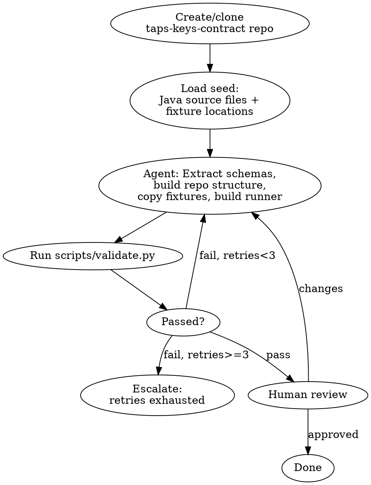
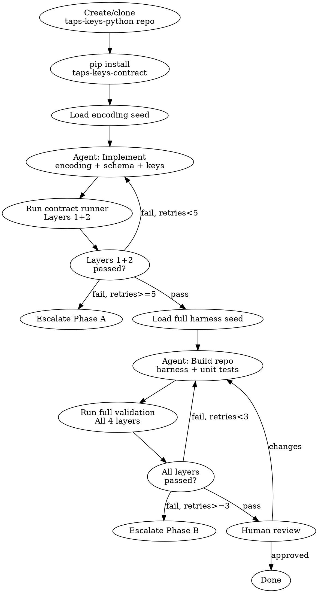

# taps-keys Python Port Implementation Plan

> **For agentic workers:** REQUIRED SUB-SKILL: Use superpowers:subagent-driven-development (recommended) or superpowers:executing-plans to implement this plan task-by-task. Steps use checkbox (`- [ ]`) syntax for tracking.

**Goal:** Produce a Python taps-keys library with guaranteed byte-for-byte encoding compatibility with the Java original, using a contract repo as the single source of truth.

**Architecture:** Two fabro workflows — Workflow 1 builds the contract repo (schemas + golden fixtures + test runner), Workflow 2 builds the Python library (validated against the contract). sf-try methodology: contract-owned test runner, controlled error feedback, agent isolation from fixtures.

**Tech Stack:** Java 11 (fixture generation), Python 3.10+ (contract repo + Python lib), fabro (workflow orchestration), gh CLI (repo creation), Artifactory (package publishing)

**Spec:** `docs/superpowers/specs/2026-04-21-taps-keys-python-port-design.md`

---

## File Map

### Artifacts created by this plan (for review before any workflow runs)

| File | Purpose |
|---|---|
| `tools/taps-keys-fixture-gen/FixtureGenerator.java` | Java main class that produces golden fixtures from the real taps-keys lib |
| `tools/taps-keys-fixture-gen/build.gradle` | Build file for the fixture generator |
| `docs/seeds/taps-keys-python-seed.md` | Pedagogical seed document for Workflow 2 agent |
| `.fabro/workflows/taps-keys-contract/workflow.toml` | Fabro Workflow 1 definition |
| `.fabro/workflows/taps-keys-contract/workflow.dot` | Fabro Workflow 1 graph |
| `.fabro/workflows/taps-keys-contract/prompts/extract.md` | Fabro Workflow 1 agent seed (~500 lines) |
| `.fabro/workflows/taps-keys-python/workflow.toml` | Fabro Workflow 2 definition |
| `.fabro/workflows/taps-keys-python/workflow.dot` | Fabro Workflow 2 graph |
| `.fabro/workflows/taps-keys-python/prompts/full-harness.md` | Fabro Workflow 2 Phase B seed |

### Artifacts produced by workflows (after review + execution)

| Repo | Key files |
|---|---|
| `Skyscanner/taps-keys-contract` | schemas.json, fixtures/, runner/, scripts/validate.py, repo harness |
| `Skyscanner/taps-keys-python` | src/taps_keys/, tests/, scripts/validate.py, repo harness |

---

## Phase 1: Create Artifacts for Review

### Task 1: Write the Java Fixture Generator

The trust anchor. This runs the real Java taps-keys lib to produce golden fixtures that both workflows depend on.

**Files:**
- Create: `tools/taps-keys-fixture-gen/FixtureGenerator.java`
- Create: `tools/taps-keys-fixture-gen/build.gradle`

- [ ] **Step 1: Create the build.gradle**

```groovy
plugins {
    id 'java'
    id 'application'
}

java {
    toolchain {
        languageVersion = JavaLanguageVersion.of(11)
    }
}

repositories {
    maven {
        url "https://artifactory.skyscannertools.net/artifactory/maven"
        credentials {
            username "$SKYSCANNER_ARTIFACTORY_MAVEN_USER"
            password "$SKYSCANNER_ARTIFACTORY_MAVEN_PASSWORD"
        }
    }
}

dependencies {
    implementation 'net.skyscanner.taps-keys:taps-keys:0.0.58'
    implementation 'com.google.code.gson:gson:2.10.1'
}

application {
    mainClass = 'net.skyscanner.tools.FixtureGenerator'
}
```

- [ ] **Step 2: Write FixtureGenerator.java**

This class must:
1. Iterate ALL 130 schema constants via reflection (Keys.OneWay and Keys.Return fields)
2. For each schema, build keys with 5 distinct input sets (A through E from the spec)
3. For each key, capture: schema name, input set ID, inputs, encoded key, toString, toString with pipe joiner, encoded length, OpenJawFilter
4. For each schema, compute the 6 signature/disjoint checks (originAirport, destinationAirport, outboundYearMonth, outboundDay, inboundYearMonth, inboundDay)
5. Output two JSON files: `golden_encodings.json` and `golden_signatures.json`

```java
package net.skyscanner.tools;

import com.google.gson.Gson;
import com.google.gson.GsonBuilder;
import java.io.FileWriter;
import java.io.IOException;
import java.lang.reflect.Field;
import java.lang.reflect.Modifier;
import java.time.LocalDate;
import java.util.ArrayList;
import java.util.LinkedHashMap;
import java.util.List;
import java.util.Map;
import java.util.Collections;
import net.skyscanner.taps.keys.Key;
import net.skyscanner.taps.keys.KeyBuilder;
import net.skyscanner.taps.keys.KeySchema;
import net.skyscanner.taps.keys.Keys;
import net.skyscanner.taps.keys.encoding.KeyComponentSignature;

public class FixtureGenerator {

    // Input Set A: Standard (same as KeyTest.java)
    static final int ORIG_A = 13554;
    static final int DEST_A = 13555;
    static final int CARRIER_A = -32480;
    static final LocalDate OUTBOUND_A = LocalDate.parse("2018-07-08");
    static final LocalDate INBOUND_A = LocalDate.parse("2018-08-25");
    static final boolean DIRECT_A = true;

    // Input Set B: Boundary minimums/maximums
    static final int ORIG_B = 0;
    static final int DEST_B = 65535;
    static final int CARRIER_B = -32768;
    static final LocalDate OUTBOUND_B = LocalDate.parse("1970-01-01");
    static final LocalDate INBOUND_B = LocalDate.parse("1970-01-01");
    static final boolean DIRECT_B = true;

    // Input Set C: Arbitrary non-special values
    static final int ORIG_C = 1;
    static final int DEST_C = 2;
    static final int CARRIER_C = 100;
    static final LocalDate OUTBOUND_C = LocalDate.parse("2025-12-31");
    static final LocalDate INBOUND_C = LocalDate.parse("2026-01-15");
    static final boolean DIRECT_C = true;

    // Input Set D: isDirect=false
    static final int ORIG_D = 13554;
    static final int DEST_D = 13555;
    static final int CARRIER_D = -32480;
    static final LocalDate OUTBOUND_D = LocalDate.parse("2018-07-08");
    static final LocalDate INBOUND_D = LocalDate.parse("2018-08-25");
    static final boolean DIRECT_D = false;

    // Signature probe schemas (one-component schemas for disjoint checks)
    static final List<KeyComponentSignature> ORIGIN_AIRPORT_SIG =
        KeySchema.builder("").originAirport().build().signature();
    static final List<KeyComponentSignature> DEST_AIRPORT_SIG =
        KeySchema.builder("").destinationAirport().build().signature();
    static final List<KeyComponentSignature> OUTBOUND_YM_SIG =
        KeySchema.builder("").outboundDepartureYearMonth().build().signature();
    static final List<KeyComponentSignature> OUTBOUND_DAY_SIG =
        KeySchema.builder("").outboundDepartureDay().build().signature();
    static final List<KeyComponentSignature> INBOUND_YM_SIG =
        KeySchema.builder("").inboundDepartureYearMonth().build().signature();
    static final List<KeyComponentSignature> INBOUND_DAY_SIG =
        KeySchema.builder("").inboundDepartureDay().build().signature();

    public static void main(String[] args) throws Exception {
        List<Map<String, Object>> encodings = new ArrayList<>();
        List<Map<String, Object>> signatures = new ArrayList<>();

        // Collect OneWay schemas
        for (Field f : Keys.OneWay.class.getDeclaredFields()) {
            if (Modifier.isPublic(f.getModifiers()) && Modifier.isStatic(f.getModifiers())
                    && f.getType() == KeySchema.class) {
                KeySchema schema = (KeySchema) f.get(null);
                String name = f.getName();
                generateEncodings(encodings, name, "oneway", schema);
                generateSignatures(signatures, name, schema);
            }
        }

        // Collect Return schemas
        for (Field f : Keys.Return.class.getDeclaredFields()) {
            if (Modifier.isPublic(f.getModifiers()) && Modifier.isStatic(f.getModifiers())
                    && f.getType() == KeySchema.class) {
                KeySchema schema = (KeySchema) f.get(null);
                String name = f.getName();
                generateEncodings(encodings, name, "return", schema);
                generateSignatures(signatures, name, schema);
            }
        }

        Gson gson = new GsonBuilder().setPrettyPrinting().create();

        try (FileWriter w = new FileWriter("golden_encodings.json")) {
            gson.toJson(encodings, w);
        }
        try (FileWriter w = new FileWriter("golden_signatures.json")) {
            gson.toJson(signatures, w);
        }

        System.out.println("Generated " + encodings.size() + " encoding fixtures");
        System.out.println("Generated " + signatures.size() + " signature fixtures");
    }

    static void generateEncodings(List<Map<String, Object>> out, String name,
            String prefix, KeySchema schema) {
        // Sets A-D: concrete values
        Object[][] sets = {
            {"A", ORIG_A, DEST_A, CARRIER_A, OUTBOUND_A, INBOUND_A, DIRECT_A},
            {"B", ORIG_B, DEST_B, CARRIER_B, OUTBOUND_B, INBOUND_B, DIRECT_B},
            {"C", ORIG_C, DEST_C, CARRIER_C, OUTBOUND_C, INBOUND_C, DIRECT_C},
            {"D", ORIG_D, DEST_D, CARRIER_D, OUTBOUND_D, INBOUND_D, DIRECT_D},
        };

        for (Object[] set : sets) {
            try {
                Key key = buildKey(schema, (int) set[1], (int) set[2], (int) set[3],
                        (LocalDate) set[4], (LocalDate) set[5], (boolean) set[6]);
                Map<String, Object> entry = new LinkedHashMap<>();
                entry.put("schema", name);
                entry.put("prefix", prefix);
                entry.put("input_set", (String) set[0]);
                entry.put("origin", set[1]);
                entry.put("destination", set[2]);
                entry.put("carrier", set[3]);
                entry.put("outbound_date", set[4].toString());
                entry.put("inbound_date", set[5].toString());
                entry.put("is_direct", set[6]);
                entry.put("encoded_key", key.encode());
                entry.put("to_string", key.toString());
                entry.put("to_string_pipe", key.toString('|'));
                entry.put("schema_to_string", schema.toString());
                entry.put("encoded_length", schema.encodedLength());
                entry.put("open_jaw_filter", schema.getOpenJawFilter().name());
                out.add(entry);
            } catch (Exception e) {
                System.err.println("WARN: Set " + set[0] + " failed for " + name + ": " + e.getMessage());
            }
        }

        // Set E: trailing wildcard (anyDirect)
        try {
            Key key = buildKeyWithWildcard(schema, ORIG_A, DEST_A, CARRIER_A,
                    OUTBOUND_A, INBOUND_A);
            Map<String, Object> entry = new LinkedHashMap<>();
            entry.put("schema", name);
            entry.put("prefix", prefix);
            entry.put("input_set", "E");
            entry.put("origin", ORIG_A);
            entry.put("destination", DEST_A);
            entry.put("carrier", CARRIER_A);
            entry.put("outbound_date", OUTBOUND_A.toString());
            entry.put("inbound_date", INBOUND_A.toString());
            entry.put("is_direct", "wildcard");
            entry.put("encoded_key", key.encode());
            entry.put("to_string", key.toString());
            entry.put("to_string_pipe", key.toString('|'));
            entry.put("schema_to_string", schema.toString());
            entry.put("encoded_length", schema.encodedLength());
            entry.put("open_jaw_filter", schema.getOpenJawFilter().name());
            out.add(entry);
        } catch (Exception e) {
            System.err.println("WARN: Set E failed for " + name + ": " + e.getMessage());
        }
    }

    static Key buildKey(KeySchema schema, int orig, int dest, int carrier,
            LocalDate outbound, LocalDate inbound, boolean isDirect) {
        return schema.keyBuilder()
                .marketingCarrier(carrier)
                .originAirport(orig)
                .originCity(orig)
                .originCountry(orig)
                .origin(orig)
                .destinationAirport(dest)
                .destinationCity(dest)
                .destinationCountry(dest)
                .destination(dest)
                .outboundDepartureYearMonth(outbound)
                .outboundDepartureDay(outbound)
                .inboundDepartureYearMonth(inbound)
                .inboundDepartureDay(inbound)
                .isDirect(isDirect)
                .build();
    }

    static Key buildKeyWithWildcard(KeySchema schema, int orig, int dest, int carrier,
            LocalDate outbound, LocalDate inbound) {
        return schema.keyBuilder()
                .marketingCarrier(carrier)
                .originAirport(orig)
                .originCity(orig)
                .originCountry(orig)
                .origin(orig)
                .destinationAirport(dest)
                .destinationCity(dest)
                .destinationCountry(dest)
                .destination(dest)
                .outboundDepartureYearMonth(outbound)
                .outboundDepartureDay(outbound)
                .inboundDepartureYearMonth(inbound)
                .inboundDepartureDay(inbound)
                .isDirect(KeyBuilder.anyDirect())
                .build();
    }

    static void generateSignatures(List<Map<String, Object>> out, String name,
            KeySchema schema) {
        Map<String, Object> entry = new LinkedHashMap<>();
        entry.put("schema", name);
        entry.put("schema_to_string", schema.toString());
        entry.put("origin_airport_disjoint",
                Collections.disjoint(schema.signature(), ORIGIN_AIRPORT_SIG));
        entry.put("destination_airport_disjoint",
                Collections.disjoint(schema.signature(), DEST_AIRPORT_SIG));
        entry.put("outbound_year_month_disjoint",
                Collections.disjoint(schema.signature(), OUTBOUND_YM_SIG));
        entry.put("outbound_day_disjoint",
                Collections.disjoint(schema.signature(), OUTBOUND_DAY_SIG));
        entry.put("inbound_year_month_disjoint",
                Collections.disjoint(schema.signature(), INBOUND_YM_SIG));
        entry.put("inbound_day_disjoint",
                Collections.disjoint(schema.signature(), INBOUND_DAY_SIG));
        out.add(entry);
    }
}
```

- [ ] **Step 3: Commit**

```bash
git add tools/taps-keys-fixture-gen/
git commit -m "feat: add Java fixture generator for taps-keys contract"
```

---

### Task 2: Run the Fixture Generator

**Manual step — you run this and verify the output.**

- [ ] **Step 1: Build and run**

```bash
cd tools/taps-keys-fixture-gen
./gradlew run
```

Expected output:
```
Generated 650 encoding fixtures
Generated 130 signature fixtures
```

Produces: `golden_encodings.json` (~650 entries) and `golden_signatures.json` (130 entries).

- [ ] **Step 2: Spot-check against known Java test values**

Verify a few entries match KeyTest.java assertions:
```bash
# AIRPORT_AIRPORT_DAY_OW, Set A should produce "0d7i0d7ji681"
jq '.[] | select(.schema == "AIRPORT_AIRPORT_DAY_OW" and .input_set == "A") | .encoded_key' golden_encodings.json
```

Expected: `"0d7i0d7ji681"`

```bash
# Count: should be 650 encodings, 130 signatures
jq length golden_encodings.json
jq length golden_signatures.json
```

- [ ] **Step 3: Move fixtures to a staging location**

```bash
mkdir -p /tmp/taps-keys-fixtures
cp golden_encodings.json golden_signatures.json /tmp/taps-keys-fixtures/
```

---

### Task 3: Write the Workflow 2 Seed Document

The pedagogical API spec that the Workflow 2 agent receives. This teaches the encoding algorithm through reasoning and worked examples, not just rules.

**Files:**
- Create: `docs/seeds/taps-keys-python-seed.md`

- [ ] **Step 1: Write the seed document**

```markdown
# taps-keys Python Library — Implementation Seed

## What You're Building

A Python library that encodes flight pricing lookup keys for Skyscanner's File Cache Proxy (FCP). Each key is a compact string that identifies a specific flight route + date + directionality combination. The keys must be **byte-for-byte identical** to what the existing Java library produces — FCP consumers depend on exact key matching.

## The Core Concept

A `KeySchema` defines an ordered list of typed components. A `KeyBuilder` accepts values for those components. `Key.encode()` concatenates each component's fixed-width base-32 encoding.

Think of it like a composite database key: `(origin, destination, month, day, isDirect)` — but instead of storing as separate columns, the values are encoded into a single compact string.

## Base-32 Encoding

The alphabet is `0123456789abcdefghijklmnopqrstuv` (32 characters: 10 digits + first 22 lowercase letters). Always lowercase. Never uppercase.

To encode an integer `n` in base-32 with width `w`:
1. Repeatedly divmod by 32, mapping remainders to the alphabet
2. Left-pad with `'0'` to exactly `w` characters

Python has no built-in base-32 string function. You need a custom encoder:

```python
_ALPHABET = "0123456789abcdefghijklmnopqrstuv"

def to_base32(n: int, width: int) -> str:
    if n == 0:
        return "0" * width
    chars = []
    while n > 0:
        chars.append(_ALPHABET[n % 32])
        n //= 32
    return "".join(reversed(chars)).rjust(width, "0")
```

## Component Types

Each component type has a fixed encoding width:

| Type | Width (chars) | Value range | Encoding |
|---|---|---|---|
| AIRPORT | 4 | [0, 65536] | `to_base32(value, 4)` |
| CITY | 4 | [0, 65536] | `to_base32(value, 4)` |
| COUNTRY | 4 | [0, 65536] | `to_base32(value, 4)` |
| LOCATION | 4 | [0, 65536] | `to_base32(value, 4)` |
| YEARMONTH | 2 | [0, 1024] | `to_base32((year - 1970) * 12 + (month - 1), 2)` |
| DAY | 1 | [0, 32] | `to_base32(day_of_month, 1)` |
| DIRECT | 1 | {0, 1} | `to_base32(1 if direct else 0, 1)` |
| MARKETING_CARRIER | 4 | input [-32768, 32767] | `to_base32(carrier_id + 32768, 4)` |

**Every type must validate its input range and raise ValueError on out-of-range values.** Silent overflow is the worst failure mode — it produces a valid-looking but wrong key.

## Key.encode()

Concatenate each component's encoded string in schema order. That's it.

If a component is a wildcard (trailing only), stop concatenating — wildcards mean "omit the rest."

## Worked Examples

### Example 1: AIRPORT_AIRPORT_DAY_OW

Schema components: `[AIRPORT/origin, AIRPORT/destination, YEARMONTH/outbound, DAY/outbound, DIRECT]`

Inputs: origin=13554, destination=13555, outbound=2018-07-08, isDirect=true

Step-by-step:
```
1. AIRPORT origin: 13554
   13554 ÷ 32 = 423 remainder 18 → 'i'
   423 ÷ 32 = 13 remainder 7 → '7'
   13 ÷ 32 = 0 remainder 13 → 'd'
   Result: "d7i" → pad to 4: "0d7i"

2. AIRPORT destination: 13555
   13555 ÷ 32 = 423 remainder 19 → 'j'
   423 ÷ 32 = 13 remainder 7 → '7'
   13 ÷ 32 = 0 remainder 13 → 'd'
   Result: "d7j" → pad to 4: "0d7j"

3. YEARMONTH outbound: 2018-07-08
   value = (2018 - 1970) * 12 + (7 - 1) = 48*12 + 6 = 582
   582 ÷ 32 = 18 remainder 6 → '6'
   18 ÷ 32 = 0 remainder 18 → 'i'
   Result: "i6" → pad to 2: "i6"

4. DAY outbound: day 8
   8 < 32, single char: "8"

5. DIRECT: true → 1 → "1"

Concatenate: "0d7i" + "0d7j" + "i6" + "8" + "1" = "0d7i0d7ji681"
```

### Example 2: CARRIER_CITY_COUNTRY_ANYTIME_OW

Schema: `[MARKETING_CARRIER/"", CITY/origin, COUNTRY/destination, YEARMONTH/outbound, DIRECT]`

Inputs: carrier=-32480, origin_city=11135, dest_country=11235, outbound=2018-07-08, isDirect=true

```
1. CARRIER: -32480 + 32768 = 288
   288 ÷ 32 = 9 remainder 0 → '0'
   9 ÷ 32 = 0 remainder 9 → '9'
   Result: "90" → pad to 4: "0090"

2. CITY origin: 11135
   11135 in base-32 = "arv" → pad to 4: "0arv"

3. COUNTRY destination: 11235
   11235 in base-32 = "av3" → pad to 4: "0av3"

4. YEARMONTH: 582 → "i6"

5. DIRECT: true → "1"

Concatenate: "0090" + "0arv" + "0av3" + "i6" + "1" = "00900arv0av3i61"
```

### Example 3: Wildcard (anyDirect)

Same as Example 1 but isDirect=wildcard (trailing):

```
Components 1-4 encode the same: "0d7i0d7ji68"
Component 5 (DIRECT) is wildcard → stop concatenating
Result: "0d7i0d7ji68" (no trailing "1" or "0")
```

### Example 4: January 1970 (boundary)

AIRPORT_AIRPORT_DAY_OW, origin=13554, dest=13555, outbound=1970-01-01, isDirect=true

```
YEARMONTH: (1970-1970)*12 + (1-1) = 0 → "00"
DAY: 1 → "1"
Result: "0d7i0d7j0011"
```

### Example 5: isDirect=false

AIRPORT_AIRPORT_DAY_OW, origin=13554, dest=13555, outbound=2018-07-08, isDirect=false

```
Same as Example 1 except DIRECT: false → 0 → "0"
Result: "0d7i0d7ji680"
```

### Example 6: Return flight

AIRPORT_AIRPORT_DAY_RTN, origin=13554, dest=13555, outbound=2018-07-08, inbound=2018-08-25, isDirect=true

Schema: `[AIRPORT/origin, AIRPORT/dest, YEARMONTH/outbound, YEARMONTH/inbound, DAY/outbound, DAY/inbound, DIRECT]`

```
1-2: "0d7i" + "0d7j"
3. YEARMONTH outbound: 582 → "i6"
4. YEARMONTH inbound: (2018-1970)*12 + (8-1) = 583 → "i7"
5. DAY outbound: 8 → "8"
6. DAY inbound: 25 → 25 in base-32 = "p"
7. DIRECT: true → "1"

Result: "0d7i0d7ji6i78p1"
```

### Example 7: Negative carrier

CARRIER_AIRPORT_AIRPORT_ANYTIME_OW, carrier=-32480, origin=13554, dest=13555, outbound=2018-07-08, isDirect=true

```
CARRIER: -32480 + 32768 = 288 → "0090"
Result: "0090" + "0d7i" + "0d7j" + "i6" + "1" = "00900d7i0d7ji61"
```

### Example 8: Value zero (boundary)

AIRPORT_AIRPORT_DAY_OW, origin=0, dest=0, outbound=1970-01-01, isDirect=true

```
AIRPORT origin: 0 → "0000"
AIRPORT dest: 0 → "0000"
YEARMONTH: 0 → "00"
DAY: 1 → "1"
DIRECT: true → "1"
Result: "000000000011"
```

### Example 9: Maximum carrier

CARRIER_AIRPORT_AIRPORT_ANYTIME_OW, carrier=32767, origin=13554, dest=13555, outbound=2018-07-08, isDirect=true

```
CARRIER: 32767 + 32768 = 65535 → "1vvv"
Result: "1vvv" + "0d7i" + "0d7j" + "i6" + "1" = "1vvv0d7i0d7ji61"
```

### Example 10: Country + anytime (short key)

COUNTRY_ANYWHERE_DESTINATIONCOUNTRY_ANYTIME_OW, origin_country=11236, dest_country=11235, isDirect=false

Schema: `[COUNTRY/origin, COUNTRY/destination, DIRECT]`

```
COUNTRY origin: 11236 in base-32 = "av4" → "0av4"
COUNTRY dest: 11235 → "0av3"
DIRECT: false → "0"
Result: "0av40av30"
```

## KeySchema.toString() (PRODUCTION CRITICAL)

This is used as the FCP file store name. Wrong value = data written to wrong location.

Format: `prefix + "_" + join("_", [name + display_name for each component])`

Display names (exact, PascalCase):
- AIRPORT → "Airport", CITY → "City", COUNTRY → "Country", LOCATION → "Location"
- YEARMONTH → "YearMonth", DAY → "Day"
- DIRECT → "Direct", MARKETING_CARRIER → "MarketingCarrier"

Names: "origin", "destination", "outboundDeparture", "inboundDeparture", or "" (empty for DIRECT/MARKETING_CARRIER)

Concatenation: `name + display_name` (no separator). Empty name means just the display name.

Example: `oneway_MarketingCarrier_originAirport_destinationAirport_outboundDepartureYearMonth_Direct`

## KeyBuilder Behavior

The builder stores ALL setter values in a dict keyed by (type, name) tuples. At build() time, ONLY the schema's components are looked up. Extra values are silently ignored.

This is critical: the caller sets ALL fields regardless of schema. The builder picks the right ones.

At build() time:
1. Iterate schema components in order
2. Look up each (type, name) in the dict
3. Missing → raise error
4. Wildcard → all subsequent must also be wildcard
5. Extra dict entries → silently ignored

## KeySchema.signature() and disjoint checks

`signature()` returns the list of (type, name) pairs. Used with set-disjoint to check if a component is in the schema.

`disjoint(schema.signature(), [(AIRPORT, "origin")])` → True if the schema does NOT contain an AIRPORT origin component.

This drives whether a field goes in the key (disjoint=False, skip from value) or in the protobuf value (disjoint=True, include).

## OpenJawFilter

For return schemas: check if components include (AIRPORT, "origin") and/or (AIRPORT, "destination").
- Both → BOTH
- Origin only → ORIGIN
- Destination only → DESTINATION
- Neither → NONE

All oneway schemas → NONE.

## Spark Serialization

KeySchema must be picklable. PySpark ships UDF closures via pickle. Test this explicitly.

## What NOT To Do

- Never hardcode value→encoding mappings. The encoding must be algorithmic.
- Never produce uppercase letters in base-32 output.
- Raise on out-of-range values for all types EXCEPT: replicate the Java YEARMONTH boundary exactly. Java allows value 1024 (maxValue = 2^10) despite it producing 3 chars ("100") for a 2-char field. This is a known Java edge case — do NOT "fix" it. Replicate the same range check (`<= 2^numBits`) and the same silent overflow behavior.
- Never bundle a copy of schemas.json — import it from the taps-keys-contract package using `importlib.resources`:
  ```python
  from importlib.resources import files
  import json
  schemas = json.loads(files("taps_keys_contract").joinpath("schemas.json").read_text())
  ```
- Never write fixture-loading test code — the contract runner handles that.

## Self-Check Before Submitting

- [ ] Can you encode a value you've never seen in the examples?
- [ ] Does `to_base32(0, 4)` produce `"0000"`?
- [ ] Does `to_base32(13554, 4)` produce `"0d7i"` (lowercase)?
- [ ] Does carrier -32768 encode to `"0000"` and 32767 encode to `"1vvv"`?
- [ ] Does KeySchema.to_string() produce the exact FCP file store name format?
- [ ] Does the builder silently ignore fields not in the schema?
- [ ] Is KeySchema picklable?
- [ ] Does your validate.py call the contract runner, NOT your own fixture tests?

## Output Format

Your repo structure must be:
```
taps-keys-python/
  pyproject.toml
  Makefile
  README.md
  CONTRIBUTING.md
  CLAUDE.md
  src/taps_keys/
    __init__.py
    encoding.py
    schema.py
    keys.py
    website_id.py
  tests/
    test_encoding.py
    test_schema.py
    test_website_id.py
  scripts/
    validate.py
  .claude/
    agents/
      sync-contract.md
```
```

- [ ] **Step 2: Commit**

```bash
git add docs/seeds/taps-keys-python-seed.md
git commit -m "feat: add Workflow 2 seed document for taps-keys Python port"
```

---

### Task 4: Create Fabro Workflow 1 — Build the Contract

**Files:**
- Create: `.fabro/workflows/taps-keys-contract/workflow.toml`
- Create: `.fabro/workflows/taps-keys-contract/workflow.dot`

- [ ] **Step 1: Write workflow.toml**

```toml
[workflow]
name = "taps-keys-contract"
description = "Build the taps-keys contract repo with schemas, golden fixtures, and test runner"

[workflow.env]
FIXTURES_DIR = "/tmp/taps-keys-fixtures"

[stages.create_repo]
type = "command"
command = "gh repo create Skyscanner/taps-keys-contract --private --clone || git clone git@github.com:Skyscanner/taps-keys-contract.git"

[stages.seed]
type = "prompt"
prompt_file = "prompts/extract.md"

[stages.extract]
type = "agent"
model = "claude-opus-4-6"

[stages.validate]
type = "command"
command = "cd taps-keys-contract && python scripts/validate.py"

[stages.check]
type = "conditional"
condition = "exit_code == 0"

[stages.human_review]
type = "human"
prompt = "Review the taps-keys-contract repo. Check schemas.json, runner, validate.py."

[stages.done]
type = "command"
command = "echo 'Contract repo complete'"

[stages.escalate]
type = "human"
prompt = "Workflow 1 failed after 3 retries. Review errors and intervene."
```

- [ ] **Step 2: Write workflow.dot**



- [ ] **Step 3: Write the agent prompt for the extract stage**

Create `.fabro/workflows/taps-keys-contract/prompts/extract.md`. This is the Workflow 1 seed — it must contain everything the agent needs to build the contract repo. The sections are:

**Section 1 — Context and goal** (~20 lines): What is taps-keys, what is the contract repo, why it exists.

**Section 2 — Input files** (~30 lines): List the exact Java files the agent must read, with paths:
- `/Users/haroldoolivieri/Development/Skyscanner/backend/dependencies/taps-keys/src/main/java/net/skyscanner/taps/keys/Keys.java`
- `/Users/haroldoolivieri/Development/Skyscanner/backend/dependencies/taps-keys/src/main/java/net/skyscanner/taps/keys/KeySchemaBuilder.java`
- The builder method → (type, name) mapping table from the spec

**Section 3 — schemas.json format** (~40 lines): The exact JSON structure from the spec (lines 80-119), including the `component_types` section with bits, encoded_length, and offset.

**Section 4 — Extraction rules** (~50 lines): How to parse Keys.java builder chains into schemas.json component lists. Explicit mapping: `.originAirport()` → `["AIRPORT", "origin"]`, etc. (the full 14-method table).

**Section 5 — Golden fixtures** (~20 lines): Copy `$FIXTURES_DIR/golden_encodings.json` and `$FIXTURES_DIR/golden_signatures.json` into `fixtures/`. Do not modify them.

**Section 6 — Contract runner** (~100 lines): Implement `runner/test_runner.py` and `runner/error_formatter.py`. The runner must:
- Accept a module name via `--module` arg
- Import the module dynamically
- Load fixtures from its own package
- Run 3 layers: encoding (Layer 1), signatures (Layer 2), structural (Layer 3)
- Exit 0 on all pass, exit 1 on any fail
- Error output format (exact, from the spec):
  ```
  LAYER 1 FAIL [N/650]: Set X, SCHEMA_NAME
    encode(): expected M chars, got N chars
    first difference at position P
  ```
  Reveal: layer, case number, schema, nature of mismatch (length, position, boolean flip).
  Do NOT reveal: full expected value.

**Section 7 — validate.py** (~60 lines): The 13 validation checks from the spec (structural, derived, cross-reference). Each check with its exact logic:
1. schemas.json conforms to schemas.schema.json
2. Count: 65 oneway + 65 return
3. Component types only from {AIRPORT, CITY, COUNTRY, LOCATION, YEARMONTH, DAY, DIRECT, MARKETING_CARRIER}
4. No duplicate schema names
5. toString derivation: `prefix + "_" + join("_", [name + displayName])` with the exact display name table
6. encoded_length = sum of component encoded_lengths
7. OpenJawFilter derivation from (AIRPORT, "origin") and (AIRPORT, "destination") presence
8. golden_encodings.json has 5 entries per schema
9. Bidirectional coverage: every schema in both files
10. golden_signatures.json schemas exist in schemas.json
11. Valid JSON structure
12. Signature/disjoint consistency with component lists
13. toString values in golden_encodings.json match derived toString

**Section 8 — schemas.schema.json** (~30 lines): The JSON Schema definition for validating schemas.json structure.

**Section 9 — Repo harness** (~80 lines): README (what, why, how to add schemas), CONTRIBUTING (dev setup, validation), CLAUDE.md (constitution: encoding rules, what not to change), add-schema.md skill (steps including JVM requirement for fixtures), Makefile (`make validate`), pyproject.toml (publishable as `taps-keys-contract`).

**Section 10 — Validator defenses** (~20 lines): The validate.py checks must be simple (count comparisons, JSON Schema, string formatting). No complex logic. The human reviewer should be able to read validate.py and verify each check in under 30 seconds.

- [ ] **Step 4: Write the Phase B seed for Workflow 2**

Create `.fabro/workflows/taps-keys-python/prompts/full-harness.md`:

```markdown
# Phase B: Full Repo Harness

Encoding passes all contract tests. Now build the complete repo:

## What to create

1. **README.md** — what this lib is, installation (`pip install taps-keys`), usage example (the encode snippet from the spec), how schemas.json is pulled from contract repo
2. **CONTRIBUTING.md** — dev setup, `make validate`, how to sync contract, how new schemas flow
3. **CLAUDE.md** — constitution: encoding rules are immutable, never bundle schemas.json, always use contract runner for validation, never modify fixture-loading code
4. **Makefile** — targets: `validate` (runs scripts/validate.py), `test` (runs pytest), `lint`, `sync-contract` (pip install --upgrade taps-keys-contract && make validate)
5. **pyproject.toml** — package name `taps-keys`, depends on `taps-keys-contract>=1.0`, Python >=3.10
6. **.claude/agents/sync-contract.md** — skill that upgrades the contract package and runs validation
7. **Unit tests:**
   - `tests/test_encoding.py` — base-32 edge cases: 0, 1, max per type, carrier boundaries (-32768, 32767, out-of-range throws)
   - `tests/test_schema.py` — builder silently ignores extra fields, wildcards must be trailing, KeySchema is picklable, toString format, encoded_length calculation
   - `tests/test_website_id.py` — encode_to_fixed32("GBUK") roundtrips, 4-byte big-endian
8. **scripts/validate.py** — calls contract runner (`python -m taps_keys_contract.runner --module taps_keys`) then runs `pytest tests/`. Exit 0 only if BOTH pass.
```

- [ ] **Step 4: Commit**

```bash
git add .fabro/workflows/taps-keys-contract/
git commit -m "feat: add fabro Workflow 1 — taps-keys contract"
```

---

### Task 5: Create Fabro Workflow 2 — Build Python taps-keys

**Files:**
- Create: `.fabro/workflows/taps-keys-python/workflow.toml`
- Create: `.fabro/workflows/taps-keys-python/workflow.dot`

- [ ] **Step 1: Write workflow.toml**

```toml
[workflow]
name = "taps-keys-python"
description = "Build the Python taps-keys library, validated against the contract"

[stages.create_repo]
type = "command"
command = "gh repo create Skyscanner/taps-keys-python --private --clone || git clone git@github.com:Skyscanner/taps-keys-python.git"

[stages.install_contract]
type = "command"
command = "pip install taps-keys-contract"

[stages.seed_encoding]
type = "prompt"
prompt_file = "../../../docs/seeds/taps-keys-python-seed.md"

[stages.agent_encoding]
type = "agent"
model = "claude-opus-4-6"

[stages.validate_encoding]
type = "command"
command = "cd taps-keys-python && python -m taps_keys_contract.runner --module taps_keys --layers 1,2"

[stages.check_encoding]
type = "conditional"
condition = "exit_code == 0"

[stages.seed_full]
type = "prompt"
prompt_file = "prompts/full-harness.md"

[stages.agent_full]
type = "agent"
model = "claude-opus-4-6"

[stages.validate_full]
type = "command"
command = "cd taps-keys-python && python scripts/validate.py"

[stages.check_full]
type = "conditional"
condition = "exit_code == 0"

[stages.human_review]
type = "human"
prompt = "Review the taps-keys-python repo. Check encoding correctness, repo harness, unit tests."

[stages.done]
type = "command"
command = "echo 'Python lib complete'"

[stages.escalate_a]
type = "human"
prompt = "Phase A (encoding) failed after 5 retries. Review errors."

[stages.escalate_b]
type = "human"
prompt = "Phase B (full suite) failed after 3 retries. Review errors."
```

- [ ] **Step 2: Write workflow.dot**



- [ ] **Step 3: Commit**

```bash
git add .fabro/workflows/taps-keys-python/
git commit -m "feat: add fabro Workflow 2 — taps-keys Python implementation"
```

---

## Phase 2: Review Gate

**All artifacts from Phase 1 are now committed. You review:**

### Task 6: Review All Artifacts

- [ ] **Step 1: Review the fixture generator** (`tools/taps-keys-fixture-gen/FixtureGenerator.java`)
  - Does it cover all 130 schemas?
  - Are the 5 input sets correct?
  - Does it capture all needed fields (encode, toString, signatures)?

- [ ] **Step 2: Review the seed document** (`docs/seeds/taps-keys-python-seed.md`)
  - Are the 10 worked examples correct?
  - Is the algorithm explanation clear enough for an agent to implement from?
  - Are anti-patterns and self-checks comprehensive?

- [ ] **Step 3: Review Workflow 1** (`.fabro/workflows/taps-keys-contract/`)
  - Is the extract prompt comprehensive?
  - Are retry limits appropriate?
  - Does the validation cover all checks from the spec?

- [ ] **Step 4: Review Workflow 2** (`.fabro/workflows/taps-keys-python/`)
  - Is the phased approach correct?
  - Does the seed document contain everything the agent needs?
  - Are retry limits appropriate?

---

## Phase 3: Execute

### Task 7: Generate Golden Fixtures

- [ ] **Step 1: Run the fixture generator** (you, manually)

```bash
cd tools/taps-keys-fixture-gen
./gradlew run
```

- [ ] **Step 2: Verify output**

```bash
jq length golden_encodings.json    # expect 650
jq length golden_signatures.json   # expect 130
```

- [ ] **Step 3: Stage fixtures for Workflow 1**

```bash
cp golden_encodings.json golden_signatures.json /tmp/taps-keys-fixtures/
```

---

### Task 8: Run Workflow 1 — Build the Contract

- [ ] **Step 1: Run the workflow**

```bash
fabro run taps-keys-contract
```

- [ ] **Step 2: Review at human gate** — approve or request changes

- [ ] **Step 3: Publish to Artifactory** (after approval)

```bash
cd taps-keys-contract
python -m build
twine upload --repository artifactory dist/*
```

---

### Task 9: Run Workflow 2 — Build Python taps-keys

- [ ] **Step 1: Run the workflow**

```bash
fabro run taps-keys-python
```

- [ ] **Step 2: Review at human gate** — approve or request changes

- [ ] **Step 3: Publish to Artifactory**

```bash
cd taps-keys-python
python -m build
twine upload --repository artifactory dist/*
```

- [ ] **Step 4: Verify end-to-end**

```python
from taps_keys.keys import OneWay
from datetime import date

key = (OneWay.AIRPORT_AIRPORT_DAY_OW
    .key_builder()
    .origin_airport(13554)
    .destination_airport(13555)
    .outbound_departure_year_month(date(2018, 7, 8))
    .outbound_departure_day(date(2018, 7, 8))
    .is_direct(True)
    .build()
    .encode())

assert key == "0d7i0d7ji681"
print("Success:", key)
```
