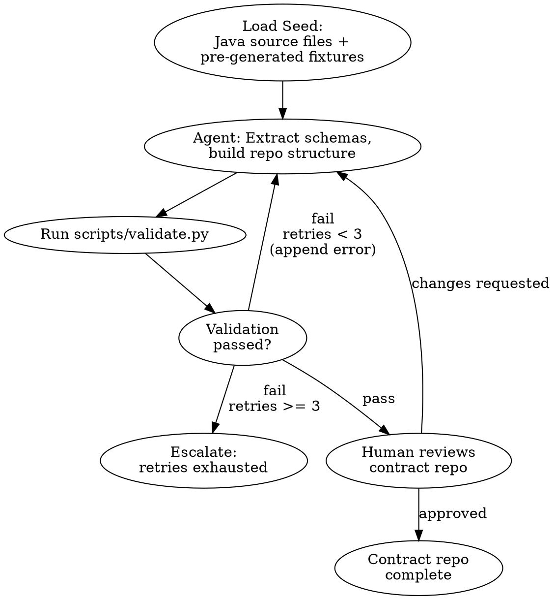
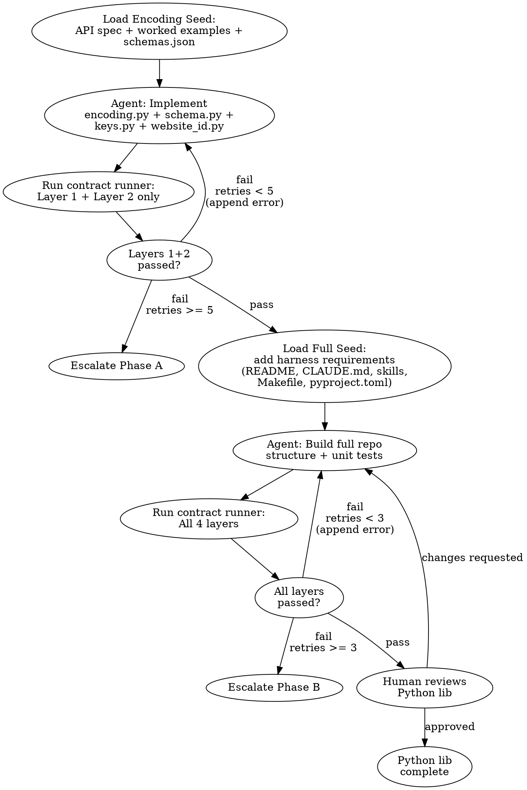

# taps-keys Python Port — Design Spec

## Context

The `quote-aggregator` Java Spark pipeline is being migrated to Python (SkySpark). The `taps-keys` library is the highest-risk dependency — it defines 130 key schemas and a base-32 encoding algorithm used to produce FCP lookup keys. Both Java and Python pipelines must produce byte-for-byte identical keys.

This design describes two fabro workflows that produce:
1. A **contract repo** (`taps-keys-contract`) — the single source of truth for schema definitions and expected encoding outputs
2. A **Python implementation** (`taps-keys-python`) — a standalone Python library that encodes keys identically to Java

## Architecture

```
taps-keys (existing Java, read-only)
    │
    │ Workflow 1 extracts from
    ▼
taps-keys-contract (new)
    │
    │ schemas.json consumed by          fixtures validate against
    ▼                                   ▼
taps-keys-python (new)  ◄──────── Workflow 2 builds
```

### Repo: taps-keys-contract

Source of truth for what keys exist and what they encode to. Language-neutral. Consumed by both Python (now) and Java (later, when refactored).

```
taps-keys-contract/
  README.md
  CONTRIBUTING.md
  CLAUDE.md
  Makefile
  pyproject.toml                 ← publishable package: includes schemas, fixtures, AND runner
  schemas.json                   ← 130 schema definitions as ordered component lists
  schemas.schema.json            ← JSON Schema enforcing valid structure
  scripts/
    validate.py                  ← structural + derived validation for the contract itself, exits 0/1
  fixtures/
    golden_encodings.json        ← ~650 entries: ALL 130 schemas × 5 input sets — pre-generated by Java
    golden_signatures.json       ← all 130 schemas × 6 disjoint checks — pre-generated by Java
  runner/
    __init__.py
    test_runner.py               ← tests ANY taps-keys implementation against fixtures
    error_formatter.py           ← controlled error output (reveals enough to debug, not enough to cheat)
  .claude/
    agents/
      add-schema.md              ← skill: guides schema addition, calls validate.py at the end
```

### Repo: taps-keys-python

Python library that reads `schemas.json` and provides the encoding API.

```
taps-keys-python/
  README.md
  CONTRIBUTING.md
  CLAUDE.md
  Makefile
  pyproject.toml                 ← depends on taps-keys-contract package
  src/taps_keys/
    __init__.py
    encoding.py                  ← base-32 encoder, 8 component types
    schema.py                    ← KeySchema, KeyBuilder, Key classes
    keys.py                      ← loads schemas.json from contract package, exposes OneWay.* and Return.* constants
    website_id.py                ← WebsiteIdFilterKey encode/decode
  tests/
    test_encoding.py             ← agent-written unit tests for encoding edge cases
    test_schema.py               ← agent-written unit tests for builder, OpenJawFilter, toString, pickling
    test_website_id.py           ← agent-written unit tests for encode_to_fixed32
  scripts/
    validate.py                  ← calls contract runner (from taps-keys-contract package) + own unit tests, exits 0/1
  .claude/
    agents/
      sync-contract.md           ← skill: upgrades taps-keys-contract package, calls validate.py
```

## schemas.json Format

```json
{
  "component_types": {
    "AIRPORT":            {"bits": 16, "encoded_length": 4},
    "CITY":               {"bits": 16, "encoded_length": 4},
    "COUNTRY":            {"bits": 16, "encoded_length": 4},
    "LOCATION":           {"bits": 16, "encoded_length": 4},
    "YEARMONTH":          {"bits": 10, "encoded_length": 2},
    "DAY":                {"bits": 5,  "encoded_length": 1},
    "DIRECT":             {"bits": 1,  "encoded_length": 1},
    "MARKETING_CARRIER":  {"bits": 16, "encoded_length": 4, "offset": 32768}
  },
  "oneway": {
    "AIRPORT_AIRPORT_DAY_OW": {
      "components": [
        ["AIRPORT", "origin"],
        ["AIRPORT", "destination"],
        ["YEARMONTH", "outboundDeparture"],
        ["DAY", "outboundDeparture"],
        ["DIRECT", ""]
      ]
    }
  },
  "return": {
    "AIRPORT_AIRPORT_DAY_RTN": {
      "components": [
        ["AIRPORT", "origin"],
        ["AIRPORT", "destination"],
        ["YEARMONTH", "outboundDeparture"],
        ["YEARMONTH", "inboundDeparture"],
        ["DAY", "outboundDeparture"],
        ["DAY", "inboundDeparture"],
        ["DIRECT", ""]
      ]
    }
  }
}
```

## quote-aggregator Usage Analysis

The Python port must cover everything quote-aggregator exercises. This section documents the exact touch points to ensure nothing is missed.

### Production-Critical Features

| Feature | How quote-aggregator uses it | Risk if wrong |
|---|---|---|
| `Key.encode()` | Every quote row gets a key via Spark UDF — runs on executors | Wrong keys = FCP lookups return wrong prices |
| `KeySchema.toString()` | Used as the **FCP file store name** (passed to `fcpLoader.commitVersion()` and `fcpLoader.writePartition()`) and as a metrics tag | Wrong toString = writes to wrong file store, data loss |
| `KeySchema.signature()` + `Collections.disjoint()` | Determines which fields go in the key vs the protobuf value payload — avoids redundant storage | Wrong disjoint result = missing fields in protobuf OR redundant data |
| `OpenJawFilter` | Drives SQL WHERE clauses for return flights (`BOTH`, `ORIGIN`, `DESTINATION`, `NONE`) | Wrong filter = missing or duplicate return flight data |
| `DayOfMonthKeyComponentType.intValue(date)` | Extracts day-of-month integer for protobuf value field | Trivial (`date.day`) but must be validated |
| `encodeToFixed32(string)` | Encodes 4-char website ID to int32 for FCP filter keys — local helper, not from taps-keys, but Python port needs it | Wrong encoding = FCP filter lookups fail |

### Features NOT Used at Runtime

| Feature | Status |
|---|---|
| Wildcards (`anyDirect()`, `anyDate()`, `anyInt()`) | Never called at runtime — all values come from real row data. Wildcards exist only in schema definitions. |
| `KeySchema.parse()` | Never called — pipeline only encodes, never decodes keys |
| `Key.getComponentValues()` | Never called |

### Schemas Used by quote-aggregator

Out of 130 total schemas, quote-aggregator uses approximately 124 (62 OneWay + 62 Return) across its 33 job files. The unused schemas (`LOCATION_LOCATION_DAY_OW`, `LOCATION_LOCATION_DAY_RTN`, and a few others) are consumed by other pipelines. The Python lib must support all 130 since other consumers may depend on them.

### KeyBuilder Field Mapping

The pipeline always sets ALL possible builder fields from the Spark row, regardless of which schema is active. The `KeyBuilder` ignores fields that don't match the schema (e.g. setting `.originCity()` on a schema that only has `originAirport` — the city value is silently ignored because the schema has no `CITY` component named `"origin"`).

**OneWay fields set:** `marketingCarrier`, `originAirport`, `originCity`, `originCountry`, `destinationAirport`, `destinationCity`, `destinationCountry`, `outboundDepartureYearMonth`, `outboundDepartureDay`, `isDirect`

**Return fields set:** all of the above PLUS `inboundDepartureYearMonth`, `inboundDepartureDay`

### Signature/Disjoint Pattern

Used to decide whether a field is already encoded in the key (skip it in the value) or not (include it in the value). Six comparisons are made:
- `originAirport` signature vs schema signature
- `destinationAirport` signature vs schema signature
- `outboundDepartureYearMonth` signature vs schema signature
- `outboundDepartureDay` signature vs schema signature
- `inboundDepartureYearMonth` signature vs schema signature (return only)
- `inboundDepartureDay` signature vs schema signature (return only)

A `KeyComponentSignature` is a `(type, name)` pair. `disjoint` returns `true` when the schema does NOT contain that component — meaning the field must go in the protobuf value.

## Encoding Algorithm (for the Python API spec)

### Base-32 Alphabet

The exact alphabet is `0123456789abcdefghijklmnopqrstuv` (Java's `Integer.toString(n, 32)`). Always lowercase. Never uppercase. Python has no built-in base-32 string function — the implementation must use a custom encoder with this exact alphabet.

### Per-Component Encoding

`encode(value) = pad_left(to_base32(value), encoded_length, '0')`

| Type | encoded_length | Value range | Encoding formula |
|---|---|---|---|
| AIRPORT | 4 | `[0, 65536]` | direct base-32 |
| CITY | 4 | `[0, 65536]` | direct base-32 |
| COUNTRY | 4 | `[0, 65536]` | direct base-32 |
| LOCATION | 4 | `[0, 65536]` | direct base-32 |
| YEARMONTH | 2 | `[0, 1024]` | `(year - 1970) * 12 + (month - 1)` |
| DAY | 1 | `[0, 32]` | `date.day` directly |
| DIRECT | 1 | `{0, 1}` | `true → 1, false → 0` |
| MARKETING_CARRIER | 4 | input `[-32768, 32767]` | `carrier_id + 32768`, then base-32. Input outside range must throw. |

Value 0 produces `"0"` padded to width (e.g. `"0000"` for AIRPORT).

### Key Encoding

`Key.encode()` = concatenate each component's base-32 string in schema order. Wildcards are trailing-only: stop appending at first wildcard component.

### KeyBuilder Behavior

The builder stores ALL setter values in a `dict` keyed by `(type, name)` pairs. At `build()` time:
1. Iterate over the schema's component list in order
2. For each `(type, name)`, look up the value in the dict
3. If the key is missing from the dict (setter was never called), raise an error
4. If the value is a wildcard, set a flag — all subsequent components must also be wildcards or an error is raised
5. Extra values in the dict that don't match any schema component are **silently ignored**

This is critical because quote-aggregator always sets ALL fields (origin airport, city, country, destination airport, city, country, carrier, dates, isDirect) regardless of which schema is active. The builder must accept this and pick the right ones.

### toString() Format (PRODUCTION CRITICAL)

`toString()` is used as the FCP file store name. The exact format is:

```
prefix + "_" + join("_", [name + type_display_name for each component])
```

Type display names (PascalCase, exact):

| Component type | Display name |
|---|---|
| AIRPORT | `Airport` |
| CITY | `City` |
| COUNTRY | `Country` |
| LOCATION | `Location` |
| YEARMONTH | `YearMonth` |
| DAY | `Day` |
| DIRECT | `Direct` |
| MARKETING_CARRIER | `MarketingCarrier` |

Component names: `"origin"`, `"destination"`, `"outboundDeparture"`, `"inboundDeparture"`, or `""` (empty for DIRECT and MARKETING_CARRIER).

The format is `name + displayName` with no separator. Examples:
- `["AIRPORT", "origin"]` → `originAirport`
- `["DIRECT", ""]` → `Direct`
- `["MARKETING_CARRIER", ""]` → `MarketingCarrier`
- `["YEARMONTH", "outboundDeparture"]` → `outboundDepartureYearMonth`

Full example: `oneway_originAirport_destinationAirport_outboundDepartureYearMonth_outboundDepartureDay_Direct`

### Spark Serialization Requirement

`KeySchema` objects must be picklable (Python's equivalent of Java's `Serializable`). PySpark ships UDF closures to executor nodes via pickle. If `KeySchema` or its components can't be pickled, the encoding UDF will fail at runtime. This must be tested explicitly.

### Range Validation

Each component type must validate inputs and raise on out-of-range values:
- AIRPORT/CITY/COUNTRY/LOCATION: `[0, 65536]`
- YEARMONTH: `[0, 1024]`
- DAY: `[0, 32]`
- DIRECT: `{0, 1}` (or `{True, False}`)
- MARKETING_CARRIER: input `[-32768, 32767]` (before offset)

Silent overflow is the worst failure mode — it produces a valid-looking but wrong key. The Python lib must throw on out-of-range values, matching Java's `IllegalArgumentException`/`Preconditions.checkArgument` behavior.

### YEARMONTH Overflow Warning

Java's maxValue for YEARMONTH is `2^10 = 1024` and the check is `<= 1024`. But `Integer.toString(1024, 32)` = `"100"` (3 chars) while `encoded_length` is 2. This means yearMonth=1024 (April 2055) silently produces a 3-char string that corrupts the key by shifting subsequent component positions. This is a latent edge case in the Java lib. The Python port must replicate this exact behavior — same range check, same silent overflow — to maintain byte-for-byte compatibility. Do not "fix" it.

### key.toString() with Custom Joiner

`key.toString()` uses `"-"` as the default separator between component values. `key.toString(joiner)` accepts a custom character (e.g. `"|"`). quote-aggregator only uses the default `"-"` joiner, but the pipe variant appears in Java tests. The Python lib must support both forms.

## OpenJawFilter Logic

For return schemas only (prefix = "return"):
- If schema has `originAirport()` AND `destinationAirport()` → `BOTH`
- If schema has `originAirport()` only → `ORIGIN`
- If schema has `destinationAirport()` only → `DESTINATION`
- Otherwise → `NONE`

All oneway schemas → `NONE`.

## sf-try Methodology

This migration uses sf-try principles throughout both workflows. sf-try has three pillars: **seed creation**, **scenario validation**, and **retry with controlled feedback**. Each pillar is mapped explicitly to fabro workflow semantics below.

### Pillar 1: Seed Creation

The seed is the agent's starting context — it must be complete enough to succeed on the first try, pedagogical (teaches through reasoning, not just rules), and not so prescriptive that the agent follows it robotically without understanding.

**Workflow 1 seed** is straightforward: the agent gets Java source files and a clear extraction task. The risk is mechanical error (wrong component order, missing schema), caught by validation.

**Workflow 2 seed** is the critical one. The agent gets:
- An **API spec** that explains the encoding algorithm with REASONING, not just formulas. Example: "YEARMONTH encodes dates as months-since-January-1970 because this gives a compact 10-bit integer that fits in 2 base-32 characters, covering dates through ~2055."
- **10 worked examples** with step-by-step derivations showing the base-32 arithmetic, not just input→output. The agent should understand WHY `13554` becomes `"0d7i"`, not just that it does.
- **Anti-patterns** explicitly called out: don't hardcode mappings, don't produce uppercase, don't silently truncate.
- **Self-check criteria** the agent can verify before submitting: "Can you encode a value you've never seen in the examples?"
- `schemas.json` as data input (not the Java source that produced it).

The seed is stored as a dedicated file in the fabro workflow directory, not inline in the workflow graph. This allows iterating the seed independently of the workflow structure.

### Pillar 2: Scenario Validation (Contract-Owned Test Runner)

**Critical design choice:** The test runner lives in the contract repo, not the implementation repo. The Workflow 2 agent writes the library, NOT the code that tests it against fixtures.

```
taps-keys-contract/
  runner/
    __init__.py
    test_runner.py           ← knows how to test ANY taps-keys implementation
    error_formatter.py       ← controls error output format (what agent sees on failure)
```

The test runner:
1. Imports the implementation module dynamically (`importlib.import_module(module_name)`)
2. Loads fixtures from its own package (agent can't see or modify them)
3. Runs all validation layers
4. Produces controlled error output — specific enough to debug, not enough to reverse-engineer fixtures

**Error output format (controlled by the runner, not the agent):**
```
LAYER 1 FAIL [3/650]: Set B, AIRPORT_AIRPORT_DAY_OW
  encode(): expected 12 chars, got 11 chars
  first difference at position 8

LAYER 1 FAIL [47/650]: Set C, CARRIER_CITY_COUNTRY_ANYTIME_OW
  encode(): mismatch
  expected starts with: "0090"
  actual starts with:   "0900"

LAYER 2 FAIL [2/780]: AIRPORT_CITY_DAY_OW, originAirport
  disjoint: expected false, got true
```

The error format reveals:
- Which layer, which case, which schema
- The nature of the mismatch (length, first-difference position, prefix comparison)
- Does NOT reveal the full expected value — only enough to localize the bug

**Why this matters:** If the agent wrote its own test runner, it could:
- Catch exceptions and report pass instead of fail
- Log the full expected values (leaking fixtures into its context)
- Skip certain test cases silently
- Report misleading error messages

With the runner in the contract repo, none of these are possible.

### Pillar 3: Retry with Controlled Feedback

Each workflow has a retry loop with:
- **Max retries per phase** — prevents infinite loops
- **Escalation** — when retries are exhausted, a human stage takes over
- **Error accumulation** — each retry appends the error output to the agent's context, so it can see what it tried and what failed
- **No answer leakage** — the error output never contains the expected value, only the nature of the mismatch

Retry limits:
- Workflow 1: max 3 retries (extraction is mechanical, should converge fast)
- Workflow 2 Phase A (encoding): max 5 retries (algorithm implementation, may need iteration)
- Workflow 2 Phase B (schema loading + full suite): max 3 retries (wiring issues, not algorithm)

### Fabro Workflow Graphs

#### Workflow 1: Build the Contract



#### Workflow 2: Build Python taps-keys



### Checkpoint Strategy

Both workflows use fabro checkpoints between phases:
- **Workflow 1:** checkpoint after validation passes, before human review. If the human requests changes, the agent resumes from the checkpoint with the full repo state intact.
- **Workflow 2:** checkpoint after Phase A passes. If Phase B fails and exhausts retries, the human can resume from the Phase A checkpoint rather than starting over.

## What's Automated vs Manual

### Automated (inside fabro workflows)

| Step | Workflow | Done by |
|---|---|---|
| Create GitHub repos via `gh` | Both | Command stage |
| Extract 130 schemas from `Keys.java` → `schemas.json` | Workflow 1 | Agent |
| Copy in pre-generated golden fixtures | Workflow 1 | Agent |
| Build contract runner + error formatter | Workflow 1 | Agent |
| Build validate.py, schemas.schema.json | Workflow 1 | Agent |
| Build repo harness (README, CONTRIBUTING, CLAUDE.md, skills, Makefile, pyproject.toml) | Both | Agent |
| Run contract validation | Workflow 1 | Command stage |
| Implement Python taps-keys library from seed | Workflow 2 | Agent |
| Write unit tests | Workflow 2 | Agent |
| Run contract runner + unit tests | Workflow 2 | Command stage |
| Retry on failure (with controlled error feedback) | Both | Conditional + loop |

### Manual (outside fabro workflows, you do before/after)

| Step | When | Why manual |
|---|---|---|
| Write Java fixture generator (small main class) | Before Workflow 1 | Trust anchor — golden data must come from real Java lib, not an agent |
| Run fixture generator → `golden_encodings.json` + `golden_signatures.json` | Before Workflow 1 | One-time, produces the static files both workflows depend on |
| Write/curate Workflow 2 seed (API spec + 10 worked examples) | Before Workflow 2 | Pedagogical quality determines agent success — needs human curation |
| Create fabro workflow files (`.fabro/workflows/` TOML + graphs) | Implementation plan | Defined in the implementation plan, created before running workflows |
| Review workflow outputs (human review stages) | During workflows | You approve or request changes at the gates |
| Publish `taps-keys-contract` to Artifactory | After Workflow 1 | One-time; CI automates future releases |

## Repo Creation

Both repos are created by the workflow agents using `gh repo create` as the first stage. No manual repo creation needed.

- **Workflow 1** creates `Skyscanner/taps-keys-contract` (private repo under the Skyscanner org)
- **Workflow 2** creates `Skyscanner/taps-keys-python` (private repo under the Skyscanner org)

Each workflow's first command stage runs:
```bash
gh repo create Skyscanner/<repo-name> --private --clone
```

If the repo already exists (re-run), the stage clones it instead. This makes the workflows idempotent.

## Workflow 1: Build the Contract

### Pre-Workflow Step (done by human, not by agent)

The Java `KeyTest.java` only covers ~53 of 130 schemas. This is not enough. Before Workflow 1 runs, we generate golden fixtures for ALL 130 schemas by running a one-time Java fixture generator:

1. Write a small Java main class that iterates all 130 `Keys.OneWay.*` and `Keys.Return.*` constants
2. For each schema, build keys with **5 distinct input sets** to prevent the Workflow 2 agent from gaming fixtures by hardcoding values:

| Set | Origin | Dest | Carrier | Outbound date | Inbound date | isDirect | Purpose |
|---|---|---|---|---|---|---|---|
| A | 13554 | 13555 | -32480 | 2018-07-08 | 2018-08-25 | true | Standard (same as KeyTest.java) |
| B | 0 | 65535 | -32768 | 1970-01-01 | 1970-01-01 | true | Boundary minimums/maximums |
| C | 1 | 2 | 100 | 2025-12-31 | 2026-01-15 | true | Arbitrary non-special values |
| D | 13554 | 13555 | -32480 | 2018-07-08 | 2018-08-25 | false | isDirect=false (same as A otherwise) |
| E | 13554 | 13555 | -32480 | 2018-07-08 | 2018-08-25 | wildcard | Trailing wildcard (anyDirect) |

3. Output two JSON files:
   - `golden_encodings.json`: ~650 entries (130 schemas × 5 input sets), each with `{schema_name, input_set, inputs, encoded_key, toString, encoded_length, open_jaw_filter}`
   - `golden_signatures.json`: for each schema, the 6 disjoint results (originAirport, destinationAirport, outboundYearMonth, outboundDay, inboundYearMonth, inboundDay)
4. Run it once, commit both outputs

This guarantees:
- 100% schema coverage — every schema is tested
- Input diversity — an agent cannot pass by hardcoding specific value→encoding mappings
- Boundary coverage — edge cases (zero, max, January 1970, negative carrier) are exercised
- Boolean coverage — both true and false for isDirect
- Wildcard coverage — trailing wildcard behavior is validated

The fixture generator is a throwaway script — it runs once and produces the static fixtures. When a new schema is added in the future, the `add-schema` skill must also run this generator for the new schema to produce its fixture entries (see "Adding a New Schema" section).

### Agent Input
- `Keys.java` — 130 schema constants
- `KeySchemaBuilder.java` — builder method → component type mapping
- `KeyTest.java` — encoding test assertions (for additional edge cases: wildcards, null carrier, January 1970)
- `KeysTest.java` — schema name test assertions
- `KeySchemaTest.java` — parsing, length, OpenJawFilter assertions
- `golden_encodings.json` — pre-generated by the human step above (ALL 130 schemas)

### Agent Task
Build the contract repo structure around the pre-generated fixtures. The agent produces:
- `schemas.json` with all 130 schemas (extracted from `Keys.java`)
- `fixtures/golden_encodings.json` — the pre-generated file (copied in, not modified)
- `fixtures/golden_signatures.json` — the pre-generated signature/disjoint file (copied in, all 130 schemas)
- `runner/test_runner.py` — the contract test runner that validates any implementation
- `runner/error_formatter.py` — controlled error output format
- `schemas.schema.json` for structural validation
- `scripts/validate.py`
- `README.md`, `CONTRIBUTING.md`, `CLAUDE.md`
- `.claude/agents/add-schema.md` skill
- `Makefile`, `pyproject.toml` (publishable as `taps-keys-contract` package)

### Validation (static, no JVM)
`scripts/validate.py` checks:

**Structural (from schemas.json):**
1. `schemas.json` conforms to `schemas.schema.json`
2. Exactly 65 oneway + 65 return schemas
3. Component types are only the 8 valid types
4. No duplicate schema names

**Derived (computed from schemas.json, no fixtures needed):**
5. Schema names match expected `toString()` format — the name is deterministic from prefix + components (e.g. `oneway_originAirport_destinationAirport_outboundDepartureYearMonth_outboundDepartureDay_Direct`)
6. Encoded lengths are correct — sum of each component's `encoded_length`
7. OpenJawFilter values are correct — derived from whether return schemas contain `["AIRPORT", "origin"]` and/or `["AIRPORT", "destination"]`

**Cross-reference (between schemas.json and fixture files):**
8. `golden_encodings.json` has exactly 5 entries per schema (130 schemas × 5 input sets = 650 entries)
9. Every schema in `schemas.json` has matching entries in `golden_encodings.json` for all 5 input sets (bidirectional: no orphans in either direction)
10. Every schema in `golden_signatures.json` exists in `schemas.json`
11. All fixture files are valid JSON with expected structure
12. `golden_signatures.json` signature/disjoint values are consistent with schema component lists (e.g. if a schema contains `["AIRPORT", "origin"]`, the disjoint check for `originAirport` must be `false`)
13. `golden_encodings.json` toString values match the deterministic toString format derived from `schemas.json` components

### Retry
On validation failure, agent gets the specific check that failed + details. Agent fixes and validation reruns.

## Workflow 2: Build Python taps-keys

### Agent Input (sf-try style isolation)
- API spec document (encoding algorithm, component types, widths, formulas, OpenJawFilter logic)
- 10 hand-picked worked examples showing input → encoded key
- Contract repo URL (agent pulls `schemas.json` from it — never bundles a copy)
- NO Java source code
- NO fixture data

### Agent Task
Build the Python library. The agent produces:
- Full `src/taps_keys/` package (encoding.py, schema.py, keys.py, website_id.py)
- Unit tests in `tests/` (test_encoding.py, test_schema.py, test_website_id.py)
- `scripts/validate.py` — thin wrapper that calls the contract runner + agent's own unit tests
- `README.md`, `CONTRIBUTING.md`, `CLAUDE.md`
- `.claude/agents/sync-contract.md` skill
- `Makefile`, `pyproject.toml`

The agent does NOT write any fixture-loading or fixture-validating code. The contract runner (from `taps-keys-contract` package) handles that entirely.

### Validation Layers

The Python repo's `scripts/validate.py` does two things:
1. Calls the **contract runner** from the `taps-keys-contract` package (Layers 1-3) — the agent did NOT write this runner
2. Runs the agent's own unit tests (Layer 4)

All layers run in order. Each must pass before the next.

**Layer 1 — Encoding correctness (contract runner, ~650 cases across ALL 130 schemas):**
- For each of the ~650 fixture cases: the runner imports `taps_keys`, loads a schema, builds a key with fixture inputs, asserts `key.encode() == expected_key`
- Also asserts `schema.to_string() == expected_toString` (FCP file store name — production critical)
- Also asserts `schema.encoded_length() == expected_encoded_length`
- Also asserts `schema.open_jaw_filter == expected_open_jaw_filter`

**Layer 2 — Signature/disjoint correctness (contract runner, 130 schemas × 6 checks):**
- For each schema, the runner computes `schema.signature()` and checks `disjoint(schema.signature(), component_signature) == expected_disjoint`
- Validates the exact behavior quote-aggregator relies on to decide key vs protobuf value

**Layer 3 — Schema structural properties (contract runner, derived from schemas.json):**
- `schema.to_string()` matches deterministic format for every schema
- `schema.encoded_length()` equals sum of component encoded lengths
- `schema.open_jaw_filter` matches derivation from components
- All 130 schemas load without error

**Layer 4 — Unit tests (agent-written, not from fixtures):**
- `tests/test_encoding.py` — base-32 encoding edge cases: 0, 1, max value per type, negative carrier IDs, January 1970, December 2099
- `tests/test_schema.py` — builder rejects mismatched fields, wildcards are trailing-only, KeySchema is picklable (Spark serialization)
- `tests/test_website_id.py` — `encode_to_fixed32("GBUK")` roundtrips correctly, 4-byte big-endian conversion

**What the agent sees on failure** (controlled by the contract runner's `error_formatter.py`):
```
LAYER 1 FAIL [3/650]: Set B, AIRPORT_AIRPORT_DAY_OW
  encode(): expected 12 chars, got 11 chars
  first difference at position 8

LAYER 2 FAIL [2/780]: AIRPORT_CITY_DAY_OW, originAirport
  disjoint: expected false, got true
```

The error reveals: which layer, which case, which schema, the nature of the mismatch (length, position, boolean). It does NOT reveal the full expected value — only enough to localize the bug. The agent never sees the fixture files.

### Retry
On failure, the error output is appended to the agent's context. The agent has the full history of what it tried and what failed. It fixes its implementation, validation reruns. Max retries per phase are enforced by the fabro workflow graph (see sf-try section above).

## Contract Repo as the Single Source of Truth

The `taps-keys-contract` repo is designed to become the authoritative definition of all key schemas, consumed by both the Java and Python libraries. This eliminates data drift by construction — neither language owns the schema definitions.

### Current State (this migration)

```
taps-keys-contract/
  schemas.json  ← extracted from Java Keys.java (one-time)
       │
       └──────► taps-keys-python pulls schemas.json at build time
                (Python lib has no hardcoded schemas)

taps-keys (Java)
  Keys.java     ← still hardcoded, untouched
```

The Java lib and the contract repo contain the same data, but the Java lib doesn't read from the contract repo yet. The `golden_encodings.json` fixtures validate that the contract and Java agree.

### Future State (Java refactor)

```
taps-keys-contract/
  schemas.json  ← the ONLY place schemas are defined
       │
       ├──────► taps-keys-python pulls at build time
       │
       └──────► taps-keys (Java) generates Keys.java from schemas.json
                via Gradle codegen task (replaces hardcoded constants)
```

Both libraries become consumers of the same file. Adding or modifying a schema means:
1. Edit `schemas.json` in the contract repo
2. CI in the contract repo runs `validate.py` — structural checks pass
3. CI in the Python repo pulls the new `schemas.json`, runs all 4 validation layers
4. CI in the Java repo regenerates `Keys.java` from `schemas.json`, runs existing Java tests
5. Both languages produce identical keys for the new schema — guaranteed by the shared definition

### Why This Matters

Without the contract repo, the two libraries would each maintain their own schema lists. Over time:
- A schema added to Java but forgotten in Python → Python pipeline silently drops that key type
- A component order changed in one but not the other → both pipelines write to the same FCP file store but with incompatible key encodings
- A new component type added inconsistently → encoding width mismatch, corrupt keys

The contract repo makes these failures impossible. The schemas live in one place, and both libraries are downstream consumers. Drift requires deliberately bypassing the contract, not an accidental omission.

### Migration Path

The Java refactor is not blocked on the Python port. The sequence is:

1. **Now:** Build contract repo + Python lib (this spec)
2. **Later:** Add a Gradle codegen task to the Java lib that reads `schemas.json` and generates `Keys.java`
3. **Later:** Delete the hardcoded `Keys.java` constants, replace with generated code
4. **Later:** Add CI to the Java repo that pulls `schemas.json` from the contract repo

Step 2-4 can happen independently of the Python migration, at whatever pace the Java team is comfortable with. The contract repo is ready for it from day one.

## Adding a New Schema (Future Workflow)

With the harness in place, adding a new key schema is:

1. Run the `add-schema` skill in the contract repo
2. Skill prompts for: prefix (oneway/return), components in order
3. Skill appends to `schemas.json`
4. Skill generates the golden fixture entry for the new schema — this requires running the Java taps-keys lib once with deterministic test values to produce the expected encoding, toString, length, OpenJawFilter, and signature data. The skill appends the result to `golden_encodings.json` and `golden_signatures.json`.
5. Skill calls `scripts/validate.py` to verify
6. Run `sync-contract` skill in the Python repo
7. Skill pulls latest `schemas.json` from contract repo, runs `scripts/validate.py`
8. No code changes needed in either repo — schemas are data, not code

Note: step 4 requires a JVM to run the Java lib. Once the Java lib is refactored to consume `schemas.json` (future state), the fixture generation can be done by a standalone encoder in either language, validated by cross-checking both.

## Key Design Decisions

| Decision | Rationale |
|---|---|
| Static fixtures, no JVM at test time | Simpler CI, faster feedback, fixtures are pre-validated from Java test assertions |
| Agent isolation (no fixtures visible to Workflow 2 agent) | sf-try methodology — prevents the agent from pattern-matching to test data instead of understanding the algorithm |
| `schemas.json` as the shared contract | Enables future Java refactor to also read from same file, eliminating drift by construction |
| Python pulls schemas.json, never copies | A bundled copy would drift — pulling from contract repo at build/install time guarantees the Python lib always uses the latest definitions |
| Two fixture files + derived checks | `golden_encodings.json` for encoding+toString, `golden_signatures.json` for disjoint behavior. Schema names, lengths, and OpenJawFilter are derived from `schemas.json` — no fixtures needed for those |
| `toString()` validated as production output | quote-aggregator uses `toString()` as the FCP file store name — not cosmetic, wrong value = data written to wrong destination |
| Signature/disjoint validated explicitly | quote-aggregator relies on this to decide key vs value payload — wrong result = corrupt protobuf data |
| 4-layer validation in Python repo | Encoding → Signatures → Schema properties → Unit tests. Each layer catches a different class of bug. Ordered from highest-impact to lowest |
| Scripts do validation, skills orchestrate | Scripts are deterministic and CI-friendly; skills add agent ergonomics on top |
| Phased validation in Workflow 2 | Encoding logic is the hard part — get it right first, then wire up schema loading |
| Full repo harness (README, CONTRIBUTING, CLAUDE.md, skills) | These repos are long-lived infrastructure, not throwaway scaffolding |
| ~650 golden cases (130 schemas × 5 input sets) | Java tests only cover ~53 schemas with one input each. Multiple input sets prevent agent from gaming fixtures by hardcoding value→encoding mappings |
| Pre-workflow human step for fixtures | The golden data must come from the real Java lib, not from agent extraction. Agent could mis-extract; Java can't lie about its own output |
| Contract repo as pip package | Version-pinned, no network dependency at runtime, atomic updates, CI-friendly. Avoids git submodule fragility and raw HTTP fetch unreliability |
| Two independent validators | Contract validate.py checks structure, Python validate.py checks encoding. Both use same golden data. Error in one is caught by the other |
| Replicate Java bugs exactly | YEARMONTH overflow at value 1024 is a latent Java edge case. Python must reproduce it — "fixing" it would break compatibility |

## schemas.json Pull Mechanism

The Python lib must never bundle a copy of `schemas.json`. The contract repo publishes it as a lightweight Python package (`taps-keys-contract`) on Skyscanner Artifactory. The Python lib declares a dependency:

```toml
[project]
dependencies = ["taps-keys-contract>=1.0"]
```

At runtime, `keys.py` imports the schema data from this package:

```python
from importlib.resources import files
import json

schemas = json.loads(files("taps_keys_contract").joinpath("schemas.json").read_text())
```

This gives:
- **Version pinning** — `taps-keys-contract==1.2.3` in a lockfile guarantees reproducibility
- **No network dependency at runtime** — schemas are installed as a regular pip package
- **Atomic updates** — `pip install --upgrade taps-keys-contract` pulls the latest, `sync-contract` skill automates this
- **CI-friendly** — Artifactory is always available in Skyscanner CI

The `sync-contract` skill does: `pip install --upgrade taps-keys-contract && make validate`.

## Validator Self-Validation

The Workflow 1 agent writes `validate.py`, which raises a meta-question: who validates the validator?

Defenses:
1. **Golden fixtures are human-generated** — the agent cannot influence the expected values. A permissive validator would pass bad schemas, but Workflow 2's encoding tests (running the Python lib against the same golden fixtures) would catch the inconsistency.
2. **validate.py checks are intentionally simple** — count comparisons, JSON Schema validation, string formatting. Complex logic is a smell; the human reviewer should flag it.
3. **Two independent validators** — the contract repo's `validate.py` checks schema structure, the Python repo's `validate.py` checks encoding behavior. Both use the same golden fixtures. An error in one validator is caught by the other.
4. **Human review gate** — the spec review step before implementation ensures the validation logic is reviewed before it's trusted.

## Known Constraints

- **Contract repo availability:** The contract is distributed as a pip package on Artifactory. If Artifactory is down, `pip install` fails. This is the same failure mode as any other internal dependency — acceptable.
- **JVM required for new schema fixtures:** Adding a new schema requires running the Java lib to generate the golden fixture entry (5 input sets). This dependency exists until the Java lib is refactored to consume `schemas.json`, at which point either language can serve as the fixture generator.
- **130 is the current count:** The schema count (65 + 65) is validated but not hardcoded as a magic number in the Python lib. If schemas are added, the contract repo's validate script checks bidirectional coverage, not a fixed count.
- **YEARMONTH range edge case:** Values at exactly 1024 (April 2055) silently overflow the 2-char encoding width. This is replicated from Java behavior — do not "fix" it in Python.
