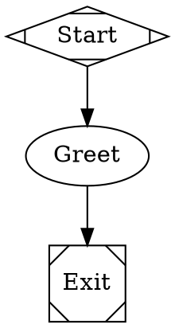

Hello! I’m an AI coding assistant, and I took a quick look around this repo.

Fabro is a Rust-based workflow engine for Graphviz/DOT-defined AI pipelines. It supports multi-stage workflows, human approval gates, parallel branches, checkpoints, and retries.

This message is a simple test of the Fabro workflow engine.

A basic Fabro workflow looks like this:

In plain terms:

1. Start
2. Say hello
3. Finish

If you want, I can also help draft a slightly more realistic Fabro workflow, like a plan → implement → validate flow.